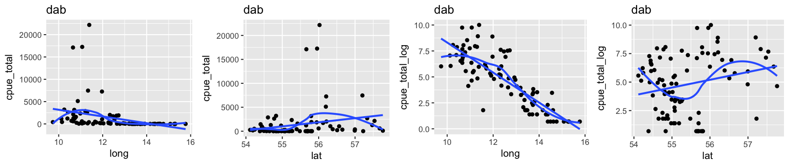
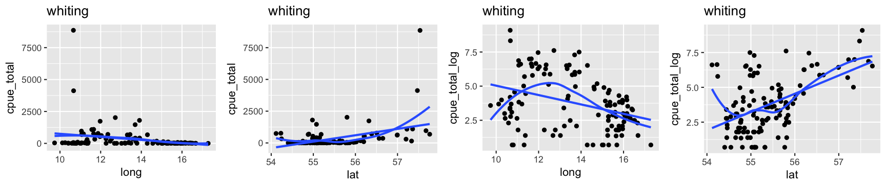
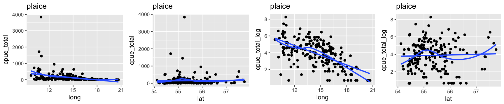
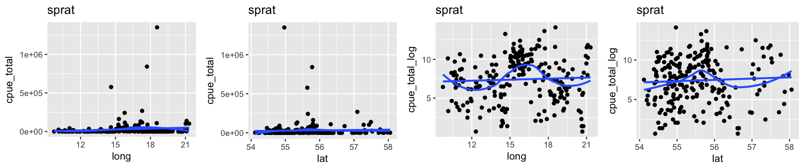
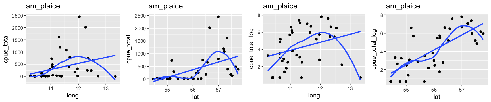
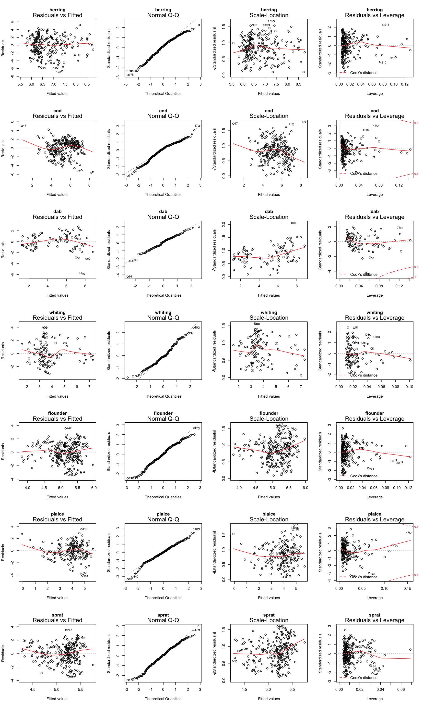
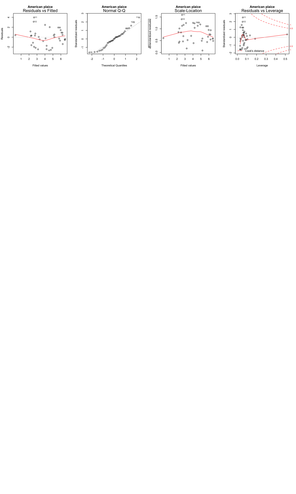

***

<div class="img-with-text" >
  <a href="https://earthobservatory.nasa.gov/IOTD/view.php?id=84047">
    
  </a>
  <p><span class="source-img" style = "float:right; font-size:10px;">Foto: ISS Crew Earth Observations Facility and the Earth Science and Remote Sensing Unit, Johnson Space Center (under CC0)</span></p>
</div>

<br>

<div class="img-with-text">
  <a href="http://www.fishbase.org" style="white-space: nowrap;">
    
    
    
    <br>
    
    
    
    
  </a>
<p><span class="source-img" style = "float:right; font-size:10px;">Fotos: <a href='http://www.fishbase.org' title=''>Fishbase</a> (under <a href='https://creativecommons.org/licenses/by-nc/3.0/' title=''>CC-BY-NC 3.0</a>)</span></p>
</div> 

<br>

# Your task

Study the effects of latitude, longitude, depth and hydrography on the number of caught fish - in areas where the species are present (since we use presence-only data). You can also download the data and do the data wrangling yourself and compare with the one provided here (although it will not contain the salinity and temperature then). Some instructions for this are below.

## Data wrangling


```r
# Loading relevant libraries
library(tidyverse)

# Set your working directory if you haven't before (should be the same than 
# for the R Markdown file) and LOAD the data
load("data/data_case_study_2.R") # I have the data in a subfolder called 'data'

# Check what objects the file contains
ls() # only one called `cpue15`
```

```
## [1] "cpue15"
```

```r
names(cpue15)
```

```
##  [1] "year"           "lat"            "long"           "depth"         
##  [5] "area"           "subarea"        "gear"           "species"       
##  [9] "cpue_total"     "cpue_total_log" "temp_pred"      "sal_pred"
```

```r
# Transform data
spec_df <- tibble(species = unique(cpue15$species), 
  common_name = c("herring", "cod", "dab", "whiting", "flounder", "plaice",
     "sprat", "am_plaice"))
spec_df$species <- as.character(spec_df$species)
str(spec_df)
```

```
## Classes 'tbl_df', 'tbl' and 'data.frame':	8 obs. of  2 variables:
##  $ species    : chr  "Clupea harengus" "Gadus morhua" "Limanda limanda" "Merlangius merlangus" ...
##  $ common_name: chr  "herring" "cod" "dab" "whiting" ...
```

```r
cpue15 <- cpue15 %>%
  left_join(spec_df, by = "species")
spec <- spec_df$common_name
```

***


## A. Distribution along the latitude/longitude gradient

- A1. For which species seems to be no latitudinal and longitudinal effect on the CPUE?
- A2. For which species is the spatial effect greatest? Which model describes best the relationship?
- A3. Which species has an increasing CPUE with increasing latitude and decreasing longitude?


```r
world <- map_data("world")
worldmap <- ggplot(world, aes(x = long, y = lat)) +
  geom_polygon(aes(group = group), fill = "ivory3", colour = "black") 
baltic <- worldmap + coord_map("ortho",  xlim = c(10, 30), ylim = c(54,59))

baltic + geom_point(data = cpue15, aes(x = long, y = lat, 
  colour = cpue_total_log), size = 1) +
  scale_colour_gradient2(low = "blue", mid = "yellow", 
    high = "red", midpoint = 7.5) +
  guides(colour = guide_colourbar(title = "Total log(CPUE) per hour")) +
  facet_wrap(~species, labeller = label_both) +
  ggtitle(label = "Spatial distribution of most abundant species",
    subtitle = "Jan-March 2015") +
  xlab("Longitude") + ylab("Latitude") 
```


### Individual scatterplots for spatial trends (lat/long separately)


```r
for (i in 1:8) { 
  dat <- cpue15 %>% filter(common_name == spec[i] )
  p_long <- ggplot(data = dat, aes(long, cpue_total)) + 
    geom_point() +
    geom_smooth(se = FALSE) +  
    geom_smooth(se = FALSE, method = "lm") + #coord_trans(y = "sqrt") +
    ggtitle(spec[i])
  
  p_lat <- ggplot(data = dat, aes(lat, cpue_total)) + 
    geom_point() +
    geom_smooth(se = FALSE) +  
    geom_smooth(se = FALSE, method = "lm") + #coord_trans(y = "sqrt") +
    ggtitle(spec[i])
  
  p_long_log <- ggplot(data = dat, aes(long, cpue_total_log)) + 
    geom_point() +
    geom_smooth(se = FALSE) +  
    geom_smooth(se = FALSE, method = "lm") + 
    ggtitle(spec[i])
  
  p_lat_log <- ggplot(data = dat, aes(lat, cpue_total_log)) + 
    geom_point() +
    geom_smooth(se = FALSE) +  
    geom_smooth(se = FALSE, method = "lm") + 
    ggtitle(spec[i])
  
  gridExtra::grid.arrange(grobs = 
      list(p_long, p_lat, p_long_log, p_lat_log), ncol = 4)
}
```



Since the relationship and scatter around the predictions looks much better for the log-transformed data, we will continue modelling only this data (model diagnostic plots for the untrasnformed data would also indicate violations of the homogeneity assumptions).

### Now the models

For simplicity I will demonstrate the model comparison without models including polynomials.


```r
m_coord_aic <- vector("list", length=8)
names(m_coord_aic) <- spec
spec_df$m_coord_1 <- vector("list", length=8)
spec_df$m_coord_2 <- vector("list", length=8)
spec_df$m_coord_3 <- vector("list", length=8)
spec_df$m_coord_4 <- vector("list", length=8)
spec_df$m_coord_5 <- vector("list", length=8)
spec_df$m_coord_best <- vector(length=8)
spec_df$m_coord_r2 <- vector(length=8)


for (i in 1:8){
  dat <- cpue15 %>% filter(common_name == spec[i] )
  m1 <- lm(cpue_total_log  ~ 1, data = dat)
  m2 <- lm(cpue_total_log  ~ long, data = dat)
  m3 <- lm(cpue_total_log  ~ lat, data = dat)
  m4 <- lm(cpue_total_log  ~ long + lat, data = dat)
  m5 <- lm(cpue_total_log  ~ long * lat, data = dat)
  
  aic_temp <- as_tibble(AIC(m1,m2,m3,m4,m5)) %>%
    mutate(model = rownames(.)) %>%
    mutate(m_object = list(m1,m2,m3,m4,m5)) %>%
    arrange(AIC) 
  
  m_coord_aic[[i]] <- aic_temp
  spec_df$m_coord_1[[i]] <- m1
  spec_df$m_coord_2[[i]] <- m2
  spec_df$m_coord_3[[i]] <- m3
  spec_df$m_coord_4[[i]] <- m4
  spec_df$m_coord_5[[i]] <- m5
  spec_df$m_coord_best[[i]] <- aic_temp$model[1]
  spec_df$m_coord_r2[[i]] <- round(summary(aic_temp$m_object[[1]])$adj.r.squared,2)
}
```

### Complete AIC comparison

```r
m_coord_aic
```

```
## $herring
## # A tibble: 5 x 4
##      df   AIC model m_object
##   <dbl> <dbl> <chr> <list>  
## 1  3.00  1072 m3    <S3: lm>
## 2  4.00  1074 m4    <S3: lm>
## 3  5.00  1075 m5    <S3: lm>
## 4  3.00  1106 m2    <S3: lm>
## 5  2.00  1107 m1    <S3: lm>
## 
## $cod
## # A tibble: 5 x 4
##      df   AIC model m_object
##   <dbl> <dbl> <chr> <list>  
## 1  5.00  1045 m5    <S3: lm>
## 2  3.00  1056 m3    <S3: lm>
## 3  4.00  1056 m4    <S3: lm>
## 4  2.00  1088 m1    <S3: lm>
## 5  3.00  1090 m2    <S3: lm>
## 
## $dab
## # A tibble: 5 x 4
##      df   AIC model m_object
##   <dbl> <dbl> <chr> <list>  
## 1  4.00   326 m4    <S3: lm>
## 2  5.00   328 m5    <S3: lm>
## 3  3.00   328 m2    <S3: lm>
## 4  3.00   432 m3    <S3: lm>
## 5  2.00   435 m1    <S3: lm>
## 
## $whiting
## # A tibble: 5 x 4
##      df   AIC model m_object
##   <dbl> <dbl> <chr> <list>  
## 1  4.00   475 m4    <S3: lm>
## 2  5.00   477 m5    <S3: lm>
## 3  3.00   484 m3    <S3: lm>
## 4  3.00   505 m2    <S3: lm>
## 5  2.00   520 m1    <S3: lm>
## 
## $flounder
## # A tibble: 5 x 4
##      df   AIC model m_object
##   <dbl> <dbl> <chr> <list>  
## 1  5.00   913 m5    <S3: lm>
## 2  3.00   914 m2    <S3: lm>
## 3  4.00   915 m4    <S3: lm>
## 4  2.00   918 m1    <S3: lm>
## 5  3.00   920 m3    <S3: lm>
## 
## $plaice
## # A tibble: 5 x 4
##      df   AIC model m_object
##   <dbl> <dbl> <chr> <list>  
## 1  3.00   658 m2    <S3: lm>
## 2  4.00   660 m4    <S3: lm>
## 3  5.00   662 m5    <S3: lm>
## 4  2.00   748 m1    <S3: lm>
## 5  3.00   750 m3    <S3: lm>
## 
## $sprat
## # A tibble: 5 x 4
##      df   AIC model m_object
##   <dbl> <dbl> <chr> <list>  
## 1  2.00  1096 m1    <S3: lm>
## 2  3.00  1097 m3    <S3: lm>
## 3  3.00  1098 m2    <S3: lm>
## 4  4.00  1099 m4    <S3: lm>
## 5  5.00  1099 m5    <S3: lm>
## 
## $am_plaice
## # A tibble: 5 x 4
##      df   AIC model m_object
##   <dbl> <dbl> <chr> <list>  
## 1  5.00   139 m5    <S3: lm>
## 2  4.00   146 m4    <S3: lm>
## 3  3.00   147 m3    <S3: lm>
## 4  3.00   171 m2    <S3: lm>
## 5  2.00   173 m1    <S3: lm>
```

### Overview of best models based on the AIC

```r
spec_df %>% select(species, common_name, m_coord_best, m_coord_r2)
```

```
## # A tibble: 8 x 4
##   species                      common_name m_coord_best m_coord_r2
##   <chr>                        <chr>       <chr>             <dbl>
## 1 Clupea harengus              herring     m3               0.140 
## 2 Gadus morhua                 cod         m5               0.170 
## 3 Limanda limanda              dab         m4               0.700 
## 4 Merlangius merlangus         whiting     m4               0.320 
## 5 Platichthys flesus           flounder    m5               0.0300
## 6 Pleuronectes platessa        plaice      m2               0.370 
## 7 Sprattus sprattus            sprat       m1               0     
## 8 Hippoglossoides platessoides am_plaice   m5               0.620
```

### Numerical output of best models

```r
#herring
summary(spec_df$m_coord_3[[1]]) 
```

```
## 
## Call:
## lm(formula = cpue_total_log ~ lat, data = dat)
## 
## Residuals:
##     Min      1Q  Median      3Q     Max 
## -6.5553 -1.5642  0.2081  1.8592  4.9113 
## 
## Coefficients:
##             Estimate Std. Error t value Pr(>|t|)    
## (Intercept) -51.1754     9.1070  -5.619 5.40e-08 ***
## lat           1.0426     0.1639   6.361 1.03e-09 ***
## ---
## Signif. codes:  0 '***' 0.001 '**' 0.01 '*' 0.05 '.' 0.1 ' ' 1
## 
## Residual standard error: 2.302 on 235 degrees of freedom
## Multiple R-squared:  0.1469,	Adjusted R-squared:  0.1433 
## F-statistic: 40.47 on 1 and 235 DF,  p-value: 1.035e-09
```

```r
# cod
summary(spec_df$m_coord_5[[2]]) 
```

```
## 
## Call:
## lm(formula = cpue_total_log ~ long * lat, data = dat)
## 
## Residuals:
##     Min      1Q  Median      3Q     Max 
## -4.5295 -1.3940  0.2861  1.4244  3.3516 
## 
## Coefficients:
##              Estimate Std. Error t value Pr(>|t|)    
## (Intercept) -69.34218   34.92745  -1.985 0.048210 *  
## long          7.75309    2.12870   3.642 0.000329 ***
## lat           1.31915    0.62719   2.103 0.036450 *  
## long:lat     -0.13782    0.03811  -3.616 0.000362 ***
## ---
## Signif. codes:  0 '***' 0.001 '**' 0.01 '*' 0.05 '.' 0.1 ' ' 1
## 
## Residual standard error: 1.903 on 248 degrees of freedom
## Multiple R-squared:  0.1767,	Adjusted R-squared:  0.1667 
## F-statistic: 17.74 on 3 and 248 DF,  p-value: 1.824e-10
```

```r
# dab
summary(spec_df$m_coord_4[[3]]) 
```

```
## 
## Call:
## lm(formula = cpue_total_log ~ long + lat, data = dat)
## 
## Residuals:
##     Min      1Q  Median      3Q     Max 
## -4.8606 -0.8560 -0.0556  0.7067  3.5208 
## 
## Coefficients:
##             Estimate Std. Error t value Pr(>|t|)    
## (Intercept)   3.2561     9.6822   0.336   0.7374    
## long         -1.4165     0.1001 -14.149   <2e-16 ***
## lat           0.3456     0.1702   2.031   0.0453 *  
## ---
## Signif. codes:  0 '***' 0.001 '**' 0.01 '*' 0.05 '.' 0.1 ' ' 1
## 
## Residual standard error: 1.415 on 88 degrees of freedom
## Multiple R-squared:  0.711,	Adjusted R-squared:  0.7045 
## F-statistic: 108.3 on 2 and 88 DF,  p-value: < 2.2e-16
```

```r
# whiting
summary(spec_df$m_coord_4[[4]]) 
```

```
## 
## Call:
## lm(formula = cpue_total_log ~ long + lat, data = dat)
## 
## Residuals:
##     Min      1Q  Median      3Q     Max 
## -3.3922 -1.1236 -0.0798  0.8123  4.2869 
## 
## Coefficients:
##              Estimate Std. Error t value Pr(>|t|)    
## (Intercept) -57.44380   11.06349  -5.192 8.68e-07 ***
## long         -0.24584    0.07379  -3.332  0.00115 ** 
## lat           1.16541    0.19482   5.982 2.38e-08 ***
## ---
## Signif. codes:  0 '***' 0.001 '**' 0.01 '*' 0.05 '.' 0.1 ' ' 1
## 
## Residual standard error: 1.663 on 119 degrees of freedom
## Multiple R-squared:  0.3298,	Adjusted R-squared:  0.3186 
## F-statistic: 29.28 on 2 and 119 DF,  p-value: 4.549e-11
```

```r
# flounder
summary(spec_df$m_coord_2[[5]]) 
```

```
## 
## Call:
## lm(formula = cpue_total_log ~ long, data = dat)
## 
## Residuals:
##     Min      1Q  Median      3Q     Max 
## -3.4207 -0.8804 -0.0303  0.8803  3.1583 
## 
## Coefficients:
##             Estimate Std. Error t value Pr(>|t|)    
## (Intercept)  4.02166    0.45634   8.813   <2e-16 ***
## long         0.07120    0.02866   2.484   0.0136 *  
## ---
## Signif. codes:  0 '***' 0.001 '**' 0.01 '*' 0.05 '.' 0.1 ' ' 1
## 
## Residual standard error: 1.393 on 258 degrees of freedom
## Multiple R-squared:  0.02335,	Adjusted R-squared:  0.01957 
## F-statistic: 6.169 on 1 and 258 DF,  p-value: 0.01363
```

```r
# plaice
summary(spec_df$m_coord_2[[6]]) 
```

```
## 
## Call:
## lm(formula = cpue_total_log ~ long, data = dat)
## 
## Residuals:
##     Min      1Q  Median      3Q     Max 
## -4.4206 -0.7396 -0.0511  0.9667  3.0094 
## 
## Coefficients:
##             Estimate Std. Error t value Pr(>|t|)    
## (Intercept)  9.48228    0.52837   17.95   <2e-16 ***
## long        -0.38599    0.03582  -10.78   <2e-16 ***
## ---
## Signif. codes:  0 '***' 0.001 '**' 0.01 '*' 0.05 '.' 0.1 ' ' 1
## 
## Residual standard error: 1.262 on 196 degrees of freedom
## Multiple R-squared:  0.3721,	Adjusted R-squared:  0.3689 
## F-statistic: 116.1 on 1 and 196 DF,  p-value: < 2.2e-16
```

```r
# sprat - nothing (m1)
# American plaice
summary(spec_df$m_coord_5[[8]]) 
```

```
## 
## Call:
## lm(formula = cpue_total_log ~ long * lat, data = dat)
## 
## Residuals:
##     Min      1Q  Median      3Q     Max 
## -2.4751 -0.4423  0.1121  0.6537  4.0101 
## 
## Coefficients:
##             Estimate Std. Error t value Pr(>|t|)   
## (Intercept) 717.9673   257.9308   2.784  0.00872 **
## long        -71.7724    23.0662  -3.112  0.00376 **
## lat         -12.9006     4.6224  -2.791  0.00856 **
## long:lat      1.2949     0.4132   3.134  0.00354 **
## ---
## Signif. codes:  0 '***' 0.001 '**' 0.01 '*' 0.05 '.' 0.1 ' ' 1
## 
## Residual standard error: 1.392 on 34 degrees of freedom
## Multiple R-squared:  0.6535,	Adjusted R-squared:  0.6229 
## F-statistic: 21.38 on 3 and 34 DF,  p-value: 5.83e-08
```

### Residual diagnostics of best models


```r
par(mfrow = c(7,4))
plot(spec_df$m_coord_3[[1]], main = "herring") 
plot(spec_df$m_coord_5[[2]], main = "cod") 
plot(spec_df$m_coord_4[[3]], main = "dab") 
plot(spec_df$m_coord_4[[4]], main = "whiting") 
plot(spec_df$m_coord_2[[5]], main = "flounder") 
plot(spec_df$m_coord_2[[6]], main = "plaice") 
plot(spec_df$m_coord_5[[8]], main = "American plaice") 
```


The resdiual plots look for some models not ideal but acceptable.

### Back to the questions

- A1. For which species seems to be no latitudinal and longitudinal effect on the CPUE? <span style="color:red;font-weight:bold;">Sprattus sprattus</span>
- A2. For which species is the spatial effect greatest? Which model describes best the relationship? <span style="color:red;font-weight:bold;">Limanda limanda: ~ long+lat</span>
- A3. Which species has an increasing CPUE with increasing latitude and decreasing longitude? <span style="color:red;font-weight:bold;">Limanda limanda and Merlangius merlangus</span>

***

## B. Depth preferences

- B1. For which species does the bottom depth have no effect on the CPUE?
- B2. Which species responds strongest to the depth in terms of CPUE? Is the relationship positive or negative here?

### Visualization


```r
plot_list <- vector("list", length = 8)
for (i in 1:8) { 
  dat <- cpue15 %>% filter(common_name == spec[i] )
  plot_list[[i]] <- ggplot(data = dat, aes(depth, cpue_total_log)) + 
    geom_point() +
    geom_smooth(se = FALSE) +  
    geom_smooth(se = FALSE, method = "lm") +
    ggtitle(spec[i])
}
gridExtra::grid.arrange(grobs = plot_list, ncol = 4)
```


### Models

The models contain here only an intercept or an intercept and depth as covariate:


```r
spec_df$m_depth <- vector("list", length=8)
spec_df$m_depth_best <- vector(length=8)
spec_df$m_depth_r2 <- vector(length=8)

for (i in 1:8){
  dat <- cpue15 %>% filter(common_name == spec[i] )
  m0 <- lm(cpue_total_log ~ 1, data = dat)
  m1 <- lm(cpue_total_log  ~ depth, data = dat)
  
  aic_temp <- as_tibble(AIC(m0,m1)) %>%
    mutate(model = rownames(.)) %>%
    mutate(m_object = list(m0,m1)) %>%
    arrange(AIC) 
  
  spec_df$m_depth[[i]] <- m1
  spec_df$m_depth_best[[i]] <- aic_temp$model[1]
  spec_df$m_depth_r2[[i]] <- round(summary(aic_temp$m_object[[1]])$adj.r.squared,2)
}

spec_df %>% select(species, m_depth_best, m_depth_r2)
```

```
## # A tibble: 8 x 3
##   species                      m_depth_best m_depth_r2
##   <chr>                        <chr>             <dbl>
## 1 Clupea harengus              m0               0     
## 2 Gadus morhua                 m1               0.0800
## 3 Limanda limanda              m1               0.410 
## 4 Merlangius merlangus         m1               0.0400
## 5 Platichthys flesus           m1               0.100 
## 6 Pleuronectes platessa        m1               0.0100
## 7 Sprattus sprattus            m1               0.0900
## 8 Hippoglossoides platessoides m1               0.320
```

### Overview of best models based on the AIC

```r
spec_df %>% select(species, m_depth_best, m_depth_r2)
```

```
## # A tibble: 8 x 3
##   species                      m_depth_best m_depth_r2
##   <chr>                        <chr>             <dbl>
## 1 Clupea harengus              m0               0     
## 2 Gadus morhua                 m1               0.0800
## 3 Limanda limanda              m1               0.410 
## 4 Merlangius merlangus         m1               0.0400
## 5 Platichthys flesus           m1               0.100 
## 6 Pleuronectes platessa        m1               0.0100
## 7 Sprattus sprattus            m1               0.0900
## 8 Hippoglossoides platessoides m1               0.320
```

### Numerical output of best model 
The model for Limanda limanda shows the highest proportion of variance explained by depth:

```r
summary(spec_df$m_depth[[3]])
```

```
## 
## Call:
## lm(formula = cpue_total_log ~ depth, data = dat)
## 
## Residuals:
##    Min     1Q Median     3Q    Max 
## -4.273 -1.405 -0.153  1.138  5.149 
## 
## Coefficients:
##             Estimate Std. Error t value Pr(>|t|)    
## (Intercept)  8.76495    0.53920  16.255  < 2e-16 ***
## depth       -0.12253    0.01535  -7.983  4.7e-12 ***
## ---
## Signif. codes:  0 '***' 0.001 '**' 0.01 '*' 0.05 '.' 0.1 ' ' 1
## 
## Residual standard error: 1.997 on 89 degrees of freedom
## Multiple R-squared:  0.4173,	Adjusted R-squared:  0.4107 
## F-statistic: 63.73 on 1 and 89 DF,  p-value: 4.705e-12
```

### Residual diagnostics of best model


```r
par(mfrow = c(1,4))
plot(spec_df$m_depth[[3]], main = "dab") 
```


### Back to the questions
- B1. For which species does the bottom depth have no effect on the CPUE?   
<span style="color:red;font-weight:bold;">Clupea harengus</span>
- B2. Which species responds strongest to the depth in terms of CPUE? Is the relationship positive or negative here?    
<span style="color:red;font-weight:bold;">Limanda limanda: negative</span>


***

## C. Effect of salinity and temperature

- C1. Is there any species that seems to not respond to salinity and temperature?
- C2. Which species shows the strongest response to temperature and salinity? Does that fit to what we know about the species thermal and salinity preferences?


```r
m_hydro_aic <- vector("list", length=8)
names(m_hydro_aic) <- spec
spec_df$m_hydro_1 <- vector("list", length=8)
spec_df$m_hydro_2 <- vector("list", length=8)
spec_df$m_hydro_3 <- vector("list", length=8)
spec_df$m_hydro_4 <- vector("list", length=8)
spec_df$m_hydro_5 <- vector("list", length=8)
spec_df$m_hydro_best <- vector(length=8)
spec_df$m_hydro_r2 <- vector(length=8)

for (i in 1:8){
  dat <- cpue15 %>% filter(common_name == spec[i] )
  m1 <- lm(cpue_total_log  ~ 1, data = dat)
  m2 <- lm(cpue_total_log  ~ temp_pred, data = dat)
  m3 <- lm(cpue_total_log  ~ sal_pred, data = dat)
  m4 <- lm(cpue_total_log  ~ temp_pred + sal_pred, data = dat)
  m5 <- lm(cpue_total_log  ~ temp_pred * sal_pred, data = dat)
  
  aic_temp <- as_tibble(AIC(m1,m2,m3,m4,m5)) %>%
    mutate(model = rownames(.)) %>%
    mutate(m_object = list(m1,m2,m3,m4,m5)) %>%
    arrange(AIC) 
  
  m_hydro_aic[[i]] <- aic_temp
  spec_df$m_hydro_1[[i]] <- m1
  spec_df$m_hydro_2[[i]] <- m2
  spec_df$m_hydro_3[[i]] <- m3
  spec_df$m_hydro_4[[i]] <- m4
  spec_df$m_hydro_5[[i]] <- m5
  spec_df$m_hydro_best[[i]] <- aic_temp$model[1]
  spec_df$m_hydro_r2[[i]] <- round(summary(aic_temp$m_object[[1]])$adj.r.squared,2)
}
```

### Complete AIC comparison

```r
m_hydro_aic
```

```
## $herring
## # A tibble: 5 x 4
##      df   AIC model m_object
##   <dbl> <dbl> <chr> <list>  
## 1  5.00  1095 m5    <S3: lm>
## 2  3.00  1106 m2    <S3: lm>
## 3  2.00  1107 m1    <S3: lm>
## 4  4.00  1108 m4    <S3: lm>
## 5  3.00  1109 m3    <S3: lm>
## 
## $cod
## # A tibble: 5 x 4
##      df   AIC model m_object
##   <dbl> <dbl> <chr> <list>  
## 1  5.00  1005 m5    <S3: lm>
## 2  4.00  1012 m4    <S3: lm>
## 3  3.00  1049 m2    <S3: lm>
## 4  3.00  1083 m3    <S3: lm>
## 5  2.00  1088 m1    <S3: lm>
## 
## $dab
## # A tibble: 5 x 4
##      df   AIC model m_object
##   <dbl> <dbl> <chr> <list>  
## 1  5.00   324 m5    <S3: lm>
## 2  4.00   328 m4    <S3: lm>
## 3  3.00   336 m3    <S3: lm>
## 4  2.00   435 m1    <S3: lm>
## 5  3.00   437 m2    <S3: lm>
## 
## $whiting
## # A tibble: 5 x 4
##      df   AIC model m_object
##   <dbl> <dbl> <chr> <list>  
## 1  4.00   472 m4    <S3: lm>
## 2  5.00   474 m5    <S3: lm>
## 3  3.00   493 m3    <S3: lm>
## 4  3.00   502 m2    <S3: lm>
## 5  2.00   520 m1    <S3: lm>
## 
## $flounder
## # A tibble: 5 x 4
##      df   AIC model m_object
##   <dbl> <dbl> <chr> <list>  
## 1  5.00   903 m5    <S3: lm>
## 2  4.00   910 m4    <S3: lm>
## 3  3.00   915 m3    <S3: lm>
## 4  3.00   918 m2    <S3: lm>
## 5  2.00   918 m1    <S3: lm>
## 
## $plaice
## # A tibble: 5 x 4
##      df   AIC model m_object
##   <dbl> <dbl> <chr> <list>  
## 1  5.00   657 m5    <S3: lm>
## 2  4.00   685 m4    <S3: lm>
## 3  3.00   704 m3    <S3: lm>
## 4  3.00   720 m2    <S3: lm>
## 5  2.00   748 m1    <S3: lm>
## 
## $sprat
## # A tibble: 5 x 4
##      df   AIC model m_object
##   <dbl> <dbl> <chr> <list>  
## 1  4.00  1090 m4    <S3: lm>
## 2  5.00  1091 m5    <S3: lm>
## 3  3.00  1093 m2    <S3: lm>
## 4  2.00  1096 m1    <S3: lm>
## 5  3.00  1096 m3    <S3: lm>
## 
## $am_plaice
## # A tibble: 5 x 4
##      df   AIC model m_object
##   <dbl> <dbl> <chr> <list>  
## 1  4.00   149 m4    <S3: lm>
## 2  5.00   150 m5    <S3: lm>
## 3  3.00   152 m3    <S3: lm>
## 4  3.00   159 m2    <S3: lm>
## 5  2.00   173 m1    <S3: lm>
```

### Overview of best models based on the AIC

```r
spec_df %>% select(common_name, m_hydro_best, m_hydro_r2)
```

```
## # A tibble: 8 x 3
##   common_name m_hydro_best m_hydro_r2
##   <chr>       <chr>             <dbl>
## 1 herring     m5               0.0600
## 2 cod         m5               0.290 
## 3 dab         m5               0.720 
## 4 whiting     m4               0.330 
## 5 flounder    m5               0.0700
## 6 plaice      m5               0.380 
## 7 sprat       m4               0.0400
## 8 am_plaice   m4               0.490
```

### Numerical output of best models

```r
#herring
summary(spec_df$m_hydro_5[[1]]) 
```

```
## 
## Call:
## lm(formula = cpue_total_log ~ temp_pred * sal_pred, data = dat)
## 
## Residuals:
##    Min     1Q Median     3Q    Max 
## -6.689 -1.655  0.221  1.817  5.197 
## 
## Coefficients:
##                    Estimate Std. Error t value Pr(>|t|)    
## (Intercept)        24.13087    4.05444   5.952 9.67e-09 ***
## temp_pred          -4.46277    1.04980  -4.251 3.08e-05 ***
## sal_pred           -0.94903    0.24871  -3.816 0.000174 ***
## temp_pred:sal_pred  0.23946    0.06191   3.868 0.000142 ***
## ---
## Signif. codes:  0 '***' 0.001 '**' 0.01 '*' 0.05 '.' 0.1 ' ' 1
## 
## Residual standard error: 2.408 on 233 degrees of freedom
## Multiple R-squared:  0.07384,	Adjusted R-squared:  0.06192 
## F-statistic: 6.193 on 3 and 233 DF,  p-value: 0.0004586
```

```r
# cod
summary(spec_df$m_hydro_5[[2]]) 
```

```
## 
## Call:
## lm(formula = cpue_total_log ~ temp_pred * sal_pred, data = dat)
## 
## Residuals:
##     Min      1Q  Median      3Q     Max 
## -5.5044 -1.0358  0.2909  1.2401  5.0680 
## 
## Coefficients:
##                     Estimate Std. Error t value Pr(>|t|)    
## (Intercept)        -15.61813    2.98495  -5.232 3.56e-07 ***
## temp_pred            5.78749    0.77135   7.503 1.11e-12 ***
## sal_pred             0.45564    0.18799   2.424   0.0161 *  
## temp_pred:sal_pred  -0.14270    0.04692  -3.042   0.0026 ** 
## ---
## Signif. codes:  0 '***' 0.001 '**' 0.01 '*' 0.05 '.' 0.1 ' ' 1
## 
## Residual standard error: 1.757 on 248 degrees of freedom
## Multiple R-squared:  0.2983,	Adjusted R-squared:  0.2898 
## F-statistic: 35.13 on 3 and 248 DF,  p-value: < 2.2e-16
```

```r
# dab
summary(spec_df$m_hydro_5[[3]]) 
```

```
## 
## Call:
## lm(formula = cpue_total_log ~ temp_pred * sal_pred, data = dat)
## 
## Residuals:
##     Min      1Q  Median      3Q     Max 
## -5.7098 -0.8331  0.1151  0.9274  2.7410 
## 
## Coefficients:
##                     Estimate Std. Error t value Pr(>|t|)   
## (Intercept)        -17.96406    9.68079  -1.856  0.06689 . 
## temp_pred            4.04977    2.38659   1.697  0.09329 . 
## sal_pred             1.22255    0.37463   3.263  0.00157 **
## temp_pred:sal_pred  -0.22765    0.09147  -2.489  0.01472 * 
## ---
## Signif. codes:  0 '***' 0.001 '**' 0.01 '*' 0.05 '.' 0.1 ' ' 1
## 
## Residual standard error: 1.387 on 87 degrees of freedom
## Multiple R-squared:  0.7253,	Adjusted R-squared:  0.7158 
## F-statistic: 76.57 on 3 and 87 DF,  p-value: < 2.2e-16
```

```r
# whiting
summary(spec_df$m_hydro_4[[4]]) 
```

```
## 
## Call:
## lm(formula = cpue_total_log ~ temp_pred + sal_pred, data = dat)
## 
## Residuals:
##     Min      1Q  Median      3Q     Max 
## -3.1048 -1.2287 -0.1804  1.2433  3.9511 
## 
## Coefficients:
##              Estimate Std. Error t value Pr(>|t|)    
## (Intercept) -11.04895    2.60584  -4.240 4.44e-05 ***
## temp_pred     3.13587    0.64034   4.897 3.09e-06 ***
## sal_pred      0.11414    0.01928   5.920 3.19e-08 ***
## ---
## Signif. codes:  0 '***' 0.001 '**' 0.01 '*' 0.05 '.' 0.1 ' ' 1
## 
## Residual standard error: 1.644 on 119 degrees of freedom
## Multiple R-squared:  0.3455,	Adjusted R-squared:  0.3345 
## F-statistic: 31.41 on 2 and 119 DF,  p-value: 1.114e-11
```

```r
# flounder
summary(spec_df$m_hydro_5[[5]]) 
```

```
## 
## Call:
## lm(formula = cpue_total_log ~ temp_pred * sal_pred, data = dat)
## 
## Residuals:
##     Min      1Q  Median      3Q     Max 
## -3.3390 -0.8362 -0.0177  1.0548  3.5494 
## 
## Coefficients:
##                    Estimate Std. Error t value Pr(>|t|)    
## (Intercept)        -3.25072    2.24548  -1.448  0.14893    
## temp_pred           2.29826    0.58114   3.955 9.92e-05 ***
## sal_pred            0.36304    0.13427   2.704  0.00732 ** 
## temp_pred:sal_pred -0.10186    0.03364  -3.028  0.00271 ** 
## ---
## Signif. codes:  0 '***' 0.001 '**' 0.01 '*' 0.05 '.' 0.1 ' ' 1
## 
## Residual standard error: 1.357 on 256 degrees of freedom
## Multiple R-squared:  0.07982,	Adjusted R-squared:  0.06903 
## F-statistic: 7.402 on 3 and 256 DF,  p-value: 8.963e-05
```

```r
# plaice
summary(spec_df$m_hydro_5[[6]]) 
```

```
## 
## Call:
## lm(formula = cpue_total_log ~ temp_pred * sal_pred, data = dat)
## 
## Residuals:
##     Min      1Q  Median      3Q     Max 
## -4.1108 -0.7711 -0.0141  0.8766  3.5158 
## 
## Coefficients:
##                     Estimate Std. Error t value Pr(>|t|)    
## (Intercept)        -18.67315    2.87786  -6.489 7.05e-10 ***
## temp_pred            5.33418    0.72685   7.339 5.76e-12 ***
## sal_pred             0.91060    0.14652   6.215 3.07e-09 ***
## temp_pred:sal_pred  -0.20596    0.03642  -5.656 5.50e-08 ***
## ---
## Signif. codes:  0 '***' 0.001 '**' 0.01 '*' 0.05 '.' 0.1 ' ' 1
## 
## Residual standard error: 1.252 on 194 degrees of freedom
## Multiple R-squared:  0.3883,	Adjusted R-squared:  0.3789 
## F-statistic: 41.06 on 3 and 194 DF,  p-value: < 2.2e-16
```

```r
# sprat
summary(spec_df$m_hydro_4[[7]]) 
```

```
## 
## Call:
## lm(formula = cpue_total_log ~ temp_pred + sal_pred, data = dat)
## 
## Residuals:
##     Min      1Q  Median      3Q     Max 
## -6.7451 -1.7498  0.2616  2.1231  6.5454 
## 
## Coefficients:
##             Estimate Std. Error t value Pr(>|t|)   
## (Intercept)  0.63943    2.60601   0.245  0.80640   
## temp_pred    1.99219    0.69880   2.851  0.00478 **
## sal_pred    -0.06911    0.02997  -2.306  0.02206 * 
## ---
## Signif. codes:  0 '***' 0.001 '**' 0.01 '*' 0.05 '.' 0.1 ' ' 1
## 
## Residual standard error: 2.817 on 218 degrees of freedom
## Multiple R-squared:  0.04442,	Adjusted R-squared:  0.03566 
## F-statistic: 5.067 on 2 and 218 DF,  p-value: 0.007063
```

```r
# American plaice
summary(spec_df$m_hydro_4[[8]]) 
```

```
## 
## Call:
## lm(formula = cpue_total_log ~ temp_pred + sal_pred, data = dat)
## 
## Residuals:
##     Min      1Q  Median      3Q     Max 
## -2.5450 -1.0297  0.0275  0.8528  3.9601 
## 
## Coefficients:
##              Estimate Std. Error t value Pr(>|t|)    
## (Intercept) -11.29796    2.98311  -3.787 0.000575 ***
## temp_pred     1.87496    0.88944   2.108 0.042260 *  
## sal_pred      0.27993    0.07858   3.563 0.001083 ** 
## ---
## Signif. codes:  0 '***' 0.001 '**' 0.01 '*' 0.05 '.' 0.1 ' ' 1
## 
## Residual standard error: 1.617 on 35 degrees of freedom
## Multiple R-squared:  0.519,	Adjusted R-squared:  0.4916 
## F-statistic: 18.89 on 2 and 35 DF,  p-value: 2.734e-06
```

### Residual diagnostics of best models


```r
par(mfrow = c(7,4))
plot(spec_df$m_hydro_5[[1]], main = "herring") 
plot(spec_df$m_hydro_5[[2]], main = "cod") 
plot(spec_df$m_hydro_5[[3]], main = "dab") 
plot(spec_df$m_hydro_4[[4]], main = "whiting") 
plot(spec_df$m_hydro_5[[5]], main = "flounder") 
plot(spec_df$m_hydro_5[[6]], main = "plaice") 
plot(spec_df$m_hydro_4[[5]], main = "sprat") 
```



```r
plot(spec_df$m_hydro_4[[8]], main = "American plaice") 
```




### Back to the questions
- C1. Is there any species that seems to not respond to salinity and temperature?    <span style="color:red;font-weight:bold;">No</span>
- C2. Which species shows the strongest response to temperature and salinity? Does that fit to what we know about the species thermal and salinity preferences?    
<span style="color:red;font-weight:bold;">Limanda limanda</span>


  


