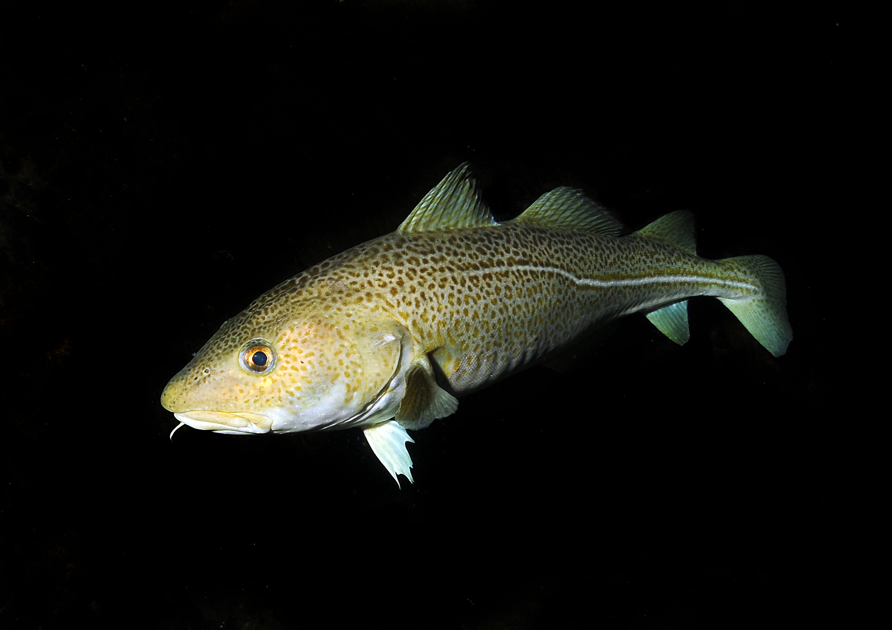

```{r setup, include=FALSE}
knitr::opts_chunk$set(tidy=FALSE, warning=FALSE, message=FALSE, cache=FALSE, dev.args=list(bg="transparent"), fig.retina = 2)
```
***

<div class="img-with-text" >
  <a href="https://earthobservatory.nasa.gov/IOTD/view.php?id=84047">
    
  </a>
  <p><span class="source-img" style = "float:right; font-size:10px;">Foto: ISS Crew Earth Observations Facility and the Earth Science and Remote Sensing Unit, Johnson Space Center (under CC0)</span></p>
</div>

# Background

A notable feature of the Baltic hydrography is the presence of a generally east-west and north-south salinity gradient and salinity stratification of the water column, as you have identified in case study 1. The complex hydrographic regime of the Baltic, its short, but dynamic evolution, and the human intervention resulted in the biota consisting of species of various origins and environmental tolerances that have immigrated or been artificially introduced to the area over the relatively recent history of the system. These are marine and freshwater species, migratory species, and glacial relicts. Representatives of these categories have different environmental preferences as well as tolerances and the composition of communities therefore varies greatly in different regions of the Baltic Sea, depending primarily on salinity, water temperature, oxygen content, and nutrient concentrations. Regional climate change models predict an increase in temperature and a decrease in salinity but a high uncertainty remains about the impact of climate change on fish stocks. 

In this case study, we will investigate the **winter distribution** (1. quarter of the year: Jan- March) of the **8 most abundant fish species** in **2015** (Fig.1) using the BITS monitoring data. Since 2001, the **Baltic International Trawl Surveys (BITS)** has been carried out with a harmonized sampling scheme and standard gear to sample the demersal fish community in the Baltic Sea. This sampling scheme consists of trawl hauls with a duration of 30 minutes, carried at a speed of 3 knots with a demersal otter trawl gear (TV3 with mesh size of 520 or 930 mm). The gear is best suited for sampling demersal fish such as gadoids and flatfish. The dataset was downloaded from the ICES Database for Trawl Surveys (DATRAS; http://datras.ices.dk/ Home/Default.aspx; data downloaded on the 20th of Dec 2017).

<div class="img-with-text">
  <a href="http://www.fishbase.org" style="white-space: nowrap;">
    
    
    
    <br>
    
    
    
    
    </a>
  <p><span class="source-img" style = "float:right; font-size:10px;">
    <strong>Fig 1.</strong> Upper row showing from left to right: 
    <a href="https://www.fishbase.de/summary/69" title=''>Atlantic cod</a> (&copy; R. Svensen), 
    <a href="http://www.fishbase.se/summary/Merlangius-merlangus.html" title=''>whiting</a> (&copy; R.S.), 
    <a href="https://www.fishbase.de/summary/24" title=''>Atlantic herring</a> (&copy; R.S.), 
    <a href="https://www.fishbase.de/summary/1357" title=''>European sprat</a> (&copy; R.S.);
     lower row showing: 
    <a href="https://www.fishbase.de/summary/Platichthys-flesus.html" title=''>European flounder</a> 
    (&copy; K.I. Stergiou), 
    <a href="https://www.fishbase.de/summary/695" title=''>Common dab</a> (&copy; G.-P. Zauke), 
    <a href="http://www.fishbase.se/summary/Pleuronectes-platessa.html" title=''>European plaice</a> 
    (&copy; <a href="http://www.oceaneyephoto.com" title=''>J. Greenfield</a>), 
    <a href="http://www.fishbase.se/summary/4239" title=''>American plaice</a> (&copy; R.S.). 
    Image courtesy of the above photographers at <a href='http://www.fishbase.org' title=''>fishbase.org</a> 
    and <a href='http://www.uwphoto.com' title=''>uwphoto.com</a> (R. Svensen).
  </p>
</div> 

<br>
<br>
<br>
The data set contains also salinity and temperature values for every haul. This data stems from the oceanographic database provided by ICES, which was interpolated to generate predicted winter values for the location of the hauls taken.

```{r}
load("data/data_case_study_2.R")
str(cpue15)
```

The tibble contains information for each haul: the year, the coordinates, the respective ICES subdision and subarea, the gear type ("TVS" = small trawl type of 520 meshes, "TVL" = large trawl of 930 meshes), the 8 species, the total CPUE and its log-transformed value, and the interpolated temperature and salinity values. To avoid the problem of zero-inflation in your models, all zero values have been filtered out!

***

# Your task

Study the effects of latitude, longitude, depth and hydrography on the number of caught fish - **in areas where the species are present** (since we use presence-only data). You can also download the data and do the data wrangling yourself and compare with the one provided here (although it will not contain the salinity and temperature then). Some instructions for this are below.

## Answer the following questions

### A. Distribution along the latitude/longitude gradient

A1. For which species seems to be no latitudinal and longitudinal effect on the CPUE?
A2. For which species is the spatial effect greatest? Which model describes best the relationship?
A3. Which species has an increasing CPUE with increasing latitude and decreasing longitude?


### B. Depth preferences

B1. For which species does the bottom depth have no effect on the CPUE?
B2. Which species responds strongest to the depth in terms of CPUE? Is the relationship positive or negative here?


### C. Effect of salinity and temperature

C1. Is there any species that seems to not respond to salinity and temperature?
C2. Which species shows the strongest response to temperature and salinity? Does that fit to what we know about the species thermal and salinity preferences?


