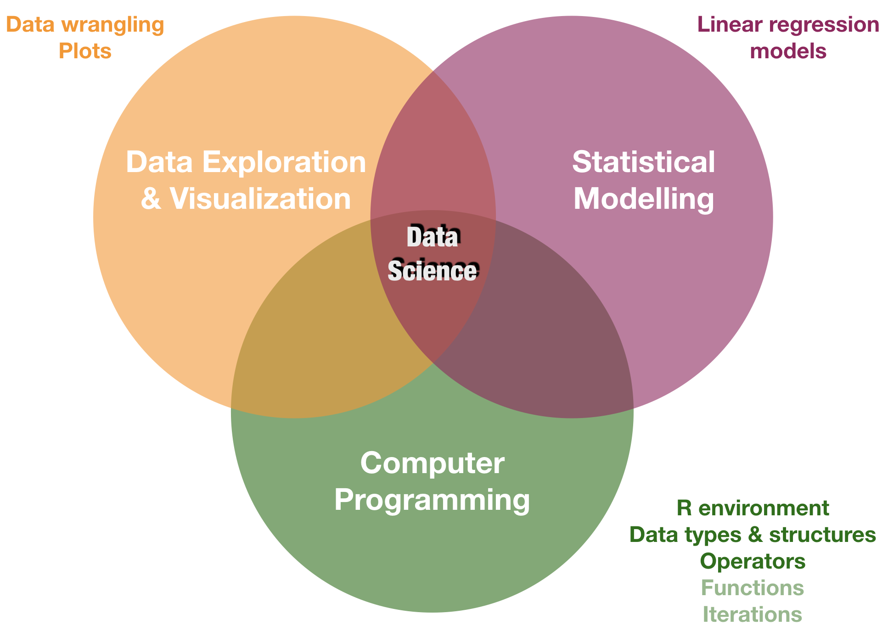
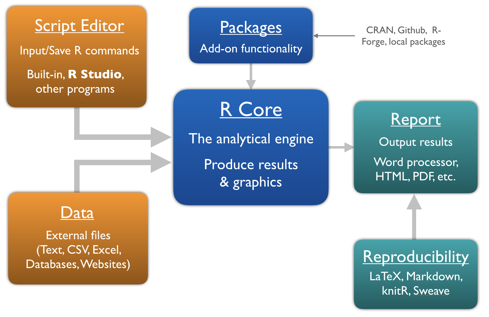
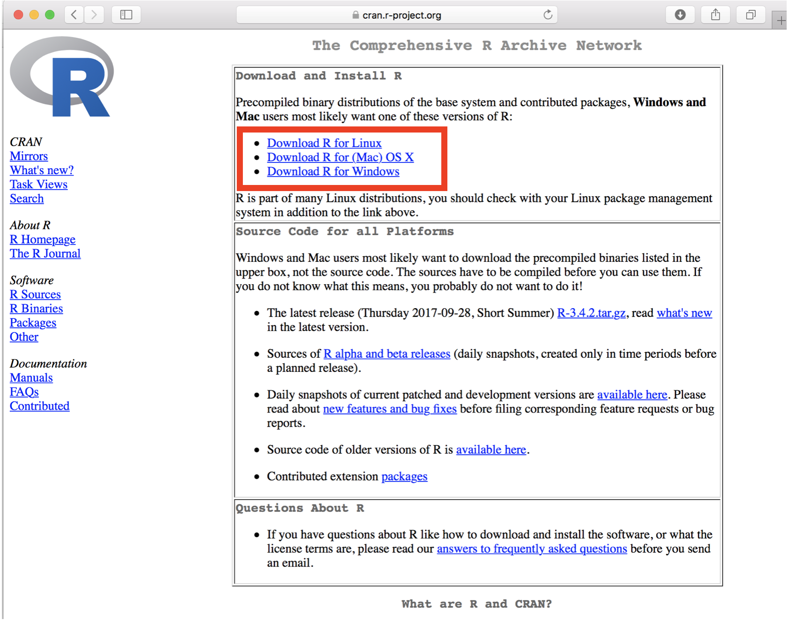
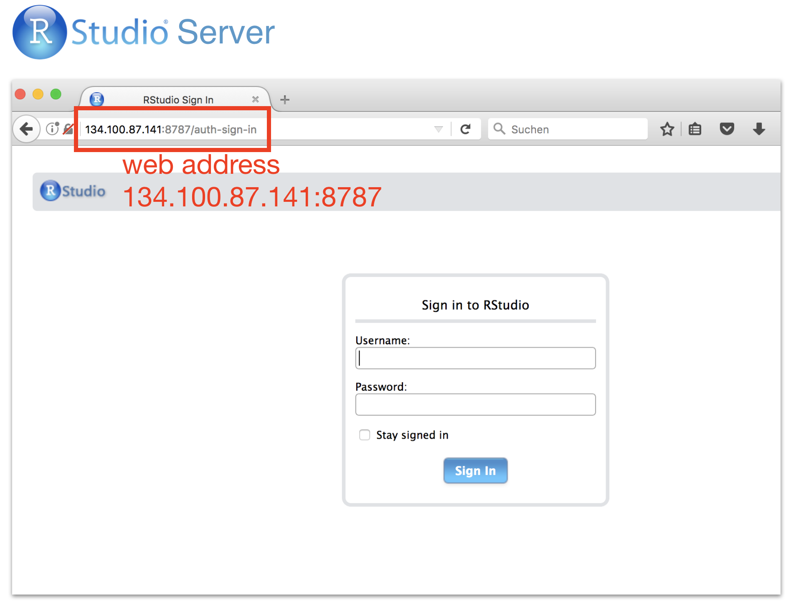
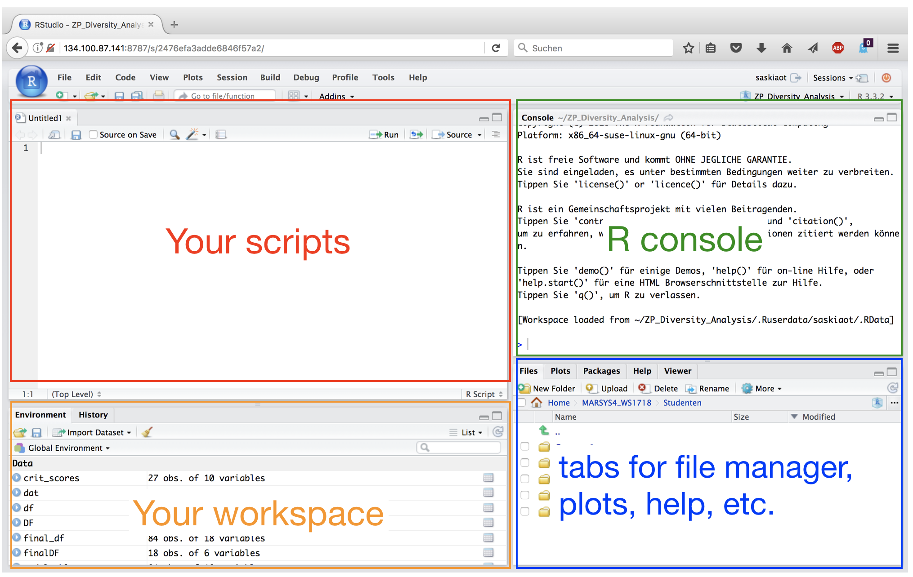
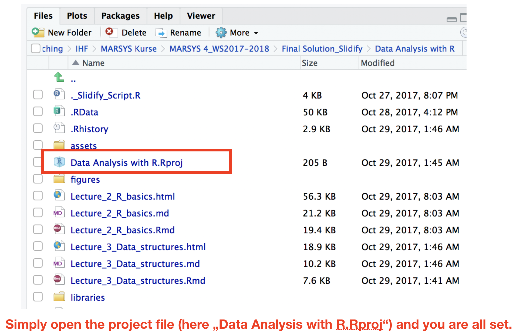

## Data science is

- all about **uncovering findings from data**. Diving in at a granular level to mine and understand complex behaviors, trends, and inferences. 

---
## Data science is 

- all about **uncovering findings from data**. Diving in at a granular level to mine and understand complex behaviors, trends, and inferences. 

### How do data scientists mine out insights? 

- It starts with data exploration. 
- When given a challenging question, data scientists become **detectives** and investigate leads and try to **understand patterns** within the data. 
- Data scientists may **apply quantitative technique** in order to get a level deeper → e.g. inferential models, segmentation analysis, time series forecasting, synthetic control experiments, etc. 
- The intent is to scientifically **piece together a forensic view** of what the data is really saying.
- THATS WHY IT IS SO EXCITING!

---

<div class="img-with-text" style="position: absolute; left: 100px; top: 50px; z-index:100">
    
 <p><span class="source-img" style = "float:right">
    Screenshot of <a href='https://hbr.org/2012/10/data-scientist-the-sexiest-job-of-the-21st-century' title=''>Harvard Business Review</a> website, taken November 11, 2017.</span></p>
</div>


--- &vcenter
### Data science is a blend of skills in three major areas:

 

--- &vcenter
### You will learn in this course:

 


--- &slide_no_footer .segue bg:#1874CD

# Intro to the R environment
 

---
## What is R? 

R is a programming language

```{r, out.width = "600px", echo = FALSE, fig.align='center'}
knitr::include_graphics("img/R_GUI.png")
```

 

---
<q style="font-size:25px;">"R is a **system for statistical computation and graphics**. It is a GNU project which is similar to the S language and environment which was developed at Bell Laboratories by John Chambers and colleagues. R can be considered as a different implementation of S…..R is available as **Free Software** under the terms of the Free Software Foundation’s GNU General Public License in source code form. It compiles and runs on a wide variety of **UNIX** platforms, **Windows** and **MacOS**."
 (from http://r-project.org/)</q>

---
### Why use R?

<iframe width="640" height="360" src="http://www.youtube.com/embed/y-HOQnMsylA?feature=player_detailpage" frameborder="0" allowfullscreen></iframe>  

--- &vcenter

```{r, out.width = "800px", echo = FALSE, fig.align='center'}

```

---
## Where do you get R?
Directly from the website https://cran.r-project.org

```{r, out.width = "600px", echo = FALSE, fig.align='center'}

```

---
## Use R from within 

 

- A software program, which provides a GUI for R (trademark of RStudio, Inc.)
- Helps writing and executing R code and analyzing data with R.
- Integrated text editor and data and package manager.
- Provides version control, LaTeX integration, keyboard shortcuts, and debugging tools.
- Has become standard amongst R users.
- Open source and commercial editions available: www.rstudio.com
- Runs on desktops (Windows, Mac, and Linux) or in a web browser connected to RStudio Server → **We will use R Studio Server during the course**!


--- &vcenter
```{r, out.width = "800px", echo = FALSE, fig.align='center'}

```

--- &vcenter
 

```{r, out.width = "900px", echo = FALSE, fig.align='center'}

```

---
## Advantages of writing scripts

- **Transparency and reproducibility** - Not only the results but each step of the analysis are visible.
- **Flexibility** - Some analyses need only a few code tweaks of an existing R script.
- **Exchange** - In theory every R user should understand your script to allow easy sharing of code.

---
## Work with scripts in R Studio

- Open a new script (**File  ➔ New File ➔ R Script)**
- Write code into the empty script (in the editor pane)
- Send the code to the R console:
  - mark the code chunk and copy and paste it into the console (NOT recommended!)
  - press **ctrl + enter**  ➔ code of current line (where the cursor is) is executed; cursor jumps then automatically to the next line of code
  - mark the code chunk ➔ ctrl + enter  ➔ entire code chunk is executed

```{r, out.width = "700px", echo = FALSE, fig.align='center'}
knitr::include_graphics("img/R_run_scripts.png")
```

---
## Style guide - Some general recommendations

- Use a style guide and stick to it.
- Every script should be **as small as possible** and **as complex as needed**.
- Every script should be run by the console from start to end **without any error messages**.
- Use **"#"** to comment your code.
- Comment **why** you do something, not what you do.
- Never use `attach()`.
- Assignment operator: `<-` (do not use "=")

---
## Style guide - Object names

- Variable names should be **nouns** and function names should be **verbs**.
- Object names **cannot** begin with **numbers**.
- Don't uses special characters (e.g. !,/,%)
- Wise to **avoid** names already in use (for **functions**).
- Use **lowercase**
- Do **not** use **empty spaces** in names, instead combine with **underscore**.
- Ok to use:
  - a, x, my_list, my_dat, dat1
- **Not** recommended:
  - 1_a, c, list, _mydat, $dat

---
## Style guide - Spacing

Put a space 

- **before** and **after** all infix operators (=, +, -, <-, etc.)
- when naming arguments in function calls
- after a comma, but never before 


---
## Before you start: set the working directory

```{r, out.width = "800px", echo = FALSE, fig.align='center'}
knitr::include_graphics("img/Working_Directory.png")
```

---
## Better: Use R Projects

```{r, out.width = "800px", echo = FALSE, fig.align='center'}
knitr::include_graphics("img/R_Projects.png")
```

--- &twocol
## R Projects (cont)
                
*** =left
### New folder stucture 
```{r, out.width = "600px", echo = FALSE, fig.align = 'center'}

```

*** =right 
### Advantages of projects
- **Pre-defined** folder structure
- Working directory is set **automatically**
- All **scripts** in this projects are **immediately** available
- Opens a **new R instance** so that one can switch between several instances

--- &slide_no_footer .segue bg:#1874CD

# Arithmetics and functions in R
 

--- &twocol
## Basic calculations

In its most basic form, R can be used as a **simple calculator**.
```{r, out.width = "380px", echo = FALSE, fig.align = 'center'}
knitr::include_graphics("img/Calculator_1.png")
```

--- &twocol
## Basic calculations

Consider the following **arithmetic operators**:

*** =left
- Addition: `+`
- Subtraction: `-`
- Multiplication: `*`
- Division: `/`
- Exponentiation: `^`

*** =right

--- &twocol
## Basic calculations

Consider the following **arithmetic operators**:

*** =left
- Addition: `+`
- Subtraction: `-`
- Multiplication: `*`
- Division: `/`
- Exponentiation: `^`

*** =right
```{r, eval = FALSE}
5 + 5  
5 - 5  
3 * 5 + 2 
(5 + 5) / 2 
```

--- &twocol
## Basic calculations

Consider the following **arithmetic operators**:

*** =left
- Addition: `+`
- Subtraction: `-`
- Multiplication: `*`
- Division: `/`
- Exponentiation: `^`

*** =right
```{r, eval = TRUE}
5 + 5  
5 - 5  
3 * 5 + 2 # multipl. then add.
(5 + 5) / 2 # add. then div.
```


--- &twocol
## Basic calculations (cont)

It also has **functions** that let you do more **sophisticated**
manipulations, which you can **combine** by using **parentheses**:

*** =left
```{r, eval = FALSE}
a <- c(1,2,3,4)
c <- (a + sqrt(a))/(exp(2)+1)
```

*** =right
```{r, out.width = "315px", echo = FALSE, fig.align = 'center'}
knitr::include_graphics("img/Calculator_2.png")
```

--- &twocol
## Basic calculations (cont)

It also has **functions** that let you do more **sophisticated**
manipulations, which you can **combine** by using **parentheses**:

*** =left
```{r, eval = FALSE}
a <- c(1,2,3,4)
c <- (a + sqrt(a))/(exp(2)+1)
```
Order of calculations (from the innermost to
outermost parenthesis - just like a calculator).

> 1. `sqrt(a)` and `exp(2)`
> 2. then `a` added to `sqrt(a)` and `1` added to `exp(2)`
> 3. then the division   
<small>(sqrt = square root, exp = exponent)</small>

*** =right
```{r, out.width = "315px", echo = FALSE, fig.align = 'center'}
knitr::include_graphics("img/Calculator_2.png")
```

--- 
## + prompt

```{r, out.width = "800px", echo = FALSE, fig.align = 'center'}
knitr::include_graphics("img/Prompt.png")
```

If your prompt turns into a **"+"**, R thinks you haven't finished
your previous command. Either **finish the command**, or press **escape**.

---
## A short introduction to functions in R

- Functions are the heart and soul of R.
- A function is a **block of code** that gives **instructions** to R to carry out.
- Some functions come in R's **base** package others in **additional packages**. 
- They work similar to functions in other packages:

---
## A short introduction to functions in R

- Functions are the heart and soul of R.
- A function is a **block of code** that gives **instructions** to R to carry out.
- Some functions come in R's **base** package others in **additional packages**. 
- They work similar to functions in other packages:
  - in **Excel**, to sum up over cells A1 to A10 you write **sum(A1:A23)**.
  - in R there is an equivalent function named `sum()`, which takes the elements it should sum over as argument: 
  
```{r, out.width = "600", echo = FALSE, fig.align = 'center'}
knitr::include_graphics("img/Functions.png")
```

---
## Getting help

Getting help for a **specific** function:
```{r, eval = FALSE}
help("mean")
?mean
```
Search the help pages:
```{r, eval = FALSE}
??mean
help.search("mean")
```
List **all** functions, which contain "mean":
```{r, eval = FALSE}
apropos("mean")
```

---
## R Documentation for the function `mean`

```{r, out.width = "800", echo = FALSE, fig.align = 'center'}
knitr::include_graphics("img/Mean_help_1.png")
```

---
## R Documentation for the function `mean`

```{r, out.width = "800", echo = FALSE, fig.align = 'center'}
knitr::include_graphics("img/Mean_help_2.png")
```


--- &slide_no_footer .segue bg:#EEC900

# Your turn...

--- &multitext bg:#EEC900

# Quiz 1: Simple calculations

Open a new script in your R Studio Server environment and save it before you start writing anything. Now calculate the following and write the result in the boxes below:

1. Substract 10 from 23, then multiply with 2.
2. Substract 10 from 23, then multiply with 2, then add 100, then divide all by 5.
3. Substract 23 from 10, then multiply with -10, then take the square root (use `sqrt()` function).

*** .hint
<small>R calculates first `*` and `/` before `+` and `-` operations. To change the order wrap the respective parts in parentheses!</small>

*** .explanation
1.The substraction needs to be in parenthesis otherwise 10 is multiplied with 2 first: `((23 - 10) * 2`   
2.Wrap now everything in brackets (parentheses) before you divide by 5:   
`((23 - 10) * 2 + 100) / 5`   
3.The `sqrt()`function comes last and wraps everything else up, that means you write all other calculations inside the function:   
`sqrt((10 - 23) * -10)` or you use 2 steps:   
` x <- (10 - 23) * -10)` and then `sqrt(x)`

1. <span class='answer'>`r (23 - 10) * 2`</span>
2. <span class='answer'>`r ((23 - 10) * 2 + 100) / 5`</span>
3. <span class='answer'>`r sqrt((10 - 23) * -10)`</span>


--- &thankyou

