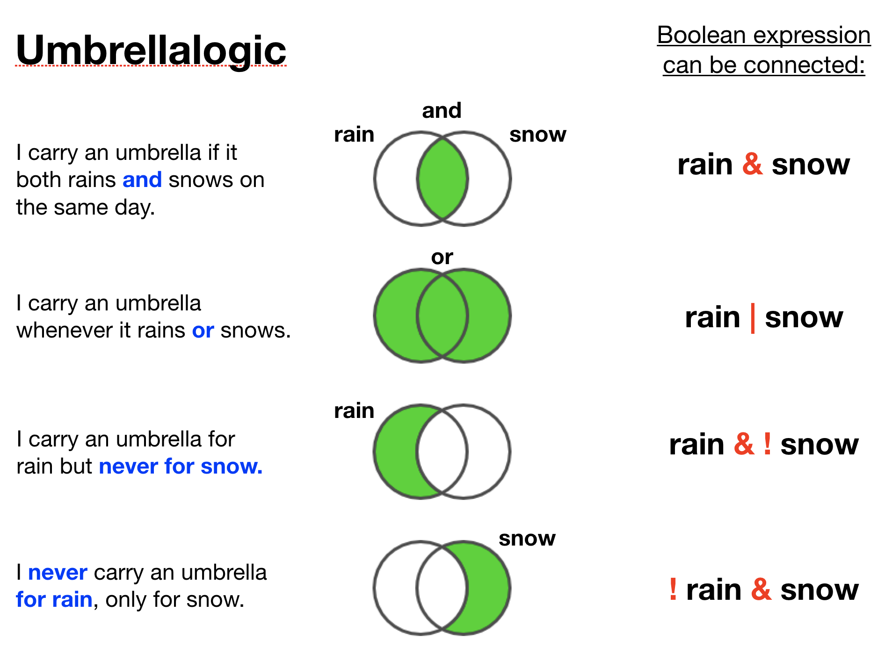

## Relational operators

 

- find out **relation between two operands**
- **six** relational operations are supported in R
- **output** is **logical** (TRUE or FALSE) for all of these operators
- work **element-wise**

|Operator | Usage | Description 
|:-------:|-------------|-------
|< | a < b | a is **LESS** than b
|> | a > b | a is **GREATER** than b
|== | a == b | a is **EQUAL** to b
|<= | a <= b | a is **LESS than or EQUAL to** b
|>= | a > = b | a is **GREATER than or EQUAL to** b
|!= | a!=b | a is **NOT EQUAL** to b


--- &twocol
### Example of relational operators

  

*** =left
```{r, eval = FALSE}
# Example for numbers
a <- 10
b <- 5
print(a < b) # less 
print(a >= b) # greater or equal
print(a != b) # not equal 
```

--- &twocol
### Example of relational operators

 

*** =left
```{r, eval = TRUE}
# Example for numbers
a <- 10
b <- 5
print(a < b) # less 
print(a >= b) # greater or equal
print(a != b) # not equal 
```

--- &twocol
### Example of relational operators

 

*** =left
```{r, eval = TRUE}
# Example for numbers
a <- 10
b <- 5
print(a < b) # less 
print(a >= b) # greater or equal
print(a != b) # not equal 
```

*** =right
```{r, eval = FALSE}
# Example for vectors
a <- c(7.5, 3, 5)
b <- c(2, 7, 5)
print ( a <= b ) # less or equal
print ( a != b ) # not equal
```

--- &twocol
### Example of relational operators

 

*** =left
```{r, eval = TRUE}
# Example for numbers
a <- 10
b <- 5
print(a < b) # less 
print(a >= b) # greater or equal
print(a != b) # not equal 
```

*** =right
```{r, eval = TRUE}
# Example for vectors
a <- c(7.5, 3, 5)
b <- c(2, 7, 5)
print ( a <= b ) # less or equal
print ( a != b ) # not equal
```

---
## Logical (boolean) operators
 

- work only for the **basic data types** (e.g. logical, numeric) and **atomic vectors** in R. 

```{r, out.width = "1000px", echo = FALSE}
knitr::include_graphics("img/Bool_operators.png")
```

---
```{r, out.width = "800px", echo = FALSE, fig.align = "center"}

```

---
### Example of combined boolean operators
 

```{r}
x <- 1:5
x[ x < 4 & x >= 2]
```

---
### Example of combined boolean operators
 

```{r}
x <- 1:5
x[ x < 4 & x >= 2]
```

|Step | Usage | 1 | 2 | 3 | 4 | 5 |  
|-------|---------|-------|-------|-------|-------|-------|
| 1 | x < 4 | TRUE | TRUE | TRUE | FALSE | FALSE |
| 2 | |  |  |  |  |  |
| 3 |  |  |  |  |  |  |


---
### Example of combined boolean operators
 

```{r}
x <- 1:5
x[ x < 4 & x >= 2]
```

|Step | Usage | 1 | 2 | 3 | 4 | 5 |  
|-------|---------|-------|-------|-------|-------|-------|
| 1 | x < 4 | TRUE | TRUE | TRUE | FALSE | FALSE |
| 2 | x >= 2 | FALSE | TRUE | TRUE | TRUE |  TRUE|
| 3 |  |  |  |  |  |  |

---
### Example of combined boolean operators
 

```{r}
x <- 1:5
x[ x < 4 & x >= 2]
```

|Step | Usage | 1 | 2 | 3 | 4 | 5 |  
|-------|---------|-------|-------|-------|-------|-------|
| 1 | x < 4 | TRUE | TRUE | TRUE | FALSE | FALSE |
| 2 | x >= 2 | FALSE | TRUE | TRUE | TRUE |  TRUE|
| 3 | x < 4 & x >= 2 | FALSE | TRUE | TRUE | FALSE | FALSE |

---
## Element- vs. operand-wise operation
 

```{r}
a <- c(TRUE, TRUE, FALSE, FALSE)
b <- c(TRUE, FALSE, TRUE, FALSE)

print(a | b)
print(a || b)
```


--- 
## Other miscellaneous operators
 

- are similarly important for manipulating data.

Operator | Usage | Description 
---------|-------------|-------
: | a:b | Creates series of numbers from left operand to right operand
%in% | a %in% b | Identifies if an element(a) belongs to a vector(b)
%*% |  A %*% t(A)| Performs multiplication of a vector with its transpose

--- &twocol
## Other miscellaneous operators
 

- are similarly important for manipulating data.

Operator | Usage | Description 
---------|-------------|-------
: | a:b | Creates series of numbers from left operand to right operand
%in% | a %in% b | Identifies if an element(a) belongs to a vector(b)
%*% |  A %*% t(A)| Performs multiplication of a vector with its transpose

### Example for `%in%`
 

*** =left
```{r}
a <- c(25, 27, 76)
b <- 27
print(b %in% a)
```

*** =right
```{r}
print(a %in% b)
```


--- &slide_no_footer .segue bg:#EEC900

# Your turn...

--- &radio bg:#EEC900
# Quiz 1: Relational operators

What does the following operation return (try to find the answer without using R):
```{r, eval = FALSE}
a <- c(6, 80, 107, 164, 208, 53, 216, 268, 65, 283)
a < 60
```

1. NA
2. a numerical vector containing 6 and 53 
3. TRUE
4. FALSE
3. _a logical vector with TRUEs and FALSEs_

*** .explanation
R checks for each element in **a** whether its value is less than 60 and returns a TRUE or otherwise a FALSE. As we have 10 elements in **a** the returned logical vector has also 10 elements.

--- &radio bg:#EEC900
# Quiz 2: Relational operators

How many `TRUE`s would you get from the following operation (try to find the answer without using R):
```{r, eval = FALSE}
a <- c(6, 80, 107, 164, 208, 53, 216, 268, 65, 283)
a <= 80
```

1. 1
2. 6
3. _4_
4. 3

*** .hint
<small>R applies the operation element-wise: 6 <= 80? 80 <= 80? 107 <= 80?...</small>

*** .explanation
Four elements have values that are TRUEly less than or equal to 80, i.e. 6,53,65, and 80.


--- &radio bg:#EEC900
# Quiz 3: Relational operators

How many `TRUE`s would you get from the following operation (try to to find the answer without using R):
```{r, eval = FALSE}
a <- c(16, 47, 207)
b <- c(0, 49, 410)
a <= b
```

1. 1
2. _2_
3. 5

*** .hint
<small>R applies the operation element-wise in both vectors: 16 <= 0? 47 <= 49? 207 <= 410?</small>

*** .explanation
Two values in **a** are TRUEly less than or equal to the corresponding values in **b**, i.e. 16 and 47.


--- &multitext bg:#EEC900
# Quiz 4: Relational operators
What do the following operations on these vectors return:
```{r, eval = TRUE}
a <- c(4, 5, 1, 8, 8, 10)
b <- c(0, 0, 3, 6, 7, 9); c <- 3
```
1. a[a < b]
2. b[b == c]
3. sum(c >= b)

*** .hint
<small>If a vector is shorter than the other it gets recycled for the element-wise comparison</small>

*** .explanation
1. Recall, `a < b` returns a logical vector of length a and b (=c(FALSE,FALSE,TRUE,FALSE,FALSE,FALSE)), which you then use to subset the vector **a**. Only the 3rd element in **a** (=1) is TRUEly less than the corresponding element in **b** (=3) and its number is then returned: <span class='answer'>`r a[a < b]`</span>

2. **c** gets first recycled (meaning that the value 3 gets repeated 6 times) for the element-wise comparison, in which only one element has the same value as **c** and the value of that element is then returned: <span class='answer'>`r b[b == c]`</span>.

3. `c >= b` returns a vector with 3 TRUEs and 3 FALSEs. Why?  When you calculate the sum, R coerces the elements to integers (recall, TRUE turns into 1 and FALSE into 0), so the correct answer is <span class='answer'>`r sum(c >= b)`</span>.


--- --- &exercise
# Logical operators

For 6 days it was measured whether it was sunny (sunny = TRUE) and whether it was hot (hot = TRUE). Now we want to check for several conditions (try to to find the answer without using R):
```{r, eval = FALSE}
sunny <- c(TRUE, TRUE, TRUE, FALSE, FALSE, FALSE)
hot <- c(FALSE, TRUE, FALSE, TRUE, FALSE, TRUE)
```

--- &radio bg:#EEC900
# Quiz 5: Logical operators

What does the following return?
```{r, eval = FALSE}
sunny <- c(TRUE, TRUE, TRUE, FALSE, FALSE, FALSE)
hot <- c(FALSE, TRUE, FALSE, TRUE, FALSE, TRUE)
sunny & hot
```

1. a vector of length 12 (with 6 TRUEs and 6 FALSEs)
2. _a vector of length 6 (with 1 TRUE and 5 FALSEs)_ 
3. a vector of length 6 (with 3 TRUEs and 3 FALSEs) 

*** .hint
<small>`&` is an element-wise AND operator: a TRUE is only returned if it is sunny and hot (both TRUE)</small>

*** .explanation
Both vectors have a length of 6 (6 days), hence,the returned vector has also 6 element. It contains only 1 TRUE (in position 2) as only at day 2 the weather was sunny AND hot.


--- &radio bg:#EEC900
# Quiz 6: Logical operators

What does the following return?
```{r, eval = FALSE}
sunny <- c(TRUE, TRUE, TRUE, FALSE, FALSE, FALSE)
hot <- c(FALSE, TRUE, FALSE, TRUE, FALSE, TRUE)
sunny | hot
```

1. a vector with 6 TRUEs
2. _a vector with 5 TRUEs and 1 FALSE_ 
3. a vector with 1 TRUE and 5 FALSEs

*** .hint
<small>`|` is an element-wise OR operator: a TRUE is returned if it is sunny or hot (at least one of both is TRUE).</small>

*** .explanation
Every day it was sunny or hot, except for day 5 (hence, here a FALSE in the returned vector).


--- &radio bg:#EEC900
# Quiz 7: Logical operators

What does the following return?
```{r, eval = FALSE}
sunny <- c(TRUE, TRUE, TRUE, FALSE, FALSE, FALSE)
hot <- c(FALSE, TRUE, FALSE, TRUE, FALSE, TRUE)
sunny || hot
```

3. FALSE 
4. _TRUE_

*** .hint
<small>The question to this operation would be: Was is for any of the 6 days at least sunny or hot?</small>

*** .explanation
`||` carries out a logical OR operation consolidated for all elements: first the OR operation is carried out element-wise and then it is checked whether at least one of the returned element is a TRUE.


--- &multitext bg:#EEC900
# Quiz 8: Combining operators

Which values do you get from the following vector:
```{r}
a <- c(6, 80, 107, 164, 208, 53, 216, 268, 65, 283)
```

1. a[a > 50 & a < 60]
2. a[a > a[5] & a < a[8]]
3. sum(a > 250 | a < 100)
4. sum(a[a %in% 1:60])

*** .explanation

1. <span class='answer'>`r a[a > 50 & a < 60]`</span>.
2. <span class='answer'>`r a[a > a[5] & a < a[8]]`</span>.
3. <span class='answer'>`r sum(a > 250 | a < 100)`</span>.
4. <span class='answer'>`r sum(a[a %in% 1:60])`</span>.


--- --- &exercise
# Quiz 9 - Challenge: Using operators for subsetting

```{r}
df <- data.frame(
  sample = letters[1:10], 
  group = c(rep(1, 5), rep(2, 5)), 
  value = c(6, 80, 107, 164, 208, 53, 216, 268, 65, 283) 
)
```

Subset this data frame using the operators you just learned:

1. Extract all observations from group 2
2. Extract all observations where values are greater than 150.
3. Extract all observations from group 1 where values are less than 50 or greater than 250.
4. Extract all observations that have the letters "a", "c", "g", or "j"

<small>(for a hint press p and for a solution code see last slide)</small>


<kbd>p</kbd>

*** =pnotes
Hint: Its easier if you first create a logical vector for subsetting the rows in the data frame; once you master this you can write it all in one R command. Remember, subsetting data frames can be done matrix-like: dataframe[ row, column]


--- &slide_no_footer .segue bg:grey

# Well Done!!!! You mastered the most important R basics that are fundamental for all that follows. 

--- 
### You are now able to ...

```{r, out.width = "700px", echo = FALSE, fig.align='center'}
knitr::include_graphics("img/Learning_cycle_1.png")
```


--- &slide_no_footer .segue bg:#CD2626

# How do you feel now.....?

--- &vcenter

## Totally confused?
                
```{r, out.width = "400px", echo = FALSE, fig.align = 'center'}
knitr::include_graphics("img/Comic_confused.png")
```

Read up on R operators in this very nice tutorial provided on the tutorialcart website:[ https://www.tutorialkart.com/r-tutorial/r-operators/](https://www.tutorialkart.com/r-tutorial/r-operators/).

--- &vcenter
## Totally bored?
                
```{r, out.width = "800px", echo = FALSE, fig.align = 'left'}
knitr::include_graphics("img/Comic_bored.png")
```

Don't worry! Soon you won't be bored anymore!!

---
## Totally content?
Then go grab a coffee, lean back and enjoy the rest of the day...!

```{r, out.width = "600px", echo = FALSE, fig.align = 'center'}
knitr::include_graphics("img/Comic_hammock.png")
```


--- &thankyou


--- &slide_no_footer .segue bg:#CD2626

# Solution - Quiz 9

---

1.Extract all observations from group 2.
```{r, eval = FALSE}
sel_group <- df$group == 2 # returns a logical vector
df[sel_group, ] # column index is empty as we want all columns
```
2.Extract all observations where values are greater than 150.
```{r, eval = FALSE}
sel_value <- df$value > 150 
df[sel_value, ]
```
3.Extract all obs. from group 1 where values < 50 or > 150.
```{r, eval = FALSE}
sel_group <- df$group == 1
sel_value <- df$value < 50 | df$value > 150
df[sel_group & sel_value, ]
```
4.Extract all observations that have the letters "a", "c", "g", or "j".
```{r, eval = FALSE}
sel_sample <- df$sample %in% c("a", "c", "g", "j") 
df[sel_sample, ]
```

