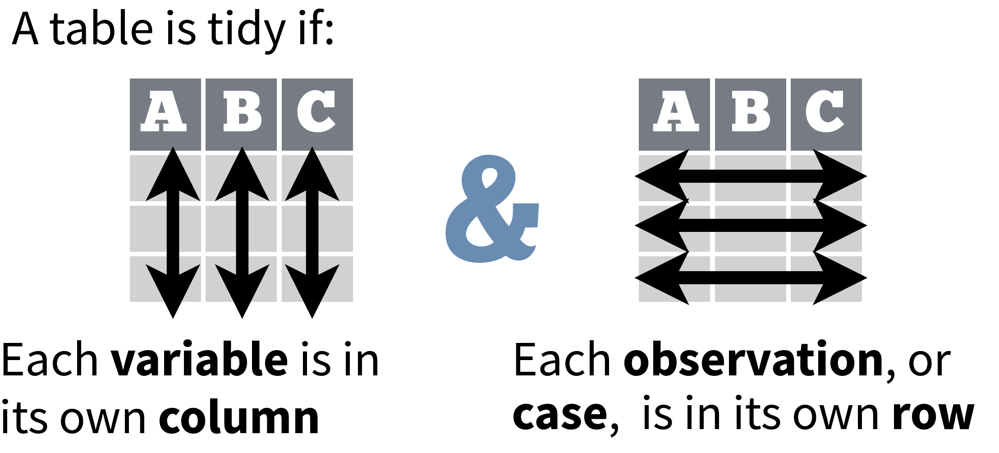
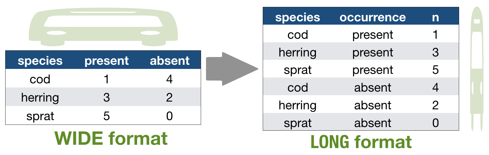
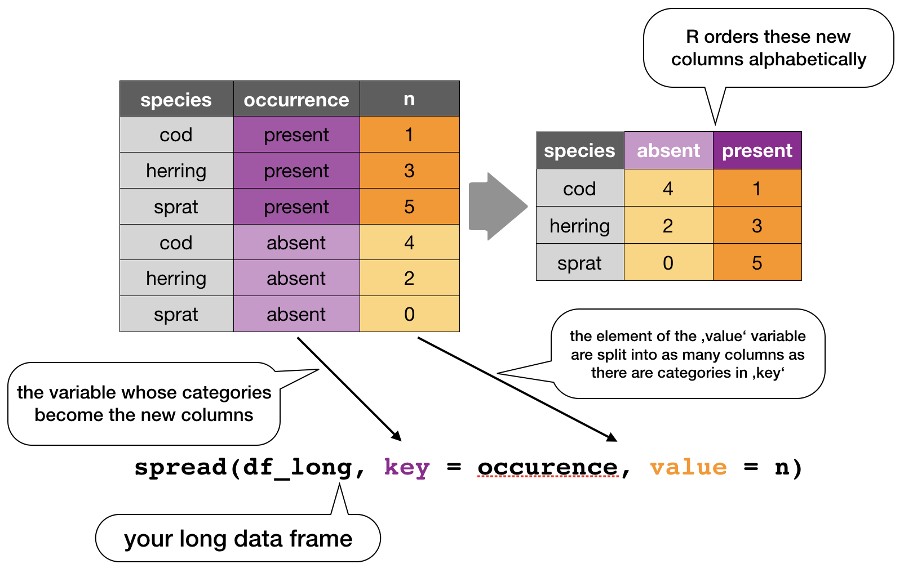
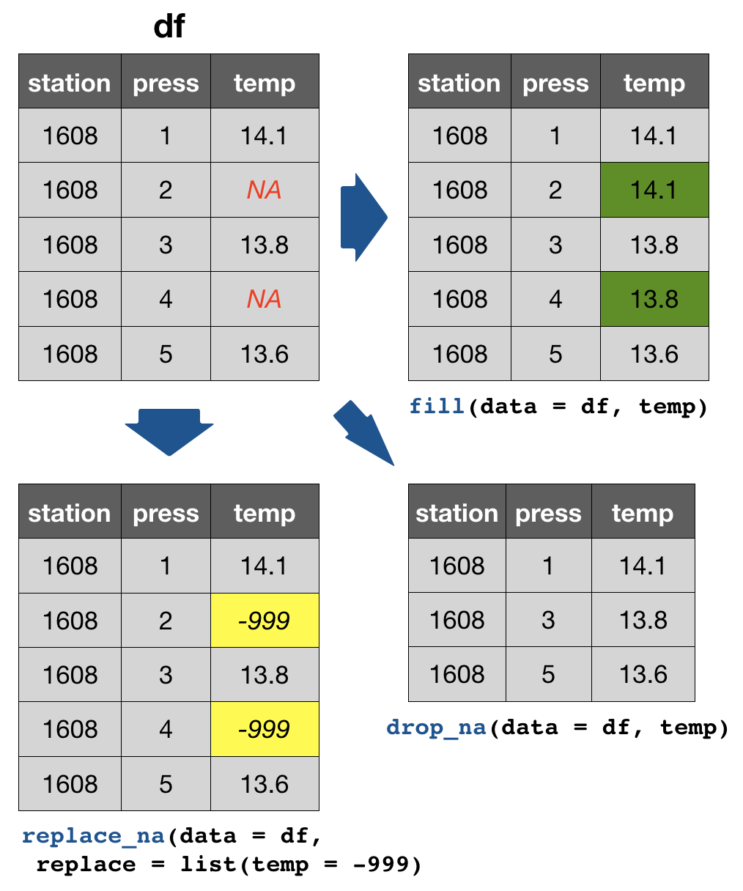

## So what is "tidy" data?

- A way to **organize tabular** data

---
## So what is "tidy" data?

- A way to **organize tabular** data

<div class="img-with-text" style="position: absolute; left: 200px; top: 200px">
    
 <p><span class="source-img" style = "float:right">source: 
  <a href='https://github.com/rstudio/cheatsheets/raw/master/data-import.pdf' title=''>Data Import</a> cheat sheet (licensed under CC-BY-SA)</span></p>
</div>


---
## So what is "tidy" data?

- A way to **organize tabular** data
- Provides a **consistent** data structure across packages.
- Is **easy** to aggregate, visualise and model (i.e. works well with dplyr, ggplot, and lm)
- Complements R’s **vectorized operations** --> R will automatically preserve observations as you manipulate variables.

---
## So what is "tidy" data?

- A way to **organize tabular** data
- Provides a **consistent** data structure across packages.
- Is **easy** to aggregate, visualise and model (i.e. works well with dplyr, ggplot, and lm)
- Complements R’s **vectorized operations** --> R will automatically preserve observations as you manipulate variables.

<div class="img-with-text" style="position: absolute; left: 250px; top: 365px">
    
 <p><span class="source-img" style = "float:right">source: 
  <a href='https://github.com/rstudio/cheatsheets/raw/master/data-import.pdf' title=''>Data Import</a> cheat sheet (licensed under CC-BY-SA)</span></p>
</div>


---
## So what is "tidy" data?

- A way to **organize tabular** data
- Provides a **consistent** data structure across packages.
- Is **easy** to aggregate, visualise and model (i.e. works well with dplyr, ggplot, and lm)
- Complements R’s **vectorized operations** --> R will automatically preserve observations as you manipulate variables.
- Something than many people have intuitively applied 
- But Hadley Wickham developed a **whole framework** around this concept and with the tidverse packages, and particularly **'tidyr'**, it is much easier to adopt

```{r, out.width = "100px", echo = FALSE, fig.align='center'}
knitr::include_graphics("img/Logo_tidyr.png")
``` 

---
## Imagine the following crosstabulation

This table shows the number of times the 3 fish species were caught in 5 trawls:
```{r, out.width = "500px", echo = FALSE, fig.align='center'}
knitr::include_graphics("img/Crosstab_1.png")
``` 
How many variables do you see?

> - You should see **3**:
    - the **species**
    - the **occurence** category with 2 levels
    - the actual **values** of these 2 levels

--- &twocol
## Accessing elements in crosstabulations

```{r, out.width = "500px", echo = FALSE, fig.align='center'}
knitr::include_graphics("img/Crosstab_1.png")
``` 

*** =left
How would you access elements, e.g., to
- get the occurence categories?
- get the species list?
- get all values in one vector?

--- &twocol
## Accessing elements in crosstabulations

```{r, out.width = "500px", echo = FALSE, fig.align='center'}
knitr::include_graphics("img/Crosstab_1.png")
``` 

*** =left
How would you access elements, e.g., to
- get the occurence categories?
- get the species list?
- get all values in one vector?

*** =right
```{r, eval = FALSE}
names(df)[2:3]
df[1, 2:4]
c( df[1, ], df[2, ], df[3, ])
```

### SIMPLE?

--- &twocol
## Alternatively: Restructure the table 

```{r, out.width = "950px", echo = FALSE, fig.align='center'}

``` 

*** =left
```{r, eval = FALSE}
names(df)[2:3]
df[1, 2:4]
c( df[1, ], df[2, ], df[3, ])
```

*** =right
```{r, eval = FALSE}
df$occurrences
df$species
df$n
```

### Which one do you prefer?


--- &twocol
## Another example with the hydrographical data from ICES

What can be potential issues with such a table?

*** =left
```{r, out.width = "400px", echo = FALSE, fig.align='center'}
knitr::include_graphics("img/Hydro_wide.png")
``` 


--- &twocol
## Another example with the hydrographical data from ICES

What can be potential issues with such a table?

*** =left
```{r, out.width = "400px", echo = FALSE, fig.align='center'}
knitr::include_graphics("img/Hydro_wide.png")
``` 

*** =right
- Where should the coordinates per station be added? In an extra table?
- Where should the date be added? On top of the station names?
- What to do with the other parameters, salinity and oxygen? Different files? 
- Not clear that the values represent temperature!

---
## Solution: Restructure the table again

```{r, out.width = "800px", echo = FALSE, fig.align='center'}
knitr::include_graphics("img/Hydro_restructured.png")
``` 

---
## Which one do you consider tidy?

---
## Which one do you consider tidy?

- The **'long'** data format is considered more tidy as
  - each observation (here temperature measurement) is in its own row
  - each variable has its own column → station and temperature are not mixed anymore!
- **BUT**: some functions require the data to be in a **wide** format --> you need to adjust your data table in that case

--- &slide_no_footer .segue bg:#1E90FF

# <small>2. Tidy data</small> - How to change between data formats? 
 

---
### 'tidyr' provides two functions for that: 
- `gather()` and 
- `spread()`

---
### `gather()` 
Moves column names into a key column, gathering the column values into a single value column.
```{r, out.width = "900px", echo = FALSE, fig.align='center'}
knitr::include_graphics("img/gather.png")
``` 

---
### `spread()` 
Moves the unique values of a key column into the column names, spreading the values of a value column across the new columns.
```{r, out.width = "800px", echo = FALSE, fig.align='center'}

``` 

---
In the R console you would write for the hydrographical example

```{r, echo = FALSE, message = FALSE}
library(tidyverse)
```


```{r, eval = FALSE}
cruise <- tibble(pressure = 1:5, station_1 = c(14.1,14.0,14.0,13.9,13.8),
  station_2 = c(15.3,15.4,15.2,15.0,14.9))
cruise
# Make tibble long
cruise_long <- gather(cruise, station_1, station_2, key = "station", value = "temp")
cruise_long
# Reshape tibble back into wide format
cruise_wide <- spread(cruise_long, station, temp)
cruise_wide # same as cruise!
```

### TRY IT YOURSELF!

--- &slide_no_footer .segue bg:#EEC900

# Your turn...

--- &exercise
# Quiz 1: Restructuring data formats
Why are `gather()` and `spread()` not perfectly symmetrical?
Carefully consider the following example:

```{r}
(stocks <- tibble(
  year = c(rep(2014,3), rep(2015, 4), rep(2016,2)),
  quarter = c(2:4, 1:4, 1:2), return = round(rnorm(9, mean = 1, sd = 0.3), 2) ) )
```

--- &exercise
# Quiz 1: Restructuring data formats
Why are `gather()` and `spread()` not perfectly symmetrical?
Carefully consider the following example:

```{r, eval=FALSE}
(stocks <- tibble(
  year = c(rep(2014,3), rep(2015, 4), rep(2016,2)),
  quarter = c(2:4, 1:4, 1:2), return = round(rnorm(9, mean = 1, sd = 0.3), 2) ) )
```

Now lets make the data wide and then long again:

```{r}
stocks_wide <- spread(stocks, quarter, return)
stocks_long <- gather(stocks_wide, `1`:`4`, key = "quarter", value = "return")
```

What is the difference between stocks and stocks_long?
(Hint: look also at the variable types and think about column names.)


--- &radio bg:#EEC900
# Quiz 2: Restructuring data formats

What is the argument 'factor_key' in `gather()` for?

1. _determines whether key values will be stored as factors_
2. determines whether factors will be also stacked
3. determines whether all factors in the dataset should be coerced to character values 

*** .hint
<small>Read the help documentation `?gather`.</small>


--- &slide_no_footer .segue bg:#1E90FF

# <small>2. Tidy data</small> - Separating and uniting cells
 

--- &twocol
Use these functions to split or combine cells into individual, isolated
values: `separate()`, `separate_row()`, `unite()`

--- 
Use these functions to split or combine cells into individual, isolated
values: `separate()`, `separate_row()`, `unite()`

```{r, out.width = "900px", echo = FALSE, fig.align='center'}
knitr::include_graphics("img/separate_unite.png")
``` 

--- &slide_no_footer .segue bg:#EEC900

# Your turn...

--- &exercise
# Try it out yourself

```{r, eval = FALSE}
df <- tibble(
  sd_station = c("25_BY5", "26_BMPJ2", "26_J56", "26_K32", 
    "27_B1", "28_BY15", "29_F64", "30_SR5", "30_US5B"),
  temp = c(14.1, 13.0, 15.2, 17.9, 14.8, 12.9, 12.1, 11.3, 11.1)
)

df_split <- separate(df, sd_station, into = c("sd", "station"))

df_join <- unite(df_split, sd, station, col = "sd_station", sep = "/")
```

--- &exercise
# Quiz 3: Separating and uniting cells
What do the extra and fill arguments do in `separate()`? Experiment with the various options for the following two toy datasets.

```{r, eval = FALSE}
df1 <- tibble(x = c("a,b,c", "d,e,f,g", "h,i,j")) 
separate(df1, x, c("one", "two", "three"), remove =F)

df2 <- tibble(x = c("a,b,c", "d,e", "f,g,i"))
separate(df2, x, c("one", "two", "three"))

```
<small>(The solution is at the end of the presentation.)</small>

--- &radio bg:#EEC900
# Quiz 4: Separating and uniting cells

Both `unite()` and `separate()` have a remove argument. What does it do? 

1. It removes extra values.
2. It removes the column names.
3. _It removes the original colum._
4. It removes special characters in the separating column.

Why would you set it to `FALSE`?

*** .hint
<small>Look into the help `?separate` and play with the argument and the above toy datasets.</small>


--- &slide_no_footer .segue bg:#1E90FF

# <small>2. Tidy data</small> - Handling missing values and other replacements
 

---
## Handling missing values (NAs) 
- **Leave them** in and **accomodate algorithm** to missing data, e.g. missing values are skipped during calculations like "pairwise deletion"; can cause problems
- **Delete** rows/columns
- **Interpolate** missing values
	- replace NAs by **mean/median** (advantage median: distribution can be skewed)
	- replace NAs by **regression** (linear interpolation)

---
## Checking for NAs

You can apply the function `is.na()` to single vectors and **single variables in a data frame** as you learned in lecture 2. Here an example with the ICES dataset

```{r, echo = FALSE, message = FALSE}
hydro <- read_csv("data/1111473b.csv")
names(hydro) <- c("cruise", "station", "type", "date_time", 
  "lat", "long", "depth", "pres", "temp", "psal", "doxy")
```

```{r}
is.na(hydro$temp)
```

--- &twocol
### ..... Puh!
Remember, the `is.na()` function returns a logical vector of the **same length then the original vector** (which has, in our case, **30012** values!). 

BETTER: If you wrap the function by the `sum()`function, you can calculate the sum of all TRUEs in this vector:

*** =left
```{r}
sum(is.na(hydro$temp))
sum(is.na(hydro$psal))
```

*** =right
You can do the same with the entire data frame
```{r}
sum(is.na(hydro))
```

---
### A shortcut to check NAs in all variables

A very fast way to see whether and how many NAs you have in a dataframe is to use the `summary()` function, which displays not only some **descriptive statistics** but also the **number of NAs**:

```{r}
summary(hydro[ ,9:11]) # for display purposes I selected not all columns
```

--- &twocol
### tidyr provides 3 useful functions for handling NAs

*** =left

1. `drop_na(data, ...)`: Drops entire rows containing missing values. 
2. `fill(data, ..., .direction = c("down", "up"))`: Fills missing values in using the previous  (direction = "down") or following (direction = "up") entry. Useful if only values that change are recorded.
3. `replace_na(data, replace = list(), ...)`: Replaces missing values with a value specified for each column.

*** =right
```{r, out.width = "400px", echo = FALSE, fig.align='center'}

``` 

--- 
## Replacing (single) values other than NAs

Use the indexing rules and operators for subsetting you've learned so far:

```{r}
cruise <- tibble(pressure = 1:5, station_1 = c(4.1,4.0,4.0,3.9,33.8),
  station_2 = c(-5.3,-5.4,5.2,5.0,4.9))
```

--- &twocol
## Replacing (single) values other than NAs

Use the indexing rules and operators for subsetting you've learned so far:

```{r}
cruise <- tibble(pressure = 1:5, station_1 = c(4.1,4.0,4.0,3.9,33.8),
  station_2 = c(-5.3,-5.4,5.2,5.0,4.9))
```

*** =left
1. Replace a **single** value, e.g. set an extreme value to NA so it gets excluded in the analysis:
```{r, eval = FALSE}
# if you know the row of the outlier
cruise$station_1[5] <- NA
```

*** =right     
2. Replace **all** negative temperature values with NAs (might be typing or measurement errors)
```{r, eval = FALSE}
cruise$station_2[
  cruise$station_2 < 0] <- NA
# works only if you have no NAs, 
# otherwise try
cruise$station_2[
  !is.na(cruise$station_2) & 
  cruise$station_2< 0] <- NA
```

---
## Replacing (single) values other than NAs (cont)

A useful function to identify the position of elements in a vector for which the specified conditions holds is `which()`.
Lets identify the temperature value(s) that are equal to the maximum observed temperature value and set this/these to NA:

```{r}
id <- which(cruise$station_1 == max(cruise$station_1))
id
cruise$station_1[id] <- NA
```


--- &slide_no_footer .segue bg:#EEC900

# Your turn...

--- &exercise
# Task: Replace NAs

We have the following dataset:
```{r}
df <- tibble(
  station = paste0("station_", 1:20), # concatenates "station" with the number 1 to 20
  temp = rnorm(20, mean = 14, sd = 2), # generates 20 values from a normal distribution
  sal = rnorm(20, mean = 8, sd = 0.5)
) 
random_nas <- sample(1:20, 7) # samples 7 random positions
df$temp[random_nas] <- NA # fill these positions in variable 'temp' with NAs
df$sal[random_nas] <- NA
```

--- &exercise
# Quiz 5: Replace NAs in temp

Try to deal with the NAs in the variable 'temp' in the following way:

1. Drop all rows with NAs in 'temp'
2. Replace NAs with the previous value
3. Replace NAs with the mean value (of the entire variable)
4. Replace NAs with -999

**What are the consequences if you do this? What is the best option (out of the four and having the original NAs in) for which situation?**

<small>As a help: calculate for each option the mean temperature and compare the results (the solution is at the end of the presentation).</small>

--- &exercise
# Quiz 6: Replace NAs in temp AND sal

Restore the original df (including the NAs in temp) and figure out how to change NAs (with the previous value) in both variables 'temp' and 'sal'  **IN ONE STEP**.

(The solution is at the end of the presentation.)

---
## Overview of more functions:

<div class="img-with-text" style="position: absolute; left: 200px; top: 100px">
    
 <p><span class="source-img" style = "float:right">
 Cheat sheet is freely available at 
 <a href='https://www.rstudio.com/resources/cheatsheets/' title=''>https://www.rstudio.com/resources/cheatsheets/</a></span></p>
</div>


--- &slide_no_footer .segue bg:#EEC900

# Your turn again...

--- bg:#EEC900
# Let’s put together everything you’ve learned to tackle a realistic data tidying problem.

```{r, out.width = "700px", echo = FALSE, fig.align = 'center'}
knitr::include_graphics("img/Tidy_synthesis.png")
```

--- &exercise
# Tasks

1. Import the hydrographical ICES dummy dataset: "dummy_hydro.csv"
2. Make the data tidy

**WHAT ARE THE THINGS TO CONSIDER????**

--- &exercise
# Tasks

1. Import the hydrographical ICES dummy dataset: "dummy_hydro.csv"
2. Make the data tidy
    - Is any restructuring needed?
    - Is any separation or union needed?
    - Do you agree with the column names?
    - Are the data types correct?
    - Do you need to handle NAs?
    - Are there any awkward values in the data (potential typing errors)?

--- &slide_no_footer .segue bg:#E5E5E5

## Overview of functions you learned today

base package: `is.na()`, `which()`, `summary()`

tidyr package: `gather()`, `spread()`,
`separate()`, `separate_row()`, `unite()`,
`drop_na()`, `fill()`, `replace_na()`


--- &slide_no_footer .segue bg:#CD2626

# How do you feel now.....?

--- &vcenter
## Totally confused?
                
```{r, out.width = "400px", echo = FALSE, fig.align = 'center'}
knitr::include_graphics("img/Comic_confused.png")
```

Go thorougly through the tasks and quizzes. 
Read the chapter [12 Tidy Data](http://r4ds.had.co.nz/tidy-data.html)  in 'R for Data Science'.

--- &vcenter
## Totally bored?
                
```{r, out.width = "800px", echo = FALSE, fig.align = 'left'}
knitr::include_graphics("img/Comic_bored.png")
```

Then play around already with the full hydro dataset "1111473b.csv" and make it tidy.

---
## Totally content?
Then go grab a coffee, lean back and enjoy the rest of the day...!

```{r, out.width = "600px", echo = FALSE, fig.align = 'center'}
knitr::include_graphics("img/Comic_hammock.png")
```


--- &thankyou


--- &slide_no_footer .segue bg:#CD2626

# Solutions

---
## Quiz 3: Separating and uniting cells

- df1: row 2 has one element MORE when splitting the string into individual columns —> R will return an error message and drop the extra value as default. If you want to get no warning or keep the extra value (united with the previous value) change the 'extra’ argument to extra = „drop“ or „merge“: 
```{r, eval=FALSE}
separate(df1, x, c("one", "two", "three"), extra = "merge")
```

- df2:  row 2 has one element LESS when splitting the string into individual columns —> with the default settings (fill = „warn“) R will fill the empty element with NA from the right and return a message. If you want to fill from the left without any warning, you should change to fill = „left“:
```{r, eval=FALSE}
separate(df2, x, c("one", "two", "three"), fill = "left")
```

--- 
## Quiz 5: Replace NAs in temp

```{r, eval = FALSE}
# This would be your code:
# 1.
drop_na(df, temp)
# 2.
fill(df, temp) # default is previous value 
# 3.
temp_mean <- mean(df$temp, na.rm= TRUE)
replace_na(df, list(temp = temp_mean))
# 4.
replace_na(df, list(temp = -999))
```

Some function cannot handle NAs so one way to solve the problem is to drop the entire rows that contain NAs somewhere or replace the NAs with some values such as the mean, median, or previous values:

---
## Quiz 5: Replace NAs in temp (cont)

- **dropping rows**: a simple, clean solution that doesn’t bring any artificial information into the data. But you might loose so many rows that your sample size becomes too small. In that case, filling NAs with values is a better option.

- **previous values**: can be useful in time series or spatial data (including depth profiles) where values next to each other (e.g. temperatures the next day or the adjacent water depth) are likely to be similar. Problematic here is if you have large gaps, e.g. the temperature in 1m depth and then in 100m depth again. For all intermediate depths (2-99m) the values would resemble the one from 1m depth, which is highly unrealistic. In such a case, removing the entire sample might be the best choice.

---
## Quiz 5: Replace NAs in temp (cont)

- **mean**: replacing NAs with means (or medians) is a common technique, particularly if samples are not closely related (e.g. temperature measurements of stations far away from each other). But, think carefully which mean to take. The overall mean (across all samples, stations, etc)? The mean of that sample? The mean of the specific depth? The mean of the specific depth in the specific month?


- Some datasets come with the value -999 for missing values. To be consistent you might want to do the same for other datasets. But as soon as you do any calculations, this value will be treated as a real number messing up all your results (imagine the mean of 15, 16 and -999). Always change such missing values to NAs before you do any calculation, visualisation, or modelling.


**Best solution**: there isn’t a best solution but a good practice is to keep your missing values as NAs and only for particular methods you deal with NAs in a way that is best suited for the type of data.

---
## Quiz 6: Replace NAs in temp AND sal

If you don’t specify any variable, NAs will be replace in the entire dataset: 
```{r, eval=FALSE}
fill(df)  
```

If you want to make sure only in temp and sal NAs are replaced specify that:
```{r, eval=FALSE}
fill(df, temp, sal)
```


