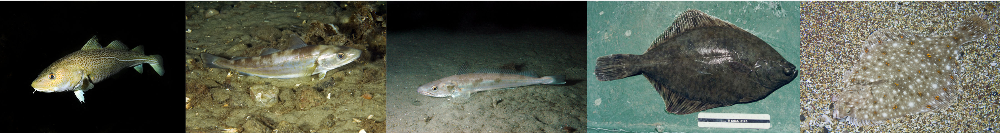
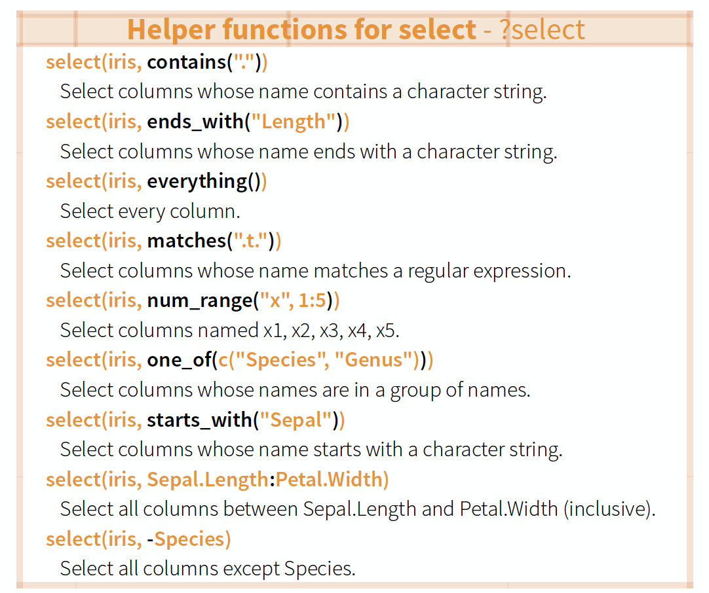
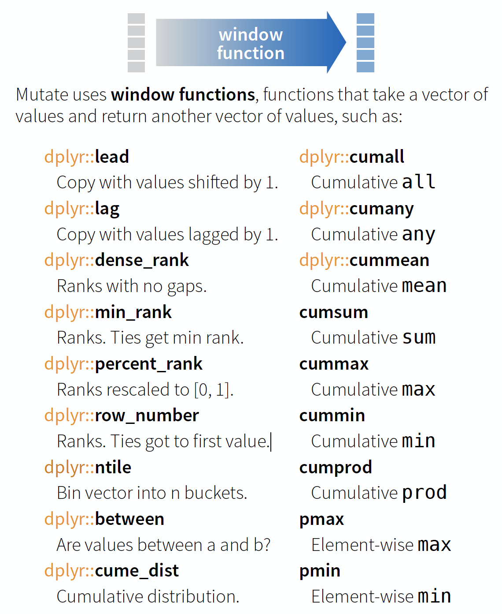
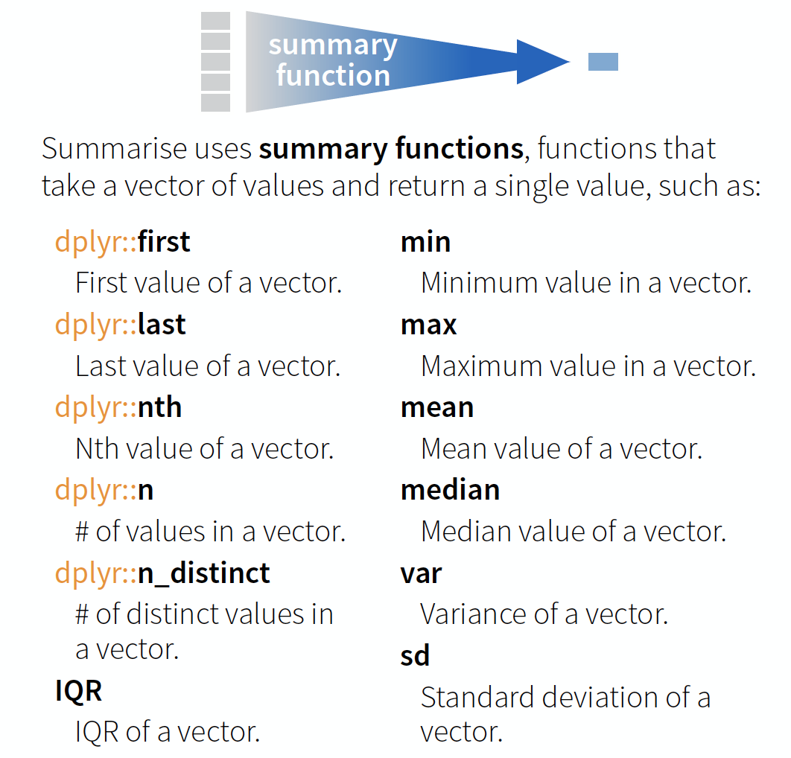

## What could be interesting questions for the oceanographic ICES data?

- Develop some questions yourself...

---

<q> The **first thing** that should be checked before getting into the actual analysis of the oceanographic data is the **data quality**! </q>

---

```{r, out.width = "850px", echo = FALSE, fig.align='center'}
knitr::include_graphics("img/Sampling_questions.png")
```

---
## These questions require data aggregation

Aggregations can be done by
> - **gear type**
> - **datasource**
> - **spatially** (e.g., per ICES subdivision or rectangle in this example)
> - **temporally** (e.g., per year or month) → This requires some knowledge of handling dates and times!


--- &slide_no_footer .segue bg:#1874CD

# Handling dates and times 
 

---
## Measurement of time is highly idiosyncratic

```{r, out.width = "800px", echo = FALSE, fig.align='center'}
knitr::include_graphics("img/Time.png")
```

---
## Measurement of time is highly idiosyncratic

### Surprisingly difficult for computers!

---
## Dates and times in R

To see how R handles dates and times, have a look at `Sys.time()`:

```{r}
Sys.time()
```

You see, first comes the year-month-day, then the time (h:m:s), and then the time zone. 
If you type
```{r}
unclass(Sys.time())
```
You get the number of seconds since 1 January 1970.

---
## Dates and times in R

- Two basic classes of date/times:
  - **POSIXlt**  
  - **POSIXct**  
- In tidyverse 3 types of date/time data that refer to an instant in time:

---
## Dates and times in R

- Two basic classes of date/times:
  - **POSIXlt**  
  - **POSIXct**  
- in tidyverse 3 types of date/time data that refer to an instant in time:

1. **date**: Tibbles print this as `<date>`.
2. **time** within a day: Tibbles print this as `<time>`.
3. **date-time** is a date plus a time: it uniquely identifies an instant in time (typically to the nearest second). Tibbles print this as `<dttm>`. 

---
## Dates and times in R (cont)

- Many ways of writing the date and time → **importing** the correct date format and **extracting parts** can be tricky!
- Always use the **simplest** possible data type that works for your needs.
- One tidy way to import the correct date and time is with the `parse_functions` in the **readr** package → but it requires some knowledge on the specification of the date format you want to import.


---
##  The 'lubridate' package

<div style="position: absolute; left: 950px; top: 25px; z-index:100">
    
</div>

- Makes it **easier** to work with dates and times.
- Handles a wide **variaty of formats** automatically.
- Is **not** part of the **core** tidyverse so it needs to be installed once and loaded additionally every time:.
```{r, eval = FALSE}
install.packages("lubridate")
library(lubridate)
```


--- &twocol
## Create DATE objects from string

Depending on the order of the date components you have 3 functions to choose from:

```{r, echo = FALSE, message = FALSE}
library(lubridate)
```


*** =left
```{r}
ymd("2017-11-17") # YEAR-MONTH-DAY
mdy("Nov 17th, 2017") # MONTH-DAY-YEAR
dmy("17-Nov-2017") # DAY-MONTH-YEAR
```

*** =right
- **Only the order matters!** The format is not important as lubridate will automatically recognize it.
- You can apply the function to an entire vector.

--- &twocol
## Create DATE-TIME objects from strings

*** =left
Simply combine `ymd`, `mdy` or `dmy` with 
- `_h` if you have only the hour
- `_hm` if you have hour and minute
- `_hms` for hour:min:sec

*** =right
```{r}
# Date with HOUR-MIN-SEC
ymd_hms("2017-11-17 12:11:59")
# Date with HOUR-MIN
mdy_hm("11/17/2017 12:11")
```


--- &twocol
## Create DATE-TIME objects from strings (cont)

If the time zone is not UTC (default) specify the `tz` argument
```{r}
mdy_hm("11/17/2017 12:11", tz = "CET") 
mdy_hm("11/17/2017 12:11", tz = "Europe/Helsinki") 
```
CET = Central European Time, EET = Eastern European Time

---
## Create DATE-TIME objects from individual components

If the date is split into different columns in your dataset you can combine them to a date object using `make_date()` or `make_datetime()`:

```{r}
make_date(year = 2017, month = 11, day = 15:17)
```
Year and month get recycled to the same length as days.


--- &twocol
## Switch between date-time and date

You can switch between both formats with `as_date()` and `as_datetime()` (but you might loose information):


```{r}
dt_utc <- mdy_hm("11/17/2017 12:11")
dt_utc
```

*** =left
```{r}
d_utc <- as_date(dt_utc)
d_utc
```


*** =right
```{r}
as_datetime(d_utc)
```


--- &twocol
### Extract date components

For aggregation purposes its often useful to extract individual components.
Lubridate has the following helper functions (all have simply the name of the component you want to extract):

*** =left
- `year()`
- `month()`
- `mday()` - day of the month
- `yday()` - day of the year
- `wday()` - day of the week
- `hour()`, `minute()`, `second()`

*** =right
```{r}
dt_utc <- mdy_hm("11/17/2017 12:11")
year(dt_utc)
yday(dt_utc)
```

---
### Handling time periods, intervals

Lubridate offers many more functions that deal with dates and times such as
- `%--%` creates intervals
- and `as.duration()` calculates the duration of this interval
```{r}
(day_int <- dmy("10/11/2017") %--% dmy("17/11/2017") )
as.duration(day_int)
```

--- &vcenter

<q>To learn more on functions offered by lubridate read the vignette or [chapter 16] (http://r4ds.had.co.nz/dates-and-times.html#date-time-components) in R for Data Science.</q>


--- &slide_no_footer .segue bg:#EEC900

# Your turn...

--- &exercise
# Import the following dataset

```{r, message = FALSE}
library(tidyverse)
date_ex <- read_csv("data/date_time_examples.csv")
print(date_ex, n = 5)
```

--- &checkbox bg:#EEC900
# Quiz 1: Handling dates

Which of the variables have been correctly parsed as dates?

1. date1
2. date2
3. date3
4. _sampling_start_CET_
5. _sampling_end_UTC_
6. year
7. month
8. day

--- &exercise
# Quiz 2: Handling dates

Convert variables `date1`, `date2`, and `date3` into the date format. 
Which are the correct functions for each date format?
Do they look the same after conversion?

--- &exercise
# Quiz 3: Handling dates

Create a new date variable by combining the `year`, `month`, and `day` variables. 

--- &multitext bg:#EEC900
# Quiz 4 - Challenge: Handling dates and times

A video plankton recorder (VPR) was towed along a transect in the Skagerrak (North of Denmark) from East to West on several subsequent days. The starting and ending time of the tow were recorded each time (col 4 and 5). Can you tell me for how long the VPR was towed at the following sampling dates (in min)?

1. 2017-11-08
2. 2017-11-14 
3. 2017-11-15

*** .hint
<small>You can do simple calculations also with date objects or use some of the functions just presented. </small>

*** .explanation

Once date and time variable have the correct datetime format (including the time zone), you can simply substract the start time from the end time

`date_ex$sampling_end_UTC - date_ex$sampling_start_CET` and R will account for the time difference in case time zones differ.

Alternatively, use the lubridate functions `%--%` and `as.duration()` then `as.numeric(.., "minutes")` to convert to the unit minutes (see examples in `?as.duration`):
`tow_period <- date_ex$sampling_end_UTC %--% date_ex$sampling_start_CET`
`as.numeric(as.duration(tow_period), "minutes")[c(1,7,8)]`

1. <span class='answer'>`r difftime(date_ex$sampling_end_UTC[1], date_ex$sampling_start_CET[1], units = "mins")`</span>

2. <span class='answer'>`r difftime(date_ex$sampling_end_UTC[7], date_ex$sampling_start_CET[7], units = "mins")`</span>

3. <span class='answer'>`r difftime(date_ex$sampling_end_UTC[8], date_ex$sampling_start_CET[8], units = "mins")`</span>


--- &exercise
# Exercise: Date-time in the ICES hydrographical data

As preparation for the following data manipulation, import the ICES data, change the variable names, and check the date-time variable. Was the format correctly parsed?
(Don't forget to set the working directory beforehand!)

```{r, eval = FALSE, message = FALSE}
hydro <- read_csv("data/1111473b.csv")
# Change names to e.g.
names(hydro) <- c("cruise", "station", "type", "date_time", 
  "lat", "long", "depth", "pres", "temp", "psal", "doxy")
```

Create 3 new columns that contain the
- **year**
- **month**
- **day**


--- &slide_no_footer .segue bg:#1874CD

# Data transformation with 'dplyr'
 

--- 
## The 'dplyr' package 

<div style="position: absolute; left: 950px; top: 25px; z-index:100">
    
</div>

Makes data manipulation easier and faster

| Typical manipulations |  Core functions in dplyr |
|------------------------|-------------------------|
| Manipulate observations (rows) |  `filter()`, `arrange()` |
| Manipulate variables (columns) | `select()` |
| Summarise observations |  `summarise()` |
| Group observations | `group_by()`, `ungroup()`  |
| Combine tables | `bind_` and `join_` functions |

--- 
## The 'dplyr' package (cont)

<div style="position: absolute; left: 950px; top: 25px; z-index:100">
    
</div>

### Function structure
- First argument is always a data frame or tibble
- Subsequent arguments say what to do with data frame
- Always return a data frame

---
### A demonstration with growth information for 5 fish species

```{r, out.width = "1000px", echo = FALSE, fig.align = 'center'}

```

```{r}
fish_growth <- tibble(
  Species = c("Gadus morhua", "Platichthys flesus", "Pleuronectes platessa",     
    "Merlangius merlangus", "Merluccius merluccius"), 
  Linf = c(110, 40.8, 54.4, 41.3, 81.7), 
  K = c(0.4, 0.4, 0.1, 0.2, 0.1)
)
```
(Linf = average maximum length, K = rate at which the fish approaches Linf)

<p><span class="source-img" style="position:absolute; left:200px; top:600px; font-size:10px;">
  Image courtesy of the photographers at <a href='http://www.fishbase.org' title=''>fishbase.org</a> 
  (Konstantinos I. Stergiou, Jim Greenfield) and 
  <a href='http://www.uwphoto.com' title=''>uwphoto.com</a> (Rudolf Svensen).
</p>

---
### `filter()` → extract rows that meet logical criteria

```{r, out.width = "700px", echo = FALSE, fig.align='center'}
knitr::include_graphics("img/dplyr_filter.png")
```

---
### Some other helpful functions to ...

<div class="img-with-text" style="position: absolute; left: 300px; top: 125px">
    
 <p><span class="source-img" style = "float:right">source: older version of <a href='https://github.com/rstudio/cheatsheets/raw/master/data-transformation.pdf' title=''>Data Transformation with dplyr</a> cheat sheet (licensed under CC-BY-SA)</span></p>
</div>


--- 
### `arrange()` → sort observations by specific variables 
```{r, out.width = "700px", echo = FALSE, fig.align='center'}
knitr::include_graphics("img/dplyr_arrange.png")
```

---
### `select()` → extract columns by name or helper function

```{r, out.width = "700px", echo = FALSE, fig.align='center'}
knitr::include_graphics("img/dplyr_select.png")
```


---
### Overview of helper functions

<div class="img-with-text" style="position: absolute; left: 300px; top: 125px">
    
 <p><span class="source-img" style = "float:right">source: older version of <a href='https://github.com/rstudio/cheatsheets/raw/master/data-transformation.pdf' title=''>Data Transformation with dplyr</a> cheat sheet (licensed under CC-BY-SA)</span></p>
</div>


---
### `mutate()` and `transmute()` → create new variables
```{r, out.width = "750px", echo = FALSE, fig.align='center'}
knitr::include_graphics("img/dplyr_mutate_transmute.png")
```

---
### `mutate()` and `transmute()`
You can do any calculation with a variable or apply a so-called **window function**:

<div class="img-with-text" style="position: absolute; left: 300px; top: 150px">
    
 <p><span class="source-img" style = "float:right">source: older version of <a href='https://github.com/rstudio/cheatsheets/raw/master/data-transformation.pdf' title=''>Data Transformation with dplyr</a> cheat sheet (licensed under CC-BY-SA)</span></p>
</div>


--- &twocol
You can do any calculation with a variable as long as it is vectorized. Useful functions are:

*** =left
```{r, out.width = "350px", echo = FALSE, fig.align='center'}
knitr::include_graphics("img/dplyr_mutate_vec_funcs1.png")
```

*** =right
```{r, out.width = "350px", echo = FALSE, fig.align='center'}
knitr::include_graphics("img/dplyr_mutate_vec_funcs2.png")
```

<p><span class="source-img" style="position: absolute; left: 250px; top: 600px">source: older version of <a href='https://github.com/rstudio/cheatsheets/raw/master/data-transformation.pdf' title='Vectorized functions in dplyr'>Data Transformation with dplyr</a> cheat sheet (licensed under CC-BY-SA)</span></p>

---
### `summarise()` → reduce variables to *values*
```{r, out.width = "800px", echo = FALSE, fig.align='center'}
knitr::include_graphics("img/dplyr_summarise.png")
```

---
### Useful summary functions

<div class="img-with-text" style="position: absolute; left: 300px; top: 150px">
    
 <p><span class="source-img" style = "float:right">source: older version of <a href='https://github.com/rstudio/cheatsheets/raw/master/data-transformation.pdf' title=''>Data Transformation with dplyr</a> cheat sheet (licensed under CC-BY-SA)</span></p>
</div>


--- &slide_no_footer .segue bg:#EEC900

# Your turn...

--- &exercise
# Import the oceanographic ICES dataset

If you haven't done it before in the date handling section do it now
(don't forget to set the working directory beforehand!):

```{r, echo = FALSE, message = FALSE}
library(tidyverse)
hydro <- read_csv("data/1111473b.csv")
names(hydro) <- c("cruise", "station", "type", "date_time", 
  "lat", "long", "depth", "pres", "temp", "psal", "doxy")
hydro$month <- month(hydro$date_time)
hydro$day <- day(hydro$date_time)
```

```{r, eval = FALSE}
hydro <- read_csv("data/1111473b.csv")
names(hydro) <- c("cruise", "station", "type", 
  "date_time", "lat", "long", "depth", 
  "pres", "temp", "psal", "doxy")
```

Extract from the **date_time** variable the **year**, **month**, and **day** and save them in separate variables.


--- &multitext  bg:#EEC900
# Quiz 5: Data manipulation

- Create a subset by **filtering** month *7* and pres *1*.
- **Select** from this subset only the *cruise*, *station*, and *day* variables.
- **Arrange** this subset now by *day*, then by *station*, and then by *cruise*.

Questions (solution code will be at the end of the presentation):

1. How many stations were sampled on day 2?
2. And how many cruises sampled these stations?

*** .hint
<small>Once you have filtered, selected and arranged your subset, print it in the console or use `View(your_subset)`.</small>

*** .explanation

1. <span class='answer'>`r length(hydro$station[hydro$month == 7 & hydro$pres == 1 & hydro$day == 2 ])`</span>

2. <span class='answer'>`r (length(unique(hydro$cruise[hydro$month == 7 & hydro$pres == 1 & hydro$day == 2 ])))`</span>


--- &multitext  bg:#EEC900
# Quiz 6: Data manipulation

Lets try a different approach to a similar question (code is at the end of slides):
- Create a subset by **filtering** month *2*, day *4*, and pres *1*.
- **Select** from this subset only the *cruise* and *station* variables (this step could also be skipped).
- **Summarise** the *cruise* and *station* variables by calculating the number of unique values: `n_distinct()`.

1. How many stations were sampled on day 4?
2. And how many cruises sampled these stations?

*** .explanation

1. <span class='answer'>`r length(unique(hydro$station[hydro$month == 2 & hydro$day == 4 & hydro$pres == 1]))`</span>

2. <span class='answer'>`r length(unique(hydro$cruise[hydro$month == 2 & hydro$day == 4 & hydro$pres == 1]))`</span>


---

<q> **Well done**! You managed to calculate the number of sampled stations and cruises for a **single day**! But what about all the other days? </q>

---

## Devise a strategy for all days or months! 

Try to get something like this
```{r, echo = FALSE}
cruise_stat_count <- hydro %>%
  filter(pres == 1) %>%
  group_by(month, day) %>%
  summarise(
    cruise_count = length(unique(cruise)),
    station_count = length(unique(station))
  ) %>% ungroup()

print(cruise_stat_count, n = 7)
```

---

<q> You get 2 minutes to think of a strategy ... </q>

---
## Solution for group-wise operations: 

- `group_by()` takes an existing tbl and converts it into a grouped tbl where operations are performed "by group"
- `ungroup()` removes grouping


---
## Principle of group-wise operations 

```{r, out.width = "800px", echo = FALSE, fig.align='center'}
knitr::include_graphics("img/dplyr_group_operations.png")
```

---
## dplyr offers many more functions!
From now on you should constantly look into the cheat sheet:

<div class="img-with-text" style="position: absolute; left: 75px; top: 175px">
    
 <p><span class="source-img" style = "float:right">
 Cheat sheet is freely available at 
 <a href='https://www.rstudio.com/resources/cheatsheets/' title=''>https://www.rstudio.com/resources/cheatsheets/</a></span></p>
</div>

---

<q> Before you can practice your data manipulation skills you will get to know **one very usefool tool** for more complex operations!!! </q>


--- &slide_no_footer .segue bg:#1874CD

# The pipe operator

---
##  Basic piping with %>% 

<div style="position: absolute; left: 950px; top: 25px; z-index:100">
    
</div>

- The so-called pipe-operator is provided by the **magritr** package.
- Is part of the **core** tidyverse so you only need to install 'tidyverse' or any of the tidyverse core packages.
- **Simplifies operations**!
- Imagine taking the square root of the sums of squares of a data subset in **one step**:

---
##  Basic piping with %>% 

<div style="position: absolute; left: 950px; top: 25px; z-index:100">
    
</div>

- The so-called pipe-operator is provided by the **magritr** package.
- Is part of the **core** tidyverse so you only need to install 'tidyverse' or any of the tidyverse core packages.
- **Simplifies operations**!
- Imagine taking the square root of the sums of squares of a data subset in **one step**:
```{r, eval = FALSE,  results = 'asis'}
sqrt(sum( (hydro$temp[hydro$station == "0010" &  hydro$pres %in% c(1,5,10)] - 
    mean(hydro$temp[hydro$station == "0010" &  hydro$pres %in% c(1,5,10)]))^2))
```
Does that look simple and readable?

--- 
With `%>%` you can couple several function calls sequentially without creating many intermediate objects:

```{r, out.width = "900px", echo = FALSE, fig.align='center'}
knitr::include_graphics("img/Pipe_operator.png")
```

> - `%>%` pipes left-hand side values forward into expressions that appear on the right-hand side.
> - Additional steps can be easily added anywhere in the sequence of operations.


--- &slide_no_footer .segue bg:#EEC900

# Your turn...

--- &exercise
# Tell me ...

1. Which dplyr function can you use to remove duplicated row values?
2. And which dplyr function(s) can you use to count the number of rows in each variable group?

→ These functions can be helpful in the next data manipulation exercises!


--- &exercise
# More complex data manipulations

With the `group_by()` function and the pipe operator you will be able to answer the following questions (choose **at least 3** questions):

```{r, eval = FALSE}
1. On average, how many stations were sampled per month during 2015?
2. Which stations were sampled more than 3 times per month?
3. How many days took the sampling place in each month? 
4. Do you see any temporal gap during the year where no sampling took place?
5. Which depths are most frequently sampled?
6. What are the most common depth profiles taken? (Every 1 metre, every 5 metres?)
7. Are the NAs in the dataset related to specific months or cruises?

What else could be relevant in terms of data quality?
```
(the solution code is at the end of the presentation)


--- &slide_no_footer .segue bg:#E5E5E5

## Overview of functions you learned today

base: `Sys.time()`, `unclass(Sys.time())`

lubridate: `ymd`, `mdy`, `dmy`, `ymd_hms`, `mdy_hm`
`make_date`, `as_date()`, `as_datetime()`
`year()`, `month()`, `mday()`,  `yday()`, `wday()`, `hour()`, `minute()`, `second()`, `%—%`, `as.duration()`

dplyr: `filter()`, `arrange()`, `select()`, `mutate()` and `transmute()`, `summarise()`, `group_by()`, `ungroup()`

magrittr: `%>%`


--- &slide_no_footer .segue bg:#CD2626

# How do you feel now.....?

--- &vcenter

## Totally confused?
```{r, out.width = "400px", echo = FALSE, fig.align = 'center'}
knitr::include_graphics("img/Comic_confused.png")
```

Tr out ALL the exercises and compare your code and results with the solution code!
Read [chapter 5](http://r4ds.had.co.nz/transform.html) on data transformation, [chapter 16](http://r4ds.had.co.nz/dates-and-times.html) on dates and times, and [chapter 18] (http://r4ds.had.co.nz/pipes.html) on the pipe operator 'in R for Data Science'.


--- &vcenter
## Totally bored?
                
```{r, out.width = "800px", echo = FALSE, fig.align = 'left'}
knitr::include_graphics("img/Comic_bored.png")
```

Then play around with the full hydro dataset "1111473b.csv" and explore already the hydrographical variables.

---
## Totally content?
Then go grab a coffee, lean back and enjoy the rest of the day...!

```{r, out.width = "600px", echo = FALSE, fig.align = 'center'}
knitr::include_graphics("img/Comic_hammock.png")
```


--- &thankyou


--- &slide_no_footer .segue bg:#CD2626

# Solutions

--- &twocol
## Quiz 5: Data manipulation

```{r}
h_filt <- filter(hydro, month == 7, pres == 1)
h_sel <- select(h_filt, cruise,station, day)
h_arr <- arrange(h_sel, day, station, cruise)
# View(h_arr) or filter by day
out <- filter(h_sel, day == 2)
```

*** =left
```{r}
out
```

*** =right
Using the **pipe operator**:
```{r, eval = FALSE}
hydro %>%
  filter(month == 7, pres == 1) %>%
  select(cruise, station, day) %>%
  arrange(day, station, cruise) %>%
  filter(day == 2)
```

--- 
## Quiz 6: Data manipulation

```{r}
h_filt <- filter(hydro, month == 2, day == 4, pres == 1)
summarise(h_filt, cruise_nr = n_distinct(cruise),
  station_nr = n_distinct(station) )
```
Using the **pipe operator**:
```{r, eval = FALSE}
hydro %>%
  filter(month == 2, day == 4, pres == 1) %>%
  summarise(cruise_count = n_distinct(cruise),
    station_count = n_distinct(station) )
```


--- 
## Complex data manipulations - Question 1
*On average, how many stations were sampled per month during 2015?*

You want the number of sampled stations per month before you can calculate the mean. This could be done by counting the number of rows with different station values per month. Problem: The data consists of double entries (duplicated station values) due to the different sampling depths (and maybe the station was sampled more than once at the same day during the cruise). So first remove double entries by using the `distinct()` function!

--- &twocol
## Complex data manipulations - Question 1 (cont)
*On average, how many stations were sampled per month during 2015?*

*** =left
```{r}
hydro %>%
  select(station, month) %>%
  # to remove duplicates
  distinct() %>%
  group_by(month) %>%
  count() %>%
  ungroup() %>%
  summarise(stat_per_month = mean(n))
```

*** =right
As we are only interested in stations per month and not in double entries, etc., 
- both variables are first selected 
- and then duplicated entries removed.
- The dataset is grouped by month, 
- number of rows per month (= the stations) calculated and 
- the mean across months computed.

--- &twocol
## Complex data manipulations - Question 2  
*Which stations were sampled more than 3 times per month?*

*** =left
```{r, eval = FALSE}
hydro %>%
  select(station,date_time,month) %>% 
  distinct() %>%
  group_by(month, station) %>%
  count() %>%
  filter(n > 3)
```
- date_time is kept in to indicate the nr of samplings at this station per month
- instead of *count()* you can also use *summarise(n = length(station))* or *summarise(n = n())*
  
*** =right
```{r, echo = FALSE}
hydro %>%
  select(station, date_time, month) %>% 
  distinct() %>%
  group_by(month, station) %>%
  count() %>%
  filter(n > 3) %>%
  print(n = 9)
```


--- &twocol
## Complex data manipulations - Question 3  
*How many days took the sampling place in each month?*

*** =left
What are you interested in here? In *day* and *month*, so select only those 2 variables, remove duplicated rows, group by month so that you can count the number of rows with different day values:
```{r, eval = FALSE}
hydro %>%
  select(month, day) %>%
  distinct() %>% 
  group_by(month) %>%
  summarise(n = n()) # or count() 
```

*** =right
```{r, echo = FALSE}
hydro %>%
  select(month, day) %>%
  distinct() %>% 
  group_by(month) %>%
  summarise(n = n()) 
```

--- 
## Complex data manipulations - Question 4  
*Do you see any temporal gap during the year where no sampling took place?*

This is a question were you can play around with various other functions. No approach will be the correct one. Here is one solution where the julian days are computed with the lubridate function `yday()` and the difference between successive julian days then calculated:

```{r, eval = FALSE}
hydro %>%
  mutate(julian_day = lubridate::yday(date_time)) %>%
  select(julian_day, month) %>%
  distinct() %>% 
  arrange(julian_day) %>% 
  mutate( timegap = c(NA, diff(julian_day)) ) %>%
  group_by(month) %>%
  filter(timegap > 3) 
```

--- 
## Complex data manipulations - Question 4 (cont)
*Do you see any temporal gap during the year where no sampling took place?*

```{r, echo = FALSE}
hydro %>%
  mutate(julian_day = lubridate::yday(date_time)) %>%
  select(julian_day, month) %>%
  distinct() %>% 
  arrange(julian_day) %>% 
  mutate( timegap = c(NA, diff(julian_day)) ) %>%
  group_by(month) %>%
  filter(timegap > 3) 
```  

So mainly April shows the greatest gaps (with a gap of 6 days, and twice of 4 days). Why could that be? 

--- &twocol
## Complex data manipulations - Question 5 and 6  
*Which depths are most frequently sampled?*
*What are the most common depth profiles taken? (Every 1 metre, every 5 metres?)*

*** =left
```{r}
hydro %>%
 select(pres) %>%
 group_by(pres) %>%
 count() %>%
 arrange(desc(n)) %>% print(n=3)
```

*** =right
If you got the same result you probably noted, that the depth (or pres) values are not integers and the number of unique values is there fore very high (1,193). To reduce the numer of depth levels we could round them first. Instead of using the function `round()` I suggest using `ceiling()`, which rounds to the next higher integer (so that 0.4m is considered 1m):

--- &twocol
## Complex data manipulations - Q5 and 6 (cont)
*Which depths are most frequently sampled?*
*What are the most common depth profiles taken? (Every 1 metre, every 5 metres?)*

*** =left
```{r}
hydro %>%
transmute(pres2 = ceiling(pres)) %>%
 group_by(pres2) %>%
 count() %>%
 arrange(desc(n)) %>% print(n=3)
```

*** =right
- Q5: The depths most often sampled are 5m, 10m, and 1m.
- Q6: From 0 to 30m depth samples were mostly taken in 5m intervals (1, 5, 10, 15, 20, 25, 30m) depth and afterwards mostly in 10m intervals. 


--- &twocol
## Complex data manipulations - Question 7
*Are the NAs in the dataset related to specific months or cruises?*

*** =left
Check if related to months
```{r, eval = FALSE}
hydro %>% 
 select(month, temp, psal, doxy) %>%
 group_by(month) %>%
 summarise(
  t_na = sum(is.na(temp)),
  s_na = sum(is.na(psal)),
  o_na = sum(is.na(doxy))
 ) %>%
 mutate(sum_na = t_na+s_na+o_na) %>%
 arrange(desc(sum_na)) 
```

*** =right
```{r, echo = FALSE}
hydro %>% 
 select(month, temp, psal, doxy) %>%
 group_by(month) %>%
 summarise(
  t_na = sum(is.na(temp)),
  s_na = sum(is.na(psal)),
  o_na = sum(is.na(doxy))
 ) %>%
 mutate(sum_na = t_na+s_na+o_na) %>%
 arrange(desc(sum_na)) 
```

--- &twocol
## Complex data manipulations - Question 7 (cont)
*Are the NAs in the dataset related to specific months or cruises?*

*** =left
Check if related to cruises
```{r, eval = FALSE}
hydro %>% 
 select(cruise, temp, psal, doxy) %>%
 group_by(cruise) %>%
 summarise(
  t_na = sum(is.na(temp)),
  s_na = sum(is.na(psal)),
  o_na = sum(is.na(doxy))
 ) %>%
 mutate(sum_na = t_na+s_na+o_na) %>%
 arrange(desc(sum_na)) 
```

*** =right
```{r, echo = FALSE}
hydro %>% 
 select(cruise, temp, psal, doxy) %>%
 group_by(cruise) %>%
 summarise(
  t_na = sum(is.na(temp)),
  s_na = sum(is.na(psal)),
  o_na = sum(is.na(doxy))
 ) %>%
 mutate(sum_na = t_na+s_na+o_na) %>%
 arrange(desc(sum_na)) 
```


--- &twocol
## Complex data manipulations - Question 7 (cont)
*Are the NAs in the dataset related to specific months or cruises?*

- NAs are most common in October and August but there is no clear seasonal pattern in the occurrence of NAs.
- Certain cruises provided data to ICES with many more missing values.
  - The NAs are mainly related to specific cruises, with the highest number of NAs found for oxygen.
  - It might be smart to go into the original data and check for those cruises if NAs occur only for specific depths.
  
*** =left  
```{r, eval = FALSE}
hydro %>%
  filter(month==2,cruise=="67BC") %>%
  View()
```

*** =right
→ at this cruise doxy was only taken in 10m depth intervals not in 5m as for temp and psal
