## A demonstration with the internal iris data 

<a href="https://en.wikipedia.org/wiki/Iris_flower_data_set">
  
  
  
</a>

<p><span class="source-img" style="position: absolute; left: 150px; top: 600px">Photos taken by Radomil Binek, Danielle Langlois, and Frank Mayfield (from left to right); accessed via <a href='https://en.wikipedia.org/wiki/Iris_flower_data_set' title=''>Wikipedia</a> (all photos under <a href='https://creativecommons.org/licenses/by-sa/3.0/' title=''>CC-BY-SA 3.0</a> license)</span></p>


--- &twocol
### Step 1 - start a plot with `ggplot()`

*** =left

```r
ggplot(iris, aes(x = Sepal.Length, 
    y = Petal.Length))
```

*** =right
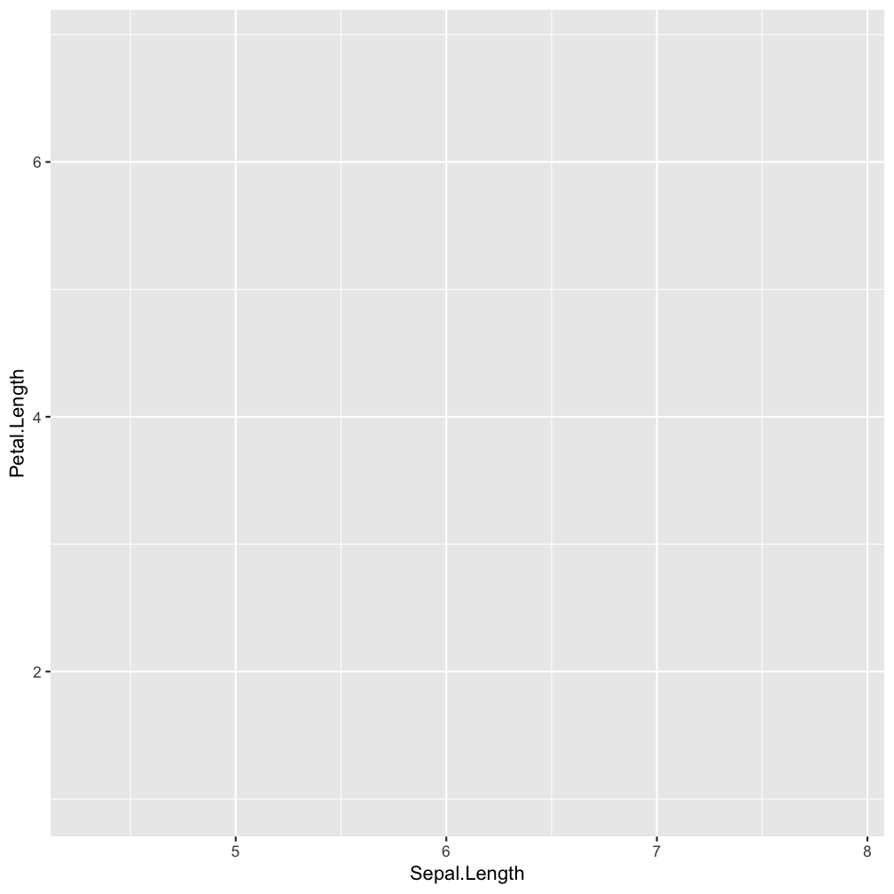

--- &twocol
### Step 2 - add layers: `geom_point()`

*** =left

```r
ggplot(iris, aes(x = Sepal.Length, 
    y = Petal.Length)) +
  geom_point()
```

*** =right
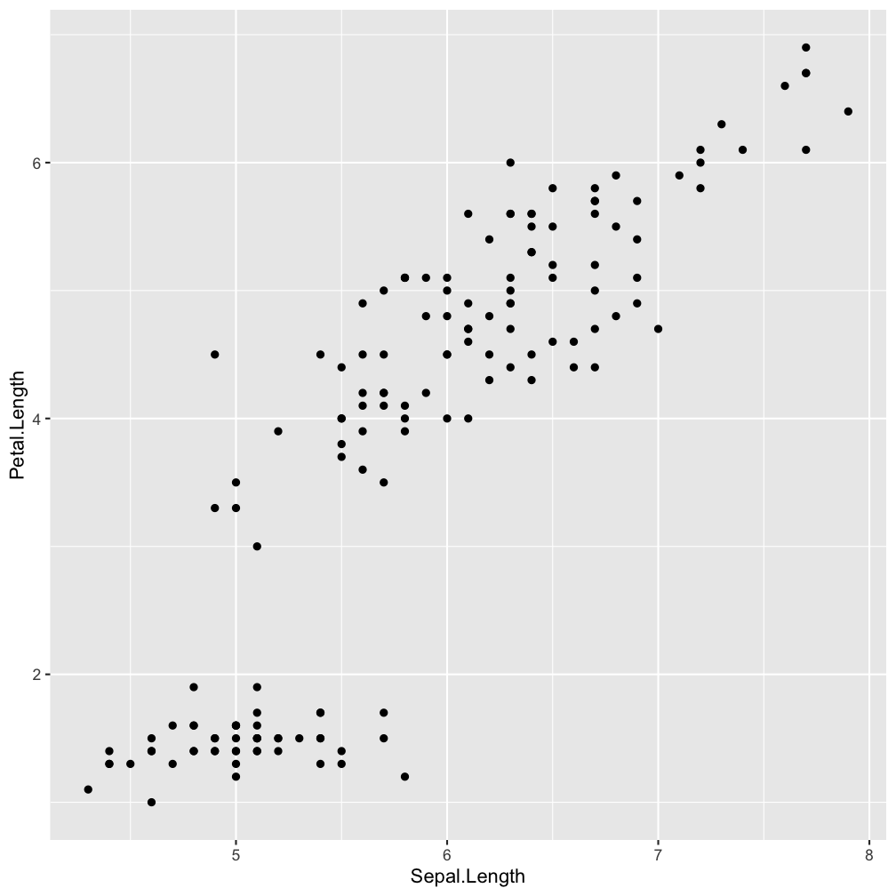

--- &twocol
### Step 2 - add layers: `geom_point()`

*** =left

```r
ggplot(iris, aes(x = Sepal.Length, 
    y = Petal.Length)) +
  geom_point(aes(col = Species))
```
<div class="alert alert-green", style="width: 440px">
  <h4>aes(col = Species)</h4> Show points in species-specific colours.
</div>

*** =right


--- &twocol
### Step 2 - add layers: `geom_smooth()`  

*** =left

```r
ggplot(iris, aes(x = Sepal.Length, 
    y = Petal.Length)) +
  geom_point(aes(col = Species)) +
  geom_smooth()
```

*** =right


--- &twocol
### Step 2 - add layers: `geom_smooth()` 

*** =left

```r
ggplot(iris, aes(x = Sepal.Length, 
    y = Petal.Length)) +
  geom_point(aes(col = Species)) +
  geom_smooth(aes(col = Species), 
    method = "lm")
```
<div class="alert alert-green", style="width: 440px">
  <h4>aes(col = Species), method = "lm"</h4> Make smoother species-specific and linear.
</div>

*** =right


--- &twocol
### Step 2 - add layers

*** =left

```r
ggplot(iris, aes(x = Sepal.Length, 
    y = Petal.Length, col = Species)) +
  geom_point() +
  geom_smooth(method = "lm")
```
<div class="alert alert-green", style="width: 440px">
 <size=4> Move species-specific colour aesthetics to <code>ggplot()</code> (so it becomes the default setting for all added layers).</size=4> 
</div>

*** =right


--- &twocol
### Step 3 - add scales: `scale_colour_brewer()`

*** =left

```r
ggplot(iris, aes(x = Sepal.Length, 
    y = Petal.Length, col = Species)) +
  geom_point() +
  geom_smooth(method = "lm") +
  scale_colour_brewer() 
```

*** =right
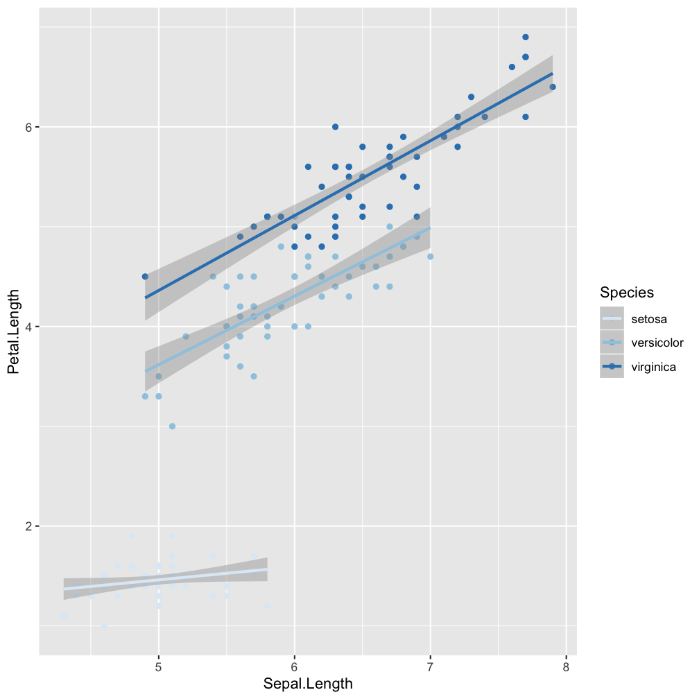

--- &twocol
### Step 4 - add facets: `facet_wrap()`

*** =left

```r
ggplot(iris, aes(x = Sepal.Length, 
    y = Petal.Length, col = Species)) +
  geom_point() +
  geom_smooth(method = "lm") +
  scale_colour_brewer() +
  facet_wrap(~Species, nrow=3)
```
<div class="alert alert-green", style="width: 440px">
  <h4>facet_wrap(~Species, nrow=3)</h4> Divide the species-specific observations into different panels.
</div>

*** =right
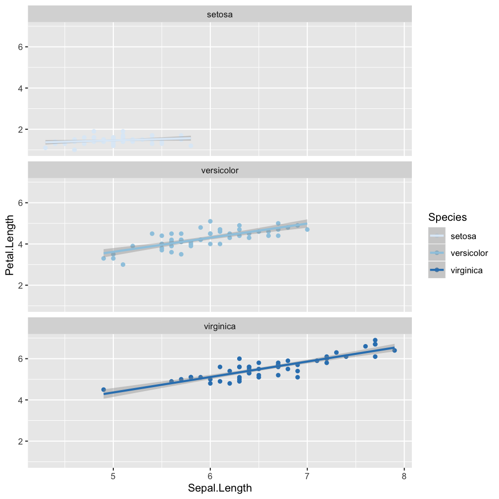

--- &twocol
### Step 5 - modify coordinate system: `coord_polar()`

*** =left

```r
ggplot(iris, aes(x = Sepal.Length, 
    y = Petal.Length, col = Species)) +
  geom_point() +
  geom_smooth(method = "lm") +
  scale_colour_brewer() +
  facet_wrap(~Species, nrow=3) +
  coord_polar()
```

*** =right
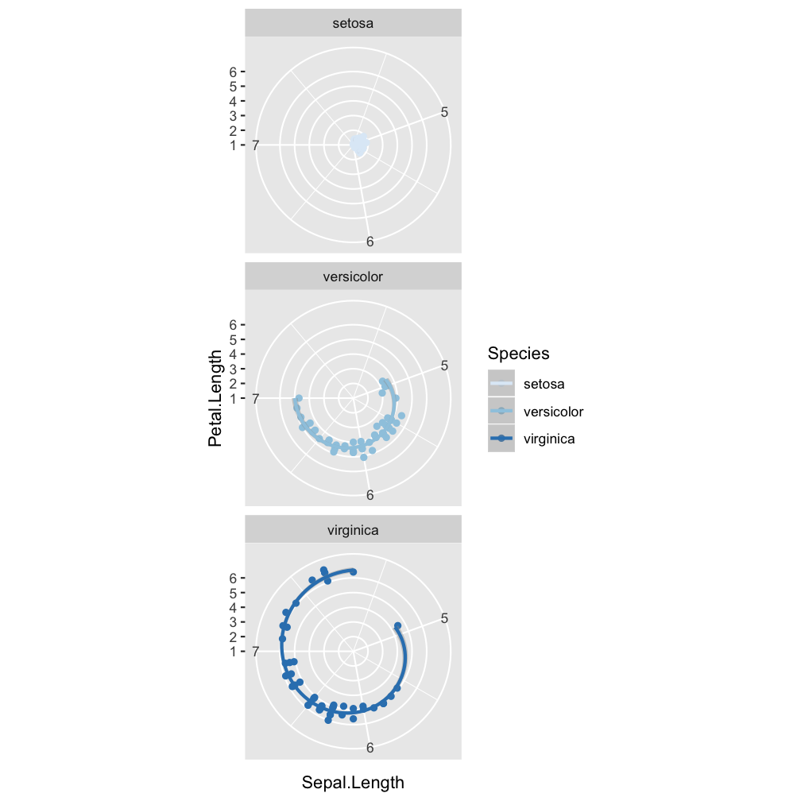

--- &twocol
### Step 6 - change the look of non-data elements: `theme_dark()`

*** =left

```r
ggplot(iris, aes(x = Sepal.Length, 
    y = Petal.Length, col = Species)) +
  geom_point() +
  geom_smooth(method = "lm") +
  scale_colour_brewer() +
  facet_wrap(~Species, nrow=3) +
  coord_polar() +
  theme_dark()
```

*** =right
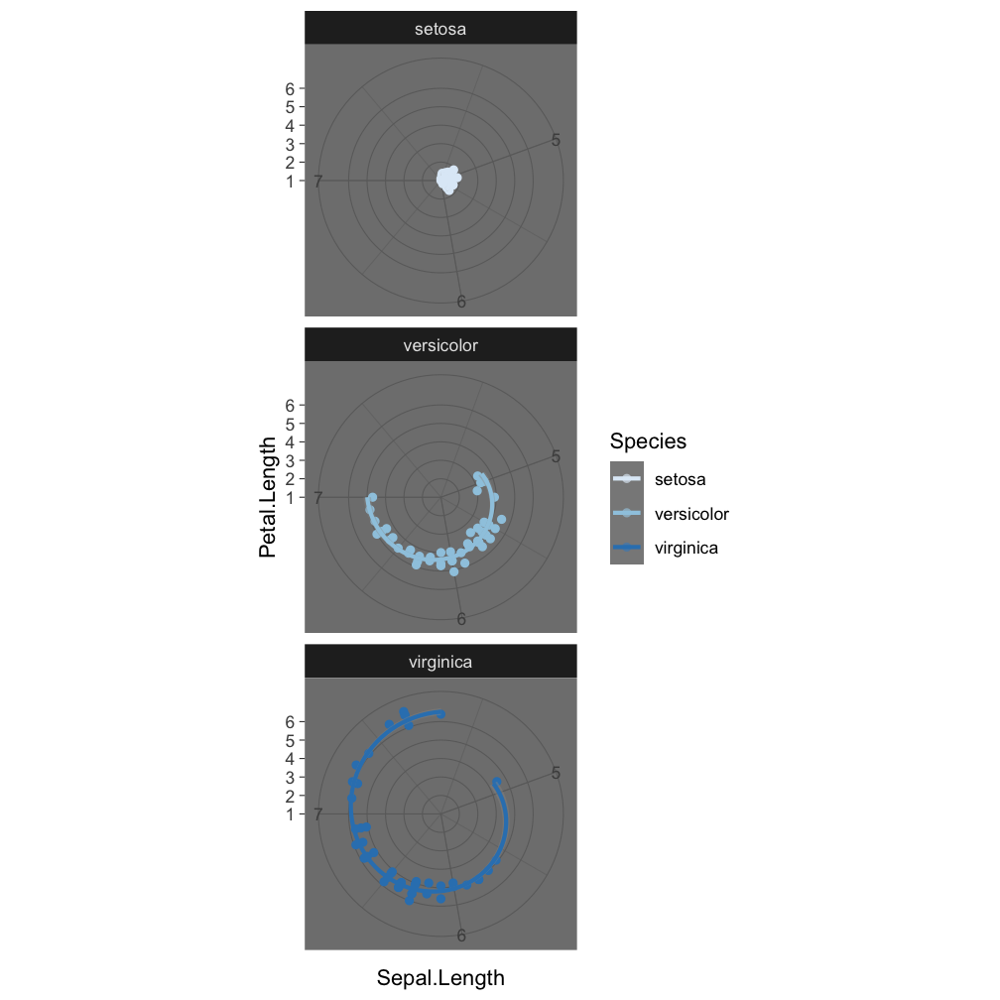

---
### Step 7 - save the plot: `ggsave()`


```r
ggplot(iris, aes(x = Sepal.Length, 
    y = Petal.Length, col = Species)) +
  geom_point() +
  geom_smooth(method = "lm") +
  scale_colour_brewer() +
  facet_wrap(~Species, nrow=3) +
  coord_polar()

ggsave("Iris_length_relationships.pdf", width = 4, height = 4)
```
The last plot displayed is saved (as default).

--- &slide_no_footer .segue bg:#1874CD

# <small>ggplot</small> - geom_functions
 


---
## When to use which function?

That depends on 
- what you want to display (your question) 
- and the type of data

Common plots are ...


--- &twocol
### Visualize frequency distributions

*** =left
BARPLOTS -  
<small>are used for **categorical** or **discrete** variables. Bars do not touch each other; there are no ‘in-between’ values.</small>

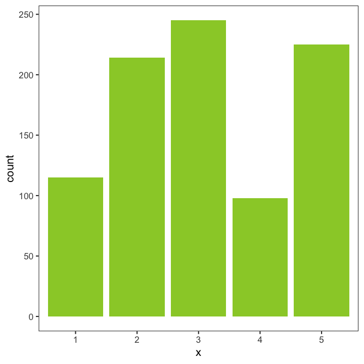

*** =right
HISTOGRAMS and DENSITY PLOTS (can be combined)
<small>are used for **continuous** variables and are often used to check whether variables are normally distributed. Bars touch each other in histograms.</small>

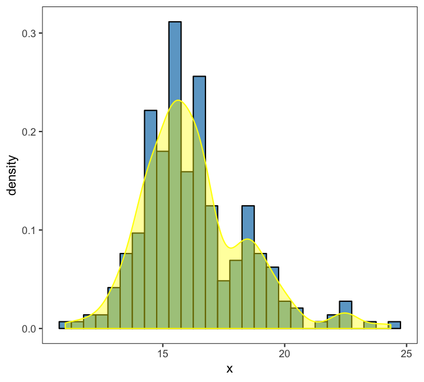


--- &mytwocol2
### Compare groups

BOXPLOTS - <small>are used to compare two or more groups in terms of their *distributional center and spread*. They transport a lot of information and should be computed in every data exploration! You can check,</small>

*** =left
- <small>**differences in average y values** between groups and whether these might be significant,</small> 
- <small>if group **variances differ**,</small> 
- <small>whether individual groups are **normally distributed**</small>
- <small>identify **outlier**</small>

<a class="btn btn-small btn-danger" rel="popover" data-content="If boxes do not overlap, significance test will most likely confirm a significant difference. Are box sizes and whisker lengths different between groups? This is an indication of 'homogeneity', which is a problem for some statistical tests. If the lengths of lower and upper whisker/hinge differ is this an indication for non-normality. CLICK TO CLOSE AGAIN!" data-original-title="" id='example'>Click here to read how</a>


*** =right
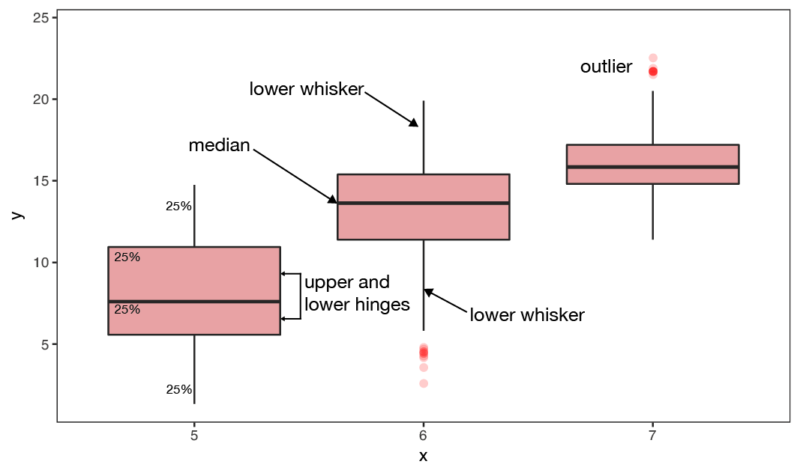

--- &twocol
### Show relationship between 2 variables

*** =left
SCATTERPLOTS -  
<small>are the most basic plots for **continuous** variables. They are also the least interpreting plots as they show every observation in the 2-dimensional space.</small>
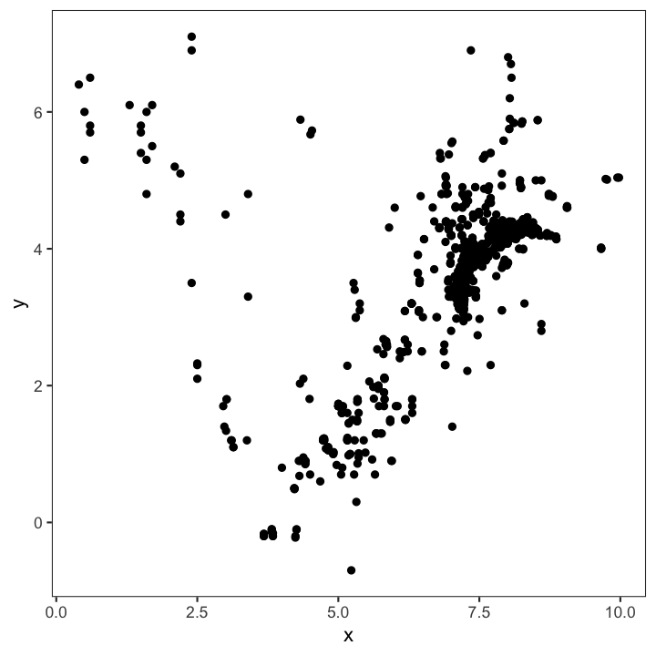

*** =right
<small>Another useful feature is that they can be **combined with other plotting elements**: defining *aesthetics for a 3rd variable* (e.g. colours of points) or adding *regression or smoothing lines* to help visualise the relationship:</small>
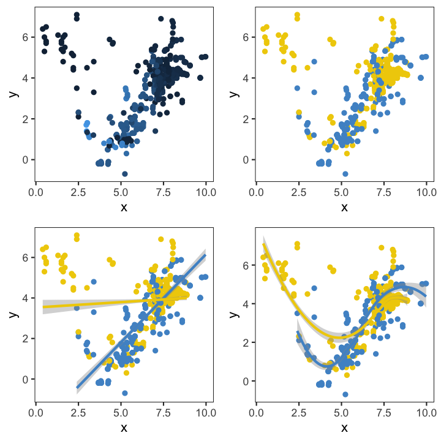

---
<q> An overview of core *geom_functions* depending on the type of data:</q>

--- &slide_no_footer bg:url(img/geom_flowchart_1.png);background-size:cover

<p><span class="source-img" style="position: absolute; left: 650px; top: 25px;">Elements taken from older version of 
    <a href='https://github.com/rstudio/cheatsheets/raw/master/data-visualization-2.1.pdf' title=''>ggplot</a> cheat sheet </span></p>

--- &slide_no_footer bg:url(img/geom_flowchart_2.png);background-size:cover

--- &slide_no_footer bg:url(img/geom_flowchart_3.png);background-size:cover

--- &slide_no_footer .segue bg:#FF8C00

# Some examples with the ICES hydro data
 

--- &twocol
### A barplot to see the frequency of monthly samplings 

*** =left

```r
hydro_sub <- hydro %>%
 select(fmonth, station, date_time) %>%
  # (fmonth = month as factor)
 distinct()

ggplot(hydro_sub,aes(x=fmonth)) +
  geom_bar()
```
<div class="alert alert-green", style="width: 440px">
  <h4>Note</h4> For barplots (or boxplots) <strong>x</strong> must be <strong>categorical</strong>, hence, we use here month as a factor! 
</div>

*** =right
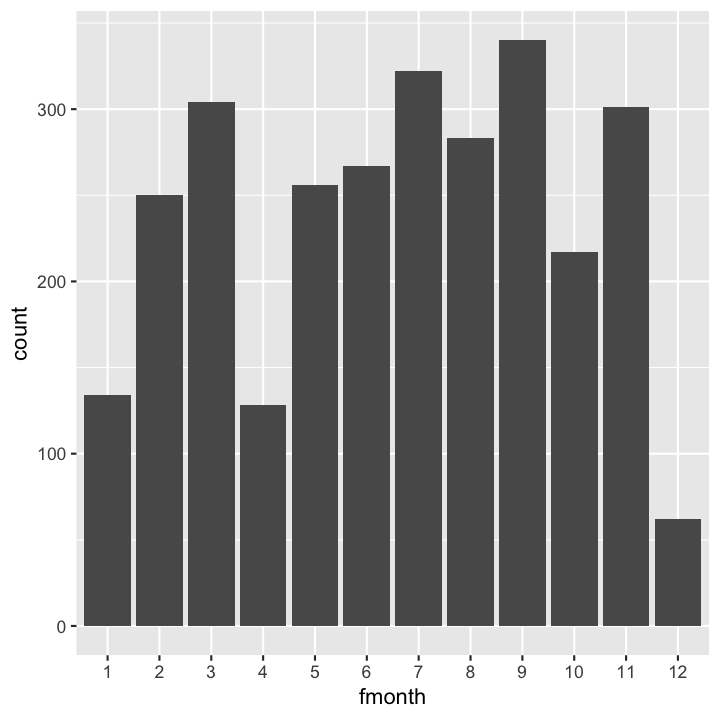

--- &twocol
### A scatterplot to see all stations, coloured by month
<div class="alert alert-orange">
  <h4>Note:</h4> To get a <strong>discrete scale</strong> we use again <strong>fmonth</strong>.
</div>

*** =left

```r
hydro_sub <- hydro %>%
 select(fmonth,station,lat,long) %>%
 distinct()

ggplot(hydro_sub, aes(x = long,  
    y = lat, col = fmonth)) +
  geom_point() 
```

*** =right
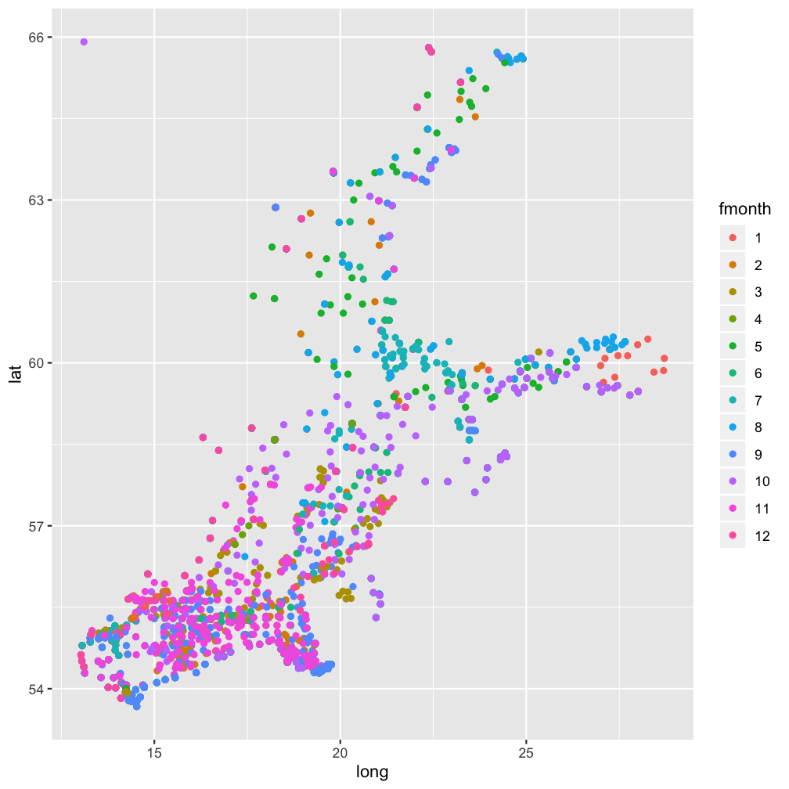

--- &twocol
### A histogram to see the distribution of (all) temperature values
<div class="alert alert-orange">
  <h4>Note:</h4> You can use the <strong>pipe operator</strong> also when plotting and saving ggplot as an object!
</div>

*** =left

```r
p <- hydro %>% ggplot(aes(x = temp)) +
  geom_histogram()
p
```

*** =right


---
### A boxplot to compare the surface temp between months

```r
hydro %>% filter(pres < 5) %>%
  group_by(fmonth, station, date_time, cruise) %>%
  summarise(mean_sst = mean(temp)) %>% ungroup() %>%
ggplot(aes(x = fmonth, y = mean_sst)) +
  geom_boxplot(outlier.colour = "red", outlier.alpha = 0.2)
```

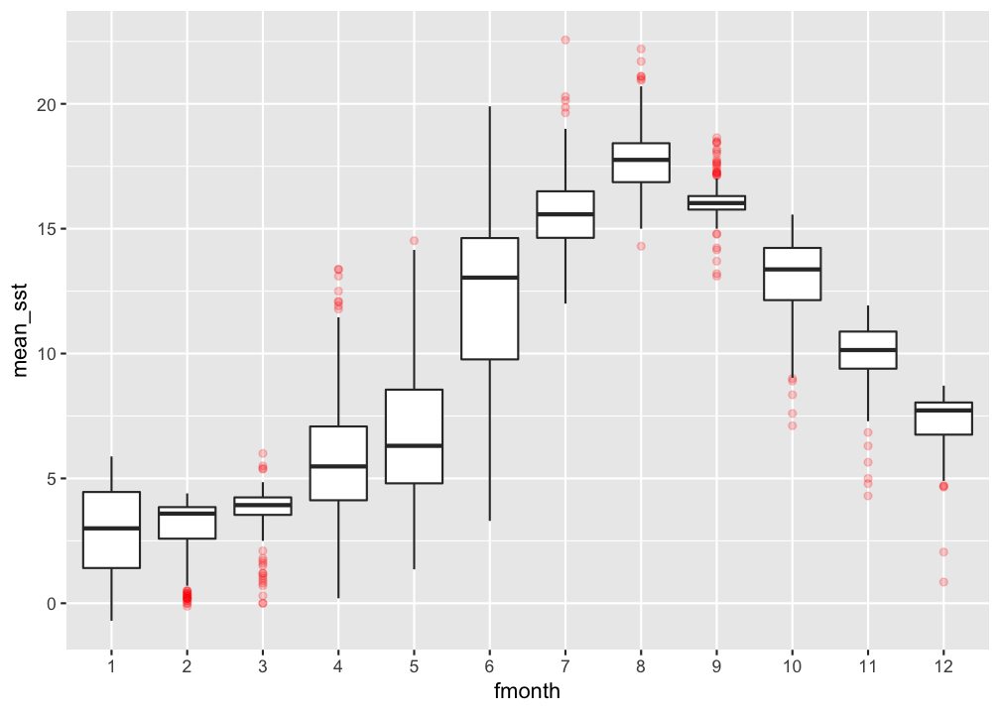

---
### Correlation plot between temperature and salinity

```r
ggplot(hydro, aes(x = psal, y = temp, col = day)) +
  geom_point()
```

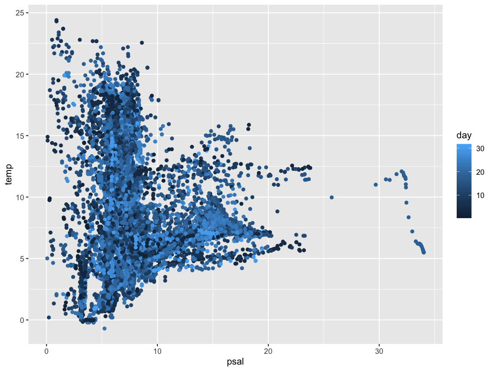

--- &mytwocol2
### .. now separated by month

*** =left

```r
ggplot(hydro, 
  aes(x = psal, 
    y = temp, 
    col = day)) +
  geom_point() +
  facet_wrap(
    ~fmonth, 
    nrow = 3)
```

*** =right


--- &twocol
### Depth profile at one station in July

*** =left

```r
hydro_sub <- hydro %>% 
  filter(station=="0403",fmonth==7,day==11) 
p_temp <- ggplot(hydro_sub, aes(y=pres)) +
  geom_point(aes(x = temp), col="red") +
  ylim(70, 0)
p_sal <- ggplot(hydro_sub, aes(y=pres)) +
  geom_point(aes(x = psal)) +
  ylim(70, 0)
p_oxy <- ggplot(hydro_sub, aes(y=pres)) +
  geom_point(aes(x = doxy), col="blue") +
  ylim(70, 0)
gridExtra::grid.arrange(grobs = list(
  p_temp, p_sal, p_oxy), nrow=1)
```
<div class="alert alert-green", style="width: 440px">
  <h4>Note</h4> The colour specification is <strong>outside</strong> the <strong>aesthetic mapping</strong>: because we want the same colour for all observations.
</div>

*** =right
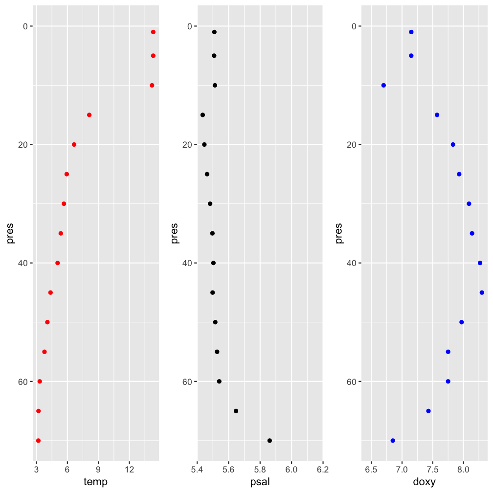

--- &twocol
### Some extension examples: `ggridges` 

*** =left

```r
library(ggridges)
hydro %>% filter(pres < 10) %>%
  group_by(station, fmonth, day) %>%
  summarise(
    sst = mean(temp, na.rm = TRUE)) %>%
  group_by(station, fmonth) %>%
  summarise(
    sst = mean(sst, na.rm = TRUE)) %>%
  ungroup() %>%
  ggplot(aes(x = sst, y = fmonth, 
    fill = fmonth)) +
  geom_density_ridges(scale = 12, 
    rel_min_height = 0.005) +
  scale_fill_cyclical(
    values = c("blue", "green")) +
  theme_ridges()
```

*** =right
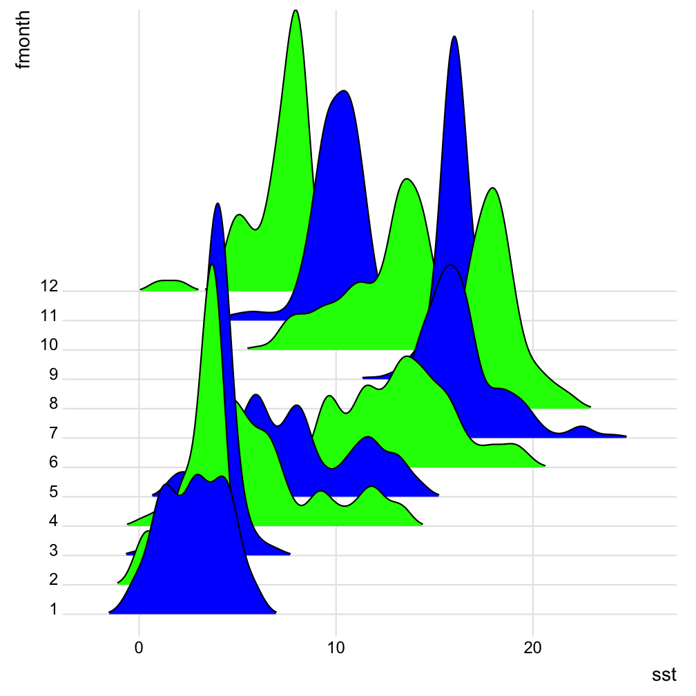

---&twocol
### Some extension examples: `ggmap`

*** =left

```r
library(ggmap)
b <- matrix(c(
  min(hydro$long), 
  max(hydro$long), 
  min(hydro$lat), 
  max(hydro$lat) ), byrow=T,nrow=2)
colnames(b) <- c("min","max")
rownames(b) <- c("x","y")
map_bs <- ggmap(get_map(location = b, 
  zoom = 5))
map_bs + geom_point(data=hydro, 
  aes(long,lat), size=0.5, 
  color="red")
```

*** =right


---&twocol
### Some extension examples: `ggmap`

*** =left

```r
baltic <- c(left = min(hydro$long), 
            bottom = min(hydro$lat),
            right = max(hydro$long), 
            top = max(hydro$lat))
map_stamen <- get_stamenmap(baltic, 
  zoom = 5, maptype = "toner-lite")
ggmap(map_stamen) + 
  geom_point(data=hydro, 
  aes(long,lat), size=0.5, 
  color="red") + theme_linedraw()
```

*** =right


--- &slide_no_footer .segue bg:#EEC900

# Your turn...

--- &multitext bg:#EEC900
# Quiz 1: Syntax
  
Complete the following code snippet (fill in the ... gaps)  to create the plot you need 
for answering the question below. 

```r
library(ggplot2)

p <- ...(... = mtcars, ...(wt, mpg, label = rownames(mtcars)))
... + geom_point(...(size = gear)) ...
geom_text(...(colour = factor(cyl)), hjust = 0, nudge_... = 0.05)
```

1. Find the car model in the 'mtcars' dataset with the lowest mpg (=Miles per(US) gallon) value in its 4 cyl(inder) class that also has the lowest number of (forward) gears. Which position in the alphabet has the first letter of this model?

*** .hint
<small>You have to fill in 4 times a function name, 2 times a (partial) argument, 1 symbol (which is in fact also a function), and 1 object name. </small>

*** .explanation
1. <span class='answer'>20</span>


--- &radio bg:#EEC900
# Quiz 2: Get to know geom_functions

Which of these function is NOT a `geom_function`?

1. geom_hex
2. geom_linerange
3. geom_label
4. geom_ribbon
5. _geom_trend_
6. geom_sf
7. geom_crossbar

*** .hint
<small>The webside http://ggplot2.tidyverse.org/reference/ provides an overview of all geom_functions</small>

--- &exercise
# Small exercises with the ICES hydro dataset

1. What happens if you make a scatterplot of station (x) vs temp (y)? Why is the plot not useful? What would be a better plot?
2. What happens if you make a boxplot of cruise (x) vs psal (y)? Why is this plot less suitable? What could be an alternative?


--- &slide_no_footer .segue bg:#CD2626

# How do you feel now.....?

--- &vcenter
## Totally confused?
                


Try to reproduce some of the plots in this presentation and the quiz and
read [chapter 3] (http://r4ds.had.co.nz/data-visualisation.html) on data visualization in 'R for Data Science' .

--- &vcenter
## Totally bored?
                


Then figure out how to get a CTD profile in ONE panel!

---
## Totally content?
Then go grab a coffee, lean back and enjoy the rest of the day...!


--- &thankyou

