### You will now learn how to **override the default** settings


```r
p <- ggplot(hydro, aes(long, lat))
str(p)
```

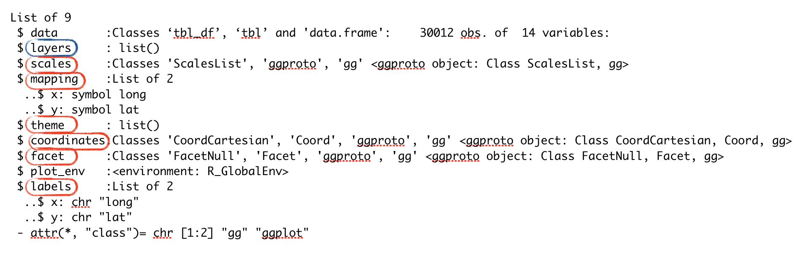

--- &slide_no_footer .segue bg:#1874CD

# <small>ggplot</small> - Aesthetics
 

---
<q> ggplot(data, **aes(x, y, color, size, shape, linetype, fill, alpha, label, family, width, hjust, vjust, ...)**)</q>

---
### Aesthetics: visual properties of the objects in your plot

- You can display a point in different ways by changing the values of its aesthetics (e.g. size, shape, and colour of border and inside):
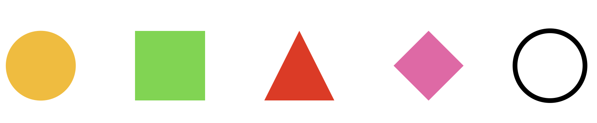

> - Use `aes()` to associate the name of the aesthetic **with a variable** to display, for single values `aes()` not needed
> - Once you map an aesthetic, ggplot2 takes care of the rest:
    - selects a reasonable scale 
    - constructs a legend that explains the mapping between levels and values 
> - For x and y aesthetics, ggplot2 does not create a legend, but it creates an axis line with tick marks and a label


--- &twocol

*** =left
Assign single value for aesthethic colour (`aes()` not needed):

```r
ggplot(hydro_april, aes(long, lat)) +
  geom_point(colour = "red")
```


--- &twocol

*** =left
Assign single value for aesthethic colour (`aes()` not needed):

```r
ggplot(hydro_april, aes(long, lat)) +
  geom_point(colour = "red")
```


*** =right
Map colour to variable "day" with automatic colour setting: 

```r
ggplot(hydro_april, aes(long, lat)) +
  geom_point(aes(colour = factor(day)))
```


<div class="alert alert-orange", style="width: 440px">
  <h4>Note:</h4> If you don't like the default settings, you need to add a scale function later.
</div>


--- &twocol
### Colour

*** =left
Colour is the most popular aesthetic after
position. It is also the easiest to misuse.

It can be specified with

- A **name**, e.g., "red". R has 657 built-in named colours, which can be listed with `colours()`. 
- An **RGB specification**, with a string of the form "#RRGGBB"
- The Stowers Institute provides a [nice printable pdf](http://research.stowers.org/mcm/efg/R/Color/Chart/ColorChart.pdf) that lists all colours.

--- &twocol
### Colour 

*** =left
Colour is the most popular aesthetic after
position. It is also the easiest to misuse.

It can be specified with

- A **name**, e.g., "red". R has 657 built-in named colours, which can be listed with `colours()`. 
- An **RGB specification**, with a string of the form "#RRGGBB"
- The Stowers Institute provides a [nice printable pdf](http://research.stowers.org/mcm/efg/R/Color/Chart/ColorChart.pdf) that lists all colours.

*** =right

```r
col_df <- data.frame(x = 1:4, y = 1:4)
ggplot(col_df, aes(x, y)) +
  geom_point(colour = c("blue4", 
    "grey60", "#556B2F", "#8B7355"), 
    size = 7) 
```

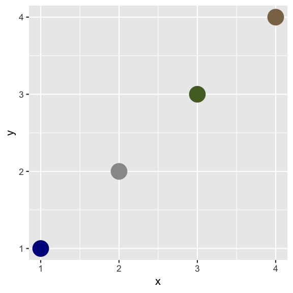
<div class="alert alert-orange", style="width: 440px">
  <h4>Note:</h4> Only single values are assigned to the colour aesthethic, hence, the `aes()` mapping (to a variable) is not needed.
</div>

---
### Colour (cont)

For some geoms/point shapes you can specify 2 colour aesthetics: the border colour (=**colour**) and the inside (=**fill**) 


```r
ggplot(hydro, aes(x = fmonth)) +
  geom_bar(aes(colour = fmonth), fill = "white")
```

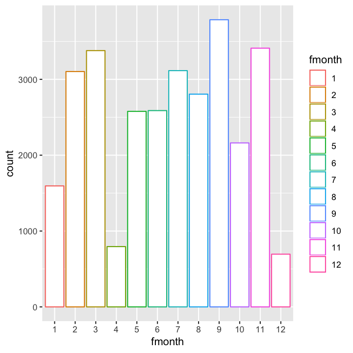

--- &twocol
### Colour (cont)

To make colours transparent use **alpha** aesthethics
- range from 0 = transparent to 1 = opaque

*** =left

```r
col_df <- data.frame(x = 1:5, y = 1:5)
ggplot(col_df, aes(x, y)) +
  geom_point(fill = "red", 
    alpha = c(.1,.3,.5,.7,1.0), 
    size = 5, shape = 21) 
```

*** =right


--- &twocol
### Types of shape

Default shape is 19

*** =left

```r
shapes <- data.frame(
  shape = c(0:19, 22, 21, 24, 23, 20),
  x = 0:24 %/% 5, y = -(0:24 %% 5))

ggplot(shapes, aes(x, y)) + 
  geom_point(aes(shape = shape),  
    size = 10, fill = "red") +
  geom_text(aes(label = shape), 
    hjust = 0, nudge_x = 0.15) +
  scale_shape_identity() +
  expand_limits(x = 4.1) +
  scale_x_continuous(NULL,breaks=NULL) + 
  scale_y_continuous(NULL,breaks=NULL)
```

*** =right


--- &twocol
### Linetype
Line types can be specified with an integer or name: 0 = blank, 1 = solid, 2 = dashed, 3 = dotted, 4 = dotdash, 5 = longdash, 6 = twodash, as shown below:

*** =left

```r
lty <- c("blank", "solid", "dashed", 
  "dotted", "dotdash", 
  "longdash","twodash")
linetypes <- data.frame(
  y = seq_along(lty), lty = lty) 
ggplot(linetypes, aes(0, y)) + 
  geom_segment(aes(xend = 5, 
    yend = y, linetype = lty)) + 
  scale_linetype_identity() + 
  geom_text(aes(label = lty), 
    hjust = 0, nudge_y = 0.2) +
  scale_x_continuous(NULL,breaks=NULL) + 
  scale_y_continuous(NULL,breaks=NULL)
```

*** =right
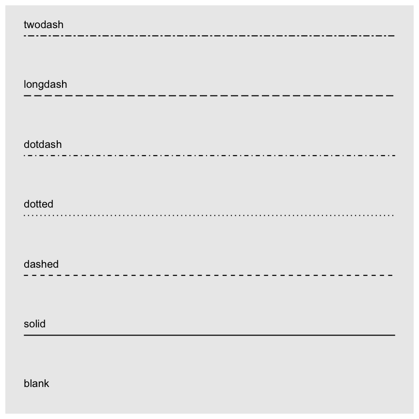


--- &twocol
### Text - Font 
There are only three fonts that are guaranteed to work everywhere: "**sans**" (the default), "**serif**", or "**mono**":

*** =left

```r
df <- data.frame(x = 1, y = 3:1, 
  family = c("sans", "serif", "mono"))
ggplot(df, aes(x, y)) + 
  geom_text(aes(label = family, 
    family = family), size = 15)
```

*** =right
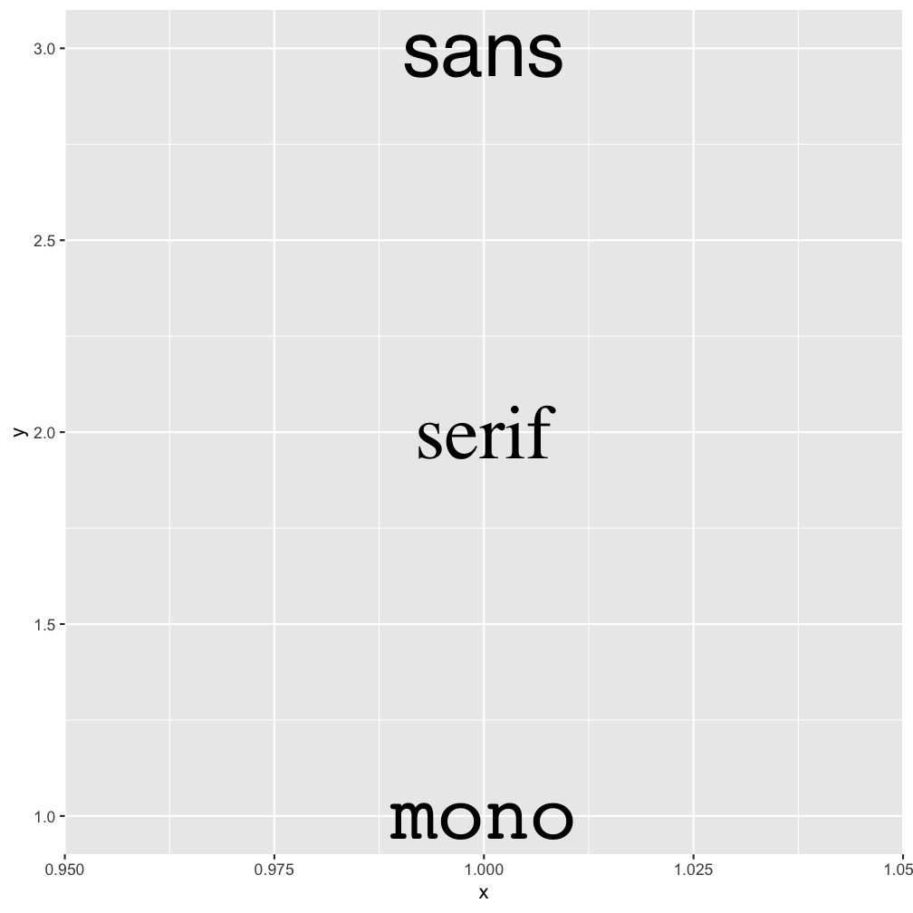

--- &twocol
### Text - Justification 
Horizontal and vertical justification have the same parameterisation, either a **string** (“top”, “middle”, “bottom”, “left”, “center”, “right”) or a **number** between 0 and 1:

*** =left
- top = 1, middle = 0.5, bottom = 0
- left = 0, center = 0.5, right = 1

```r
just <- expand.grid(hjust = c(0,0.5,1), 
  vjust = c(0, 0.5, 1))
just$label <- paste0(just$hjust, ", ", 
  just$vjust)

ggplot(just, aes(hjust, vjust)) +
  geom_point(colour = "grey70", 
    size = 5) + 
  geom_text(aes(label = label, 
    hjust = hjust, vjust = vjust),
    size = 7)
```

*** =right
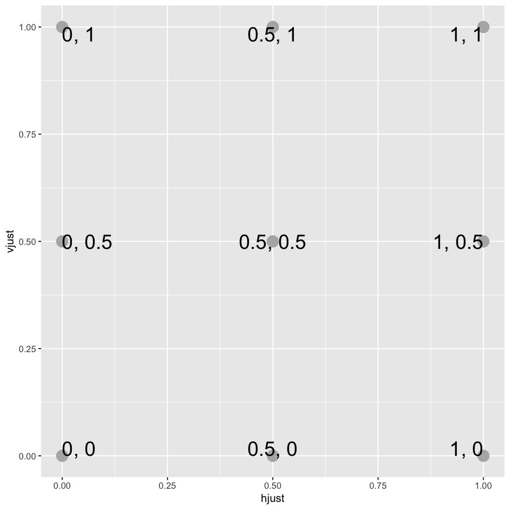


--- &slide_no_footer .segue bg:#EEC900

# Your turn

--- &exercise
# Exercise 1: Aesthetics

1. What happens if you map the same variable to multiple aesthetics?
2. What does the *stroke* aesthetic do? What *shapes* does it work with? (Hint: use `?geom_point`)
3. What happens if you map an aesthetic to something other than a variable name, like `aes(colour = psal < 10)`?
4. What’s gone wrong with this code? Why are the points not blue?


```r
ggplot(data = hydro) + 
  geom_point(mapping = aes(x = psal, y = temp, color = "blue"))
```


--- &slide_no_footer .segue bg:#1874CD

# <small>ggplot</small> - Scales
 

---
## Using scales

- To **change the default settings of an aesthetic** use a scale that applies to that mapping (if you have used `aes()` for a specific aesthetic):
  - *aesthetic mapping* = What variable to map to e.g. colour
  - *scale* =  How to map the variable to e.g. color
- Use the **three part scale name** convention and set additional arguments in the scale function if desired:


--- &twocol
## Common scales 

*** =left
### Use with most aesthetics

scale_aesthetic ...

- _**manual**()
- _**identity**()
- _**discrete**()
- _**continuous**()

*** =right
### Use with x or y aesthetics 

- `scale_x_log10()` - Plot x on log10 scale
- `scale_x_reverse()` - Reverse axis direction 
- `scale_x_sqrt()` - Plot x on square root scale

--- 
## Scale colour - discrete data

ggplot2's default discrete palettes
(depends on how many colors are needed)


--- 
## Scale colour - discrete data

### Example of oceanographic stations sampled in summer months


```r
sst_sum <- hydro %>% filter(pres == 1, fmonth %in% 5:8)
sst_sum$fmonth <- factor(sst_sum$fmonth) # to remove other factor levels
p <- ggplot(sst_sum, aes(x = long, y = lat, colour = fmonth)) + geom_point()
```

--- &twocol
### Manually assign colours: `scale_colour_manual()` 

*** =left
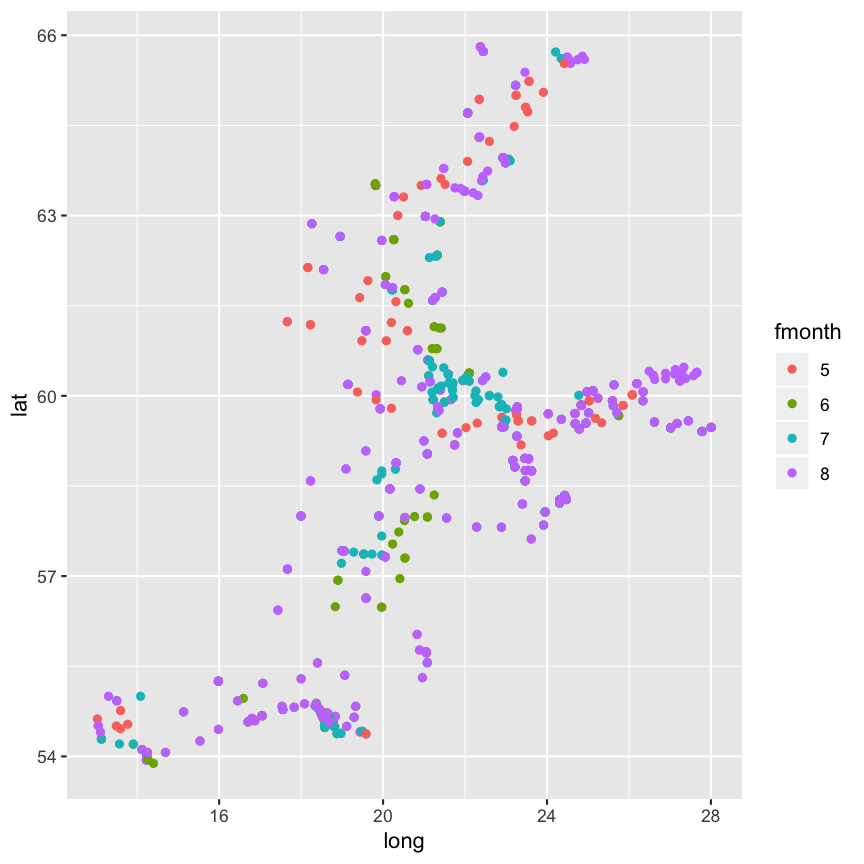


```r
p
```

*** =right
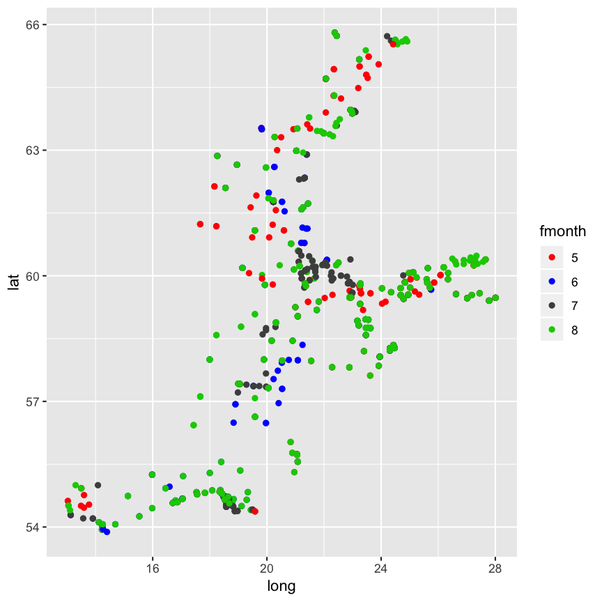


```r
p + scale_colour_manual(values = 
  c("red","blue","grey30","green3"))
```


--- &twocol
### Use ready-made schemes: `scale_colour_hue()`

scale_colour_hue is the **default** colour scale → does not generate colour-blind safe palettes

*** =left
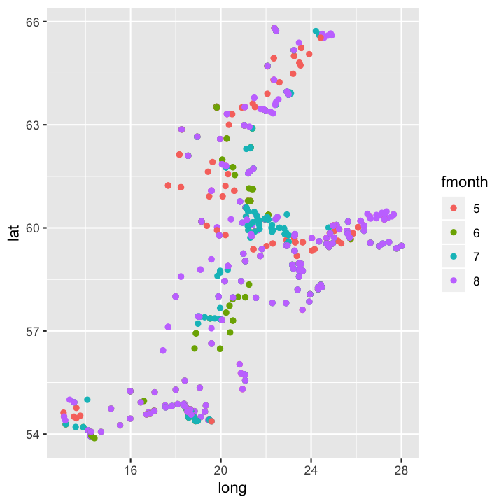


```r
p + scale_colour_hue()
```

*** =right


```r
p + scale_colour_hue(l = 50, c = 150, 
  h = c(150, 270) )
```
<div class="alert alert-orange" style="position: absolute; left: 950px; top: 475px">
  <h4>Adjust:</h4> <small><strong>l</strong>uminosity, <strong>c</strong>hroma, and range of <strong>h</strong>ues</small>
</div>


--- &twocol
### Use ready-made schemes: `scale_colour_grey()`

*** =left


```r
p + scale_colour_grey()
```


--- &twocol
### Use ready-made schemes: `scale_colour_brewer()`

*** =left


```r
p + scale_colour_brewer()
```

*** =right
The brewer scales provides nice colour schemes from the ColorBrewer particularly tailored for maps: [http://colorbrewer2.org](http://colorbrewer2.org)


To see a list of each brewer palette, run the following command 

```r
library(RColorBrewer)
display.brewer.all()
```

--- 


--- 
## Scale colour - continous data

### Example of summer sea surface temperature (SST)


```r
# Same dataset as before
sst_sum <- hydro %>% filter(pres == 1, fmonth %in% 5:8)
sst_sum$fmonth <- factor(sst_sum$fmonth)
p <- ggplot(sst_sum, aes(x = long, y = lat, colour = temp)) + geom_point()
```

--- &twocol
### Use different gradient schemes: `scale_colour_gradient()`

scale_colour_gradient is the **default** colour scale. Creates a **two colour** gradient (low-high):

*** =left
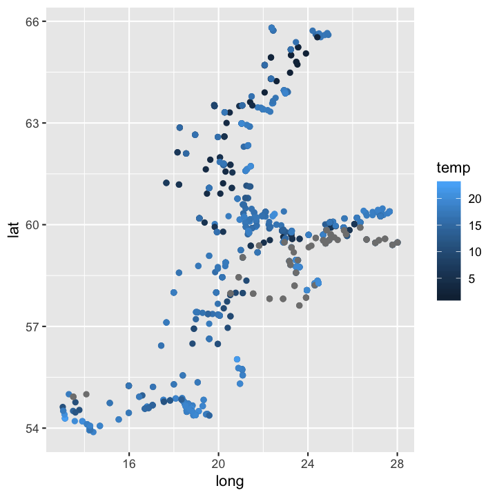


```r
p
```

*** =right


```r
p + scale_colour_gradient()
```

--- &twocol
### Use different gradient schemes: `scale_colour_gradient()`

Change a few settings ...

*** =left


```r
p + scale_colour_gradient(
  low = "yellow", high = "red")
```

*** =right
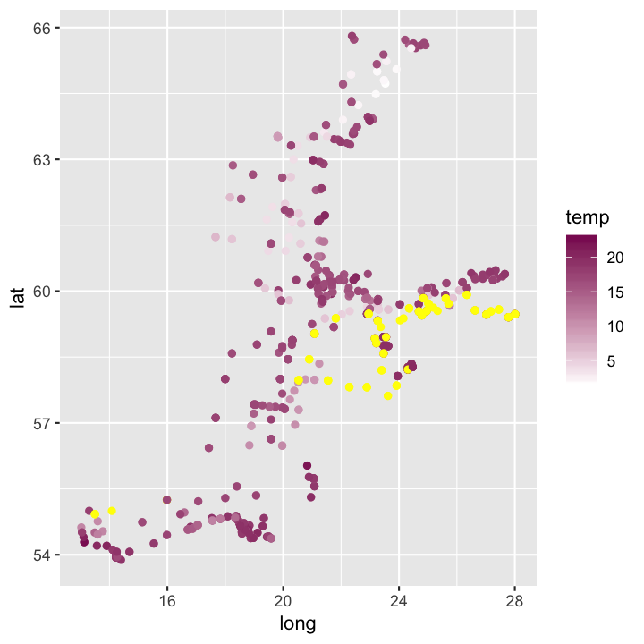


```r
p + scale_colour_gradient(
  low = "white", high = "maroon4", 
  na.value = "yellow")
```

--- &twocol
### Use different gradient schemes: `scale_colour_gradient2()`

Creates a **diverging** colour gradient (low-mid-high):

*** =left
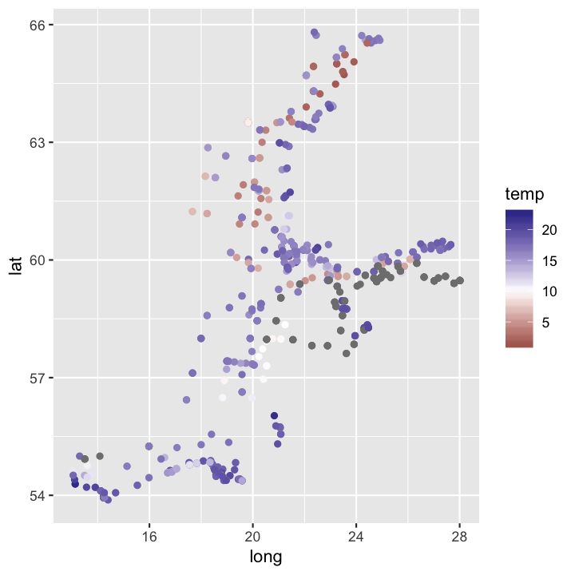


```r
p + scale_colour_gradient2(midpoint=10)
```
Set the midpoint from 0 to 10.

*** =right
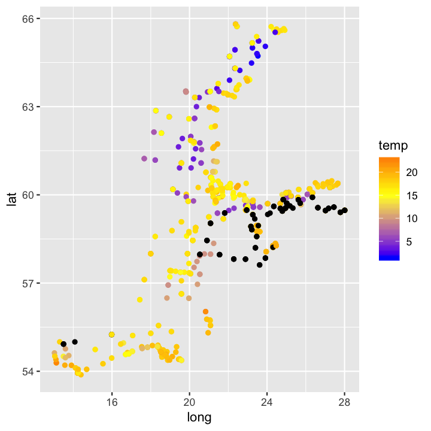


```r
p + scale_colour_gradient2(midpoint=15, 
  low = "blue", mid = "yellow", 
  high = "red", na.value = "black")
```

---
## Overview of colour-related scales


--- 
## Scale shape - discrete data

--- &twocol
## Scale shape - discrete data

*** =left


```r
p <- ggplot(sst_sum, aes(long,lat)) + 
  geom_point(aes(shape = fmonth)) 
```

*** =right


```r
p + scale_shape_manual(values = 0:3)  
```

--- &twocol
## Scale shape - discrete data

*** =left
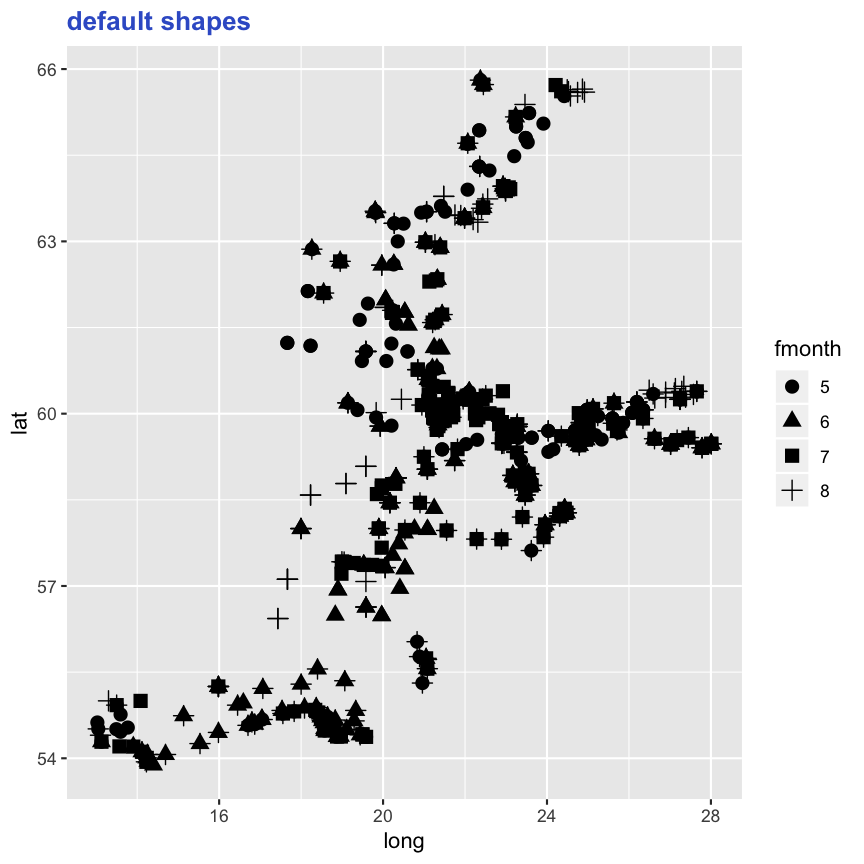


```r
p <- ggplot(sst_sum, aes(long,lat)) + 
  geom_point(aes(shape = fmonth)) 
```

*** =right


```r
p + scale_shape_manual(values = 0:3)  
```

<div class="alert alert-orange" style="position: absolute; left: 580px; top: 25px">
  <h4>Note:</h4> With different shapes it becomes more apparent that some stations were sampled in several months!
</div>


---
## Scale shape - continuous data

--- &twocol
## Scale shape - continuous data

*** =left
When your data variable already contains values that could be used as  aesthetic values ggplot2 handles them directly without producing a legend (the variable is considered as scaled).

Use `scale_shape_identity()` for continuous data:


```r
ggplot(hydro_april, aes(long, lat)) + 
  geom_point(aes(shape = day)) +
  scale_shape_identity() 
```

*** =right


--- 
## Scale size - continuous data

### Example of sea surface temperature (SST) in June


```r
sst_june <- hydro %>% filter(pres == 1, fmonth == "6")
```

--- &twocol
## Scale size - continuous data

You can use `scale_size()`, `scale_size_area()`, or `scale_radius()`:

*** =left
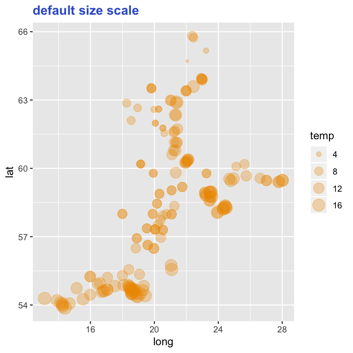


```r
p <- ggplot(sst_june, aes(long,lat))+ 
  geom_point(aes(size = temp),
    colour = "orange2", alpha=0.3)
```

*** =right


```r
p + scale_radius(range=c(1,10), 
    breaks=seq(5,20,2.5), limits=c(4,20))
```

<div class="alert alert-orange" style="position: absolute; left: 600px; top: 25px">
  <h4>Note:</h4> Using transparent colours (with alpha aesthetics) shows also nicely overlying points!
</div>

---

There are scales for every aesthetic ggplot2 uses. To see a complete list with examples, visit [http://docs.ggplot2.org/current](http://docs.ggplot2.org/current)

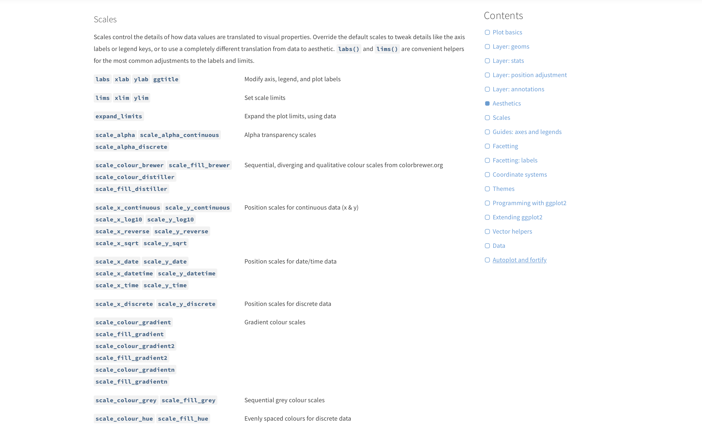

<p><span class="source-img" style="position: absolute; left: 650px; top: 650px">Screenshot from webpage (taken Dec. 2017)</span></p>

--- &slide_no_footer .segue bg:#EEC900

# Your turn...

--- &exercise
# Exercise 2: Scaling

Look at `display.brewer.all()`in the **RColorbrewer** package. Experiment with the different palettes available for the brewer scale. Add a color scheme that you like for *temp* in the `sst_sum` data.


--- &slide_no_footer .segue bg:#1874CD

# <small>ggplot</small> - Faceting
 

---
<small>Facets divide a plot into subplots based on the values of one or more discrete variables</small>


---
To adjust facet labels set labeller 

```r
p + facet_grid(pres ~ fmonth, labeller = label_both)
```


--- &slide_no_footer .segue bg:#EEC900

# Your turn

--- &exercise
# Exercise 3: Faceting

1. What happens if you facet on a continuous variable?
2. What are the advantages to using faceting instead of the colour aesthetic? What are the disadvantages? How might the balance change if you had a larger dataset?
3. When using `facet_grid()` you should usually put the variable with more unique levels in the columns. Why?
4. Read `?facet_wrap`. What does *nrow* do? What does *ncol* do? What other options control the layout of the individual panels? Why doesn’t `facet_grid()` have *nrow* and *ncol* argument?

--- &exercise

5.What plots are generated by the following code? What does `.` do?


```r
temp_sum <- hydro %>% filter(pres %in% c(1, 50), fmonth %in% 5:8)

ggplot(data = temp_sum) + 
  geom_point(mapping = aes(x = long, y = lat)) +
  facet_grid(fmonth ~ .)

ggplot(data = temp_sum) + 
  geom_point(mapping = aes(x = long, y = lat)) +
  facet_grid(. ~ pres)
```


--- &slide_no_footer .segue bg:#1874CD

# <small>ggplot</small> - Coordinate systems 
 

---
## Using coordinate systems

- Determine the coordinate plane to draw the graph on.
- Use the **two part scale name** convention and set additional arguments in the coord_function if desired:

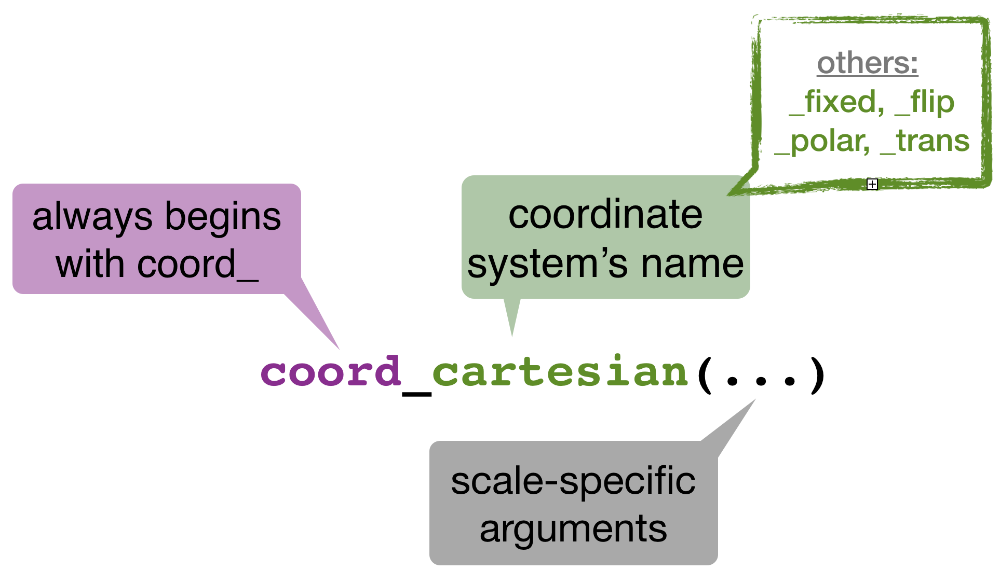

---
<small>Which months are most frequently sampled?</small>


--- &twocol
## Useful changes of coord: Pie charts

In the grammar of graphics, a pie chart is a **stacked** bar graph in **polar** coordinates.

*** =left

```r
monthly_pie <- hydro %>% 
  select(fmonth, station, cruise, 
    date_time) %>% distinct() %>% 
  group_by(fmonth) %>% 
  mutate(year = "y")

ggplot(monthly_pie, aes(year)) + 
  geom_bar(aes(fill = fmonth)) + 
  scale_fill_brewer(
    palette="Paired") +
  coord_polar(theta="y", direction=-1)
```
<small>What is now needed is some element cleaning...</small>

*** =right


--- &twocol
## Useful changes of coord: Map projections

`coord_map()` projects a portion of the earth, which is approximately spherical, onto a flat 2D plane using any projection defined by the mapproj package. 

*** =left
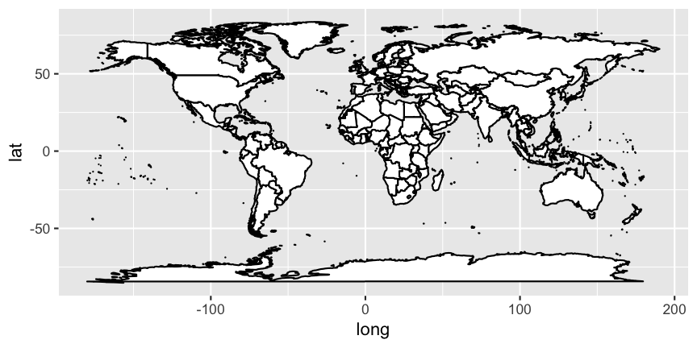


```r
# Showing the world map:
world <- map_data("world")
worldmap <- ggplot(world, aes(
    x=long, y=lat, group=group)) +
  geom_polygon(fill = "white", 
    colour = "black") 
```

*** =right

```r
worldmap + coord_map("ortho", 
  orientation = c(55, 20, 0))
```

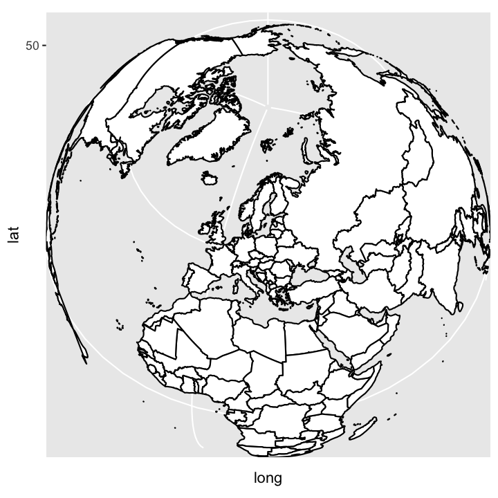

--- &twocol
### Zooming into the Baltic Sea: 
Simply add the axis limits to `coord_map()`

*** =left 

```r
worldmap + coord_map("ortho", 
  orientation = c(55, 20, 0),
  xlim = c(10, 30), ylim = c(54,66))
```

*** =right
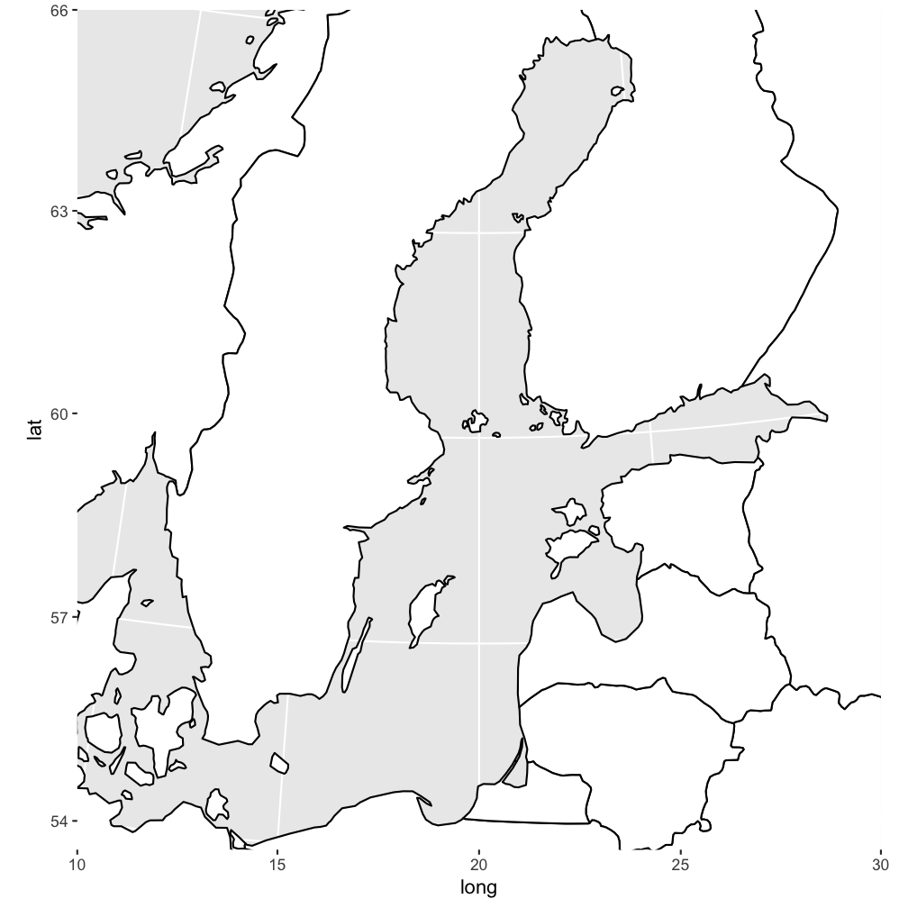


--- &slide_no_footer .segue bg:#EEC900

# Your turn...

--- &exercise
# Exercise 4: Coordinate systems

1. Figure out out to change the order of the month in the flipped coordinate system (lower left plot in the overview figure)
2. Turn a stacked bar chart into a pie chart using coord_polar().
3. What’s the difference between `coord_map()` and `coord_quickmap()`?


--- &slide_no_footer .segue bg:#1874CD

# <small>ggplot</small> - Making your figures look nice: labels, legends, and themes
 

---
## Labels

- Good labels are critical for **making** your **plots understandable** to a wider audience.
- Both *axis* and *legend* labels should show the **full variable name** or a **commonly used abbreviation**.
- The *title* and *subtitle* should provide **main findings**.

---
## Labels

- Good labels are critical for **making** your **plots understandable** to a wider audience.
- Both *axis* and *legend* labels should show the **full variable name** or a **commonly used abbreviation**.
- The *title* and *subtitle* should provide **main findings**.

- There are <mark>different functions</mark> available to change labels:
  - `xlab()`: change the label of the **x-axis**
  - `ylab()`: change the label of the **y-axis**
  - `ggtitle()`: provide a title (and subtitle)
  - `labs()`: change all labels

--- &twocol
### Example with sea surface temperature in June

*** =left


*** =right

```r
p <- ggplot(sst_june, aes(long,lat)) +
  geom_point(aes(colour = temp)) +
  scale_colour_gradient(
    low = "white", high = "red")

# Labels added here
p + xlab("Longitude") +
  ylab("Latitude") +
  ggtitle(label = "Thermal patterns 
    in the Baltic Sea",
    subtitle = "Sea surface temperature 
    (1m depth) in June 2015")
```

---
## Legends

- Control over the legends is decentralized:
  - Choose the type of legend for each aesthetic with `guides()`
  - Make adjustments to the legend with `guide_legend()` or `guide_colourbar()`, which can be specified in each scale_* function or in `guides()`:
  


--- &twocol
### Example with sea surface temperature in summer

*** =left

```r
p <- ggplot(sst_sum, aes(long,lat)) +
  geom_point(aes(colour = temp, 
    shape = fmonth)) +
  scale_colour_gradient(
    low = "white", high = "red")
```


```r
p2 <- p + guides(colour = 
      guide_colourbar(order = 1,
        title = "SST (in °C)"),
    shape = guide_legend(
      order = 2,
      title = "Summer months",
      title.position = "bottom",
      nrow = 2, byrow = TRUE,
      title.theme = element_text(
        colour = "red", angle = 0)))
```

*** =right


---
## Not happy with the labels?

--- &twocol
## Not happy with the labels?

*** =left
You can change the labels (and more) in the **scale_*_functions**:


```r
p3 <- p2 + scale_shape_discrete(
    labels=c("May","June","July","Aug"))
p3
```


*** =right


---
## Not happy with the position of the legend?

### → Lets get to the last topic ...


--- &slide_no_footer .segue bg:url(img/Themes_pre-made_2.png);background-size:cover

## Themes


---
## Themes

- A theme determines how the plot looks.
- ggplot2 comes with **several pre-loaded** themes that control the appearance of non-data elements.
- Customization → You can **modify individual details** of the current theme with `theme()` or even create your own theme.


--- &twocol
Change the legend position with `theme()`

*** =left

```r
p3 + theme(legend.position = "bottom", 
  legend.justification = "left") 
```


*** =right

```r
p3 + theme(
  legend.position = c(0.01, .95),
  legend.justification = c("left", "top"),
  legend.box.just = "left"
)
```

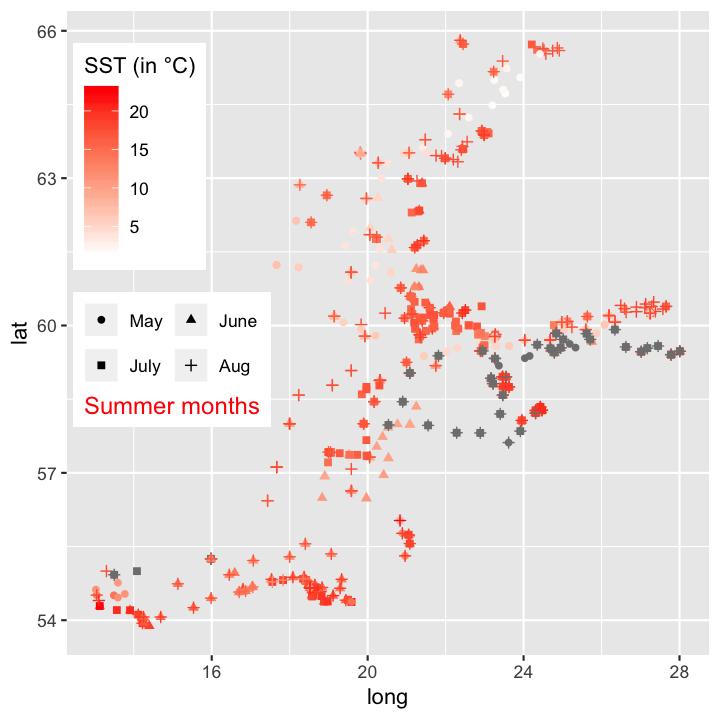

---
## Long list of theme components

See for more info
- `?theme` and 
- [Winston Chang's wiki](https://github.com/wch/ggplot2/wiki/New-theme-system) on github 

<div style="position: absolute; left: 500px; top: 125px; z-index:100">
    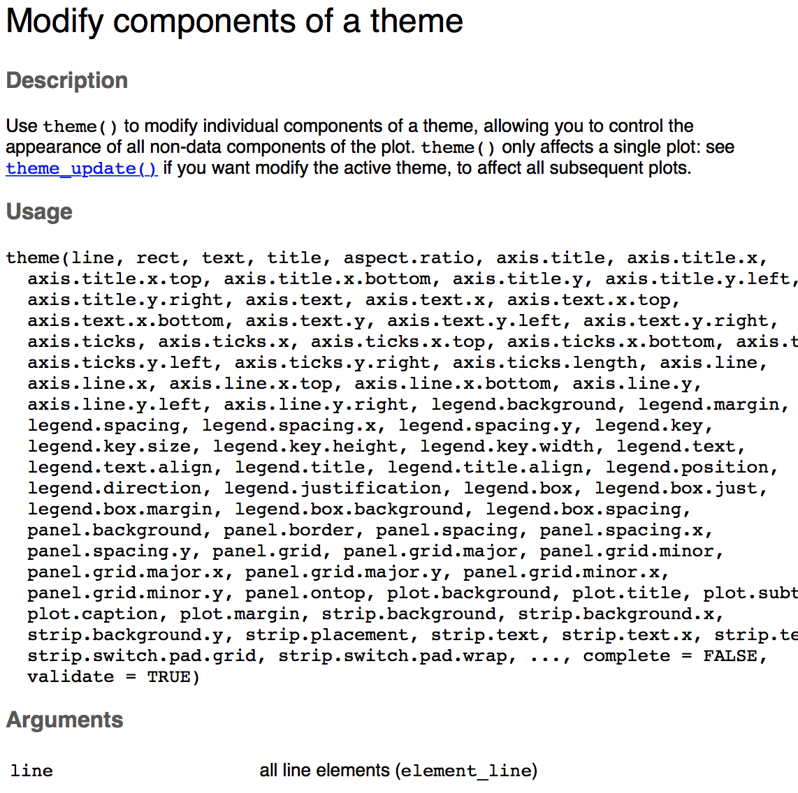
</div>

---
## Pre-made themes

- ggplot has 7  themes in-built, try them out yourself:

```
p3 + theme_bw()
p3 + theme_gray()
p3 + theme_classic()
p3 + theme_light()
p3 + theme_linedraw()
p3 + theme_minimal()
p3 + theme_void()
```

---
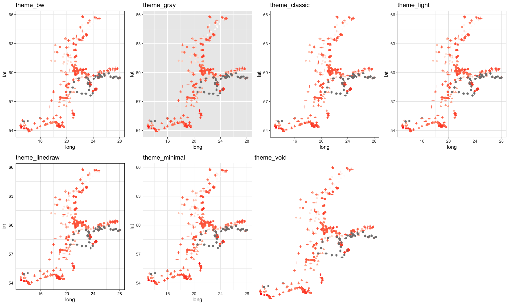

---
## Nice pre-made themes from external packages: 

### **ggthemes** by Jeffrey Arnold

- [https://github.com/jrnold/ggthemes](https://github.com/jrnold/ggthemes)
- [ggthemes vignette](https://cran.r-project.org/web/packages/ggthemes/vignettes/ggthemes.html)
- install.packages("ggthemes")


### **ggtech** by Ricardo Bion

- [https://github.com/ricardo-bion/ggtech](https://github.com/ricardo-bion/ggtech)
- devtools::install_github("ricardo-bion/ggtech", 
                          dependencies=TRUE)
- ggtech offers themes that resemble google, airbnb, twitter, facebook                      
- You need to install various necessary fonts manually before using ggtech!

---
### **ggthemes** examples


--- &slide_no_footer .segue bg:#EEC900

# Your turn...

--- &exercise
# Exercise 5: Labels, legends, and themes

1. What does `labs()` do? Read the documentation.
2. Create a ggplot (anyone you like) and explore the different built-in themes. You can also install the **ggthemes** package and choose one of those.


--- &slide_no_footer .segue bg:#1874CD

# Multiple plots on one page


---
## Arrange multiple plots on the same page

- For ggplot objects the standard R functions `par()` and `layout()` do not work
- Alternative functions:
  - `viewport()` and `grid.layout()` in the [grid](https://www.rdocumentation.org/packages/grid/versions/3.4.3) package
  - `grid.arrange()` in the [gridExtra](https://www.rdocumentation.org/packages/gridExtra/versions/2.3) package
  - `plot_grid()` and `draw_plot()` in the [cowplot](https://www.rdocumentation.org/packages/cowplot/versions/0.9.2) package
- All these function use internally the following grid specifications (in "npc" units):


---
## Arrange multiple plots on the same page

- For ggplot objects the standard R functions `par()` and `layout()` do not work
- Alternative functions:
  - `viewport()` and `grid.layout()` in the [grid](https://www.rdocumentation.org/packages/grid/versions/3.4.3) package
  - `grid.arrange()` in the [gridExtra](https://www.rdocumentation.org/packages/gridExtra/versions/2.3) package
  - `plot_grid()` and `draw_plot()` in the [cowplot](https://www.rdocumentation.org/packages/cowplot/versions/0.9.2) package
- All these function use internally the following grid specifications (in "npc" units):
- Each approach will be demonstrated using 3 different plots from the `hydro` dataset:
  - a: barplot showing the number of samplings per month
  - b: scatterplot showing the temperature ~ salinity relationship
  - c: monthly maps of temperature conditions


---
Demo plots, each assigned to an object

```r
a <- hydro %>% 
  select(fmonth, station, cruise, date_time) %>%
  distinct()  %>% group_by(fmonth) %>%
  ggplot(aes(x = fmonth)) + 
    geom_bar(aes(fill = fmonth)) + 
    guides(fill = "none") +
    scale_fill_brewer(palette = "Paired")

b <- ggplot(hydro, aes(x = psal, y = temp, col = day)) +
  geom_point()

c <- hydro %>% 
  filter(pres %in% c(1, 50), fmonth %in% 5:8) %>%
  ggplot(aes(long,lat))+ 
    geom_point(aes(colour = temp)) +
    scale_colour_gradient(low = "white", high = "red") +
    facet_grid(. ~ fmonth) 
```

--- &twocol
## Creating subplots with `viewport()`

To have a small subplot embedded drawn on top of the main plot

1. first plot the main plot,  
2. then draw the subplot in a smaller viewport using also the `print()`function

The `viewport()` function, has as arguments `x`, `y`, `width` and `height` to control the position and size of the viewport.

*** =left

```r
library(grid)
# specify the viewport for the subplot
subvp <- viewport(x = 0.7, y = 0.8, 
  width = 0.3, height = 0.3)
b
print(a, vp = subvp)
```

*** =right
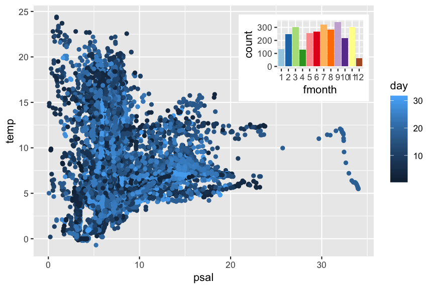

--- &twocol
## Arrange multiple plots with `grid.arrange()`

- `grid.arrange()` set up a so-called gtable layout to place multiple *grobs* on a page in the current device.
- Takes for the grid layout **number of rows and columns** as arguments:

*** =left

```r
library(gridExtra)
grid.arrange(a, b, c, 
  nrow = 2, ncol = 2)
```

*** =right


--- &twocol
### `grid.arrange()` with `arrangeGrob()`

- To **change** the **row or column span** of a plot, use the function `arrangeGrob()` when listing the plotting objects. This function takes also the row or column number as input:

*** =left

```r
grid.arrange(
  arrangeGrob(a, b, ncol = 2), 
  # a and b will be in the 1st row,  
  # splitted into 2 columns  
  c, # c will be in the 2nd row
  nrow = 2
  )
```

*** =right
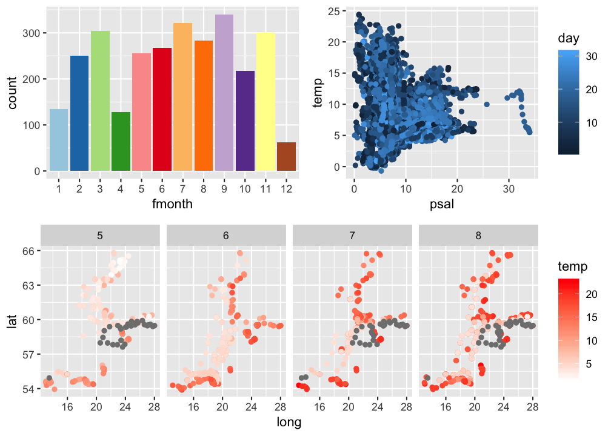

--- &twocol
### `grid.arrange()` with argument `layout_matrix`

- It is possible to use the `layout_matrix` argument for changing the row or column span of a plot (**more flexible** than `arrangeGrob()`):

*** =left

```r
grid.arrange(a, b, c, 
  nrow = 2, ncol = 2,
  layout_matrix = matrix(
    c(1,2,2,3,3,3), 
    nrow = 2, byrow = TRUE))
```
6 grid cells are specified in the matrix

- plot *a* gets cell 1 (1st row/col)
- plot *b* gets 2 cells (row 1, col 2-3)
- plot *c* gets 3 cells (row 2, col 1-3)

*** =right
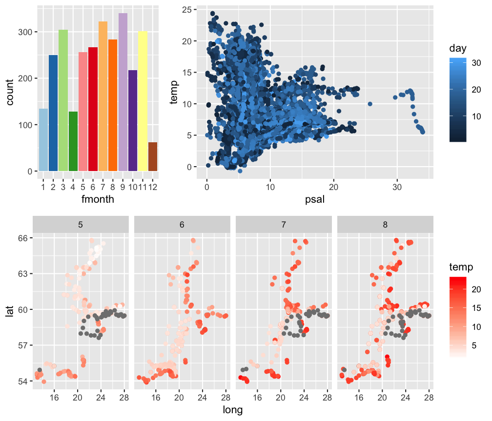

---
## Graphics with the **cowplot** package

- provides a publication-ready theme for ggplot2 
- has its own built-in default theme: white background and no grid (similar to `theme_classic()`), different font sizes
- `plot_grid()` is a shortcut function with limited adjustments


```r
library(cowplot)
plot_grid(a,b,c, labels = c("a)", "b)", "c)"), ncol = 3)
```

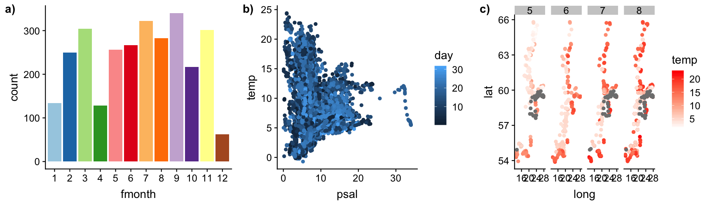

---
## Graphics with the **cowplot** package

For more adjustments (location and size) use in combination:

1. `ggdraw()` → initializes an empty drawing canvas
2. `draw_plot()` → places a single plot onto the canvas
3. `draw_plot_label()` → adds labels to the plots (default is upper left corner)

---


```r
abc <- ggdraw() +
  draw_plot(a, x = 0, y = .5, width = .5, height = .5) +
  draw_plot(b, x = .5, y = .5, width = .5, height = .5) +
  draw_plot(c, x = 0, y = 0, width = 1, height = .5) +
  draw_plot_label(label = c("a)", "b)", "c)"),
    x = c(0, 0.5, 0), y = c(1, 1, 0.5), size = 15)
abc
```

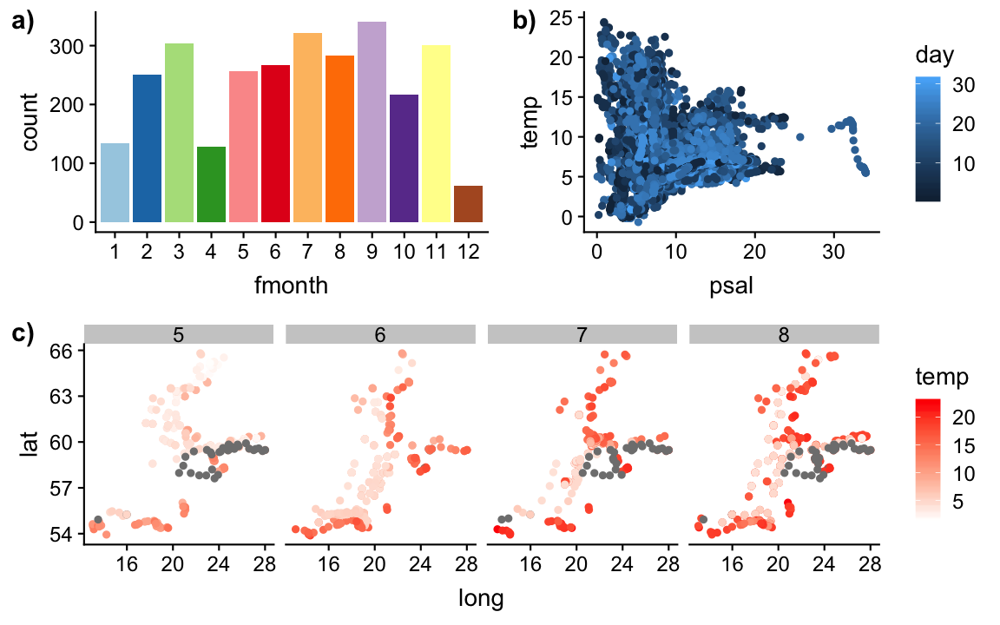

---
### Saving cowplots

- Recall: `ggsave()` (in *ggplot2*) can be used to save ggplots as
pdf.
- A better solution for cowplots: `save_plot()` (in *cowplot*) → grid layout can be specified so that the output pdf is nicely formatted and scaled


```r
save_plot("abc3.pdf", abc, 
  base_aspect_ratio = 1.3, # this makes room for a figure legend
  # the grid specification adjusts the scales:
  ncol = 2,  nrow = 2 )
```


--- &slide_no_footer .segue bg:#CDCDC1

# Coming back to the overall aim...
 

--- 
Explore spatial patterns of summer sea surface temperature in the Baltic Sea graphically:

### How to get from left to right?

<div style="position: absolute; left:25px; top: 200px; z-index:100">
    
</div>

<div style="position: absolute; left: 550px; top: 100px; z-index:100">
    
</div>


--- &slide_no_footer .segue bg:#EEC900

# Your turn...

--- &exercise
# Exercise 6: Synthesis

### You should be able to produce the right hand side plot now.

If you don't know how, follow these steps

1. Modify the colour scale.
2. Modify the text of the legend title
3. Facet into different months instead of using the shape aesthetic.
4. Add a title and axes labels.
5. Choose a theme.
6. Change the panel background colour.
7. Modify the colour of the legend title
8. CHALLENGE: Add the map to the plot. BUT: Reconsider the order of
  layers in the plat!


--- &slide_no_footer .segue bg:#CD2626

# How do you feel now.....?

--- 
## Totally confused?
                


Try to reproduce some of the plots in this presentation and the quiz and read [chapter 3] (http://r4ds.had.co.nz/data-visualisation.html) on data visualization in 'R for Data Science' or the book [ggplot2: Elegant Graphics for Data Analysis](http://www.springer.com/de/book/9783319242750) by H. Wickham.


--- &vcenter
## Totally bored?
                


Then figure out how to do an interpolation plot of the thermal regime along the latitude/longitude gradient.

---
## Totally content?
Then go grab a coffee, lean back and enjoy the rest of the day...!


--- &thankyou


--- &slide_no_footer .segue bg:#CD2626

# Solution - Exercise 6

--- 
### This is how you could code the temperature regime plot


```r
world <- map_data("world")
worldmap <- ggplot(world, aes(x = long, y = lat)) +
  geom_polygon(aes(group = group), fill = "ivory3", colour = "black") 
baltic <- worldmap + coord_map("ortho",  xlim = c(10, 30), ylim = c(54,66))

baltic + geom_point(data = sst_sum, aes(x = long, y = lat, colour = temp), size = 1) +
  scale_colour_gradient(low = "white", high = "red") +
  guides(colour = guide_colourbar(title = "SST (in °C)")) +
  facet_wrap(~fmonth, labeller = label_both) +
  ggtitle(label = "Thermal pattern in the Baltic Sea",
    subtitle = "SST in the summer months of 2015") +
    xlab("Longitude") + ylab("Latitude") +
  ggthemes::theme_base() +
  theme(legend.position = "bottom", legend.title.align = 1,
    legend.title = element_text(colour = "red", angle = 0), 
      panel.background = element_rect(fill = "lightblue1")
  ) 
```


