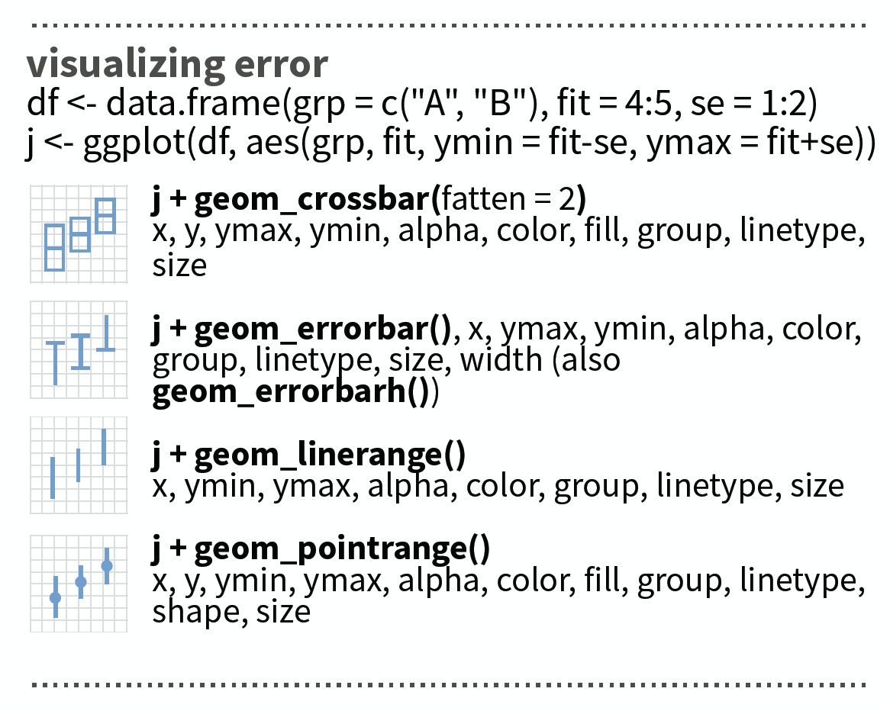

## Load the data

```{r}
cpue <- read_csv("data/CPUE per age per area_2017-11-20 06_48_16.csv")
print(cpue, n = 5)  
```

--- 
## So what are the `Areas`?
### ICES subdivisions (SD) in the Baltic Sea

<div class="img-with-text" style="position: absolute; left: 350px; top: 200px; z-index:100">
    
 <p><span class="source-img" style = "float:right">
    source: EAA and EFTTA position paper, Sept 30th, 2016 (<a href='http://www.eaa-europe.org/positions/western-baltic-cod-2016.html' title=''>http://www.eaa-europe.org</a>)</span></p>
</div>


---
### Now check whether the data is tidy and filter the year 2015

> - Are you satisfied with `Survey`, `Quarter`, `Area`, or `Species` being character or integer vectors?
> - Why not convert them into **factors** ...?


--- &slide_no_footer .segue bg:#1874CD

# Factors
 

---
## Recall:

Factors are

- vectors that can contain only **predefined values**,  
- used to store **categorical data**,
- built **on top of integer** vectors using two attributes: 
  - the **class**, “factor”, which makes them behave differently from regular integer vectors,
  - and the **levels**, which defines the set of allowed values.

---
## Recall:

Factors are

- vectors that can contain only **predefined values**,  
- used to store **categorical data**,
- built **on top of integer** vectors using two attributes: 
  - the **class**, “factor”, which makes them behave differently from regular integer vectors,
  - and the **levels**, which defines the set of allowed values.
- a useful tidyverse package for factors is **forcats**

<div style="position: absolute; left: 625px; top: 450px; z-index:100">
    
</div>

--- 
## String vs. factor
Imagine that you have a vector or variable that contains month:

```{r}
x1 <- c("Dec", "Apr", "Jan", "Mar")
```

Using a string to record this variable has two problems:

1. There are only twelve possible months, and there’s nothing saving you from typos
2. It doesn’t sort in a useful way

```{r}
x2 <- c("Dec", "Apr", "Jam", "Mar")
sort(x1)
```

---
## Creating factors

You can fix both of these problems with a factor. To create a factor you must start by creating a vector of the valid levels:
```{r, eval = FALSE}
library(forcats)
month_levels <- c(
  "Jan", "Feb", "Mar", "Apr", "May", "Jun", 
  "Jul", "Aug", "Sep", "Oct", "Nov", "Dec"
)
```

```{r, echo = FALSE}
month_levels <- c(
  "Jan", "Feb", "Mar", "Apr", "May", "Jun", 
  "Jul", "Aug", "Sep", "Oct", "Nov", "Dec"
)
```

---
## Creating factors (cont)

Now you can create a factor:
```{r}
y1 <- factor(x1, levels = month_levels)
y1
```

```{r}
sort(y1)
```

---
## Creating factors (cont)
Any values not in the set will be silently converted to NA:

```{r}
y2 <- factor(x2, levels = month_levels)
y2
```

If you omit the levels, they’ll be taken from the data in alphabetical order:

```{r}
factor(x1)
```

--- &twocol
## Factor levels 

Sometimes you’d prefer that the order of the levels match the order of the first appearance in the data. You can do that when creating the factor by setting levels to `unique(x)` or after the factor conversion with `fct_inorder()`:

*** =left
```{r}
f1 <- factor(x1, levels = unique(x1))
f1
```

*** =right
```{r}
f2 <- x1 %>% factor() %>% fct_inorder()
f2
```

---
## Factor levels (cont)
To access the set of valid levels directly use `levels()`:

```{r}
levels(f2)
```

---
## You can do many other things with a factor using the `forcats` library

- Reorder factor levels **by hand**: `fct_relevel()`
- Reorder factors levels **by first appearance or frequency**: `fct_infreq()`
- **Reverse** order of factor levels: `fct_rev()`
- Reorder factor levels **by sorting along another variable**: `fct_reorder()`
- **Collapse factor levels** into manually defined groups: `fct_collapse()`

---
## A demonstration with the CPUE dataset and the areas

```{r, echo=FALSE}
# I receive an error that cpue not found...? So here its loaded AGAIN
cpue <- read_csv("data/CPUE per age per area_2017-11-20 06_48_16.csv")
```

```{r}
cpue$Area <- factor(cpue$Area) # (same as cpue <- mutate(cpue, Area = factor(Area)))
levels(cpue$Area)
```

To plot the total CPUE of Atlantic cod (*Gadus morhua*) per area in 2015:
```{r}
cpue_total <- cpue %>% 
  filter(Species == "Gadus morhua", Year == 2015, Quarter == 1) %>%
  select(Area, contains("Age")) %>%
    mutate(total_cpue = rowSums(select(., contains("Age")))) 
```

--- &twocol
### Area sorted automatically

*** =left
```{r, eval=FALSE}
cpue_total %>%
  ggplot(aes(x = Area, y= total_cpue, 
    fill = Area)) +
  geom_col()
```

*** =right
```{r, echo=FALSE, fig.height = 6, fig.width = 6, fig.align = "left"}
cpue_total %>%
  ggplot(aes(x = Area, y= total_cpue, 
    fill = Area)) +
  geom_col()
```

--- &twocol
### Now lets reorder the Area factor

*** =left
```{r, fig.height = 5, fig.width = 5, fig.align = "center"}
# Simply reverse order
cpue_total %>% 
  ggplot(aes(x = fct_rev(Area), 
    y = total_cpue, fill = Area)) +
  geom_col()
```

*** =right
```{r, fig.height = 5, fig.width = 5, fig.align = "center"}
# Reorder manually
cpue_total %>% mutate(Area=fct_relevel(
  Area, "22", after = 2)) %>%
  ggplot(aes(x=Area, y=total_cpue,
    fill = Area)) + geom_col()
```

--- &twocol
### What would be if we plot the mean instead of total CPUE:

*** =left
```{r, eval=FALSE}
cpue_mean <- cpue %>% 
  filter(Species == "Gadus morhua", 
    Year == 2015, Quarter == 1) %>%
  select(Area, contains("Age")) %>%
  mutate(mean_cpue = rowMeans(select(., 
    contains("Age"))))
cpue_mean %>%
  ggplot(aes(x = Area, y= mean_cpue,
    fill = Area)) +
  geom_col()
```

<div class="boxorange1" >
  <h4>Note:</h4> <p><span style="font-size:15px">When using the pipe operator and the <strong>select function</strong> within another function (here <code>rowMeans()</code>) you need to use as first argument the <strong>dot as placeholder</strong> for the data!</span></p></div>


*** =right
```{r, echo=FALSE, fig.height = 6, fig.width = 6, fig.align = "left"}
cpue_mean <- cpue %>% 
  filter(Species == "Gadus morhua", 
    Year == 2015, Quarter == 1) %>%
  select(Area, contains("Age")) %>%
  mutate(mean_cpue = rowMeans(select(., 
    contains("Age"))))
cpue_mean %>%
  ggplot(aes(x = Area, y= mean_cpue,
    fill = Area)) +
  geom_col()
```
**How representatives are the means?**


--- &slide_no_footer .segue bg:#1874CD

# Visualizing errors
 


--- &twocol
## Visualizing errors using e.g. `geom_errorbar()`

*** =left
```{r, eval = FALSE}
cpue_mean %>%
  mutate(sd_cpue = apply(
    select(., contains("Age")), 1, sd),
    se_cpue = sd_cpue/ sqrt(11)
  ) %>%
  ggplot(aes(x = Area, y= mean_cpue,
    fill = Area)) +
  geom_col() +
  geom_errorbar(aes(
    ymin = mean_cpue - se_cpue, 
    ymax = mean_cpue + se_cpue),
    width = .2)  
    # Width of the error bars
```

*** =right
```{r, echo = FALSE, fig.height = 7, fig.width = 6, fig.align = "center"}
cpue_mean %>%
  mutate(sd_cpue = apply(
    select(., contains("Age")), 1, sd),
    se_cpue = sd_cpue/ sqrt(11)
  ) %>%
  ggplot(aes(x = Area, y= mean_cpue,
    fill = Area)) +
  geom_col() +
  geom_errorbar(aes(
    ymin = mean_cpue - se_cpue, 
    ymax = mean_cpue + se_cpue),
    width = .2)  # Width of the error bars
```

---
## Visualizing errors: other options

<div class="img-with-text" style="position: absolute; left: 300px; top: 100px">
    
 <p><span class="source-img" style = "float:right">source: older version of <a href='https://github.com/rstudio/cheatsheets/raw/master/data-visualization-2.1.pdf' title=''>Data Visualization with ggplot</a> cheat sheet (licensed under CC-BY-SA)</span>
</div>


--- &slide_no_footer .segue bg:#EEC900

# Your turn...

--- &exercise
# Exercise

### Pick one species and the year 2015 and find out if there are spatial differences (between areas)

1. in **total** CPUE
2. **mean** CPUE (with error bar)
3. in CPUE of **each age**

Were does the variability in the wide error bars come from?

<small> At the end of the presentation you find a solution code! </small>


--- &slide_no_footer .segue bg:#E5E5E5

## Overview of functions you learned today

base functions for factors: `factor(x, levels)`, `unique(x)`, `levels()`

base functions applied on margin of dataframes: `rowSums()`, `rowMeans()`, `apply(data, MARGIN, FUN)`

dplyr package: select helper function `contains()`

ggplot2 package: `geom_col()`, `geom_errorbar()`

forcats package: `fct_inorder()`, `fct_relevel()`, `fct_infreq()`, `fct_rev()`, `fct_reorder()`, `fct_collapse()`


--- &slide_no_footer .segue bg:#CD2626

# How do you feel now.....?

--- &vcenter
## Totally confused?
                
```{r, out.width = "400px", echo = FALSE, fig.align = 'center'}
knitr::include_graphics("img/Comic_confused.png")
```

Practice on the exercise data and try out maybe all species or all years. Read [chapter 15] (http://r4ds.had.co.nz/factors.html) on factors in 'R for Data Science'.

--- &vcenter
## Totally bored?
                
```{r, out.width = "800px", echo = FALSE, fig.align = 'left'}
knitr::include_graphics("img/Comic_bored.png")
```

Stay tuned for the next case study where you can play around as much as you want!

---
## Totally content?
Then go grab a coffee, lean back and enjoy the rest of the day...!

```{r, out.width = "600px", echo = FALSE, fig.align = 'center'}
knitr::include_graphics("img/Comic_hammock.png")
```


--- &thankyou


--- &slide_no_footer .segue bg:#CD2626

# Solution 

---
## Solution for all 3 species, all Quarters and 2015

You could calculate your summary statistics such as **mean, standard deviation**, etc. by applying functions to margins of the dataframe such as `rowSums`, `rowMeans()` or `apply(x, MARGIN, FUN)` as I showed you in the previous examples. Alternatively, if you want to *aggregate both across columns AND rows* (because you have e.g. repeated entries) or you want to use later the *faceting option*, convert your data into a **long format**. 
If you keep quarters or years, however, you should calculate total CPUE (summed up across the different ages) separately for each quarter or year!

In this example I will use the long format as I want to facet later also my plots.

---
### Solution for all 3 species, all Quarters and 2015 (cont)

1.Load data and convert variables into factors
```{r}
cpue <- read_csv("data/CPUE per age per area_2017-11-20 06_48_16.csv")
cpue$Area <- factor(cpue$Area, 
  levels = c(21,22,23,24,25,26,27,28,29,30,31,32))
```

2.Create data subset
```{r}
cpue_sub <- cpue %>% filter(Year == 2015) %>%
  select(Area, Quarter, Species, contains("Age"))
```

3.Make data wide  
```{r}
cpue_subl <- cpue_sub %>% gather(key = "age", value = "cpue", -Area, -Quarter, -Species)
# Same as 
cpue_subl <- cpue_sub %>% gather(key = "age", value = "cpue", Age_0:Age_10)
```

---
4.Convert `Age` into a factor
```{r}
cpue_subl$age <- factor(cpue_subl$age)
# this won't give the order you want (age 10 comes after age 1)
levels(cpue_subl$age)
```
**Uups, not a great order.**
```{r}
cpue_subl$age <- fct_relevel(cpue_subl$age, "Age_10", after = 10)
# check again
levels(cpue_subl$age)
```

---
5.Now calculate the summary statistics in one step
```{r}
cpue_stats <- cpue_subl %>%
  group_by(Area, Quarter, Species) %>%
  summarise(
  total_cpue = sum(cpue),
  mean_cpue = mean(cpue),
  se_cpue = sd(cpue) / sqrt(n()) # n() has to be empty
  )
```

---
## Create and save distribution plots per species

```{r}
p_cod_tot <- cpue_stats %>% filter(Species == "Gadus morhua") %>%
  ggplot(aes(x = Area, y = total_cpue, fill = Area)) +
  geom_col() +
  guides(fill = "none") +
  facet_grid(. ~ Quarter, labeller = label_both) 

p_cod_mean <- cpue_stats %>% filter(Species == "Gadus morhua") %>%
  ggplot(aes(x = Area, y = mean_cpue, fill = Area)) + # only y replaced
  geom_col() +
  guides(fill = "none") +
  geom_errorbar(aes(  # standard error will be added here
  ymin = mean_cpue - se_cpue, 
  ymax = mean_cpue + se_cpue),
  width = .2) +
  facet_grid(. ~ Quarter, labeller = label_both)

```

---
## Create and save distribution plots per species (cont)
  
```{r}
p_cod_age_q1 <- cpue_subl %>% 
  filter(Species == "Gadus morhua", Quarter == 1) %>%
  ggplot(aes(x = Area, y = cpue, fill = Area)) + # y replaced again
  geom_col() +
  guides(fill = "none") +
  facet_wrap(~ age, labeller = label_both)  # ~month replaced with ~age
```  

--- 
## Show all 3 plots together

To show all these plots together we can use the `grid.arrange()` function in the **gridExtra** package where we can specify a *layout matrix*. Here, I created a 2x2 matrix where I show the total cpue plot (#1) in the left upper panel, the mean cpue plot (#2) in the lower left panel, and the age-specific plot (#3) in the upper and lower right panels combined. ALl 3 saved ggplot objects need to put together in a list for the 'grobs' argument:

```{r, eval = FALSE}
gridExtra::grid.arrange(grobs = list(p_cod_tot, p_cod_mean, p_cod_age_q1),
  layout_matrix = matrix(c(1,3,2,3), byrow =TRUE, nrow = 2))  
```
See on the next slide the plots

--- &vcenter
## Gadus morhua results
```{r, echo = FALSE, fig.height = 6.5, fig.width = 14}
gridExtra::grid.arrange(grobs = list(p_cod_tot, p_cod_mean, p_cod_age_q1),
  layout_matrix = matrix(c(1,3,2,3), byrow =TRUE, nrow = 2))  
```
<small>Press 'p' for a conclusion.</small>

<kbd>p</kbd>

*** =pnotes
<small style="font-size:15px;"> Total and mean CPUE  of cod is highest in the Oresound (SD 23) and the Central BS region (SD 24-26). The rather bimodal pattern reflects the division of the cod into 2 stocks: the Western Baltic cod and the Eastern Baltic cod. Based on the bar plots we can assume for 2015 that 
- <small style="font-size:15px;">in first quarter the Western Baltic Stock occurred mainly in the Oresound and less in the Kattegat or Danish Strait, while in the last quarter overall abundances were low in all SDs.</small>
- <small style="font-size:15px;">the Eastern Baltic Cod inhabited mainly the Bornholm Basin (SD25) and was hardly present in the Gotland basin (SD 27 and 28). This pattern is quite consistent in time.</small>

The wide errorbars, however, show that this spatial distribution is variable across age groups. Looking at the age-specific plots we see that individuals caught in the Oresound are mainly of age 2, 3, and 1. Most individuals caught in the Bornholm basin and Gdansk Deep (SD26) were slightly older. Individuals older than 4 years were almost not caught in 2015, especially not in the Western Baltic.</small>


---
## Plot mean CPUE of all species together  

We can use almost the same code as for cod with the only difference that we do not filter any species. Instead, we include the species in the faceting:
```{r}
p_all_mean <- cpue_stats %>% 
  ggplot(aes(x = Area, y = mean_cpue, fill = Area)) +
  geom_col() +
  guides(fill = "none") +
  geom_errorbar(aes(
  ymin = mean_cpue - se_cpue, 
  ymax = mean_cpue + se_cpue),
  width = .2) +
  facet_grid(Quarter ~ Species, labeller = label_both) +
  coord_trans(y = "sqrt")
```

---
## Plot mean CPUE of all species together  

```{r, fig.height = 6, fig.width = 14, fig.align = "center"}
p_all_mean
```
<small>Press 'p' for a conclusion.</small>

<kbd>p</kbd>

*** =pnotes
<small style="font-size:20px;">Flounder can be found in the Western Baltic mainly in the Danish strait and Central Baltic Sea but moves in the autumn/winter month further north to the Western and Eastern Gotland basin (SD27 and 28).

In contrast, plaice is more located in the Western Baltic with highest abundances in the Danish Strait. This spatial patterns is rather consistent in the 2 quarters.</small>


