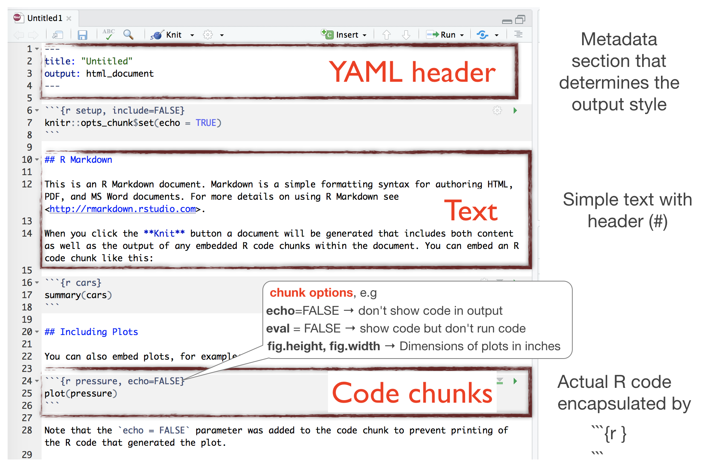
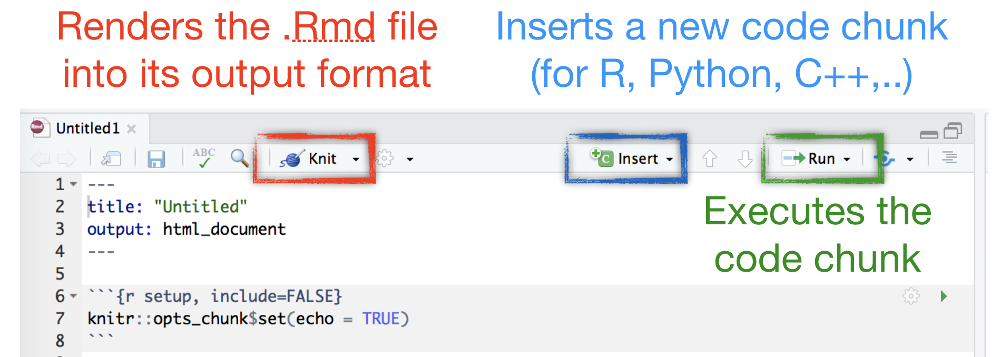
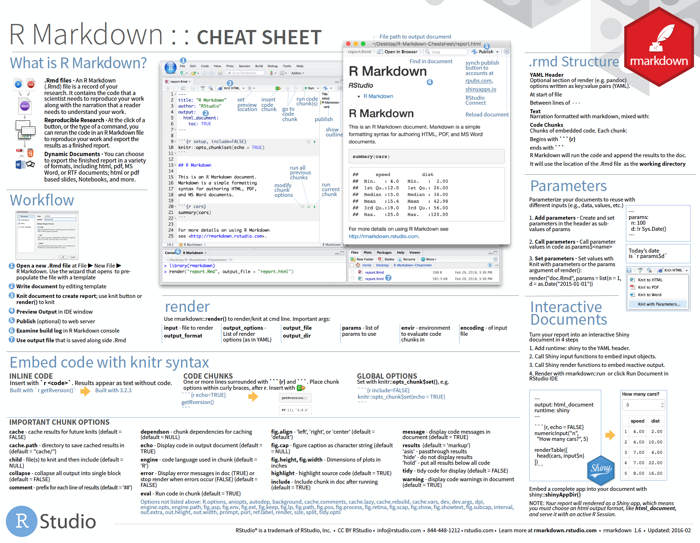

## By using R Markdown

 

- R Markdown is an easy-to-write **plain text formatter** designed to make web content, reports or presentations easy to create,
- can **weave** the outputs of your R code, like **figures and tables**, with **text** to create a report,
- supports not only the **reproducibility** of your analysis but also the **entire report**,
- supports various different **static** as well as **dynamic output formats**.
- How does it work? R Markdown encapsulates various processs into a single render function:

<div class="img-with-text" style="position: absolute; left: 250px; top: 420px">
    
 <p><span class="source-img" style = "float:right">modified from the <a href='https://github.com/rstudio/cheatsheets/raw/master/rmarkdown-2.0.pdf' title=''>R Markdown</a> cheat sheet (under CC-BY-SA license)</span></p>
</div>


---
## A quick introduction

<iframe src="https://player.vimeo.com/video/178485416" width="640" height="360" frameborder="0" style="margin-bottom: 2em;" webkitallowfullscreen="" mozallowfullscreen="" allowfullscreen="">
</iframe>

<p><span class="source-img" style="position: absolute; left: 400px; top: 650px">source:
    <a href='https://rmarkdown.rstudio.com/authoring_quick_tour.html' title='R Markdown video'>rmarkdown.rstudio.com</a> (RStudio is a trademark of Rstudio, Inc.)</span></p>

   
--- &vcenter
## How to create an .Rmd file

```{r, out.width = "800px", echo = FALSE, fig.align='center'}
knitr::include_graphics("img/Rmarkdown_step_1.png")
```

--- &vcenter
## How to create an .Rmd file

```{r, out.width = "500px", echo = FALSE, fig.align='center'}
knitr::include_graphics("img/Rmarkdown_step_2.png")
```

--- &vcenter
## Structure of an .Rmd file

```{r, out.width = "700px", echo = FALSE, fig.align='center'}
knitr::include_graphics("img/Rmarkdown_step_3.png")
```

--- &vcenter
## Structure of an .Rmd file

```{r, out.width = "800px", echo = FALSE, fig.align='center'}

```

--- &vcenter
## Rendering Output

```{r, out.width = "800px", echo = FALSE, fig.align='center'}

```

---
## (Markdown) Syntax

<div class="img-with-text" style="position: absolute; left: 200px; top: 125px">
    
 <p><span class="source-img" style = "float:right">source: 
    <a href='https://rmarkdown.rstudio.com/authoring_quick_tour.html' title=''>rmarkdown.rstudio.com</a></span></p>
</div>

---
## HTML vs Markdown vs R Markdown Syntax

<div class="img-with-text" style="position: absolute; left: 200px; top: 150px">
    
 <p><span class="source-img" style = "float:right; line-height:1.5">source: Donovan, T., Brown, M., & Katz, J. (2015). Vermont Cooperative Fish and Wildlife Research Unit R Projects: R for Fledglings.<br>Retrieved from  
    <a href='https://www.uvm.edu/rsenr/vtcfwru/R/fledglings/08_Markdown.html' title=''>https://www.uvm.edu/rsenr/vtcfwru/R/fledglings/08_Markdown.html</a><br>(under <a href='https://creativecommons.org/licenses/by-nc-nd/4.0/' title=''>CC-BY-NC-ND 4.0</a> license) </span></p>
</div>


--- &twocol
## Get more infos

 

*** =left
- The [cheatsheet](https://github.com/rstudio/cheatsheets/raw/master/rmarkdown-2.0.pdf) gives you a good overview.
- R Studio provides also a useful [reference guide](https://www.rstudio.com/wp-content/uploads/2015/03/rmarkdown-reference.pdf).
- Look at the [R Markdown Webside](https://rmarkdown.rstudio.com) from R Studio for a first start.
- To dig deeper you will find many youtube videos and online tutorials.
  - A good one is, for instance: [R for fledglings](https://www.uvm.edu/rsenr/vtcfwru/R/fledglings/08_Markdown.html)

 

<div class="img-with-text" style="position: absolute; left: 650px; top: 330px">
    
 <p><span class="source-img" style = "float:left; line-height:1.5"> Cheat sheet is freely available at <br>
 <a href='https://www.rstudio.com/resources/cheatsheets/' title=''>https://www.rstudio.com/resources/cheatsheets/</a></span></p>
</div>


--- &slide_no_footer .segue bg:#EEC900

# Your turn...

--- &exercise
# Task: Convert an R script into a Markdown file 

Start your first R Markdown file that should render a html document and save it under any name.
In lecture 8 on visualizations you were asked to answer the following questions using the `hydro` dataset (file "data/1111473b.csv"):

1. What happens if you make a scatterplot of station (x) vs temp (y)? Why is the plot not useful? What would be a better plot?
2. What happens if you make a boxplot of cruise (x) vs psal (y)? Why is this plot less suitable? What could be an alternative?

If you have done this exercise you can simply use your code and copy and paste it into the code chunks of your .Rmd file. If you haven't done the exercise you have now the opportunity to make up leeway.


--- &exercise
# Implement the following in your .Rmd file

1. Start with R code chunks for loading the data and required libraries 
2. Add code chunks for 
    i) any data modifications
    ii) any plot
3. Think about which code chunks should be evaluated (eval=TRUE) or not displayed (echo=FALSE)
4. Think about the dimensions of the figure and add the required specifications in the chunk options
5. Include different headers and subheaders
6. Add your answers and think about whether you want to use
    i) any ordered or unordered lists
    ii) text in **bold** or *italic*
7. Add a webside link that fits to the topic
8. Add an image   

<div class="alert alert-green" style="position: absolute; left: 600px; top: 525px">
  <h4>Note:</h4> Try to <strong>knit</strong> your .Rmd file <strong>frequently</strong> (after any major addition)!! It is highly likely that you will run into an error message and that way you can identify the cause much faster.</div>


--- &slide_no_footer .segue bg:url(img/Darst.jpg);background-size:cover

# Now its time for your FIRST CASE STUDY!!!

<p><span class="source-img" style="position: absolute; left: 50px; top: 650px; color:white">Photo by NASA (ID ISS040-E-12110), accessed 
    <a href='https://earthobservatory.nasa.gov/images/84047/coastlines-of-the-southern-baltic-sea' title=''>here</a></span></p>


--- &slide_no_footer .segue bg:#CD2626

# How do you feel now.....?

--- &vcenter
## Totally confused?
                
```{r, out.width = "400px", echo = FALSE, fig.align = 'center'}
knitr::include_graphics("img/Comic_confused.png")
```

Practice on the exercise data and go through the suggested info material.

--- &vcenter
## Totally bored?
                
```{r, out.width = "800px", echo = FALSE, fig.align = 'left'}
knitr::include_graphics("img/Comic_bored.png")
```

Once your done, change in the YAML header the output format to e.g. PDF and knit your .Rmd file again. How do you like that output? Play around with all the options and output formats that R Markdown provides. Convert any of your R scripts you wrote so far into an .Rmd file

---
## Totally content?
Then go grab a coffee, lean back and enjoy the rest of the day...!

```{r, out.width = "600px", echo = FALSE, fig.align = 'center'}
knitr::include_graphics("img/Comic_hammock.png")
```


--- &thankyou

