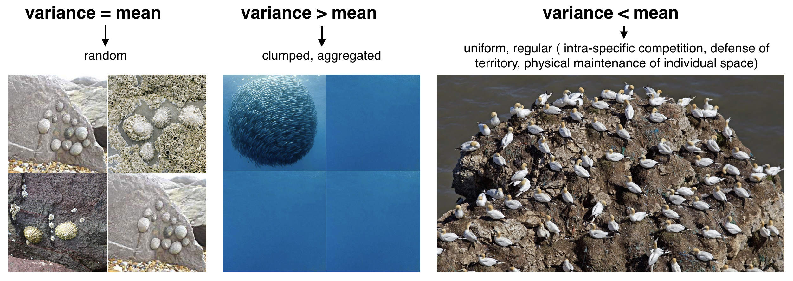
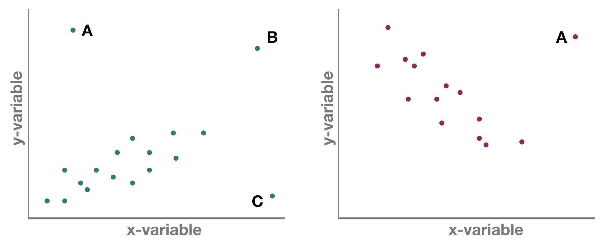
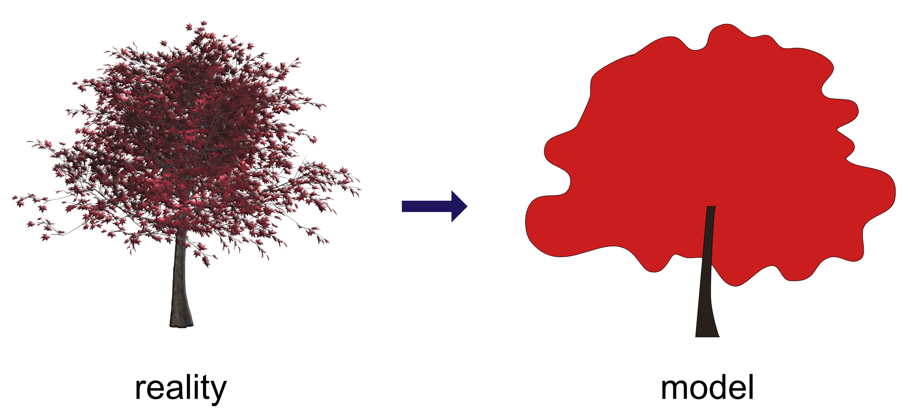
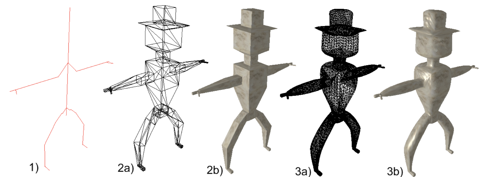
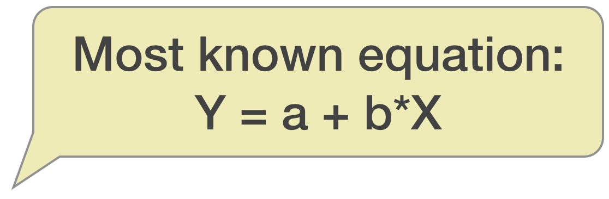
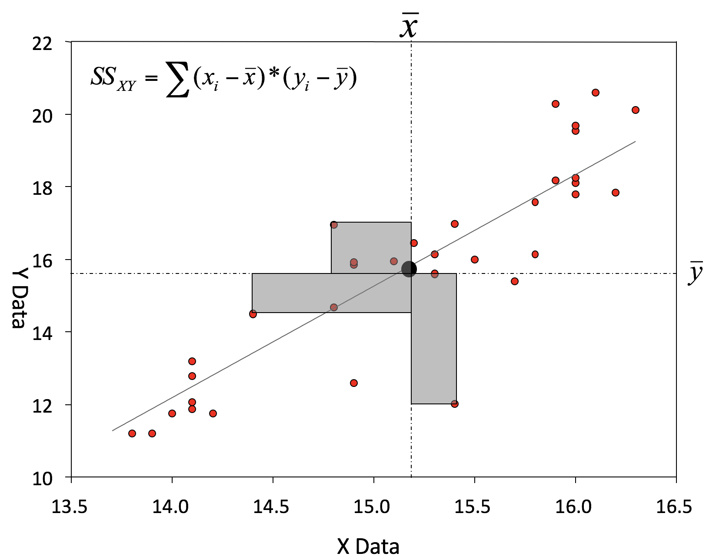
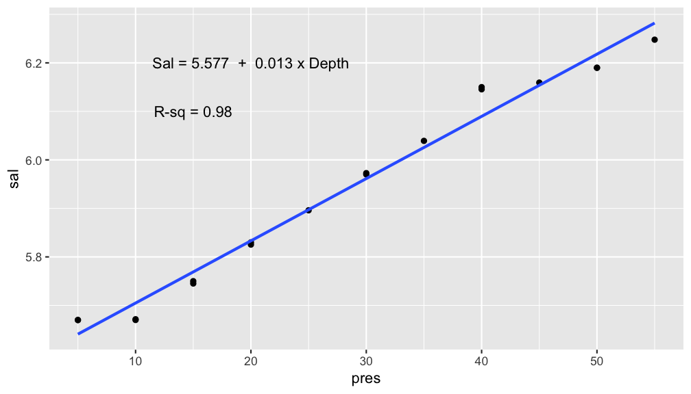
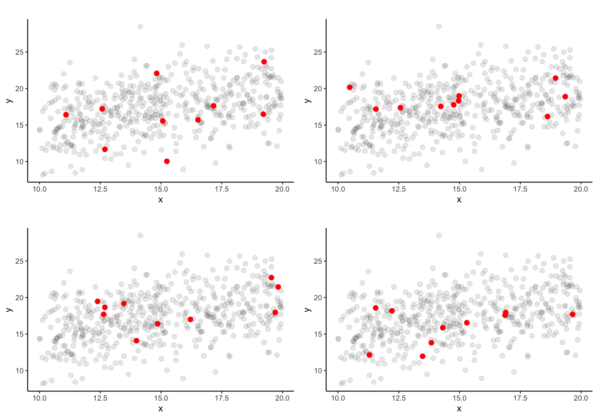
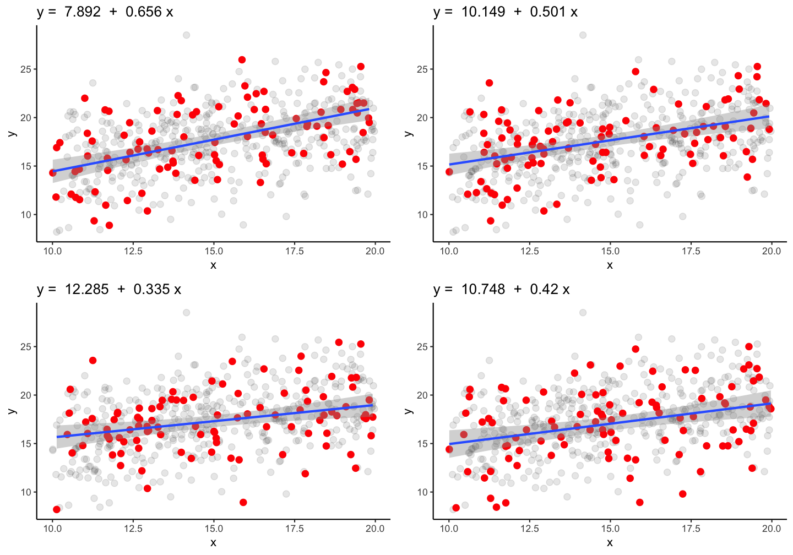

## Data distribution – the numerical description
### PARAMETER vs STATISTIC   

<div class="boxorange1" style="position: absolute; left: 80px; top: 250px;">
    <h3>Parameter</h3><p>a measure that describes the entire <strong>population</strong> (e.g. $\mu, \sigma^{2}$) </p></div>

<div class="boxgreen1" style="position: absolute; left: 580px; top: 250px;">
    <h3>Statistics</h3><p>Parameters are rarely known and are usually estimated by statistics describing a <strong>sample</strong> (e.g. $\bar{x}, s^2$)</p></div>

---
## Parameters of location or central tendency

- **Mode**: No built-in function
  - The mode is the most frequently occurring value in a distribution. It is the only measure of central tendency that can be used with nominal data.
- **Median**: `median(x)` or `quantile(x, probs = 0.5)`
  - The middle most value in a data series is called the median: half the scores are above the median and half are below the median. It is also called the "50%-percentile".
- **Arithmetic mean**:  `mean()`  $\mu;  $  $\bar{x} = \frac{1}{n} \sum_{i=1}^{n}x_{i}$
  - Often called simply the 'mean' or 'average' but one needs to be specific to differentiate from the other means.
- **Weighted mean**: `weighted.mean(x, w, ...)`  
  - Each data value $x_{i}$  has a weight $w_{i}$ assigned to it. 

<kbd>p</kbd>
    
*** =pnotes    
Further means: *geometric mean*, *harmonic mean*, *trimmed mean*

---
## Parameters of location or central tendency 


<div style="position: absolute; left: 700px; top: 125px; z-index:100">
    
</div>

<small>The <strong>arithmetic mean</strong> can be a good measure for roughly <strong>symmetric</strong> distributions but can be misleading in skewed distributions since it can be greatly influenced by extreme scores.</small>

---
## Parameters of spread or variability

- **Range**: `range()`
- **Variance**: `var()` 
- **Standard deviation**: `sd()`
- **Standard error**: no built-in function (`sd(x)/sqrt(length(x))`)
- **Coefficient of variation**: no built-in function (`sd(v)/mean(v)`)

---
### Variance $\sigma^{2}, s^{2}$
The variance is the 'Mean Sum of Squared' **(MSS)** distances of individual measurements from the overall mean:

- Sum of distances from mean equals zero → therefore the square!


---
### Variance $\sigma^{2}, s^{2}$
The variance is the 'Mean Sum of Squared' **(MSS)** distances of individual measurements from the overall mean:

- Sum of distances from mean equals zero → therefore the square!
- We don’t want our measure of variability to depend on the sample size, so the obvious solution is to **divide by the number of samples** to get the mean squared deviation:
$$\sigma^{2} = \frac{\sum_{i=1}^{n} 
  \left(x_{i} - \bar{x}\right)^{2}}
  {n-1}$$
The *n-1* in the equation represents the so-called **degrees of freedom** (df): 
$df = N-p$ (with p = number of parameter estimated from the data).

<div class="boxgreen2" style="margin-left: auto; margin-right: auto;">
    <h4>Suppose ..</h4><p>a sample has 5 numbers and a mean of 4 → the sum has to be 20. If the first 4 numbers are 1, 1, 4, and 10, the last number has to be 4: so we have 4 df for 5 numbers.</p></div>


---
### The variance is

* most commonly used 
* measure for the overall spread
* less sensitive to extreme scores
* useful for judging quality of data: 
    

    


--- &twocol
### Variance and the role of sample size
Here is a simulation to demonstrate how the variance spread changes with sample size

*** =left

```r
plot(c(0,32), c(0,15), type = "n",
  xlab = "Sample size", 
  ylab = "Variance")

for (df in seq(3,31,2)) {
  for( i in 1:30) {
    x <- rnorm(df, mean = 10, sd = 2)
    points(df, var(x)) 
  }
}
```

<small>Press 'p' in the html document for more info.</small>

*** =right


<kbd>p</kbd>

*** =pnotes
<small style="font-size:20px;">These 2 loops generate 30 times a vector *x*, which contains 3,4,5, ..., or 30 values (df) that are normally distributed with a mean of 10 and a standard deviation of 2. For each vector the variance is calculated and plotted as single point against its sample size (df). You can see that the variance spreads much more if sample size is low, in other words, with higher sample size estimates are much more precise and less variable.</small>

---
### Standard deviation **SD** ($\sigma, s$) and standard error **SE** 

The standard deviation is just the square root of the variance
$$\sigma = \sqrt{\frac{\sum\limits_{i=1}^{n} \left(x_{i} - \bar{x}\right)^{2}} {n-1}}$$
The standard error normalizes the SD by the square root of the sample size *n*
$$SD = \frac{\sigma}{\sqrt{n}}$$

---
### Standard deviation **SD** ($\sigma, s$) and standard error **SE** 

Both parameters are typically used for **error bars** in graphs:

- Standard deviation and error are expressed in the **same units as the data**.
- If data is *normal distributed*: **68%** of all measurements fall within **one standard deviation** of the mean, **95%** of all measurements fall within **two standard deviations** of the mean.
- The greater the sample size *n* the higher $s^{2}$ and $s$ → *SE* gives an estimate of variability independent of sample size.
* The greater *n*, the smaller *SE*.


--- &twocol
### Coefficient of variation **CV**

*** =left
- Allows for comparison of the variation of populations that have significantly different mean values.
- Is defined as the ratio of the standard deviation to the mean: $CV = \frac{s}{\bar{x}}$.
- It is often reported as on a scale of 0 to 100% by multiplying the above calculation by 100. 
- Tends to be biased with small sample sizes.


<div class="img-with-text" style="position: absolute; left: 550px; top: 120px">
<a href="http://static.peerj.com/infographic/2015/marine-megafauna/Marine_megafauna_Infographic.pdf">
  
</a> 
 <p><span class="source-img" style = "float:right; line-height:1.5;">source: 
  <a href='https://peerj.com/articles/715/' title=''>Sizing ocean giants: patterns of intraspecific size variation in marine megafauna</a><br> by McClain et al., DOI: 10.7717/peerj.715</span></p>
</div>


---
## Something on outliers

* Might incorrectly influence analysis
* 1 outlier only → take it out
* Several tests (e.g. regression) model the center of the data; if you are more interested in the outlier apply outlier-analysis techniques 
* Outliers in 1 dimension are not necessarily outliers in 2 or more dimensions

---
### But which one is an outlier? That depends on the dimensional perspective.



---
### But which one is an outlier? That depends on the dimensional perspective.


<small>1-dimensional (left panel): Point A might be an outlier of variable y, but not of x; C is an outlier of x but not y, and B is an outlier of both x and y separately 

2-dimensional space xy (left panel): A and C could be outliers (both are far away from the regression line) but B is not an outlier anymore, since it lies on the regression line.
Right panel: Point A could be an outlier in the x-space but is definitely one in the xy-space</small>


--- &slide_no_footer .segue bg:#1874CD

# Statistical modelling 
 

--- &mytwocol2
## Models are

- a simplified description of a complex entity or process.
- derived from an hypothesis → one hypothesis may produce numerous competing models.
- compare models with observed data → assess fit of model(s) to sample data.
<br>
<br>

*** =left


*** =right  



<p><span class="source-img" style = "position: absolute; left: 250px; top: 600px; line-height: 1.5;">sources: reality tree by
    <a href='https://pixabay.com/de/baum-herbst-blätter-rote-blätter-1586365/' title=''>www.pixabay.com</a> (<a href='https://creativecommons.org/publicdomain/zero/1.0/deed.de' title=''>CCO 1.0</a>); stick man graph on the right J. Nielsen (masterthesis<br>"Conversion of Graphs to Polygonal Meshes", Technical University Copenhagen), <a href='http://www.tchami.com/?tag=/gpu' title=''>www.tchami.com</a></span></p>
    

---
## Aim of statistical modelling

- To **identify** the most **relevant predictor** variables.
- To **determine** the **parameter** values that link predictor and response variable.
- We are looking for a model that
  - "**explains** the **greatest** amount of variation in the data..."
  - "that produces the least amount of non explainable variation"
  - "**fits best** to the data"
- Both Y and X can be continuous and/or categorical data


--- &vcenter
## Linear statistical models

 

$$Y = constant + coefficient * X_{1} + coefficient2 * X_{1} ... + error$$

<small>Y: response variable</small>

<small>$X_{1}, X_{2}$: predictor variables</small>

<small>constant: mean or intercept of Y (value when all X‘s equal zero)</small>

<small>coefficient: regression slopes or treatment effects</small>

<small>error: part of Y not explained or predicted by X‘s</small>


---
## Linear statistical models (cont)

- predictor variable and parameters relating predictor to response variable are included in the model as a linear combination (nonlinear terms also possible)

- **term „linear“ refers to the combination of parameters, not the shape of the distribution**: linear combination of series of parameters (regression slope, intercept) where no parameter appears as an exponent or is divided / multiplied by another parameter


--- &vcenter
## All models are linear regression models

$$Y_{i} = \alpha + \beta_{1}*X_{i} + \beta_{2}*X_{i}^2 + \epsilon_{i}$$
$$Y_{i} = \alpha + \beta_{1}*(X_{i}*W_{i}) + \epsilon_{i}$$
$$Y_{i} = \alpha + \beta_{1}*log(X_{i}) + \epsilon_{i}$$
$$Y_{i} = \alpha + \beta_{1}*exp(X_{i}) + \epsilon_{i}$$
$$Y_{i} = \alpha + \beta_{1}*sin(X_{i}) + \epsilon_{i}$$

---
## Why use linear models?

- Linear regression technique **well established** framework
- Advantages:
  - easy to **interpret** (constant and coefficients), 
  - easy to **grasp** (also interactions, multiple X)
  - coefficients can be **further used** in e.g. numerical models
  - easy to **extend**: link functions, fixed and random effects, correlation structures,…  → GLM, GLMM
- BUT:
  - Dynamics not always linear → transformations do not always help or would lead to information loss


---
## Linear models in 

 

- use function `lm(formula, data)`
- to look at the estimated coefficients: `coef(model)`
- to look at the complete numerical output: `summary(model)`

 

--- &slide_no_footer .segue bg:#EEC900

# Your turn...

--- &exercise
# Exercise 1: `Iris` length relationship

Apply a linear regression model to the `iris` dataset and model the petal width as a function of the petal length (`Petal.Width ~ Petal.Length`)

Look at the summary of your model, what would be the corresponding linear regression equation?


--- &slide_no_footer .segue bg:#1874CD

# Interpreting simple linear regression models
 

---
## Sample regression equation

<div style="position: absolute; left: 800px; top: 50px">
    
</div>

Most common way of writing the equation: 

### $y = a + b*x$

- that is the **sample** equation for the **predicted** y values

---
## Sample regression equation

<div style="position: absolute; left: 800px; top: 50px">
    
</div>

Most common way of writing the equation: 

### $y = a + b*x$

- that is the **sample** equation for the **predicted** y values

<div class="boxorange1" style="position: absolute; left: 80px; top: 350px;">
    <h3>a</h3><p>sample <strong>intercept</strong> estimates → expected value of y when <strong>x is 0</strong></p></div>

<div class="boxgreen1" style="position: absolute; left: 580px; top: 350px;">
    <h3>b</h3><p>sample regression <strong>slope</strong> estimates → the expected increase in y associated to a <strong>one unit increase</strong> in x</p></div>


---
## Sample regression equation

<div style="position: absolute; left: 800px; top: 50px">
    
</div>

Most common way of writing the equation: 

### $y = a + b*x$

- that is the **sample** equation for the **predicted** y values

### Recall: 
- **Parameter** = a measure that describes a POPULATION (e.g. $\mu, \sigma^{2}$)  
- **Statistics** = a measure that describes a SAMPLE (e.g. $\bar{x}, s^2$) 

So we need to be specific whether we want to specify the parameters for the population or sample and whether for observed or fitted y values

--- 

### Population equation:

- for observed Y values: $y_{i} = \alpha + \beta*x_{i} + \epsilon_{i}$
- for predicted Y values: $\mu(y_{i}) = \alpha + \beta*x_{i}$

### Sample equation:

- for observed Y values: $y_{i} = a + b*x_{i} + e_{i}$
- for predicted Y values: $\hat{y} = a + b*x_{i}$

<div class="boxgreen2" style="margin-left: auto; margin-right: auto;">
    <h3>coefficents</h3><p>  The population parameters $\alpha$, $\beta$ and $\sigma^2$ (population variance) are estimated by $a$, $b$ and $s^2$ (sample variance). </p></div>
    

---
## How are *a* and *b* estimated?

Underlying mathematical tool: 
- **Ordinary Least Squares (OLS)**
- OLS finds parameters *a* and *b*, based on minimising the residual sum of squares ($SS_{Residual}$)


---


### Regression through origin


---

### Residual sum of squares ( with a = 0)


---

### Minimising $SS_{Residual}$ numerically


---

### Minimising $SS_{Residual}$ numerically


---

### Coefficient estimations


---



---


---

## An example: Salinity as a function of depth
(taken from the ICES hydro dataset, station 0076, 2015-02-01)


```r
mod <- lm(sal ~ pres, data = sal_profile)
coef(mod) # same as: coefficients(mod)
```

```no-highlight
## (Intercept)        pres 
##  5.57662340  0.01282616
```

### How to interpret these coefficients?

> - Salinity at the surface (when **depth is 0m**) is around 5.58
> - Each **1m** increase in depth is associated with an INCREASE in salinity by **0.013 units**.


--- &twocol
## Visualize your linear regression
Use `geom_smooth` and set the method argument to the name of the modelling function (in this case 'lm'). If you don't want to show the standard error additionally, set `se = FALSE`:

*** =left

```r
p <- ggplot(sal_profile, 
  aes(x = pres, y = sal)) +
  geom_point() + 
  geom_smooth(method = "lm",
    se = FALSE)
p
```

*** =right


--- &twocol
## Visualize your linear regression manually

You can also **compute the predicted values** for your model using

- `predict(model)` from the *stats* package → simply returns a vector, which you can add to your data using the `dplyr::mutate()` function
- `add_predictions(data, model, var = "pred")` from the *modelr* package (in tidyverse) →  adds the variable 'pred' containing the predicted values to your data frame; useful when piping operations!

*** =left

```r
modelr::add_predictions(
  sal_profile, mod) %>%
ggplot(aes(x = pres)) +
  geom_point(aes(y = sal)) + 
  geom_line(aes(y = pred)) 
```

*** =right


---
Predictions are best visualised from an **evenly spaced grid** of *X* values that covers the region where your data lies 
- Add to the argument `newdata` in a data frame that includes an even X sequence:
  - `predict(model, newdata = data.frame(x = seq(min(x), max(x), 0.1)))` 
- **Easier**: Use the function `modelr::data_grid(data, X1, X2)` to generate this grid. If you have more than one X, it finds the unique variables and then generates all combinations.
  - Use this grid then for the `add_predictions(data = grid, model)` function

<br>  


```r
library(modelr)
grid <- sal_profile %>% 
  data_grid(pres = seq_range(pres, 20)) # 20 evenly spaced values between min and max
add_predictions(grid, mod) %>%
  ggplot(aes(x = pres)) + geom_line(aes(y = pred))   
```


---
## Visualize your regression including some statistics
- You can extract statistics from the model object directly or from functions applied on the model object such as `coef()` or `summary()` (as a help: look at the **names** or structure to see what you could extract).
- Lets extract **R-sq** and the **coefficients** to show the equation in the plot


```r
a <- round(coef(mod)[1], 3)
b <- round(coef(mod)[2], 3)
mod_summ <- summary(mod)
names(mod_summ)
```

```no-highlight
##  [1] "call"          "terms"         "residuals"     "coefficients" 
##  [5] "aliased"       "sigma"         "df"            "r.squared"    
##  [9] "adj.r.squared" "fstatistic"    "cov.unscaled"
```

```r
r_sq <- round(mod_summ$r.squared, 3)
```


--- &twocol
## Visualize your regression including some statistics
- Add model statistics as text in your ggplot using the `annotate("text", x, y, label)` function. 
- You can use the `paste()` function to concatenate text and values stored in objects:

*** =left

```r
p +
  annotate("text", x = 20, y = 6.2,
    label = paste("Sal =",a ,
      " + ",b , "x Depth")) +
    annotate("text", x = 15, y = 6.1,
    label = paste("R-sq =", r_sq))
```

*** =right



--- &slide_no_footer .segue bg:#EEC900

# Your turn...

--- &exercise
# Exercise 2: `Iris` length relationship

Visualize your `Petal.Width ~ Petal.Length` model using  
- `geom_smooth()` 
- `predict()` or `modelr::add_predictions()` to add a line manually. 
- Try also to include the regression equation somewhere in the plot.


--- &vcenter
## Aside: intercept terms

### R includes an intercept term in each model by **default**

### $$y = a + bx$$
### `y ~ x`

---
## Aside: intercept terms (cont)

You can **include** an intercept explicitly by **adding a 1** to the formula term. If you want to **exclude** the intercept, add a 0 or **substract a 1**:


```r
# includes intercept
mod1 <- lm(sal ~ pres, data = sal_profile)
mod1 <- lm(sal ~ 1 + pres, data = sal_profile)
```


```r
# excludes intercept
mod2 <- lm(sal ~ 0 + pres, data = sal_profile)
mod2 <- lm(sal ~ pres - 1, data = sal_profile)
```

---


```r
mod1
```

```no-highlight
## 
## Call:
## lm(formula = sal ~ 1 + pres, data = sal_profile)
## 
## Coefficients:
## (Intercept)         pres  
##     5.57662      0.01283
```

```r
mod2
```

```no-highlight
## 
## Call:
## lm(formula = sal ~ pres - 1, data = sal_profile)
## 
## Coefficients:
##   pres  
## 0.1644
```

--- &vcenter

Not including **a** forces the intercept through the origin of coordinates


--- &slide_no_footer .segue bg:#EEC900

# Your turn...

--- &exercise
# Exercise 3: `Iris` length relationship

Compare your `Petal.Width ~ Petal.Length` model including an intercept with the same without an intercept
- how do the slope coefficients differ?
- which regression line seems to fit better (in the plot)

Simply add both regression lines to the same plot. Or if you want to show both plots next to each other, save each plot under, e.g., p1 and p2 and use the following line of code


```r
gridExtra::grid.arrange(p1,p2, nrow = 1)
```


---
## Partitioning variation in linear models 

**Total variation** in response variable ($SS_{Y}$ or $SS_{Total}$) can be partitioned into two components

- Variation explained by predictor: **$SS_{Regression}$**
  - Effect of continous variable (Regression)
  - Difference between categorical groups (ANOVA)
- Variation not explained (residual or error variation): **$SS_{Residual}$**

---


---
## Coefficient of determination - $R^{2}$

- is a **statistical measure** of how close the data are to the fitted regression line: it represents the **proportion of variation in Y explained by linear relationship** 
- R^2 tells you how good the model is:
  - **0%** indicates that the model **explains none** of the variability of the response data around its mean.
  - In **ecology, 50%** explained variance is already considered as **very good**.


<small>The total variance in the denominator increases with an increasing number of covariates, even if they do not contribute to the explained variance. </small>

---
## Coefficient of determination - $R^{2}$
### When the model has more than one X variable: **adjusted** $R^{2}$
= corrected coefficient of determination 


--- &slide_no_footer .segue bg:#EEC900

# Your turn...

--- &exercise
# Exercise 4: `Iris` length relationship

How much variation in `Sepal.Length` is explained by `Petal.Length` in your model? Do you consider it a good model?

---
## Mean Squares (MS) = Variances

<div style="position: absolute; left: 850px; top: 30px ">
    
</div>

- SS depends on the sample size 
- MS accounts for the sample size by dividing SS by the df → it represents the **sample variance**
- Degrees of freedom: df<sub>Total</sub> = df<sub>Regression</sub> + df<sub>Residual</sub>

---
## Mean Squares (MS) = Variances

<div style="position: absolute; left: 850px; top: 30px ">
    
</div>

- SS depends on the sample size 
- MS accounts for the sample size by dividing SS by the df → it represents the **sample variance**
- Degrees of freedom: df<sub>Total</sub> = df<sub>Regression</sub> + df<sub>Residual</sub>
  
$$MS_{Regression} = \frac{SS_{Regression}}{df_{Regression}}=
\frac{\sum(\hat{y} - \bar{y})^{2}}{n-1}$$

$$MS_{Residual} = \frac{SS_{Residual}}{df_{Residual}} =
\frac{\sum(y_{i} - \hat{y})^{2}}{n-2}$$

$$MS_{Total} = \frac{SS_{Total}}{df_{Total}} =
\frac{\sum(y_{i} - \bar{y})^{2}}{n-1}$$

---
## Reliability of estimated parameters: $SE_{a}$ and $SE_{b}$

The uncertainty of the estimated **slope and intercept** 

- increases with increasing *variance* and declines with increasing *sample size* 
- is also greater when the *range of X values* is small (as measured by $SS_{X}$)

The uncertainty of the **intercept** estimate additionally increases 
- with the *square of the distance* between the origin and the mean value of X (as measured by $\sum(x_{i}^2)$.

---
## Reliability of estimated parameters: $SE_{a}$ and $SE_{b}$

The uncertainty of the estimated **slope and intercept** 

- increases with increasing *variance* and declines with increasing *sample size* 
- is also greater when the *range of X values* is small (as measured by $SS_{X}$)

The uncertainty of the **intercept** estimate additionally increases 
- with the *square of the distance* between the origin and the mean value of X (as measured by $\sum(x_{i}^2)$.

<div style="position: absolute; left: 200px; top: 400px ">
    
</div>

---
## Lets look at the standard errors in the salinity-depth model... 


```r
summary(mod)
```

```no-highlight
## 
## Call:
## lm(formula = sal ~ pres, data = sal_profile)
## 
## Residuals:
##       Min        1Q    Median        3Q       Max 
## -0.034885 -0.026902 -0.002162  0.013069  0.060330 
## 
## Coefficients:
##              Estimate Std. Error t value Pr(>|t|)    
## (Intercept) 5.5766234  0.0145514  383.24  < 2e-16 ***
## pres        0.0128262  0.0004551   28.18 4.58e-15 ***
## ---
## Signif. codes:  0 '***' 0.001 '**' 0.01 '*' 0.05 '.' 0.1 ' ' 1
## 
## Residual standard error: 0.03057 on 16 degrees of freedom
## Multiple R-squared:  0.9803,	Adjusted R-squared:  0.979 
## F-statistic: 794.2 on 1 and 16 DF,  p-value: 4.583e-15
```


--- &slide_no_footer .segue bg:#EEC900

# Your turn...

--- &exercise
# Exercise 5: `Iris` length relationship

Look at the standard errors of your model. 

- Would you consider these values close to the estimated coefficients?
- Do the standard errors indicate that the estimated slope of another sample would be similar to your iris sample or could they be totally different?

Visualize the standard error: simply set the `se`argument in `geom_smooth()` to `TRUE`.

- What do you think now about the reliability of your estimated coefficient?


--- &slide_no_footer .segue bg:#1874CD

# Outlook into model inference
 

---

## Reproducability of estimated coefficients


Imagine, each data point represents an individual fish and all data points together represent the entire population.

If you take a **random sample of 10 fish**, how similar would the estimated coefficients be?

--- &vcenter


**Guess**: Which ones are more similar and which ones might be closer to the true population parameters?

--- &vcenter


### True parameters: $\alpha$ = 10.269 and $\beta$ = 0.475

--- &vcenter


### Lets increase the **sample size to 100** fish!

--- &vcenter


### True parameters: $\alpha$ = 10.269 and $\beta$ = 0.475

---
## Inference

2 approaches for reasoning about uncertain model parameters:

- Nonparametric statistics (bootstrapping)
- Parametric statistics
  - If a model meets a set of assumptions, it is easy to calculate the probability of observing a given *b* when the true $\beta$ is 0

---
## Probabilities

If a p-value is very low ( < 0.05), it suggests that either

1. you have an unusual sample
2. the true $\beta$ does not equal 0
3. your model assumptions are wrong

--- &twocol
## Confidence intervals
Knowing probabilities also lets us calculate confidence
intervals for $\beta$

*** =left

```r
# Models with n = 10
confint(mod_list[[1]], level = 0.95)
```

```no-highlight
##                  2.5 %    97.5 %
## (Intercept) -9.5084037 25.537982
## x           -0.5626634  1.686557
```

```r
confint(mod_list[[2]], level = 0.95)
```

```no-highlight
##                  2.5 %     97.5 %
## (Intercept) 11.2339388 23.6086437
## x           -0.3394683  0.4677254
```

*** =right

```r
# Models with n = 100
confint(mod_list[[5]], level = 0.95)
```

```no-highlight
##                 2.5 %     97.5 %
## (Intercept) 4.7328994 11.0508714
## x           0.4490422  0.8620645
```

```r
confint(mod_list[[7]], level = 0.95)
```

```no-highlight
##                 2.5 %     97.5 %
## (Intercept) 9.0867047 15.4839002
## x           0.1259973  0.5433739
```

--- &slide_no_footer .segue bg:#EEC900

# Your turn...

--- bg:#EEC900
# Exercise 6: Interpret this summary output


```no-highlight
## 
## Call:
## lm(formula = len ~ age, data = cc_fn1)
## 
## Residuals:
##     Min      1Q  Median      3Q     Max 
## -26.452 -12.315  -2.452  13.003  55.094 
## 
## Coefficients:
##             Estimate Std. Error t value Pr(>|t|)    
## (Intercept)   40.997      2.058   19.92   <2e-16 ***
## age           35.454      1.408   25.18   <2e-16 ***
## ---
## Signif. codes:  0 '***' 0.001 '**' 0.01 '*' 0.05 '.' 0.1 ' ' 1
## 
## Residual standard error: 15.84 on 216 degrees of freedom
## Multiple R-squared:  0.746,	Adjusted R-squared:  0.7448 
## F-statistic: 634.3 on 1 and 216 DF,  p-value: < 2.2e-16
```

<div class="img-with-text" style="position: absolute; left: 700px; top: 125px; z-index:100">
    
 <p><span class="source-img" style = "float:right">
    exercise is based on <a href='http://derekogle.com/IFAR/' title=''>IFAR by D. Ogle, 2016</a></span></p>
</div>


--- &slide_no_footer .segue bg:#E5E5E5

## Overview of functions you learned today

descriptive stats: `median()`, `quantile()`, `mean()`, `weighted.mean()`,
`range()`, `var()`, `sd()`

linear regression model: `lm()`, `coef()`, `summary()`, `confint()`
`geom_smooth(method = "lm")`,   
`predict()`, `modelr::add_predictions()`


--- &slide_no_footer .segue bg:#CD2626

# How do you feel now.....?

--- 
## Totally confused?
                


Try out the exercises and read up on linear regressions in

- [chapter 23](http://r4ds.had.co.nz/model-basics.html) on model basics in 'R for Data Science'
- chapter 10 (linear regressions) in "The R book" (Crawley, 2013, 2nd edition) (an online pdf version is freely available [here](https://www.cs.upc.edu/~robert/teaching/estadistica/TheRBook.pdf))
- or any other textbook on linear regressions


--- &vcenter
## Totally bored?
                


Apply a model for the weight variables in the `iris` dataset. Load the hydro data and model the temperature or oxygen as a function of depth. Choose a single stations or model across all stations.

---
## Totally content?
Then go grab a coffee, lean back and enjoy the rest of the day...!


--- &thankyou


