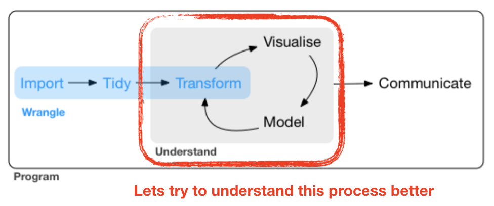

## Check: outlier / influential observations

### Leverage / Cook‘s distance ⇒ step of model validation

- **Leverage**: tool that identifies observations that have rather extreme values for the explanatory variables and may potentially bias the regression results
- **Cook's distance statistic**: measure for influential points → identifies single observations that are influential on all regression parameters: it calculates a test statistic D that measures the change in all regression parameters when omitting an observation.
  - D > 0.5 considered as too influential
  - D > 1: very critical
- It is easier to justify **omitting influential points** if they have both, *large Cook* and *large leverage values*.

---
### Leverage / Cook‘s distance ⇒ step of model validation

<div class="img-with-text" style="position: absolute; left: 200px; top: 150px; z-index:100">
    
 <p><span class="source-img" style = "float:right">Adapted from: 
    <a href='http://highstat.com/index.php/analysing-ecological-data' title=''>Zuur et al. (2007)</a></span></p>
</div>

<kbd>p</kbd>

*** =pnotes
Applying a regression analysis with and without point B gives similar results, showing that B might have a high leverage, but it is not influential on the regression parameters.


--- --- &twocol
## Standard graphical output for model validation
### Lets use the salinity ~ depth example from lecture 12:

<small>(taken from the ICES hydro dataset, station 0076, 2015-02-01)</small>


*** =left
```{r, eval = FALSE}
par(mfrow = c(2,2))
plot(mod) 
```

<div class="boxgreen1">
  <h3><em>par()</em> sets plotting parameters.</h3>
  <p> The <em>mfrow</em> argument creates a multi-paneled plot; first argument in the vector specifies the number of rows and the second the number of columns of plots.</p>
</div>


--- &mytwocol2
## Standard graphical output for model validation
### Lets use the salinity ~ depth example:

```{r, echo = FALSE}
# Just to make sure the mod object is really from the salinity data
mod <- lm(sal ~ pres, data = sal_profile)
```

*** =left
```{r, eval = FALSE}
par(mfrow = c(2,2))
plot(mod) 
```

*** =right
```{r, out.width = "550px", echo = FALSE, fig.align = 'center'}
knitr::include_graphics("img/Interpret_diag_plots.png")
```


--- &mytwocol2
## Standard graphical output for model validation

### Lets use the salinity ~ depth example:

*** =left
```{r, eval = FALSE}
par(mfrow = c(2,2))
plot(mod) 
```


<p style="position: absolute; left: 380px; top: 150px; font-size: 15px; background-color:#98F5FF;">$\epsilon$ seems slightly correlated with Y</p>

<p style="position: absolute; left: 900px; top: 225px; background-color:#98F5FF; font-size: 15px;">$\epsilon$ ~ N</p>

<p style="position: absolute; left: 600px; top: 400px; font-size: 15px; background-color:#98F5FF;">No outlier or too influential data point</p>

    
*** =right
```{r, echo = FALSE, fig.align="left"}
par(mfrow = c(2,2))
plot(mod) 
```

---
## Ordinary vs. standardized residuals 

- Ordinary residuals: observed – fitted value
- Standardized residuals = the residual divided by its standard deviation:
  $$e_{stand.} = \frac{e_{i}}{\sqrt{MS_{Residual}*(1-h_{i})}}$$  
  - where $e_{i}$ = observed - fitted value; $h_{i}$ = leverage for observation *i*; $MS_{Residual}$ represents the residual variance → more on this later
- Standardised residuals are assumed to be normally distributed with expectation 0 and variance 1; N(0,1).
- Consequently, **large residual values (>2)** indicate a **poor fit** of the regression model.

---
## Compute residuals in R

You can compute both types of residuals using

- `residuals(model)` (works too: `resid()`) from the *stats* package → returns a vector with the **ordinary** residuals
- `rstandard(model)` from the *stats* package → returns a vector with the **standardized** residuals

- `add_residuals(data, model, var = "resid")` from the *modelr* package (in tidyverse) →  adds the variable 'resid' containing the **ordinary** residuals to your data frame; useful when piping operations!

---
## Additional graphics for model validation

```{r, eval = FALSE, echo = FALSE}
# For keynote I exported the plot in the GUI as png (width 600, height 500) 
# ACF Plot: above example for negative TAC
set.seed(4)
y<-vector(length = 20)
y[1] <- 0
for (i in 2:20) {
  y[i] <- y[i-1]*-0.9 + rnorm(1,0,0.2)
}
df <- data.frame(time = 1:20, y = y)
mod <- lm(y ~ time, data = df)
summary(mod)
acf(resid(mod))

# Modelfit and residual-X pattern
set.seed(1)
x <- sample(seq(10,20, 0.01), 500, replace = TRUE)
y <- 10 + 0.5*x + rnorm(length(x), 0, 3)
df <- data.frame(x = x, y = y)
set.seed(123)
df <- df[sample(1:500,50), ]
mod <- lm(y ~ x, df)
summary(mod)

df %>% modelr::add_predictions(mod) %>%
ggplot(aes(x = pred, y = y)) + geom_point() +
  geom_abline()

df %>% modelr::add_residuals(mod) %>%
ggplot(aes(x = x, y = resid)) + geom_point() +
  geom_hline(yintercept = 0, color = "red")
```

```{r, out.width = "1100px", echo = FALSE, fig.align = 'center'}
knitr::include_graphics("img/Add_diagnostic_plots.png")
```


--- &slide_no_footer .segue bg:#EEC900

# Your turn...

--- &exercise

# Quiz: Identify violated assumptions or outliers

Load the 4 datasets into your workspace: assumptions1.txt, assumptions2.txt, assumptions3.txt,  assumptions4.txt

```{r, eval = FALSE}
df <- read_delim("data/assumptions1.txt")
str(df)
```

Regress each **y** variables against **x** in the same dataset using the `lm` function and inspect the 4 diagnostic plots per model.
```{r, eval = FALSE}
par(mfrow = c(2,2))
plot(your_lin_model)
```

Each of the 4 models will have outliers or assumptions that are not met. Find these and try to find a solution! How do the summary outputs change?


--- &slide_no_footer .segue bg:#1874CD

# Coming back to the EDA cycle ...
 


--- &vcenter

<div class="img-with-text" style="position: absolute; left: 50px; top: 100px; z-index:100">
    
 <p><span class="source-img" style = "float:right">source flowchart:
    <a href='http://r4ds.had.co.nz/wrangle-intro.html' title=''>R for Data Science</a> by Wickam & Grolemund, 2017 (licensed under <a href='https://creativecommons.org/licenses/by-nc-nd/3.0/us/' title=''>CC-BY-NC-ND 3.0 US</a>)</span></p>
</div>


```{r, eval = FALSE, echo = FALSE}
# Just for creating plots for keynote
cpue <- read_csv("data/DATRAS_data/CPUE per age per area_2017-11-20 06_48_16.csv")
cpue$Area <- factor(cpue$Area, 
  levels = c(21,22,23,24,25,26,27,28,29,30,31,32))
cpue_sub <- cpue %>% filter(Year == 2015) %>%
  select(Area, Quarter, Species, contains("Age"))

cpue_subl <- cpue_sub %>% gather(key = "Age", value = "Cpue", Age_0:Age_10)
cpue_subl$age <- fct_relevel(cpue_subl$Age, "Age_10", after = 10)

cpue_stats <- cpue_subl %>%
  filter(Species == "Gadus morhua", Quarter == 1) %>%
  group_by(Area) %>%
  summarise(
  Total_cpue = sum(Cpue),
  Mean_cpue = mean(Cpue),
  Se_cpue = sd(Cpue) / sqrt(n()) # n() has to be empty
  )

cpue_stats %>% 
  ggplot(aes(x = Area, y = Mean_cpue, fill = Area)) + # only y replaced
  geom_col() +
  guides(fill = "none") +
  geom_errorbar(aes(  # standard error will be added here
  ymin = Mean_cpue - Se_cpue, 
  ymax = Mean_cpue + Se_cpue),
  width = .2) 

## next round: make X continuous

sd_coord <- tibble(
  Area = factor(c(21,22,23,24,25,26,27,28,29,30,31,32)),
  Lat = c(57,55,55.75,55,55.5,55.5,58,57.5,59.5,62,64.75,60),
  Long = c(11.5,11,12.5,13.5,16,19.5,18,20,21,19.5,22.5,26)
  )

# Merge with data

cpue_coord <- cpue_subl %>% 
  left_join(sd_coord) %>% # we could specify by = "Area"
  filter(Species == "Gadus morhua", Quarter == 1) 

p_lat <- cpue_coord %>% 
  ggplot(aes(x = Lat, y = Cpue)) +
  geom_point(aes(colour = Age)) +
  geom_smooth() +
  scale_colour_brewer(palette = "Paired") + 
  guides(colour = "none")

p_long <- cpue_coord %>% 
  ggplot(aes(x = Long, y = Cpue)) +
  geom_point(aes(colour = Age)) +
  geom_smooth() +
  scale_colour_brewer(palette = "Paired") + 
  guides(colour = "none")

gridExtra::grid.arrange(grobs = list(p_lat, p_long), ncol = 2)

```

--- &slide_no_footer .segue bg:url(img/EDA_CPUE_loop_1.png);background-size:cover

--- &slide_no_footer .segue bg:url(img/EDA_CPUE_loop_2.png);background-size:cover

--- &slide_no_footer .segue bg:url(img/EDA_CPUE_loop_3.png);background-size:cover

--- &slide_no_footer .segue bg:url(img/EDA_CPUE_loop_4.png);background-size:cover

--- &slide_no_footer .segue bg:url(img/EDA_CPUE_loop_5.png);background-size:cover

--- &slide_no_footer .segue bg:url(img/EDA_CPUE_loop_6.png);background-size:cover

--- &slide_no_footer .segue bg:url(img/EDA_CPUE_loop_7.png);background-size:cover

--- &slide_no_footer .segue bg:url(img/EDA_CPUE_loop_8.png);background-size:cover

--- &slide_no_footer .segue bg:url(img/EDA_CPUE_loop_9.png);background-size:cover

--- &slide_no_footer .segue bg:url(img/EDA_CPUE_loop_10.png);background-size:cover

--- &slide_no_footer .segue bg:url(img/EDA_CPUE_loop_11.png);background-size:cover

--- &slide_no_footer .segue bg:url(img/EDA_CPUE_loop_12.png);background-size:cover

--- &slide_no_footer .segue bg:url(img/EDA_CPUE_loop_13.png);background-size:cover

--- &slide_no_footer .segue bg:url(img/EDA_CPUE_loop_14.png);background-size:cover

--- &slide_no_footer .segue bg:#EEC900

# Your turn...


--- &exercise
# Try it out yourself:

**Can you find a latitudinal or longitudinal gradient in cod CPUE during the first quarter in 2015?**

In this exercise, you can apply yourself what has been outlined in the EDA cycle: Follow up on the exercise from lecture 10, in which we tried to identify visually whether the CPUE differs between areas. Now you will explore visually but also statistically, whether the observed differences follow a specific pattern: Does the CPUE increase or decrease with latitude or longitude?

--- &exercise
# Apply the following steps. If you need some guidance, look at the next slides.

1. Load the dataset "data/cod_2015_q1.R", which contains the data frame `cod15`
2. Add coordinates of the area to the dataset → for more info press 'p'
3. Visualize the relationship between CPUE and Lat/Long
4. Apply linear models and inspect the model diagnostic plots
5. Create histograms of each model residuals
6. Highlight the age group in your scatterplot from step 3 (e.g. colour points by age) → which age group deviates greatest?

<kbd>p</kbd>

*** =pnotes
**For step 2**:   
To get the latitude and longitude for each area

1. search the internet for a map that shows the ICES subdivisions (SD) for the Baltic Sea and estimate the central coordinates for each SD (= area),
2. create a tibble that contains the `Area` variable as well as the respective `Lat` and `Long` values and than 
3. merge this tibble into the `cod15` tibble using a `join` function from the dplyr package

--- 
## 1. Data loading

Load the following dataset, which is a subset of the full CPUE dataset ("CPUE per age per area_2017-11-20 06_48_16.csv") we used already in lecture 10:
```{r, echo = FALSE}
rm(list = ls())
```

```{r}
load("data/cod_2015_q1.R")
ls()
```

<kbd>p</kbd>

*** =pnotes
If you want to know how this dataset was subsetted from the full CPUE dataset:
```
cpue <- read_csv(
  "data/CPUE per age per area_2017-11-2006_48_16.csv")
cod15 <- cpue %>% 
  mutate(Area = factor(Area, levels = c(21,22,
    23,24,25,26,27,28,29,30,31,32))) %>%
  filter(Year == 2015, Quarter == 1, 
    Species == "Gadus morhua") %>%
  select(Area, contains("Age")) %>%
  gather(key = "Age", value = "CPUE", Age_0:Age_10) %>%
  mutate(Age = factor(Age, levels = paste0("Age_", 0:10),
    labels = as.character(0:10))) 
```    

---
## 2. Adding coordinates

To get the latitude and longitude for each area

1. search the internet for a map that shows the ICES subdivisions (SD) for the Baltic Sea and estimate the central coordinates for each SD (= area),
2. create a tibble that contains the `Area` variable as well as the respective `Lat` and `Long` values and than 
3. merge this tibble into the `cod15` tibble using a `join` function from the dplyr package


---
## 2. Adding coordinates (cont)

Here are some rough approximations of the central coordinates of each area:
```{r}
sd_coord <- tibble(
  Area = factor(c(21,22,23,24,25,26,27,28,29,30,31,32)),
  Lat = c(57,55,55.75,55,55.5,55.5,58,57.5,59.5,62,64.75,60),
  Long = c(11.5,11,12.5,13.5,16,19.5,18,20,21,19.5,22.5,26)
  )
```

--- &twocol
## 2. Adding coordinates (cont)

The merging can be done using the `left_join()` function from `dpylr`:   

*** =left
```{r}
cod15 <- left_join(cod15, sd_coord, 
  by = "Area") %>% print(n = 5)
```

*** =right
<div class="boxorange1">
  <h3>left_join()</code></h3>
  <p>This function returns all rows from the left table (1st table listed in the function), and all columns from both tables. Alternative functions: <code>right_join(), inner_join(), full_join()</code></p>
</div>
    


--- &twocol
## 3. Visualize the relationship between CPUE and Lat/Long

*** =left
```{r, eval = FALSE}
p_lat <- cod15 %>% 
  ggplot(aes(x = Lat, y = CPUE)) +
  geom_point() +
  geom_smooth(method="lm", se=F)

p_long <- cod15 %>% 
  ggplot(aes(x = Long, y = CPUE)) +
  geom_point() +
  geom_smooth(method="lm", se=F)

grid.arrange(p_lat, p_long, nrow = 2)
```
 
*** =right
```{r, echo=FALSE, fig.align="central", fig.height=8, fig.width=5}
p_lat <- cod15 %>% 
  ggplot(aes(x = Lat, y = CPUE)) +
  geom_point() +
  geom_smooth(method="lm", se=F)

p_long <- cod15 %>% 
  ggplot(aes(x = Long, y = CPUE)) +
  geom_point() +
  geom_smooth(method="lm", se=F)

grid.arrange(p_lat, p_long, nrow = 2) 
```

--- &mytwocol2
## 4. Apply the linear statistical models and inspect the model diagnostic plots

```{r}
m_lat <- lm(formula = CPUE ~ Lat, data = cod15)
m_long <- lm(formula = CPUE ~ Long, data = cod15)
```

*** =left
```{r, eval=FALSE}
par(mfrow = c(2,4))
plot(m_lat)
plot(m_long)
```

--- &mytwocol2
## 4. Apply the linear statistical models and inspect the model diagnostic plots

```{r}
m_lat <- lm(formula = CPUE ~ Lat, data = cod15)
m_long <- lm(formula = CPUE ~ Long, data = cod15)
```

*** =left
```{r, eval=FALSE}
par(mfrow = c(2,4))
plot(m_lat)
plot(m_long)
```
What do you think about the residual distributions? Any outlier?

*** =right
```{r, echo=FALSE, fig.width = 8, fig.height=6}
par(mfrow = c(2,4))
plot(m_lat)
plot(m_long)
```

--- &mytwocol2
## 4. Apply the linear statistical models and inspect the model diagnostic plots

```{r}
m_lat <- lm(formula = CPUE ~ Lat, data = cod15)
m_long <- lm(formula = CPUE ~ Long, data = cod15)
```

*** =left
```{r, eval=FALSE}
par(mfrow = c(2,4))
plot(m_lat)
plot(m_long)
```
What do you think about the residual distributions? Any outlier?
<div class="alert alert-orange">No outlier, but strong violation of normality and homogeneity assumptions</div>

*** =right
```{r, echo=FALSE, fig.width = 8, fig.height=6}
par(mfrow = c(2,4))
plot(m_lat)
plot(m_long)
```

--- &twocol
## 5. Create histograms of the model residuals 

Compute the residuals and generate histograms for both models

```{r}
cod15 <- cod15 %>% 
  add_residuals(model = m_lat, var = "Res_lat") %>% 
  add_residuals(model = m_long, var = "Res_long")
```

*** =left
```{r, eval = FALSE}
p_lat <- cod15 %>% 
  ggplot(aes(x = Res_lat)) +
  geom_histogram(binwidth = 5) +
  geom_vline(xintercept = 0, 
    colour = "blue", size = 0.5)
p_long <- cod15 %>% 
  ggplot(aes(x = Res_lat)) +
  geom_histogram(binwidth = 5) +
  geom_vline(xintercept = 0, 
    colour = "blue", size = 0.5)
grid.arrange(p_lat, p_long, nrow = 2)
```

*** =right
```{r, echo = FALSE, fig.width=5, fig.height=4}
p_lat <- cod15 %>% 
  ggplot(aes(x = Res_lat)) +
  geom_histogram(binwidth = 5) +
  geom_vline(xintercept = 0, 
    colour = "blue", size = 0.5)
p_long <- cod15 %>% 
  ggplot(aes(x = Res_long)) +
  geom_histogram(binwidth = 5) +
  geom_vline(xintercept = 0, 
    colour = "blue", size = 0.5)
grid.arrange(p_lat, p_long, nrow = 2)
```
<div class="alert alert-orange" style="position: absolute; left: 550px; top: 600px">Both residual distributions are highly right-skewed, meaning there are many values that slightly deviate from 0 and a few that deviate greatly!</div>


--- bg:#EEC900
<q> One should stop here, in fact, as the model assumptions are violated, and do something such as transforming the data or excluding age groups. This will be discussed in the next lecture.</q>

--- &twocol
## 6. Which age group deviates greatest from the prediction?

Lets visualize again the relationship between CPUE and Lat/Long but this time colour the data points by the age groups and plot the predictions manually.

*** =left
```{r, eval = FALSE}
p_lat <- cod15 %>% 
  add_predictions(m_lat, "Pred") %>%
  ggplot(aes(x = Lat)) +
  geom_point(aes(y = CPUE, colour = Age)) +
  geom_line(aes(y = Pred)) 

p_long <- cod15 %>% 
  add_predictions(m_long, "Pred") %>%
  ggplot(aes(x = Long)) +
  geom_point(aes(y = CPUE, colour = Age)) +
  geom_line(aes(y = Pred)) +
  guides(colour = "none")

grid.arrange(p_lat, p_long, nrow = 2)
```
 
*** =right
```{r, echo=FALSE, fig.align="central", fig.height=6.5, fig.width=6}
p_lat <- cod15 %>% 
  add_predictions(m_lat, "Pred") %>%
  ggplot(aes(x = Lat)) +
  geom_point(aes(y = CPUE, colour = Age)) +
  geom_line(aes(y = Pred)) 

p_long <- cod15 %>% 
  add_predictions(m_long, "Pred") %>%
  ggplot(aes(x = Long)) +
  geom_point(aes(y = CPUE, colour = Age)) +
  geom_line(aes(y = Pred)) +
  guides(colour = "none")

grid.arrange(p_lat, p_long, nrow = 2)
```


--- &slide_no_footer .segue bg:#E5E5E5

## Overview of functions you learned today

`par()` for setting global graphical parameters 

linear regression model: `plot(model)`, `residuals()`, `resid()`, `rstandard(model)`, `modelr::add_residuals(data)`

joining tables: `dplyr::left_join()`

--- &slide_no_footer .segue bg:#CD2626

# How do you feel now.....?

--- 

## Totally confused?
                
```{r, out.width = "200px", echo = FALSE, fig.align = 'center'}
knitr::include_graphics("img/Comic_confused.png")
```

Try out the exercises and read up on linear regressions in
- [chapter 23] (http://r4ds.had.co.nz/model-basics.html) on model basics in 'R for Data Science'
- chapter 10 (linear regressions) in "The R book" (Crawley, 2013, 2nd edition) (an online pdf version is freely available [here](https://www.cs.upc.edu/~robert/teaching/estadistica/TheRBook.pdf))
- or any other textbook on linear regressions


--- &vcenter

## Totally bored?
                
```{r, out.width = "800px", echo = FALSE, fig.align = 'left'}
knitr::include_graphics("img/Comic_bored.png")
```

Think of solutions for the CPUE ~ Lat/Long model and compare the model results.

---

## Totally content?
Then go grab a coffee, lean back and enjoy the rest of the day...!

```{r, out.width = "600px", echo = FALSE, fig.align = 'center'}
knitr::include_graphics("img/Comic_hammock.png")
```


--- &thankyou
