## Model building in 6 steps


---


---
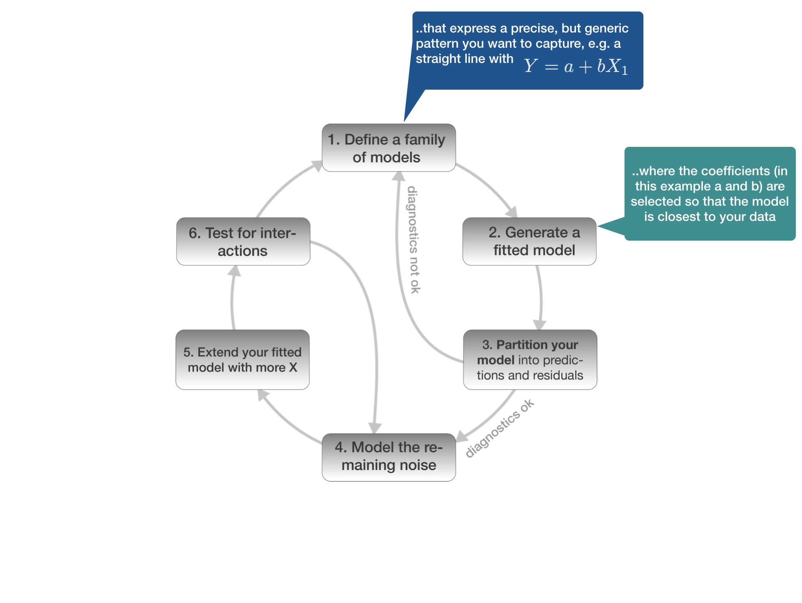

---


---


---


---
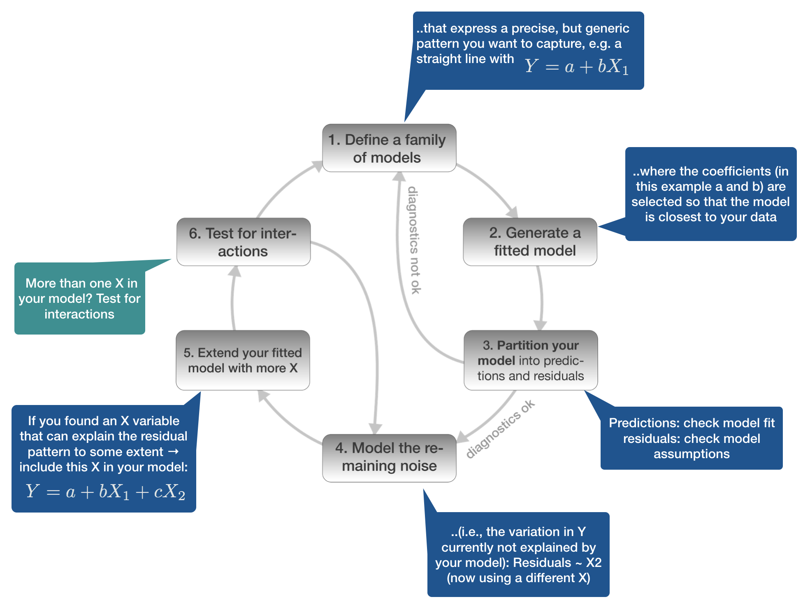

---


---


<div class="alert alert-orange" style="position: absolute; left: 25px; top: 10px">
  <small>NOTE: You can do step 1-6 also with different model families, compare them and select the one that fits best.</small>
</div>


--- &slide_no_footer .segue bg:#6495ED

# 1. Defining the model family 
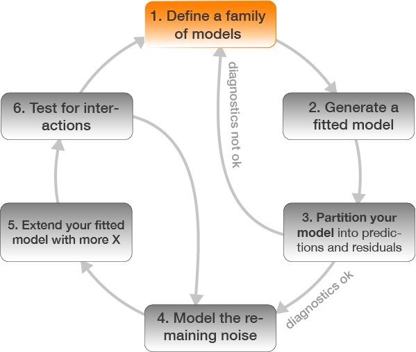 

--- 
## Aim
### You want to find the function that best explains Y 

$$Y_{i} =  f(\mathbf{X_{i}}) + \epsilon_{i}$$

<div class="alert alert-green" style="position: absolute; left: 330px; top: 250x">
  <h4>Note:</h4> <small style="font-size:20px;">X can be also a vector of several explanatory variables.</small>
</div>

---
## The function for a straight line is $Y = a + bX$

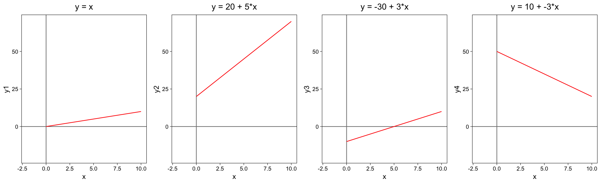

Where *y* is the dependent variable, *a* is the intercept, which is the value at which the line crosses the y-axis (when x is zero), *b* is the coefficent for the slope, and *x* is the independent variable.

---
## Quadratic relationships $Y=a+bX+cX^{2}$

When the effect of an explanatory variable X changes with increasing or decreasing values of X a model with polynomial terms might be a better option.

The quadratic dependence has three parameters and so can produce a variety of parabolas.

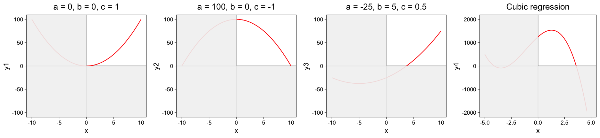

<small> <strong>a</strong> controls how quickly the parabola increases with X. If it is positive the parabola goes up and is trough-shaped, a negative value of a inverts the parabola. The parameter <strong>c</strong> controls the height of the parabola and the value of <strong>b</strong> controls the sideways displacement of the parabola. </small>


--- &vcenter
## Taylor’s theorem

<div class="img-with-text" style="position: absolute; left: 950px; top: 25px; z-index:100">
    
 <p><span class="source-img" style = "float:right">
    <a href='https://en.wikipedia.org/wiki/Brook_Taylor' title=''>Brook Taylor</a></span></p>
</div>

- [Taylor’s theorem](https://en.wikipedia.org/wiki/Taylor%27s_theorem) says that you can approximate any smooth function with an infinite sum of polynomials. 

- You can use a polynomial function to get arbitrarily close to a smooth function by fitting an equation like $Y = a + bX + cX^{2} + dX^{3} +eX^{4}$

- R provides helper functions that produce orthogonal (i.e. uncorrelated) polynomials
  - `poly(X, degree = 4)` → problem: outside the data range of the data predictions shoot off to +/- Inf
  - alternative: use the natural spline with `splines::ns(X, df = 4)`
  
  
<p><span class="source-img" style="position: absolute; left: 700px; top: 650px">source image:
    <a href='https://en.wikipedia.org/wiki/Brook_Taylor#/media/File:BTaylor.jpg' title=''>Wikipedia</a> (under CCO licence)</span></p>  


---
## Exponential growth or decay 

Curves following exponential growth or decay occur in many areas of biology. A general exponential growth is represented by $Y =a * e^{bX}$, a decay by $Y = a * e^{-bX}$.


---
## Exponential growth or decay 

Curves following exponential growth or decay occur in many areas of biology. A general exponential growth is represented by $Y =a * e^{bX}$, a decay by $Y = a * e^{-bX}$.


<div class="alert alert-green" style="position: absolute; left: 25; top: 585px">
  <small style="font-size:10px">Since the natural log is the inverse function of an exponential function, ln(exp(x)) = x, an exponential curve can be changed into a linear relationship by taking the natural log of both sides of the equation.</small>
</div>

---
## Linearizating relationships through transformations

<div class="img-with-text" style="position: absolute; left: 100px; top: 120px; z-index:100">
    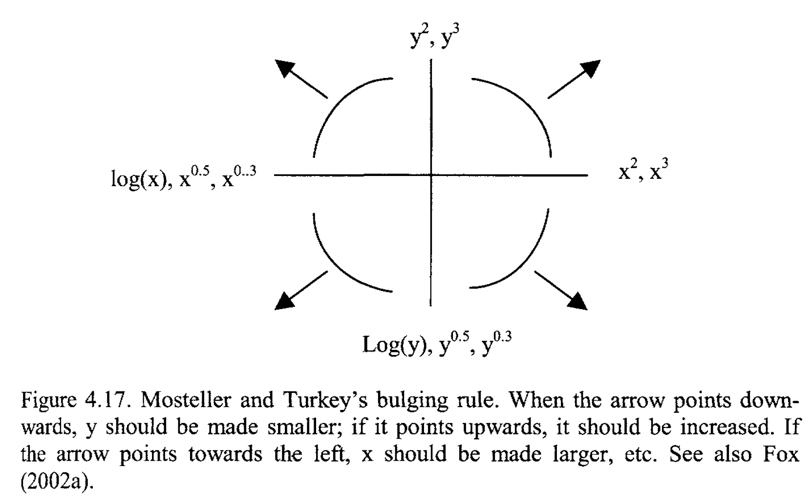
 <p><span class="source-img" style = "float:right">
    source: <a href='http://highstat.com/index.php/analysing-ecological-data' title=''>Zuur et al., 2007 (Chapter 4)</a></span></p>
</div>


--- &twocol
## Example: Weight ~ Length relationship

A typical example for a linear relationship, which cannot be described by linear graph, is in marine biology the weight-length relationships. For most species, it will follow a 2 parameter power function: $W = aL^{b}$


*** =left
<small>Lengths and weights for Chinook Salmon from three locations in Argentina (data is provided in the [FSA](https://cran.r-project.org/web/packages/FSA/index.html) package).</small>

*** =right
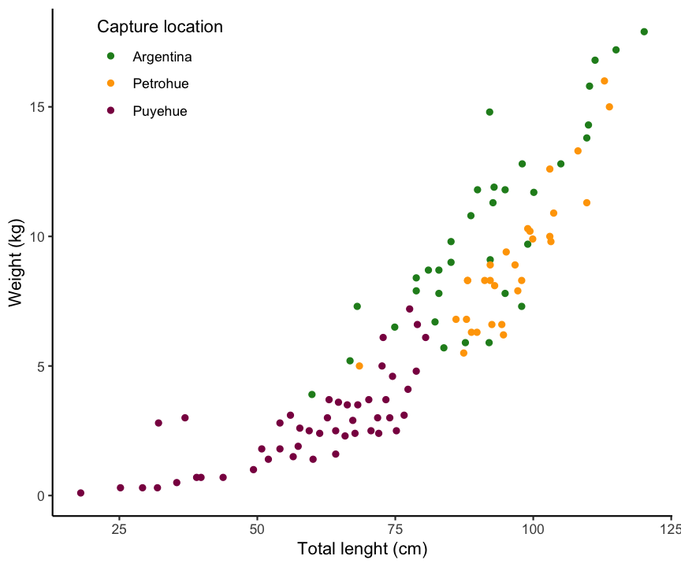

---
### Applying the bulging rule

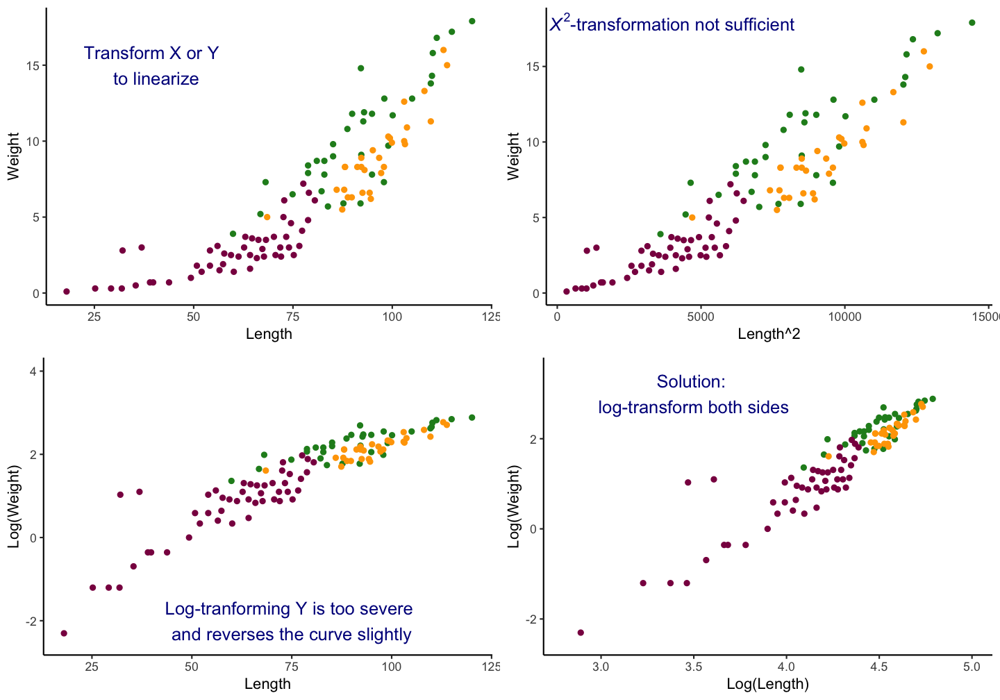

---
## General rule for common transformations

- **Square root** transformation: `sqrt()`
  - Count data.
  - Variance is about equal to the mean.
- **Log** transformation: `log()`
  - Variances are not similar or larger than the mean.
  - If the variables contains zeros add a constant (should be a proportionally small value) to each of the observations: `log(X+1)` or `log1p()`
  - to back calculate: `exp(X_log)` or `expm1(X_log)` if 1 was added
- **Arcsine** transformation: `asin()`
  - Percentages and proportions

--- &slide_no_footer .segue bg:#6495ED

# 2. Generate a fitted model
 

---
## Once you defined the model family

- you can estimate the coefficients (in an iterative process) yourself
- or you select the appropriate R function and the coefficents are automatically estimated.
- The choice of function depends on the model family but also the **data type** and **distribution of Y**:

---
## An overview of common linear models


<!-- |Data Type Y | Data Type X | Distribution Y | R Function | Statistical Model -->
<!-- |:----------:|:-----------:|:--------------:|:----------:|:---------------:| -->
<!-- | continuous | continuous | Gaussian | `lm()` | normal linear regression | -->
<!-- | continuous | categorical | Gaussian | `aov()` or `lm()` | Analysis of Variance (ANOVA)| -->
<!-- | continuous | both | Gaussian | `lm()` | Analysis of Covariance (ANCOVA) | -->
<!-- | count | both | Poisson, negative bionomial | `glm()` | log-linear models (Poisson / NB regression) | -->
<!-- | proportion | both | binomial | `glm()` | binomial logistic regression | -->
<!-- | binary | both | Bernoulli | `glm()` | logistic regression | -->
<!-- | categorical (> 2 classes) | both | multinomial | `glm()` | multinomial logistic regression (seldom)| -->
<!-- | categorical (> 2 classes) | both | Gaussian | `MASS::lda()` | linear discriminant analysis| -->

  

---
## Defining the model family in the R formula
### Focus on simple normal linear regression models

1. Straight line: `lm(formula = Y ~ X, data)`
2. Relationship with polynomials: 
  - Quadratic: `lm(Y ~ poly(X,2), data)` or `~ splines::ns(X, 2)` 
  - Cubic: `lm(Y ~ poly(X,3), data)` or `~ splines::ns(X, 3)` 
4. Linearize the relationship:
  - `lm(formula = log(Y) ~ X, data)`
  - `lm(formula = Y ~ log(X), data)`
  - `lm(formula = log(Y) ~ log(X), data)`

---
## Formulas
You can see how R defines the model by using `model_matrix()` from the *modelr* package


```r
df <- data.frame(y = c(10,20, 30), x1 = c(5,10,15))
model_matrix(df, y ~ x1)
```

```no-highlight
## # A tibble: 3 x 2
##   `(Intercept)`    x1
##           <dbl> <dbl>
## 1             1     5
## 2             1    10
## 3             1    15
```

---
## Formulas (cont)

Now with polynomials

```r
model_matrix(df, y ~ poly(x1, 2))
```

```no-highlight
## # A tibble: 3 x 3
##   `(Intercept)` `poly(x1, 2)1` `poly(x1, 2)2`
##           <dbl>          <dbl>          <dbl>
## 1             1      -7.07e- 1          0.408
## 2             1      -9.42e-17         -0.816
## 3             1       7.07e- 1          0.408
```

---
## Categorical X variables

If *X* is categorical it doesn't make much sense to model $Y = a + bX$ as $X$ cannot be multiplied with $b$. But R has a workaround:
- categorical predictors are **converted into multiple continuous predictors**
- these are so-called **dummy variables**
- each dummy variable is coded as **0 (FALSE)** or **1 (TRUE)**
- the no. of dummy variables = no. of groups **minus 1**
- all linear models fit categorical predictors using dummy variables

--- &twocol


*** =left
The data

```r
df
```

```no-highlight
##       y length
## 1   5.3      S
## 2   7.4      S
## 3  11.3      L
## 4  17.9      M
## 5   3.9      L
## 6  17.6      M
## 7  18.4      L
## 8  12.8      L
## 9  12.1      M
## 10  1.1      L
```

*** =right
The dummy variables

```r
model_matrix(df, y ~ length)
```

```no-highlight
## # A tibble: 10 x 3
##    `(Intercept)` lengthM lengthS
##            <dbl>   <dbl>   <dbl>
##  1             1       0       1
##  2             1       0       1
##  3             1       0       0
##  4             1       1       0
##  5             1       0       0
##  6             1       1       0
##  7             1       0       0
##  8             1       0       0
##  9             1       1       0
## 10             1       0       0
```

<span style="font-size:25px; font-weight:bold; color:#ff0039">Where did the length class <strong>L</strong> go? </span> 

--- &twocol

*** =left
The data

```r
df
```

```no-highlight
##       y length
## 1   5.3      S
## 2   7.4      S
## 3  11.3      L
## 4  17.9      M
## 5   3.9      L
## 6  17.6      M
## 7  18.4      L
## 8  12.8      L
## 9  12.1      M
## 10  1.1      L
```

*** =right
The dummy variables

```r
model_matrix(df, y ~ length)
```

```no-highlight
## # A tibble: 10 x 3
##    `(Intercept)` lengthM lengthS
##            <dbl>   <dbl>   <dbl>
##  1             1       0       1
##  2             1       0       1
##  3             1       0       0
##  4             1       1       0
##  5             1       0       0
##  6             1       1       0
##  7             1       0       0
##  8             1       0       0
##  9             1       1       0
## 10             1       0       0
```
<span style="font-size:25px; font-weight:bold; color:#ff0039"><strong>L</strong> is represented by the <strong>intercept</strong> ! </span> 


--- 
## Overview of model formulae in R

<div class="img-with-text" style="position: absolute; left: 200px; top: 100px; z-index:100">
    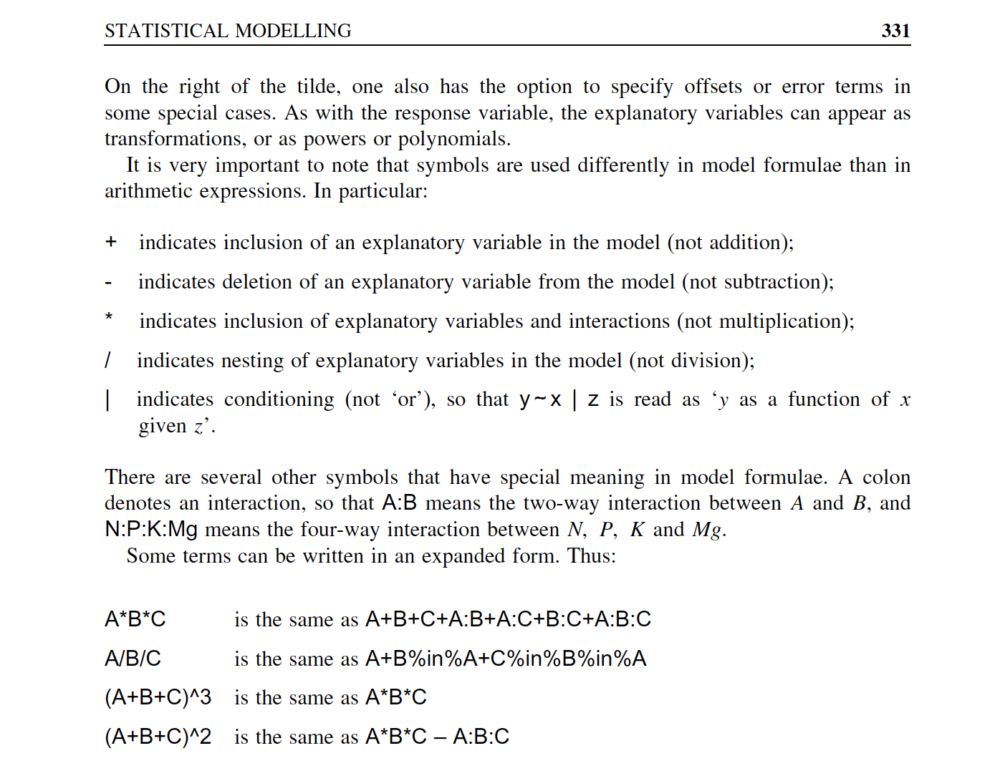
 <p><span class="source-img" style = "float:right">source: 
    <a href='http://onlinelibrary.wiley.com/book/10.1002/9780470515075' title=''>Crawley (2007)</a></span></p>
</div>


--- &slide_no_footer .segue bg:#6495ED

# 3. Partition your model
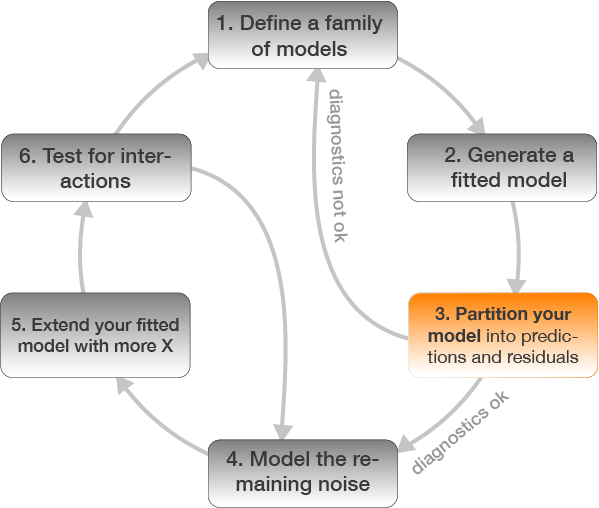 


--- &twocol
### Partition your model into predicted values and residuals


*** =left
Predicted values: Check **modelfit**


*** =right
Residuals: Check **assumptions**
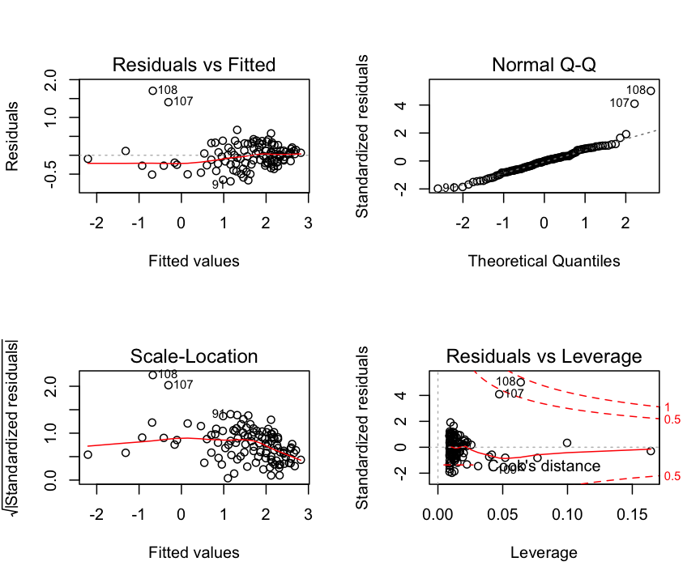


--- &slide_no_footer .segue bg:#6495ED

# 4. Model the remaining noise
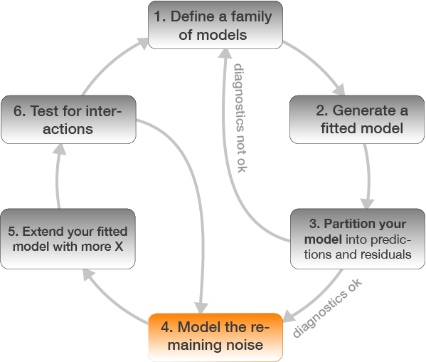 

---
## 2 different ways to understand what the model captures

1. Study the model family and fitted coefficients (common in statistical modelling courses).
2. Understanding a model by looking at its predictions and what it does not capture (the pattern in the residuals, i.e. the deviation of each observation from its predicted value) (getting more popular these days).
 - Particularly studying the residuals helps to identify less pronounced patterns in the data.

--- &twocol
## Residual patterns

*** =left
A typical example where residuals are modelled is in fishery ecology when studying recruitment success:

<div class="img-with-text" style="position: absolute; left: 600px; top: 50px; z-index:100">
    
 <p><span class="source-img" style = "float:right">
    <a href='https://www.researchgate.net/publication/288667847_STATISTICAL_INFERENCES_REGARDING_THE_HIGH_AND_LOW_RECRUITMENT_SCENARIOS_BASED_ON_THE_OUTPUT_FROM_THE_2012_AND_2014_STOCK_ASSESSMENTS_FOR_WESTERN_ATLANTIC_BLUEFIN_TUNA_A_PRELIMINARY_ANALYSIS_USING_THE_' title=''>Bluefin Species Group, 2015, Collect. Vol. Sci. Pap. ICCAT, 71(4): 1863-1869</a></span></p>
</div>


---
## Best practice: 
### Model the residual ~ every X variable not included in the model


Residuals show a distinct pattern: The model seems to underestimate the weight in Argentina and overestimate  in Puyehue.

--- &slide_no_footer .segue bg:#6495ED

# 5. Extend your fitted model with more X
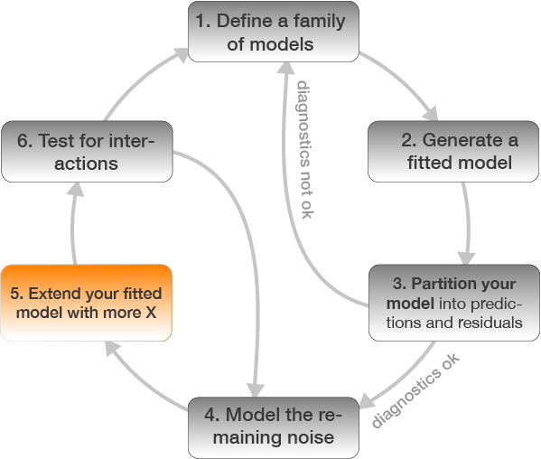 

---
### Chinook Salmon example: add `loc` as X variable to the model


```r
mod2 <- lm(formula = w_log ~ tl_log + loc, data = ChinookArg)
# alternatively
mod2 <- update(mod, .~. + loc)
```

--- &twocol
Check modelfit and diagnostics again

*** =left


*** =right
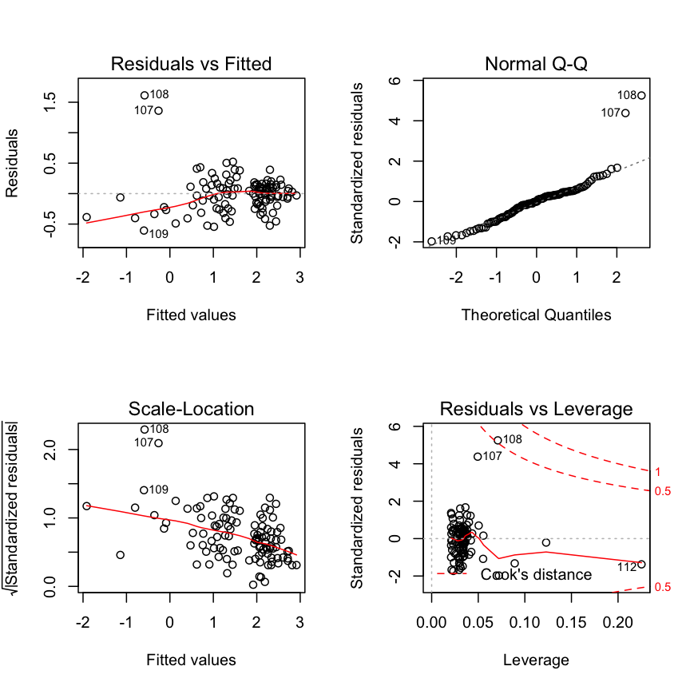

---

```r
summary(mod2)
```

```no-highlight
## 
## Call:
## lm(formula = w_log ~ tl_log + loc, data = ChinookArg)
## 
## Residuals:
##      Min       1Q   Median       3Q      Max 
## -0.60633 -0.19351 -0.00076  0.14352  1.61286 
## 
## Coefficients:
##             Estimate Std. Error t value Pr(>|t|)    
## (Intercept) -8.12169    0.56827 -14.292  < 2e-16 ***
## tl_log       2.30492    0.12563  18.347  < 2e-16 ***
## locPetrohue -0.22813    0.08013  -2.847  0.00528 ** 
## locPuyehue  -0.45699    0.09231  -4.951 2.74e-06 ***
## ---
## Signif. codes:  0 '***' 0.001 '**' 0.01 '*' 0.05 '.' 0.1 ' ' 1
## 
## Residual standard error: 0.3186 on 108 degrees of freedom
## Multiple R-squared:  0.8962,	Adjusted R-squared:  0.8934 
## F-statistic:   311 on 3 and 108 DF,  p-value: < 2.2e-16
```


--- &slide_no_footer .segue bg:#6495ED

# 6. Test for interactions
 

---
### Chinook Salmon example: include `tl_log:loc` interaction


```r
mod3 <- lm(formula = w_log ~ tl_log * loc, data = ChinookArg)
# alternatively
mod3 <- update(mod2, .~. + tl_log:loc)
```

--- &twocol
Check modelfit and diagnostics again

*** =left


*** =right


---

```r
summary(mod3)
```

```no-highlight
## 
## Call:
## lm(formula = w_log ~ tl_log + loc + tl_log:loc, data = ChinookArg)
## 
## Residuals:
##      Min       1Q   Median       3Q      Max 
## -0.58273 -0.18471 -0.00186  0.13088  1.63620 
## 
## Coefficients:
##                    Estimate Std. Error t value Pr(>|t|)    
## (Intercept)         -6.6750     1.5904  -4.197 5.64e-05 ***
## tl_log               1.9836     0.3530   5.619 1.56e-07 ***
## locPetrohue         -2.3957     3.1494  -0.761    0.449    
## locPuyehue          -2.0696     1.6868  -1.227    0.223    
## tl_log:locPetrohue   0.4795     0.6928   0.692    0.490    
## tl_log:locPuyehue    0.3624     0.3793   0.955    0.342    
## ---
## Signif. codes:  0 '***' 0.001 '**' 0.01 '*' 0.05 '.' 0.1 ' ' 1
## 
## Residual standard error: 0.3201 on 106 degrees of freedom
## Multiple R-squared:  0.8972,	Adjusted R-squared:  0.8924 
## F-statistic:   185 on 5 and 106 DF,  p-value: < 2.2e-16
```

--- &slide_no_footer .segue bg:#1874CD

# Interpreting models with categorical X variables
 

---

## Recall: Categorical X variables

If *X* is categorical it doesn't make much sense to model $Y ~ a + bX$ as $X$ cannot be multiplied with $b$. But R has a workaround:
- categorical predictors are **converted into multiple continuous predictors**
- these are so-called **dummy variables**
- each dummy variable is coded as **0 (FALSE)** or **1 (TRUE)**
- the no. of dummy variables = no. of groups **minus 1**
- all linear models fit categorical predictors using dummy variables

--- &twocol
## Only categorical X

*** =left
Differences of Chinook Salmon weight between three locations in Argentina


```r
chin_mod <- lm(w_log ~ loc, ChinookArg)
```

*** =right


--- &slide_no_footer .segue bg:#EEC900

# Your turn...

--- &exercise
# How would you interpret these coefficients?


```r
chin_mod <- lm(w_log ~ loc, ChinookArg)
coef(chin_mod)
```

```no-highlight
## (Intercept) locPetrohue  locPuyehue 
##  2.25605528 -0.09844412 -1.52993775
```

What is the regression equation for each location?


--- &exercise
# How would you interpret these coefficients?
R generates dummy variable to be able to apply regressions on categorical variables. We can see this using the `model.matrix()` function: 


```r
model.matrix(w_log ~ loc, ChinookArg) %>% 
    as.data.frame(.) %>%
  # adding the location variable from the original data
  mutate(sampl_loc = ChinookArg$loc) %>%
  head()
```

```no-highlight
##   (Intercept) locPetrohue locPuyehue sampl_loc
## 1           1           0          0 Argentina
## 2           1           0          0 Argentina
## 3           1           0          0 Argentina
## 4           1           0          0 Argentina
## 5           1           0          0 Argentina
## 6           1           0          0 Argentina
```
<small>We can see that the first 10 fish were sampled at the location 'Argentina' and that these observations were coded 1 for the variable 'intercept' (representing the first factor level → here Argentina) and 0 for the variable  `locPetrohue` and `locPuyehue`.</small>


--- bg:#EEC900
# Apply the estimated coefficients to the regression equation with dummy variables:

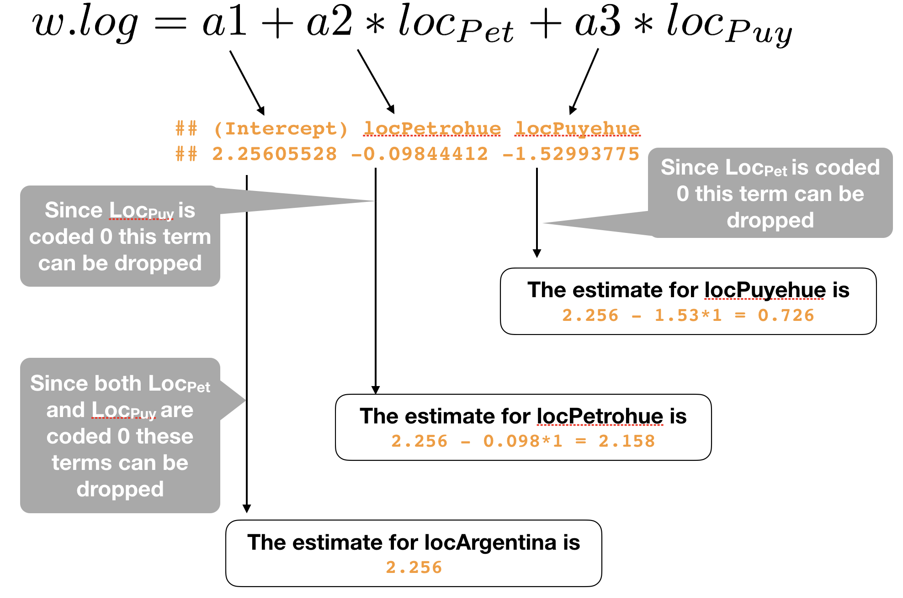

---
## Only categorical X - ANOVA

Linear regression with a categorical variable, is the equivalent
of ANOVA (**ANalysis Of VAriance**). To see the output as an
ANOVA table, use `anova()` on your lm object


```r
anova(chin_mod)
```

```no-highlight
## Analysis of Variance Table
## 
## Response: w_log
##            Df Sum Sq Mean Sq F value    Pr(>F)    
## loc         2 60.542 30.2711  73.097 < 2.2e-16 ***
## Residuals 109 45.140  0.4141                      
## ---
## Signif. codes:  0 '***' 0.001 '**' 0.01 '*' 0.05 '.' 0.1 ' ' 1
```

---
## Only categorical X - ANOVA

Alternatively, use `aov()` instead of `lm()`

```r
chin_aoc <- aov(w_log ~ loc, ChinookArg)
summary(chin_aoc)
```

```no-highlight
##              Df Sum Sq Mean Sq F value Pr(>F)    
## loc           2  60.54  30.271    73.1 <2e-16 ***
## Residuals   109  45.14   0.414                   
## ---
## Signif. codes:  0 '***' 0.001 '**' 0.01 '*' 0.05 '.' 0.1 ' ' 1
```

---
## Categorical and continuous X variables: ANCOVA

- **ANalysis of COVAriance** (ANCOVA) is a hybrid of a linear regression and ANOVA.
- Has at least one continuous and one categorical explanatory variable.
- Some consider ANCOVA as an "ANOVA"" model with a covariate included → focus on the factor levels adjusted for the covariate (e.g. [Quinn & Keough 2002](http://www.cambridge.org/de/academic/subjects/life-sciences/ecology-and-conservation/experimental-design-and-data-analysis-biologists?format=PB&isbn=9780521009768#Pq0cPIFm91XhGxdS.97)).
- Some consider it as a "Regression" model with a categorical predictor →  focus on the covariate adjusted for the factor (e.g. [Crawley 2007](http://onlinelibrary.wiley.com/book/10.1002/9780470515075)).
- The typical "maximal" model involves estimating an intercept and slope (regression part) for each level of the categorical variable(s) (ANOVA part) → i.e., including an interaction

--- &twocol
### Chinook Salmon weight as a function of location AND length  

*** =left
without interaction


*** =right
with interaction
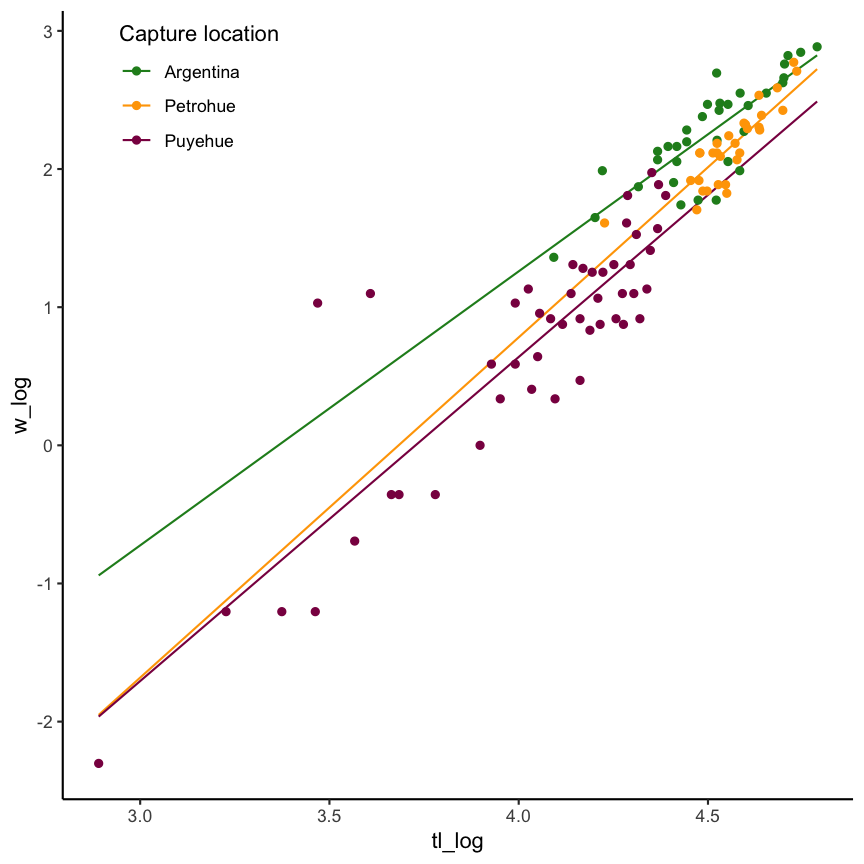

--- &vcenter
## Regression view of an ANCOVA

### $$w.log_{ij} =  \alpha_{i} + \beta_{i}*tl.log_{j} + \epsilon_{ij}$$
where i = location, j = each individual fish

--- &vcenter
## Regression view of an ANCOVA
### Location-specific equations

$$w.log_{Arg,j} =  \alpha_{Arg} + \beta_{Arg}*tl.log_{j} + \epsilon_{Arg,j}$$

$$w.log_{Pet,j} =  \alpha_{Pet} + \beta_{Pet}*tl.log_{j} + \epsilon_{Pet,j}$$

$$w.log_{Puy,j} =  \alpha_{Puy} + \beta_{Puy}*tl.log_{j} + \epsilon_{Puy,j}$$


--- &slide_no_footer .segue bg:#EEC900

# Your turn...

--- &exercise
# ANCOVA Interpretation

Run the following 2 models and formulate for both models the location-specific equations with the estimated coefficients


```r
library(FSA)
ChinookArg <- mutate(ChinookArg, 
  tl_log = log(tl), w_log = log(w))
chin_ancova1 <- lm(w_log ~ loc + tl_log, ChinookArg)
chin_ancova2 <- lm(w_log ~ loc * tl_log, ChinookArg)
```

--- &slide_no_footer .segue bg:#CD2626

# Solution 

--- 
## ANCOVA 1 - no interaction


>$w.log = a1 + a2*locPetrohue + a3*locPuyehue+ b*tl.log$

The estimate for the mean weight at location *Argentina*:  
$w.log_{Arg} = a1 + a2*0 + a3*0 + b*tl.log$ = <strong>-8.12+2.3*tl_log</strong>

The estimate for the mean weight at location *Petrohue*:  
$w.log_{Pet} = a1 + a2*1 + a3*0 + b*tl.log$    
= -8.12+-0.23+2.3*tl_log = <strong>-8.35 + 2.3*tl_log</strong>

The estimate for the mean weight at location *Puyehue*:  
$w.log_{Puy} = a1 + a2*0 + a3*1 + b*tl.log$    
= -8.12+-0.46+2.3*tl_log = <strong>-8.58+2.3 * tl_log</strong>


--- 
## ANCOVA 2 - with interaction


>$\begin{eqnarray} w.log = a1 + a2*locPetrohue + a3*locPuyehue + \\ b1*tl.log+ b2*tl.log + b3*tl.log \end{eqnarray}$

The estimate for the mean weight at location *Argentina*:  
$w.log_{Arg}$ = <strong>-6.67+2.3*tl_log</strong>

The estimate for the mean weight at location *Petrohue*:  
$w.log_{Pet}$ = -6.67+-2.4+1.98*tl_log+0.48*tl_log = <strong>-9.07 + 2.46 * tl_log</strong>

The estimate for the mean weight at location *Puyehue*:  
$w.log_{Puy}$ = = -6.67+-2.07+1.98*tl_log+0.36*tl_log = <strong>-8.74 + 2.34 * tl_log</strong>


--- &slide_no_footer .segue bg:#1874CD

# Model selection


---
## How to compare and choose the best model?

- Based on best goodness-of-fit: How well do the model fit a set of observations.
- How to judge this?
  - visually
  - using a criterion that summarize the discrepancy between observed values and the values expected under the model, e.g.
      - explained variance (**$R_{2}$**)
      - Akaike's Information Criterion (**AIC**) and modifications
      - Bayesian Information Criterion (**BIC**)
- A good book on that subject is written by Anderson & Burnham 2002:[ Model Selection and Multimodel Inference - A Practical Information-Theoretic Approach](http://www.springer.com/de/book/9780387953649)

--- &twocol
## Akaike's Information Criterion 


- The AIC is a **relative measure**, not an absolute as $R^2$: the values can only be compared between models **fitted to the same observations** and **same Y variables**. You can't compare models fitted to different data subsets or if Y is partly transformed!
- The lower the AIC the better.
- Rule of thumb: if difference between 2 models in AIC is **< 2** than choose the more simple model.
- R function: `AIC()`

--- 
## Akaike's Information Criterion 
### Chinook example:


```r
m1 <- lm(w_log ~ loc, ChinookArg)
m2 <- lm(w_log ~ tl_log, ChinookArg)
m3 <- lm(w_log ~ loc + tl_log, ChinookArg)
m4 <- lm(w_log ~ loc * tl_log, ChinookArg)
AIC(m1, m2, m3, m4)
```

```no-highlight
##    df       AIC
## m1  4 224.06339
## m2  3  87.69126
## m3  5  67.57480
## m4  7  70.53732
```
Which model shows the best performance based on the AIC?

---
## Principle of parsimony (Occam‘s Razor):

- As few parameters as possible.
- Models should be minimal adequate.
- Simple explanations should be preferred.
- Linear models should be preferred to non-linear models.

<br>


<kbd>p</kbd>

*** =pnotes
"The principle of parsimony is attributed to the early 14th-century English nominalist philosopher, William of Occam, who insisted that, given a set of equally good explanations for a given phenomenon, the correct explanation is the simplest explanation. It is called Occam’s razor because he ‘shaved’ his explanations down to the bare minimum." (from Crawley, 2007)

--- &slide_no_footer .segue bg:#CDC673

# Beware

--- &slide_no_footer .segue bg:#CDC673

<q>There is a temptation to become personally attached to a particular model. Statisticians call this 'falling in love with a model'.</q>

---
### Always keep in mind:

- All models are wrong, but some are useful.
- Some models are better than others.
- The correct model can never be known with certainty.
- The simpler the model, the better it is.


--- &slide_no_footer .segue bg:#EEC900

# Your turn...

--- &exercise
# Exercise: Find the 'true' model or the underlying function


--- &exercise
# Exercise: Find the 'true' model or the underlying function

I generated different dataframes where the Y variable was modelled as a specific function of X plus some random noise. Load the datasets and see what objects you loaded with `ls()`


```r
load("data/find_model.R")
ls()
```
You should see 10 dataframes. Try to find the 'true' models for df1, df2, df3, df4, and df5 by fitting different model families and compare their performance 
- using the AIC (with function `AIC(model1, model2, model3,..)`) and 
- plotting the predicted values to the observed ones and the residual histograms.

Once you think you found it, apply your models on the dataframes that do not contain the random noise (e.g. df1_nonoise for df1) and compare results.


---

## Overview of functions for modelling and interpretation

| What | Function |
|---------|----------|
| Lin. regression & ANCOVA | `lm()` |
| ANOVA | `aov()` or `anova(lm())`|
| Coefficients | `coef(mod)` |
| Complete numerical output | `summary(mod)` |
| Confidence intervals | `confint(mod)` |
| Prediction |  `predict(mod)`, `modelr::add_predictions(data, mod)` |
| Residuals | `resid(mod)`, `modelr::add_residuals(data, mod)` |
| Diagnostic plots | `plot(mod)`, `acf(resid(mod))` |
| Model comparison | `AIC(mod1, mod2, mod3)` |


--- &slide_no_footer .segue bg:#CD2626

# How do you feel now.....?

--- 
## Totally confused?
                


Practice on the Chinook salmon dataset and read 

- [chapter 23](http://r4ds.had.co.nz/model-basics.html) on model basics and [chapter 24](http://r4ds.had.co.nz/model-building.html) on model building in the "R for Data Science"" book, as well as 
- chapter 9 (statistical modelling) in "The R book" (Crawley, 2013) (an online pdf version is freely available [here](https://www.cs.upc.edu/~robert/teaching/estadistica/TheRBook.pdf)).


--- &vcenter
## Totally bored?
                


Stay tuned for the next case study where you can play around as much as you want to!

---
## Totally content?
Then go grab a coffee, lean back and enjoy the rest of the day...!


--- &thankyou


--- &slide_no_footer .segue bg:#CD2626

# Solution 

--- &twocol

## Example to find the best model: `df1`

1.Apply different models and compare first their AIC. 

*** =left

```r
load("data/find_model.R")
dat <- df1 # this way you can simply 
# replace the dataframes later
dat$y_log <- log(dat$y + 0.001)
dat$x_log <- log(dat$x)

m1 <- lm(y ~ x, data = dat)
m2 <- lm(y ~ poly(x,2), data = dat)
m3 <- lm(y ~ poly(x,3), data = dat)
m4 <- lm(y_log ~ x, data = dat)
m5 <- lm(y_log ~ x_log, data = dat)
```

*** =right

```r
AIC(m1,m2,m3) 
```

```no-highlight
##    df       AIC
## m1  3 185.24425
## m2  4  37.56960
## m3  5  34.61143
```

```r
AIC(m4,m5) 
```

```no-highlight
##    df      AIC
## m4  3 174.5666
## m5  3 139.7156
```


<div class="alert alert-success" style="position: absolute; left: 25px; top: 605px">
  <h4>Note:</h4> <small>The AIC can only be compared between models that are fitted on the same datasets! Hence, models with log-transformed Y values and those without CANNOT be compared using the AIC.</small>
</div>

--- &twocol

## Example to find the best model: `df1`

2.Prediction plots → to compare all models at the same scale, back-transform the log-model predictions

*** =left

```r
dat <- spread_predictions(
    data = dat, m1,m2,m3,m4,m5) %>%
  mutate(m4 = (exp(m4) - 0.001),
    m5 = (exp(m5) - 0.001))

dat_long <- dat %>% 
  select(x, m1,m2,m3,m4,m5) %>%
  gather(key = "model", "pred", -x) %>%
  mutate(model = factor(model, 
    labels = c("m_lm", "m_poly2",
    "m_poly3","m_log_y","m_log_both")))

dat_long %>% ggplot(aes(x,pred)) +
  geom_line(aes(colour = model)) +
  geom_point(data = dat, aes(y = y)) 
```


*** =right


--- &twocol

## Example to find the best model: `df1`

3.Residual plots

*** =left

```r
# Residual plots
r <- dat %>% 
  spread_residuals(m1,m2,m3,m4,m5) %>%
  ggplot()+ geom_vline(xintercept = 0, 
    colour = "blue", size = 0.5)
r1 <- r + ggtitle("m_lm") +
  geom_histogram(aes(x = m1)) + 
r2 <- r + ggtitle("m_poly2") +
  geom_histogram(aes(x = m2))
r3 <- r + ggtitle("m_poly3") +
  geom_histogram(aes(x = m3))
r4 <- r + ggtitle("m_log_y") + 
  geom_histogram(aes(x = m4)) 
r5 <-  r + ggtitle("m_log_all") +
  geom_histogram(aes(x = m5)) 
gridExtra::grid.arrange(grobs = 
list(r1,r2,r3,r4,r5), ncol = 3)
```


*** =right
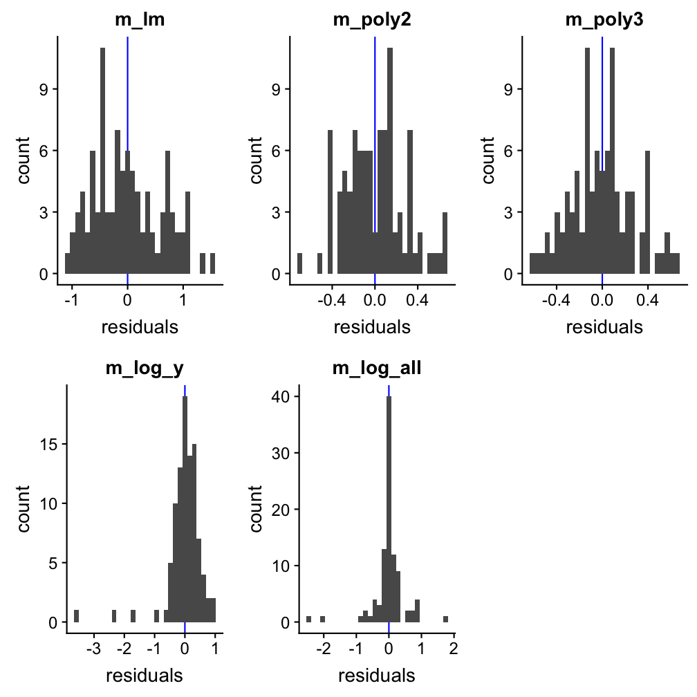

---

## Example to find the best model: `df1`

The AIC indicates best performances for models **m3** (polynomial of order 3) and **m5** (X and X both log-transformed). Also the prediction plots and the residual plots support this. In fact, the prediction plot does not show a big difference between both models. The residual plots, on the other hand, might provide some support for m5 as a high number of y values deviate little from their predictions.

To really find out which model has the true underlying function, used to create this dataset, we need to apply the models on the dataset without noise:

--- &twocol

## Example to find the best model: `df1_nonoise`

1.Apply models to the data without noise 

*** =left

```r
dat <- df1_nonoise
dat$y_log <- log(dat$y + 0.001)
dat$x_log <- log(dat$x)

m1 <- lm(y ~ x, data = dat)
m2 <- lm(y ~ poly(x,2), data = dat)
m3 <- lm(y ~ poly(x,3), data = dat)
m4 <- lm(y_log ~ x, data = dat)
m5 <- lm(y_log ~ x_log, data = dat)
```

*** =right

```r
AIC(m1,m2,m3) 
```

```no-highlight
##    df       AIC
## m1  3  156.3179
## m2  4 -397.3983
## m3  5 -990.3074
```

```r
AIC(m4,m5) 
```

```no-highlight
##    df         AIC
## m4  3    11.89622
## m5  3 -1066.44843
```


--- 

## Example to find the best model: `df1_nonoise`

2.Prediction plots without noise


--- 

## Example to find the best model: `df1_nonoise`

3.Residual plots without noise

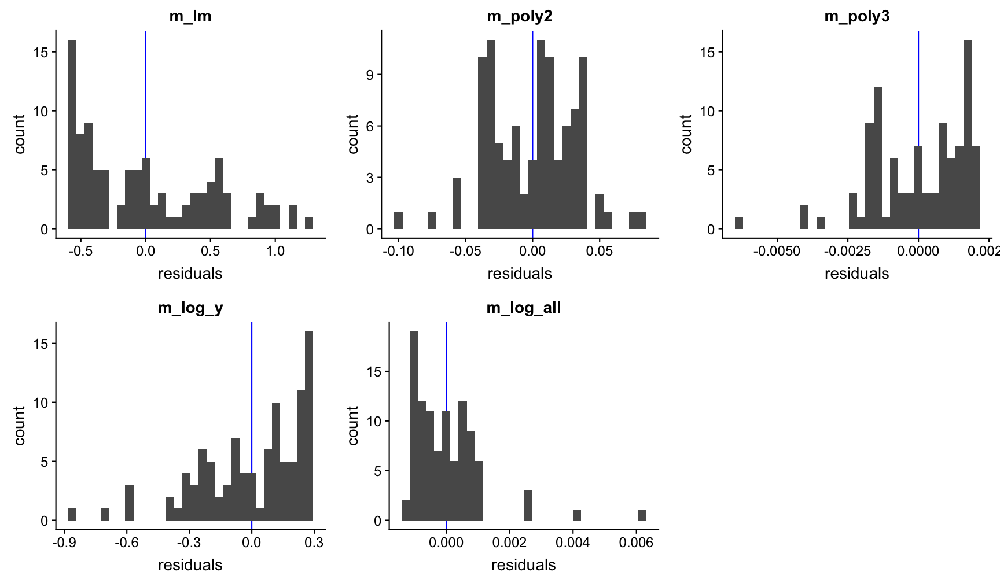

--- &twocol

## Example to find the best model: `df1_nonoise`

Now it becomes clear that the underlying function is an exponental function of the form $Y=aX^{b}$.

For comparison:

*** =left


```r
# This is the true underlying function
set.seed(123)
x <- sample(20:120, size = 100, 
  replace = TRUE)
y_noise <- rnorm(100, 0, 0.3)
a <- exp(-10)
b <- 2.5
y <- a * x^b + y_noise
```

*** =right

```r
m5_comp <- lm(log(y) ~ log(x))
coefficients(m5_comp)
```

```no-highlight
## (Intercept)      log(x) 
##  -10.662521    2.648546
```

---

## Solution of all 5 models

df1: $Y_{i}=aX_{i}^{b}+\epsilon_{i}$ , with a = exp(-10), b = 2.5

df2: $Y_{i}=a+b1X_{i}+b2X_{i}^{2}+b3X_{i}^{3}+\epsilon_{i}$ , with a = 1250, b1 = 400, b2 = -100, b3 = -30

df3: $Y_{i}=a+b1X_{i}+b2X_{i}^{2}+\epsilon_{i}$ , with a = 100, b1 = -5, b2 = 0.5

df4: $Y_{i}=ae^{bX_{i}}+\epsilon_{i}$ , with a = 20, b = 0.025

df5: $Y_{i}=ae^{-bX_{i}}+\epsilon_{i}$ , with a = 10, b = -0.025


