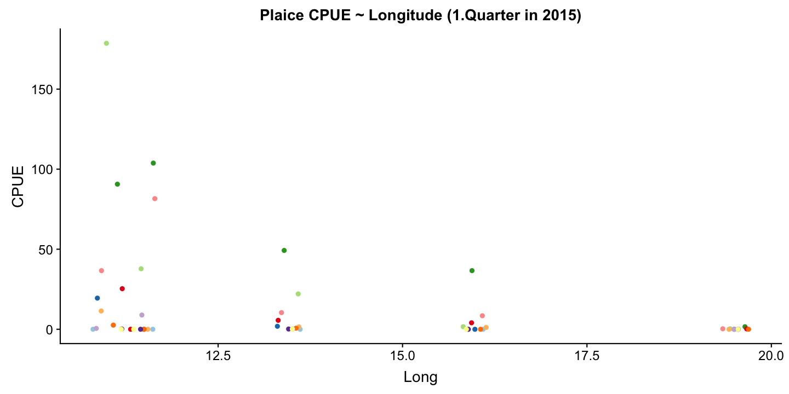
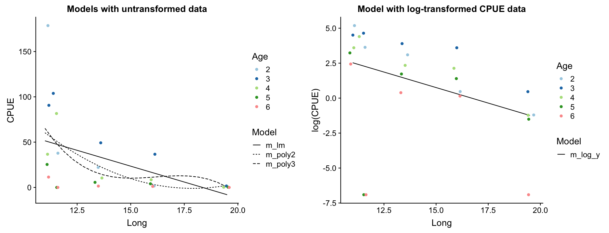
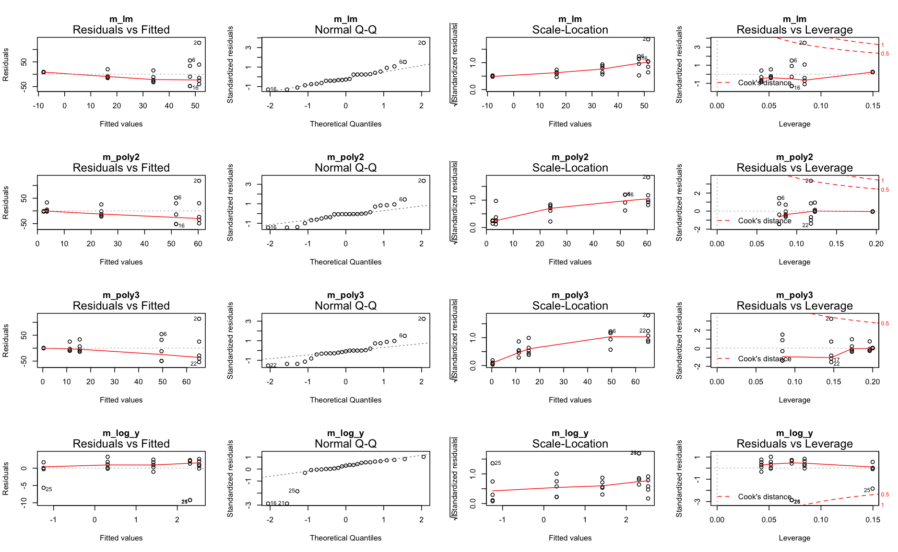
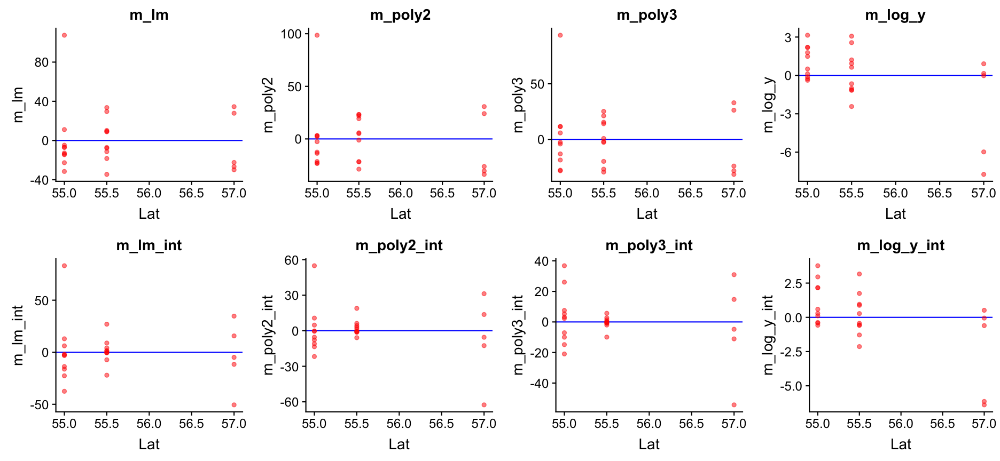

## Demonstration with Plaice CPUE in the Baltic Sea
### Research question:

**What factors explain best the pattern in age-specific Catch-Per-Unit-Effort (CPUE) of *Pleuronectes platessa* (plaice) in the first quarter of 2015?**

Since we have longitude, latitude, and age in our dataset we can test whether these variables have any effect. Lets start with longitude as it is commonly known that plaice is more frequent in the Western Baltic Sea.

---
Import and modify data

```r
cpue <- read_csv("data/CPUE per age per area_2017-11-20 06_48_16.csv")
plaice <- cpue %>% 
  mutate(Area = factor(Area, levels = c(21,22,
    23,24,25,26,27,28,29,30,31,32))) %>%
  filter(Year == 2015, Quarter == 1, Species == "Pleuronectes platessa") %>%
  select(Area, Quarter, Species, contains("Age")) %>%
  gather(key = "Age", value = "CPUE", Age_0:Age_10) %>%
  mutate(Age = factor(Age, levels = paste0("Age_", 0:10),
    labels = c("0","1","2","3","4","5","6","7","8","9","10")))
sd_coord <- tibble(
  Area = factor(c(21,22,23,24,25,26,27,28,29,30,31,32)),
  Lat = c(57,55,55.75,55,55.5,55.5,58,57.5,59.5,62,64.75,60),
  Long = c(11.5,11,12.5,13.5,16,19.5,18,20,21,19.5,22.5,26)
  )
# Merge this table into the cpue data
plaice <- left_join(plaice, sd_coord, by = "Area")
```

--- 
### Step 1: Specification of model family 
  


<div style="position: absolute; left:650px; top: 200px; z-index:100">
    
</div> 

Since a straight line seems less appropriately we will compare different model families including polynomials and transformation of Y.

--- 
### Step 2: Model fitting


```r
plaice <- plaice %>% 
  mutate(CPUE_log = log(CPUE + 0.001))

m_lm <- lm(CPUE ~ Long, data = plaice)
m_poly2 <- lm(CPUE ~ poly(Long,2), data = plaice)
m_poly3 <- lm(CPUE ~ poly(Long,3), data = plaice)
m_log_y <- lm(CPUE_log ~ Long, data = plaice)
```

---
### Step 3: Model partitioning - **predicted values** → model fit
 


Which model do you prefer? Which models are misfitting the data?
Which problem becomes more apparent when log-transforming CPUE? 
> - There are too **many zeros** in the CPUE data!

---
### Step 3: **Residuals** → model assumptions


---
## Zero-inflation

Too many zeros in the data can inflate the parameterization of coefficients. 
- One can either apply specific models that account for it (e.g. zero-truncated or zero-inflated regression models),
- convert the data into binary data (presence/absence) and apply a logistic regression,
- or reduce the number of zeros by
  - summing up the CPUE over all age classes (disadvantage: we reduce the sample size)
  - or, in this demostration, by removing specific age classes

→ In any case, we need to **rephrase our research question**!

---

```r
plaice %>% group_by(Age, CPUE) %>% 
  filter(CPUE < 0.01) %>%
  summarize(counts = n()) %>% print(n=40)
```

```no-highlight
## # A tibble: 8 x 3
## # Groups:   Age [?]
##   Age    CPUE counts
##   <fct> <dbl>  <int>
## 1 0         0      5
## 2 1         0      3
## 3 5         0      1
## 4 6         0      2
## 5 7         0      3
## 6 8         0      2
## 7 9         0      3
## 8 10        0      4
```

Lets remove age 0, 1 and > 6 and start with step 2 again.

---
### Reformulate research question:

What factors explain best the pattern in age-specific Catch-Per-Unit-Effort (CPUE) of *Pleuronectes platessa* (plaice) **age 2- 6** in the first quarter of 2015?


--- 
### Repeat step 2: Model fitting with new data


```r
plaice <- plaice %>% filter(Age %in% 2:6) %>%
  mutate(Age = fct_drop(Age))

m_lm <- lm(CPUE ~ Long, data = plaice)
m_poly2 <- lm(CPUE ~ poly(Long,2), data = plaice)
m_poly3 <- lm(CPUE ~ poly(Long,3), data = plaice)
m_log_y <- lm(CPUE_log ~ Long, data = plaice)
```
For reasons of convenience I named the subset also 'plaice' so I can simply run the previous code again without many modifications.

---
### Repeat step 3: Model partitioning - **predicted values**
 



How do the models perform now?

---
### Repeat step 3: Model partitioning - **residuals**




---
## What next?

- `m_log_y` shows the best residual distribution so we could focus on this model and move on the step 4; however, for some age classes this model greatly underestimates the CPUE.
- The models with untransformed data do not look too bad either (particularly the polynomials) so we could keep them for now and see whether including more variables helps reducing the noise and improving the model fit.


---
### Step 4: Model residuals ~ another X variable


---
### Step 4: Model residuals ~ another X variable


<div class="alert alert-green" style="position: absolute; left: 300px; top: 325px">
  <h4></h4> <small style="font-size: 30px">Lets include the factor Age in all 4 models!</small>
</div>

---
### Step 5: Re-specify the model and visualize the predictions


```r
m_lm <- update(m_lm, .~. + Age)
m_poly2 <- update(m_poly2, .~. + Age)
m_poly3 <- update(m_poly3, .~. + Age)
m_log_y <- update(m_log_y, .~. + Age)
```


**Happy now?**

---


---
### Step 6: Test for an interaction between `Long` and `Age`


```r
m_lm_int <- lm(CPUE ~ Long * Age, data = plaice)
m_poly2_int <- lm(CPUE ~ poly(Long,2) * Age, data = plaice)
m_poly3_int <- lm(CPUE ~ poly(Long,3) * Age, data = plaice)
m_log_y_int <- lm(CPUE_log ~ Long * Age, data = plaice)
```


**Better?**

---


---
## Go back to step 4: Model residuals ~ latitude 




<small>No clear pattern that suggests to include latitude in the model (in the mod_log_y model it seems residuals decrease with latitude but that is mainly caused by the 2 outliers).</small>


---
## So which one to choose? 

- From the residual diagnostics it seems that `mod_log_y` with `Age` and `Long` is the best, but the cubic model is also quite good. 
- Should an interaction term be included or not? Difficult to say from the graphics.
- Lets use the **AIC** to guide our decision!
  - It is wise to **include a NULL model** (with only an intercept) to see whether any of the covariate should be included or not.
  - Recall: the AIC is only useful for comparison between models fitted to the same observations and same Y variables: you can't compare models fitted to different data subsets or if Y is partly transformed!

---
### Overview of models we fitted

```r
m0 <- lm(CPUE ~ 1, data = plaice)
m_lm_1 <- lm(CPUE ~ Long, data = plaice)
m_lm_2 <- lm(CPUE ~ Long + Age, data = plaice)
m_lm_3 <- lm(CPUE ~ Long * Age, data = plaice)
m_poly2_1 <- lm(CPUE ~ poly(Long,2), data = plaice)
m_poly2_2 <- lm(CPUE ~ poly(Long,2) + Age, data = plaice)
m_poly2_3 <- lm(CPUE ~ poly(Long,2) * Age, data = plaice)
m_poly3_1 <- lm(CPUE ~ poly(Long,3), data = plaice)
m_poly3_2 <- lm(CPUE ~ poly(Long,3) + Age, data = plaice)
m_poly3_3 <- lm(CPUE ~ poly(Long,3) * Age, data = plaice)
# Now the log-models
m_log_y_0 <-lm(CPUE_log ~ 1, data = plaice)
m_log_y_1 <-lm(CPUE_log ~ Long, data = plaice)
m_log_y_2 <-lm(CPUE_log ~ Long + Age, data = plaice)
m_log_y_3 <-lm(CPUE_log ~ Long * Age, data = plaice)
```

---

```r
AIC(m0, m_lm_1, m_lm_2, m_lm_3, m_poly2_1, m_poly2_2, m_poly2_3,
  m_poly3_1, m_poly3_2, m_poly3_3)
```

```no-highlight
##           df      AIC
## m0         2 262.6016
## m_lm_1     3 256.8791
## m_lm_2     7 254.4298
## m_lm_3    11 252.9204
## m_poly2_1  4 257.0557
## m_poly2_2  8 253.6051
## m_poly2_3 16 252.1079
## m_poly3_1  5 258.3897
## m_poly3_2  9 254.5438
## m_poly3_3 21 255.0540
```

```r
AIC(m_log_y_0, m_log_y_1, m_log_y_2, m_log_y_3)
```

```no-highlight
##           df      AIC
## m_log_y_0  2 137.3974
## m_log_y_1  3 135.0501
## m_log_y_2  7 129.8373
## m_log_y_3 11 135.0000
```

<div class="alert alert-lightorange" style="position: absolute; left: 400px; top: 160px; width: 610px">
  <small style="font-size: 20px">All models perform better than the NULL model but do not differ much from each other; no model sticks out as most adequate but simple model! Given an AIC difference of 2, none of the polynomial models performs better than the simple linear model and, in fact, m_lm_2 (Age + Long) would be the best choice based on the AIC.</small>
</div>

<div class="alert alert-lightorange" style="position: absolute; left: 400px; top: 470px; width: 610px">
  <small style="font-size: 20px">The best log-model contains Age and Long but no interaction!</small>
</div>

---
## Summary of final model: m_log_y_2


---


```r
summary(m_log_y_2)
```

```no-highlight
## 
## Call:
## lm(formula = CPUE_log ~ Long + Age, data = plaice)
## 
## Residuals:
##     Min      1Q  Median      3Q     Max 
## -7.7375 -0.6531  0.1546  1.4860  3.1414 
## 
## Coefficients:
##             Estimate Std. Error t value Pr(>|t|)   
## (Intercept)   8.5793     2.8565   3.003  0.00731 **
## Long         -0.4436     0.1793  -2.474  0.02295 * 
## Age3          1.1864     1.7805   0.666  0.51320   
## Age4          0.0158     1.7805   0.009  0.99301   
## Age5         -2.6477     1.7805  -1.487  0.15340   
## Age6         -4.4044     1.7805  -2.474  0.02298 * 
## ---
## Signif. codes:  0 '***' 0.001 '**' 0.01 '*' 0.05 '.' 0.1 ' ' 1
## 
## Residual standard error: 2.815 on 19 degrees of freedom
## Multiple R-squared:  0.5046,	Adjusted R-squared:  0.3742 
## F-statistic: 3.871 on 5 and 19 DF,  p-value: 0.01377
```

---

<q>The R code for this demonstration can be found under 'Ecercises</q>


--- &slide_no_footer .segue bg:url(img/Darst.jpg);background-size:cover

# Time for your SECOND case study!!!

<p><span class="source-img" style="position: absolute; left: 50px; top: 650px; color:white">Photo by NASA (ID ISS040-E-12110), accessed 
    <a href='https://earthobservatory.nasa.gov/images/84047/coastlines-of-the-southern-baltic-sea' title=''>here</a></span></p>


--- &thankyou

