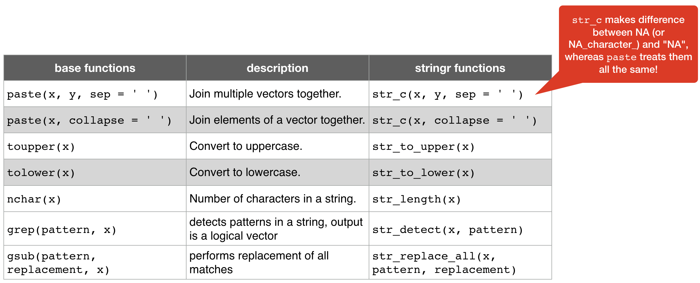
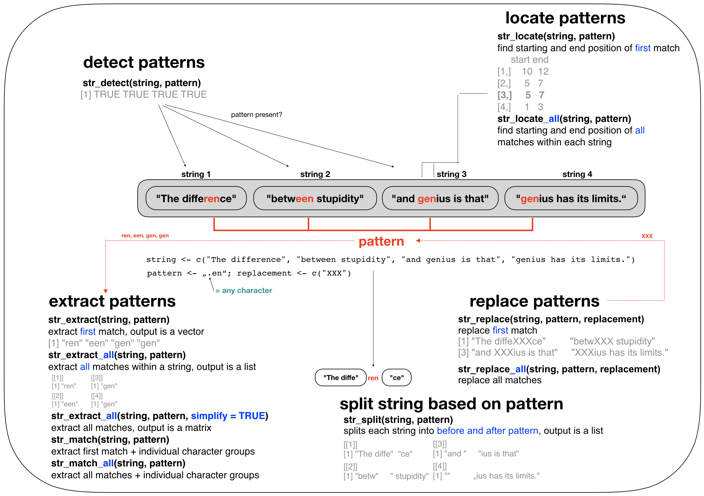

## What is a string again? 

- Any value written within a **pair of** single quote or **double quotes** in R is treated as a string and stored in a **character vector** (within double quotes). 
- Lets look at a famous quote made by Albert Einstein:


```r
einstein <- c("The difference", "between stupidity", 
  "and genius is that", "genius has its limits.")
```

<small> → The character vector `einstein` contains 4 elements or more precisely **4 strings**.</small>

---
## Manipulation of strings 
- R may not be as rich and diverse as other scripting languages when it comes to string manipulation, but it can take you very far if you know how.
- This tutorial gives you only a short introduction into some functions for basic manipulations.  
- Some of these functions require **regular expressions** (*regex* or *regexpr* in short ), which are a concise **language for describing patterns in strings** that typically contain unstructured or semi-structured data.
- To learn more about regex I recommend the excellent website [http://www.regular-expressions.info](http://www.regular-expressions.info). It contains many different topics, resources, examples, and tutorials at both beginner and advanced levels.

---
## Manipulation of strings 
Even if you don't plan to do text analysis, text mining, or natural language processing, it is useful to have some knowledge on handling and processing strings in R for the following reasons:

---

- Your dataset most likely will contain some text, e.g. stations names, species names, etc.
  - you might want to **remove a given character** in the names of your variables or in the entire dataset
  - you might want to **convert labels** to upper case (or lower case)
  - you might want to **replace** an **outdated species names** with the new name
  - you might want to **re-classify** certain categories, e.g. group different life stages together
  - you want to **abbreviate names**
  

---

- Your dataset most likely will contain some text, e.g. stations names, species names, etc.
  - you might want to **remove a given character** in the names of your variables or in the entire dataset
  - you might want to **convert labels** to upper case (or lower case)
  - you might want to **replace** an **outdated species names** with the new name
  - you might want to **re-classify** certain categories, e.g. group different life stages together
  - you want to **abbreviate names**  
- You want to **extract data** from the web (**web-scraping**) and remove irrelevant information.
- You want to **remove** all unnecessary **metadata** that your imported dataset contains.
- You want to **iterate** the data import and processing for 100 data files that have slightly different file names.


---
## Some useful base functions 


---
## Some useful base functions 


<small> Most of the times these functions are enough and they will allow you to get your job done. However, they have some drawbacks when it comes to **handling NAs** or pasting elements with **zero length**.

A **nice package** that solves these problems and provides several functions for carrying out consistent string processing comes again from **tidyverse**... </small>

---
## The *stringr* package 

<div style="position: absolute; left: 950px; top: 25px; z-index:100">
    
</div>

- *stringr* adds more functionality to the base functions for handling strings in R.
- In *stringr*,
  - **argument names** (and positions) are **consistent**, 
  - all functions deal with **NA's** and **zero length** character appropriately, and  
  - the **output** data structures from each function **matches the input** data structures of **other functions**
  - all functions start with `str_` so you can quickly select the appropriate one from the dropdown list displayed by R Studio 
- to access these function load stringr or tidyverse:


```r
library(stringr)
library(tidyverse)
```

--- 
## A quick comparison of *base* and *stringr* functions



--- &twocol
## A quick comparison of *base* and *stringr* functions


*** =left

```r
x <- c("Shark", "Whale", "Ray")
str_length(x)
```

```no-highlight
## [1] 5 5 3
```
*** =right

```r
str_to_lower(x)
```

```no-highlight
## [1] "shark" "whale" "ray"
```

```r
str_to_upper(x)
```

```no-highlight
## [1] "SHARK" "WHALE" "RAY"
```


--- &vcenter
## Combining and subsetting strings using *stringr* 


--- 
## Combining with `str_c()`


```r
# Args 'sep' for strings of DIFFERENT vectors
str_c("a", "b", sep = "<") 
```

```no-highlight
## [1] "a<b"
```

```r
# Args 'collapse' for strings within the SAME vector
str_c(c("a","b"), collapse = "-") 
```

```no-highlight
## [1] "a-b"
```

```r
# Both args for doing both (first sep, than collapse applied)
str_c(c("a","b"), c(1,2), sep = "<", collapse = "-") 
```

```no-highlight
## [1] "a<1-b<2"
```

```r
# The recycling rule also applies here:
str_c("a", 1:10, sep = "_") 
```

```no-highlight
##  [1] "a_1"  "a_2"  "a_3"  "a_4"  "a_5"  "a_6"  "a_7"  "a_8"  "a_9"  "a_10"
```


--- 
## Subsetting with `str_sub()`


```r
x <- c("Shark", "Whale", "Ray")
str_sub(string = x, start = 1, end = 3) # extract 1st to 3rd
```

```no-highlight
## [1] "Sha" "Wha" "Ray"
```

```r
str_sub(string = x, end = 1) # extract 1st
```

```no-highlight
## [1] "S" "W" "R"
```

```r
str_sub(x, -1) # extract last using negative index
```

```no-highlight
## [1] "k" "e" "y"
```

```r
# Replacing values in each string with str_sub
str_sub(x, 1, 1) <- "A"; x
```

```no-highlight
## [1] "Ahark" "Ahale" "Aay"
```

```r
# Combine str_sub with str_to_upper 
str_sub(x, -1) <- str_to_upper(str_sub(x, -1)); x
```

```no-highlight
## [1] "AharK" "AhalE" "AaY"
```


---
## Other useful *stringr* functions (1)

`str_sort()` and `str_order()`: sort character vectors using the current locale (= ISO 639 language code)

```r
x <- c("Shark", "Whale", "Ray")
str_sort(x) # returns sorted character vector
```

```no-highlight
## [1] "Ray"   "Shark" "Whale"
```

```r
str_order(x) # returns index vector of sorted strings
```

```no-highlight
## [1] 3 1 2
```

---
## Other useful *stringr* functions (2)

`str_trim()`: removes whitespace from start and end of string

```r
str_trim("  String with trailing and leading white space\t")
```

```no-highlight
## [1] "String with trailing and leading white space"
```
<br>
`str_pad()`: adds single padding character (default is whitespace)
(args 'width' indicates the total string length INCLUDING the existing characters)

```r
str_pad("a", width = 5, side = "both") 
```

```no-highlight
## [1] "  a  "
```

```r
str_pad("a", 6, "both", pad = "-")
```

```no-highlight
## [1] "--a---"
```

---
## Other useful *stringr* functions (3)

`str_wrap()`: wrap strings into formatted paragraphs (based on a specific algorithm)

```r
x <- "This is a wrapper around stri_wrap which implements a wrapping algorithm."
str_wrap(x, width=10)
```

```no-highlight
## [1] "This is\na wrapper\naround\nstri_wrap\nwhich\nimplements\na wrapping\nalgorithm."
```

```r
cat(str_wrap(x, width=10))
```

```no-highlight
## This is
## a wrapper
## around
## stri_wrap
## which
## implements
## a wrapping
## algorithm.
```


---
## Functions for pattern matching in *stringr*


--- &slide_no_footer .segue



---
## Overview of regular expressions

<div class="img-with-text" style="position: absolute; left: 150px; top: 120px; z-index:100">
    
 <p><span class="source-img" style = "float:right">
    Adapted from the <a href='https://www.rstudio.com/wp-content/uploads/2016/09/RegExCheatsheet.pdf' title=''>RegEx cheatsheet</a> by Ian Kopacka</span></p>
</div>


---
## Some examples: `str_detect()` (1)

Identify strings that match a specific pattern:


```r
x <- c("shark", "whale shark", "whale", "manta ray", "sting ray")	
```

Specific pattern using **anchors**:


```r
str_detect(x, "^w") # ^ = start of string
```

```no-highlight
## [1] FALSE  TRUE  TRUE FALSE FALSE
```

```r
str_detect(x, "y$") # $ = end of string
```

```no-highlight
## [1] FALSE FALSE FALSE  TRUE  TRUE
```

```r
str_detect(x, "whale") # all strings that contain that word
```

```no-highlight
## [1] FALSE  TRUE  TRUE FALSE FALSE
```

```r
str_detect(x, "^whale$") # all strings that start end end with this word
```

```no-highlight
## [1] FALSE FALSE  TRUE FALSE FALSE
```

---
## Some examples: `str_detect()` (2)

Identify strings that match a specific pattern:


```r
x <- c("shark", "whale shark", "whale", "manta ray", "sting ray")	
```

Specific pattern using **character classes**:


```r
# Start with a vowel (same as "^[a,e,i,u,o]")
str_detect(string = x, pattern = "^(a|e|i|u|o)") 
```

```no-highlight
## [1] FALSE FALSE FALSE FALSE FALSE
```

```r
# End with 'ark' or 'ale'
str_detect(x, pattern = "(ark|ale)$")
```

```no-highlight
## [1]  TRUE  TRUE  TRUE FALSE FALSE
```

```r
# Contains any character, then 'a', then whitespace
str_detect(x, pattern = ".a ")
```

```no-highlight
## [1] FALSE FALSE FALSE  TRUE FALSE
```


---
## Some examples: `str_subset()`

Subset strings that match a specific pattern using `str_detect()` for indexing or the **wrapper function** `str_subset()`:


```r
x <- c("shark", "whale shark", "whale", "manta ray", "sting ray")	
```


```r
# Get all strings in x that start with 'm' or end with 'k'
x[str_detect(x, "^m|k$")] 
```

```no-highlight
## [1] "shark"       "whale shark" "manta ray"
```

```r
# same as
str_subset(x, "^m|k$")
```

```no-highlight
## [1] "shark"       "whale shark" "manta ray"
```

---
## Some examples: `str_split()` (1)

Split a string into pieces based on a specific pattern:


```r
x <- c("shark", "whale shark", "whale", "manta ray", "sting ray")	
str_split(x, " ", simplify = TRUE)
```

```no-highlight
##      [,1]    [,2]   
## [1,] "shark" ""     
## [2,] "whale" "shark"
## [3,] "whale" ""     
## [4,] "manta" "ray"  
## [5,] "sting" "ray"
```

---
## Some examples: `str_split()` (2)

Split a string into pieces based on a specific pattern:


```r
fruits <- c("apples and oranges and pears and bananas",
  "pineapples and mangos and guavas")

str_split(fruits, " and ", simplify = TRUE)
```

```no-highlight
##      [,1]         [,2]      [,3]     [,4]     
## [1,] "apples"     "oranges" "pears"  "bananas"
## [2,] "pineapples" "mangos"  "guavas" ""
```

```r
# Specify n to restrict the number of possible matches
str_split(fruits, " and ", n = 2, simplify = TRUE)
```

```no-highlight
##      [,1]         [,2]                           
## [1,] "apples"     "oranges and pears and bananas"
## [2,] "pineapples" "mangos and guavas"
```

--- &slide_no_footer .segue bg:#EEC900

# Your turn...

--- &exercise
*stringr* provides a dataset (vector) called `words`, which contains a selection of 980 words: 


```r
stringr::words
```

```no-highlight
##   [1] "a"           "able"        "about"       "absolute"    "accept"     
##   [6] "account"     "achieve"     "across"      "act"         "active"     
##  [11] "actual"      "add"         "address"     "admit"       "advertise"  
##  [16] "affect"      "afford"      "after"       "afternoon"   "again"      
##  [21] "against"     "age"         "agent"       "ago"         "agree"      
##  [26] "air"         "all"         "allow"       "almost"      "along"      
##  [31] "already"     "alright"     "also"        "although"    "always"     
##  [36] "america"     "amount"      "and"         "another"     "answer"     
##  [41] "any"         "apart"       "apparent"    "appear"      "apply"      
##  [46] "appoint"     "approach"    "appropriate" "area"        "argue"      
##  [51] "arm"         "around"      "arrange"     "art"         "as"         
##  [56] "ask"         "associate"   "assume"      "at"          "attend"     
##  [61] "authority"   "available"   "aware"       "away"        "awful"      
##  [66] "baby"        "back"        "bad"         "bag"         "balance"    
##  [71] "ball"        "bank"        "bar"         "base"        "basis"      
##  [76] "be"          "bear"        "beat"        "beauty"      "because"    
##  [81] "become"      "bed"         "before"      "begin"       "behind"     
##  [86] "believe"     "benefit"     "best"        "bet"         "between"    
##  [91] "big"         "bill"        "birth"       "bit"         "black"      
##  [96] "bloke"       "blood"       "blow"        "blue"        "board"      
## [101] "boat"        "body"        "book"        "both"        "bother"     
## [106] "bottle"      "bottom"      "box"         "boy"         "break"      
## [111] "brief"       "brilliant"   "bring"       "britain"     "brother"    
## [116] "budget"      "build"       "bus"         "business"    "busy"       
## [121] "but"         "buy"         "by"          "cake"        "call"       
## [126] "can"         "car"         "card"        "care"        "carry"      
## [131] "case"        "cat"         "catch"       "cause"       "cent"       
## [136] "centre"      "certain"     "chair"       "chairman"    "chance"     
## [141] "change"      "chap"        "character"   "charge"      "cheap"      
## [146] "check"       "child"       "choice"      "choose"      "Christ"     
## [151] "Christmas"   "church"      "city"        "claim"       "class"      
## [156] "clean"       "clear"       "client"      "clock"       "close"      
## [161] "closes"      "clothe"      "club"        "coffee"      "cold"       
## [166] "colleague"   "collect"     "college"     "colour"      "come"       
## [171] "comment"     "commit"      "committee"   "common"      "community"  
## [176] "company"     "compare"     "complete"    "compute"     "concern"    
## [181] "condition"   "confer"      "consider"    "consult"     "contact"    
## [186] "continue"    "contract"    "control"     "converse"    "cook"       
## [191] "copy"        "corner"      "correct"     "cost"        "could"      
## [196] "council"     "count"       "country"     "county"      "couple"     
## [201] "course"      "court"       "cover"       "create"      "cross"      
## [206] "cup"         "current"     "cut"         "dad"         "danger"     
## [211] "date"        "day"         "dead"        "deal"        "dear"       
## [216] "debate"      "decide"      "decision"    "deep"        "definite"   
## [221] "degree"      "department"  "depend"      "describe"    "design"     
## [226] "detail"      "develop"     "die"         "difference"  "difficult"  
## [231] "dinner"      "direct"      "discuss"     "district"    "divide"     
## [236] "do"          "doctor"      "document"    "dog"         "door"       
## [241] "double"      "doubt"       "down"        "draw"        "dress"      
## [246] "drink"       "drive"       "drop"        "dry"         "due"        
## [251] "during"      "each"        "early"       "east"        "easy"       
## [256] "eat"         "economy"     "educate"     "effect"      "egg"        
## [261] "eight"       "either"      "elect"       "electric"    "eleven"     
## [266] "else"        "employ"      "encourage"   "end"         "engine"     
## [271] "english"     "enjoy"       "enough"      "enter"       "environment"
## [276] "equal"       "especial"    "europe"      "even"        "evening"    
## [281] "ever"        "every"       "evidence"    "exact"       "example"    
## [286] "except"      "excuse"      "exercise"    "exist"       "expect"     
## [291] "expense"     "experience"  "explain"     "express"     "extra"      
## [296] "eye"         "face"        "fact"        "fair"        "fall"       
## [301] "family"      "far"         "farm"        "fast"        "father"     
## [306] "favour"      "feed"        "feel"        "few"         "field"      
## [311] "fight"       "figure"      "file"        "fill"        "film"       
## [316] "final"       "finance"     "find"        "fine"        "finish"     
## [321] "fire"        "first"       "fish"        "fit"         "five"       
## [326] "flat"        "floor"       "fly"         "follow"      "food"       
## [331] "foot"        "for"         "force"       "forget"      "form"       
## [336] "fortune"     "forward"     "four"        "france"      "free"       
## [341] "friday"      "friend"      "from"        "front"       "full"       
## [346] "fun"         "function"    "fund"        "further"     "future"     
## [351] "game"        "garden"      "gas"         "general"     "germany"    
## [356] "get"         "girl"        "give"        "glass"       "go"         
## [361] "god"         "good"        "goodbye"     "govern"      "grand"      
## [366] "grant"       "great"       "green"       "ground"      "group"      
## [371] "grow"        "guess"       "guy"         "hair"        "half"       
## [376] "hall"        "hand"        "hang"        "happen"      "happy"      
## [381] "hard"        "hate"        "have"        "he"          "head"       
## [386] "health"      "hear"        "heart"       "heat"        "heavy"      
## [391] "hell"        "help"        "here"        "high"        "history"    
## [396] "hit"         "hold"        "holiday"     "home"        "honest"     
## [401] "hope"        "horse"       "hospital"    "hot"         "hour"       
## [406] "house"       "how"         "however"     "hullo"       "hundred"    
## [411] "husband"     "idea"        "identify"    "if"          "imagine"    
## [416] "important"   "improve"     "in"          "include"     "income"     
## [421] "increase"    "indeed"      "individual"  "industry"    "inform"     
## [426] "inside"      "instead"     "insure"      "interest"    "into"       
## [431] "introduce"   "invest"      "involve"     "issue"       "it"         
## [436] "item"        "jesus"       "job"         "join"        "judge"      
## [441] "jump"        "just"        "keep"        "key"         "kid"        
## [446] "kill"        "kind"        "king"        "kitchen"     "knock"      
## [451] "know"        "labour"      "lad"         "lady"        "land"       
## [456] "language"    "large"       "last"        "late"        "laugh"      
## [461] "law"         "lay"         "lead"        "learn"       "leave"      
## [466] "left"        "leg"         "less"        "let"         "letter"     
## [471] "level"       "lie"         "life"        "light"       "like"       
## [476] "likely"      "limit"       "line"        "link"        "list"       
## [481] "listen"      "little"      "live"        "load"        "local"      
## [486] "lock"        "london"      "long"        "look"        "lord"       
## [491] "lose"        "lot"         "love"        "low"         "luck"       
## [496] "lunch"       "machine"     "main"        "major"       "make"       
## [501] "man"         "manage"      "many"        "mark"        "market"     
## [506] "marry"       "match"       "matter"      "may"         "maybe"      
## [511] "mean"        "meaning"     "measure"     "meet"        "member"     
## [516] "mention"     "middle"      "might"       "mile"        "milk"       
## [521] "million"     "mind"        "minister"    "minus"       "minute"     
## [526] "miss"        "mister"      "moment"      "monday"      "money"      
## [531] "month"       "more"        "morning"     "most"        "mother"     
## [536] "motion"      "move"        "mrs"         "much"        "music"      
## [541] "must"        "name"        "nation"      "nature"      "near"       
## [546] "necessary"   "need"        "never"       "new"         "news"       
## [551] "next"        "nice"        "night"       "nine"        "no"         
## [556] "non"         "none"        "normal"      "north"       "not"        
## [561] "note"        "notice"      "now"         "number"      "obvious"    
## [566] "occasion"    "odd"         "of"          "off"         "offer"      
## [571] "office"      "often"       "okay"        "old"         "on"         
## [576] "once"        "one"         "only"        "open"        "operate"    
## [581] "opportunity" "oppose"      "or"          "order"       "organize"   
## [586] "original"    "other"       "otherwise"   "ought"       "out"        
## [591] "over"        "own"         "pack"        "page"        "paint"      
## [596] "pair"        "paper"       "paragraph"   "pardon"      "parent"     
## [601] "park"        "part"        "particular"  "party"       "pass"       
## [606] "past"        "pay"         "pence"       "pension"     "people"     
## [611] "per"         "percent"     "perfect"     "perhaps"     "period"     
## [616] "person"      "photograph"  "pick"        "picture"     "piece"      
## [621] "place"       "plan"        "play"        "please"      "plus"       
## [626] "point"       "police"      "policy"      "politic"     "poor"       
## [631] "position"    "positive"    "possible"    "post"        "pound"      
## [636] "power"       "practise"    "prepare"     "present"     "press"      
## [641] "pressure"    "presume"     "pretty"      "previous"    "price"      
## [646] "print"       "private"     "probable"    "problem"     "proceed"    
## [651] "process"     "produce"     "product"     "programme"   "project"    
## [656] "proper"      "propose"     "protect"     "provide"     "public"     
## [661] "pull"        "purpose"     "push"        "put"         "quality"    
## [666] "quarter"     "question"    "quick"       "quid"        "quiet"      
## [671] "quite"       "radio"       "rail"        "raise"       "range"      
## [676] "rate"        "rather"      "read"        "ready"       "real"       
## [681] "realise"     "really"      "reason"      "receive"     "recent"     
## [686] "reckon"      "recognize"   "recommend"   "record"      "red"        
## [691] "reduce"      "refer"       "regard"      "region"      "relation"   
## [696] "remember"    "report"      "represent"   "require"     "research"   
## [701] "resource"    "respect"     "responsible" "rest"        "result"     
## [706] "return"      "rid"         "right"       "ring"        "rise"       
## [711] "road"        "role"        "roll"        "room"        "round"      
## [716] "rule"        "run"         "safe"        "sale"        "same"       
## [721] "saturday"    "save"        "say"         "scheme"      "school"     
## [726] "science"     "score"       "scotland"    "seat"        "second"     
## [731] "secretary"   "section"     "secure"      "see"         "seem"       
## [736] "self"        "sell"        "send"        "sense"       "separate"   
## [741] "serious"     "serve"       "service"     "set"         "settle"     
## [746] "seven"       "sex"         "shall"       "share"       "she"        
## [751] "sheet"       "shoe"        "shoot"       "shop"        "short"      
## [756] "should"      "show"        "shut"        "sick"        "side"       
## [761] "sign"        "similar"     "simple"      "since"       "sing"       
## [766] "single"      "sir"         "sister"      "sit"         "site"       
## [771] "situate"     "six"         "size"        "sleep"       "slight"     
## [776] "slow"        "small"       "smoke"       "so"          "social"     
## [781] "society"     "some"        "son"         "soon"        "sorry"      
## [786] "sort"        "sound"       "south"       "space"       "speak"      
## [791] "special"     "specific"    "speed"       "spell"       "spend"      
## [796] "square"      "staff"       "stage"       "stairs"      "stand"      
## [801] "standard"    "start"       "state"       "station"     "stay"       
## [806] "step"        "stick"       "still"       "stop"        "story"      
## [811] "straight"    "strategy"    "street"      "strike"      "strong"     
## [816] "structure"   "student"     "study"       "stuff"       "stupid"     
## [821] "subject"     "succeed"     "such"        "sudden"      "suggest"    
## [826] "suit"        "summer"      "sun"         "sunday"      "supply"     
## [831] "support"     "suppose"     "sure"        "surprise"    "switch"     
## [836] "system"      "table"       "take"        "talk"        "tape"       
## [841] "tax"         "tea"         "teach"       "team"        "telephone"  
## [846] "television"  "tell"        "ten"         "tend"        "term"       
## [851] "terrible"    "test"        "than"        "thank"       "the"        
## [856] "then"        "there"       "therefore"   "they"        "thing"      
## [861] "think"       "thirteen"    "thirty"      "this"        "thou"       
## [866] "though"      "thousand"    "three"       "through"     "throw"      
## [871] "thursday"    "tie"         "time"        "to"          "today"      
## [876] "together"    "tomorrow"    "tonight"     "too"         "top"        
## [881] "total"       "touch"       "toward"      "town"        "trade"      
## [886] "traffic"     "train"       "transport"   "travel"      "treat"      
## [891] "tree"        "trouble"     "true"        "trust"       "try"        
## [896] "tuesday"     "turn"        "twelve"      "twenty"      "two"        
## [901] "type"        "under"       "understand"  "union"       "unit"       
## [906] "unite"       "university"  "unless"      "until"       "up"         
## [911] "upon"        "use"         "usual"       "value"       "various"    
## [916] "very"        "video"       "view"        "village"     "visit"      
## [921] "vote"        "wage"        "wait"        "walk"        "wall"       
## [926] "want"        "war"         "warm"        "wash"        "waste"      
## [931] "watch"       "water"       "way"         "we"          "wear"       
## [936] "wednesday"   "wee"         "week"        "weigh"       "welcome"    
## [941] "well"        "west"        "what"        "when"        "where"      
## [946] "whether"     "which"       "while"       "white"       "who"        
## [951] "whole"       "why"         "wide"        "wife"        "will"       
## [956] "win"         "wind"        "window"      "wish"        "with"       
## [961] "within"      "without"     "woman"       "wonder"      "wood"       
## [966] "word"        "work"        "world"       "worry"       "worse"      
## [971] "worth"       "would"       "write"       "wrong"       "year"       
## [976] "yes"         "yesterday"   "yet"         "you"         "young"
```


--- &multitext bg:#EEC900
# Quiz 1: Detect pattern

Now tell me,

1. how many words are longer than 10 characters?
2. how many words are exactly 2 letters long?
3. how many words start end with *p*?

*** .hint
<small>For 1. Use `str_length()` and then filter.   
For 2. and 3. use `str_detect()` with anchors and the 'any character' regex and then sum up.</small>

*** .explanation
Solution code:   
`x %>% str_length() %>% .[.>10] %>% length()`   
`str_detect(x, "^..$") %>% sum()`     
`str_detect(x, "p$") %>% sum()`     

1. <span class='answer'>4</span>
2. <span class='answer'>18</span>
3. <span class='answer'>16</span>


--- &multitext bg:#EEC900
# Quiz 2: Detect pattern and split strings

1. How many of the 3-letter words start with a consonant?
2. How many words contain 'ee' (as in street)?
3. If you subset all words that contain the pattern 'st' and than split these words by this pattern, how many strings do you get in total?

*** .hint
<small>For 1: List in your pattern all vowels but use the negation: `[^]`   
For 2: Use the quantifier for matching exactly n times.   
For 3: You could subset with `str_subset()`, split with `str_split()`, unlist the returned list and then get the length of the obtained vector.</small>

*** .explanation
Solution code:   
`str_detect(x, "^[^a,e,i,u,o]..$") %>% sum()`    
`str_detect(x, "e{2,}") %>% sum()`  
`str_subset(x, "st") %>% str_split("st") %>% unlist() %>% length()`  

1. <span class='answer'>88</span>
2. <span class='answer'>27</span>
3. <span class='answer'>124</span>


--- &exercise
# Quiz 3: Subsetting and combining strings

You have the following vector `x`:


```r
x <- c("file_001.csv", "file_002.csv", "file_003.csv", "file_004.csv", "file_005.csv",
  "file_006.csv", "file_007.csv", "file_008.csv", "file_009.csv", "file_010.csv")
```

1. How can you remove the first 1 or 2 zeros?   
2. How could you generate yourself such vector but with 100 elements ("file_1.csv" ... "file_100.csv")?

--- bg:#CD2626
# Solution


```r
# 1.You could replace first the '_00' by the underscore and then all remaining '_0'
x %>% str_replace("_00", "_") %>% str_replace("_0", "_")
```

```no-highlight
##  [1] "file_1.csv"  "file_2.csv"  "file_3.csv"  "file_4.csv"  "file_5.csv" 
##  [6] "file_6.csv"  "file_7.csv"  "file_8.csv"  "file_9.csv"  "file_10.csv"
```

```r
# 2. Simply take advantage of the recycling rule when using str_c()
x <- str_c("file_", 1:100, ".csv", sep = "")
x[1:15]
```

```no-highlight
##  [1] "file_1.csv"  "file_2.csv"  "file_3.csv"  "file_4.csv"  "file_5.csv" 
##  [6] "file_6.csv"  "file_7.csv"  "file_8.csv"  "file_9.csv"  "file_10.csv"
## [11] "file_11.csv" "file_12.csv" "file_13.csv" "file_14.csv" "file_15.csv"
```


--- &slide_no_footer .segue bg:#E5E5E5

## Overview of functions you learned today

base functions:    
`paste()`, `toupper()`, `tolower()`, `nchar()`, `grep()`, `gsub()` 

stringr functions:   
`str_c()`, `str_to_upper()`, `str_to_lower()`, `str_length()`, `str_sub()`  
`str_sort()`, `str_order()`, `str_trim()`, `str_pad()`, `str_wrap()`  
`str_detect()`, `str_subset()`, `str_locate()`, `str_locate_all()`,  
`str_extract()`, `str_extract_all()`, `str_match()`, `str_match_all()`,   
`str_replace()`, `str_replace_all()`, `str_split()`


--- &slide_no_footer .segue bg:#CD2626

# How do you feel now.....?

--- &vcenter

## Totally confused?
                


[Chapter 14 on strings](http://r4ds.had.co.nz/strings.html) is worth reading with good exercises to practise regular expressions as well as the website [http://www.regular-expressions.info](http://www.regular-expressions.info).
See also the [stringr cheatsheet](https://github.com/rstudio/cheatsheets/raw/master/strings.pdf) for a function overview.

--- &vcenter

## Totally bored?
                


Keep on working on your case study!

---

## Totally content?
Then go grab a coffee, lean back and enjoy the rest of the day...!


--- &thankyou
