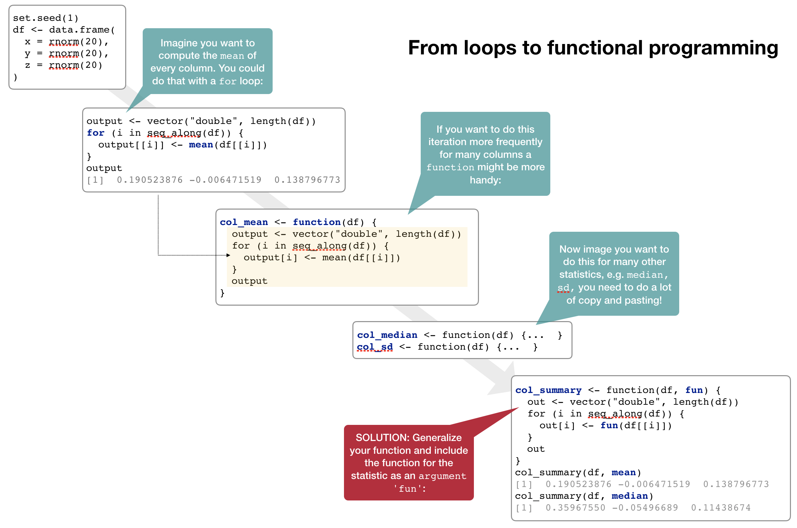
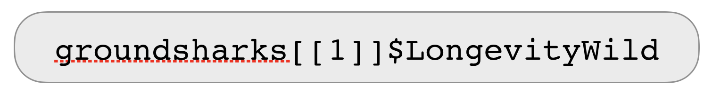
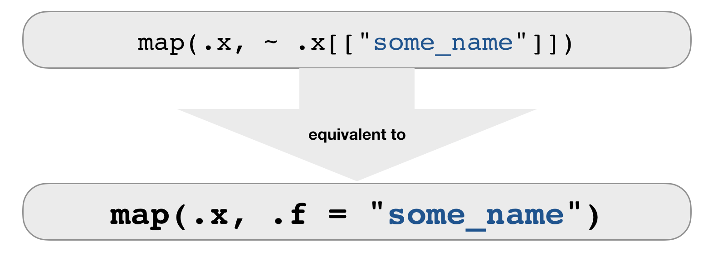
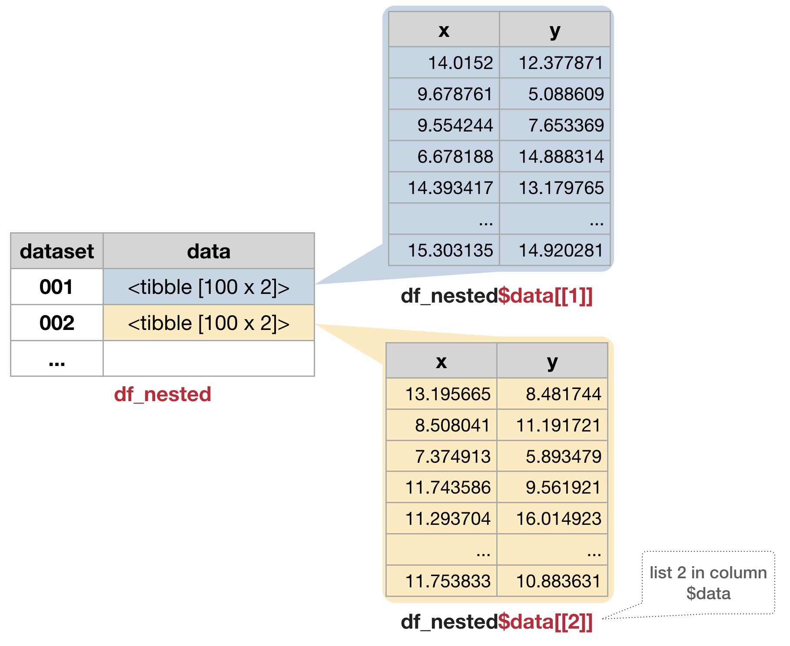

## Loops

- `for` loops are not as important in R as they are in other languages because R is a functional programming language.
- It is possible to wrap up `for` loops in a function, and call that function instead of using the for loop directly.

---
Consider (again) this simple data frame:

```{r, echo = FALSE, eval = FALSE}
# This is only for the keynote slide
set.seed(1)
df <- data.frame(
  x = rnorm(20),
  y = rnorm(20),
  z = rnorm(20)
)
output <- vector("double", length(df))
for (i in seq_along(df)) {
  output[[i]] <- mean(df[[i]])
}
output
col_mean <- function(df) {
  output <- vector("double", length(df))
  for (i in seq_along(df)) {
    output[i] <- mean(df[[i]])
  }
  output
}
col_median <- function(df) {
  output <- vector("double", length(df))
  for (i in seq_along(df)) {
    output[i] <- median(df[[i]])
  }
}
  
col_summary <- function(df, fun) {
  out <- vector("double", length(df))
  for (i in seq_along(df)) {
    out[i] <- fun(df[[i]])
  }
  out
}
col_summary(df, mean)
col_summary(df, median)
```


```{r, echo=FALSE, fig.align='center', out.width="850px"}

```

---
## Functional programming with purrr

<div style="position: absolute; left: 950px; top: 15px; z-index:100">
    
</div>

- As you have seen, passing a function to another function is extremely handy, reduces potential bugs (much less code and copy and pasting), and makes it easy to generalise
- The **apply family** of functions in base R (`apply()`, `lapply()`, `sapply()`, `vapply()`, `tapply()`, `mapply()`) does exactly that: Thes functions act on an input list, vector, dataframe, matrix or array,  and apply a named function with one or several optional arguments. 
- The **map** family of functions provided by the tidyverse packages [purrr](https://github.com/tidyverse/purrr) operates similar but can be **faster** (all functions written in C++), is **more consistent**, **well integrated** in the tidyverse concept and **easier** to learn.
- *purrr* provides in addition many more useful functions for handling lists; to have an overview of available functions see the [cheatsheet](https://github.com/rstudio/cheatsheets/raw/master/purrr.pdf)


--- &vcenter
## The most basic function: `map()`


```{r, echo=FALSE, fig.align='center', out.width="600px"}
knitr::include_graphics("img/purrr_map.png")
```

--- &twocol
## The most basic function: `map()`

Using our previous example:

*** =left
```{r}
set.seed(1)
df <- data.frame(
  x = rnorm(20),
  y = rnorm(20),
  z = rnorm(20)
)
```

`map()` always preserves the list names.

*** =right
```{r}
map(df, mean)
```

```{r, eval = FALSE}
# You can also use the pipe operator
df %>% map(median)
```


---
## The `...` argument

Here you specify all other arguments which can be specified in the function used:

```{r}
map(df, quantile, probs = c(0,0.5,1.0) )
```

---
## Other types of output than a list

- `map_lgl()` → returns a logical vector 
- `map_int()` → returns an integer vector
- `map_dbl()` → returns a double vector
- `map_chr()` → returns a character vector

The **length** of the returned vector and .x are **always** the same!

To get the means of x, y and z as vector replace `map()` with the appropriate function:
```{r}
map_dbl(df, mean)
```
<div class="alert alert-orange" style="position: absolute; left: 100px; top: 575px">
  <h4>Note: :</h4>`map_dbl()` returns a named vector based on the original list names!
</div>

---
## Other types of output than a list

You can always generate a vector of a more general data type but not the opposite
```{r}
map_int(df, mean)
```

```{r}
map_chr(df, mean)
```

--- &slide_no_footer .segue bg:#EEC900

# Your turn...

--- &exercise
# Task: Explore the data

Load the following R datafile, which contains the list `groundsharks`:

```{r, echo=FALSE}
rm(list = ls())
```

```{r}
load("data/fishbase_sharks.R")
ls()
```
This list contains data for 284 groundshark species (*Carcharhiniformes*, the largest order of sharks) downloaded from [fishbase](www.fishbase.org). The list has a hierarchical structure with one list per species containing individual sublists for each information. 

--- &exercise
# Task: Explore the data
**Answer the following questions** 

1. How many elements are in groundsharks?
2. What is the first species listed in groundsharks? What information is given for this species?
3. What is the difference between groundsharks[1] and groundsharks[[1]]?

<small>(Answers are on the next slide)</small>

--- bg:#EEC900

```{r}
length(groundsharks[[1]])
names(groundsharks[[1]])
```

--- &exercise
# Quiz 1: What is the longevity of each species in the wild?
(this information is stored in `LongevityWild`)

### STRATEGY

1. Do it for one element
2. Turn it into a recipe
3. Use `map()` to do it for all elements

--- 
### 1. What is the longevity for the blacknose shark (the first species in the list)?

- Solve the problem for one element

<div class="img"" style="position: absolute; left: 150px; top: 300px; z-index:100">
    
</div>

---
### 2. Turn it into a receipe

- Make it a formula
- Use .x as a pronoun

<div class="img"" style="position: absolute; left: 150px; top: 300px; z-index:100">
    
</div>

---
### 3. Do it for all elements

- Your recipe is the second argument to map

<div class="img"" style="position: absolute; left: 150px; top: 300px; z-index:100">
    
</div>


--- bg:#EEC900
# Quiz 2: What is the mean longevity in the wild across all shark and ray species?

---
## Solution: What is the mean longevity in the wild across all shark and ray species?

Applying a mean to a list is difficult ➔ use `map_dbl()` to get a vector returned:

```{r}
map_dbl(groundsharks, ~ .x$LongevityWild) %>% mean(na.rm = TRUE)
```


--- &slide_no_footer .segue bg:#6495ED

# Ways of specifying `.f`
 

---
## `.f` can be a formula

```{r, eval = TRUE}
map_int(groundsharks, ~ length(.x)) %>% head()
map_chr(groundsharks, ~ .x[["FBname"]]) %>% head()
map_chr(groundsharks, ~ .x$FBname) %>% head()
```

---
## `.f` can be a string or integer

- For each element, extract the named or numbered element.

```{r, echo=FALSE, fig.align='center', out.width="700px"}

```

```{r, eval = FALSE}
map_chr(groundsharks, .f = "FBname")

# use an integer to select elements by position:
map(groundsharks, 97)
```

---
## `.f` can be a function

- For each element, extract the named or numbered element.

```{r, echo=FALSE, fig.align='center', out.width="700px"}
knitr::include_graphics("img/purrr_map_function.png")
```

```{r, eval = FALSE}
map(.x = df, .f = mean, na.rm = TRUE)
map(.x = df, ~ mean(.x, na.rm = TRUE))
```

---
## Combining map functions

How long is each species name?

```{r}
# 1. Extract the scientific species name
char_species <- map(groundsharks, "sciname")
# 2. Get the length of the name (= number of characters)
map_int(char_species, str_length) %>% head()

# Piping both map functions
map(groundsharks, "sciname") %>% map_int(str_length) %>% head()

# Now in one go
map_int(groundsharks, ~ str_length(.x[["sciname"]])) %>% head()
```


---
## `set_names()`

is a useful function for extracting information from sublists and using this to set the names of another list.
- Example: Get the corresponding scientific name to each length value:

```{r}
# First extract the length values ...
map_dbl(groundsharks, .f = "Length") %>% 
  # ...and give it the names from sciname
  set_names(map_chr(groundsharks, .f = "sciname")) %>% head()
```

--- &slide_no_footer .segue bg:#EEC900

# Your turn...

--- &exercise
# Quiz 3: Extract more information from 'groundsharks'

1. Which species has the highest weight?
2. Which species has the lowest vulnerability score?
3. Which species swims deepest?
4. Which species do we know the least about (i.e. have the most NA entries)?

---
## Solutions 1 + 2

```{r}
# Species with the highest weight
map_dbl(groundsharks, .f = "Weight") %>% 
  set_names(map_chr(groundsharks, .f = "FBname")) %>% 
  sort() %>% tail(n = 1)

# Species with the lowest vulnerability score
map_dbl(groundsharks, .f = "Vulnerability") %>% 
  set_names(map_chr(groundsharks, .f = "FBname")) %>% 
  sort() %>% head(n = 1)
```

---
## Solutions 3 + 4

```{r}
# Species that swims deepest
map_dbl(groundsharks, .f = "DepthRangeDeep") %>% 
  set_names(map_chr(groundsharks, .f = "FBname")) %>% 
  sort() %>% tail(n = 1)

# Species we know least about
map_int(groundsharks, ~ sum(is.na(.x))) %>% 
  set_names(map_chr(groundsharks, .f = "sciname")) %>% 
  sort() %>% tail(n = 1)
```


--- &slide_no_footer .segue bg:#1874CD

# Other iteration functions
 

--- &vcenter
## Mapping over 2 arguments: `map2()`

```{r, echo=FALSE, fig.align='center', out.width="600px"}
knitr::include_graphics("img/purrr_map2.png")
```

- `map2()` applies a function to PAIRS of elements from two lists, vectors, etc.
- to get a vector returned: `map2_lgl()`, `map2_int()`, `map2_dbl()`, `map2_chr()`

--- 
## Mapping over 2 arguments: `map2()`

```{r}
map2(.x = c("a","b","c"), .y = c(1,2,3),  .f = rep)
```

--- &vcenter
## Mapping over multiple arguments: `pmap()` 

```{r, echo=FALSE, fig.align='center', out.width="700px"}
knitr::include_graphics("img/purrr_pmap.png")
```

- `pmap()` applies a function to GROUPS of elements FROM a LIST of lists, vectors, etc.
- NO corresponding `pmap_lgl()`, `pmap_int()`, etc.

--- 
## Mapping over multiple arguments: `pmap()` 

Example: sample from these 3 vectors 2, 10, or 5 times with or without replacement

```{r}
arg_list <- list(x = list(a = 1:10, b = 1:5, c = 1:20), size = c(2, 10, 5), 
  repl = c(FALSE, TRUE, FALSE))
pmap(.l = arg_list, .f = sample)
```


--- &twocol
## One more step in complexity: 
### Invoking different functions with `invoke_map()` 

As well as varying the arguments to the function you might also **vary the function** itself. Example: Apply the mean, median and sd to a single vector or to a list:

*** =left
```{r}
# Single vector
invoke_map(.f = list(mean, median, sd), 
  x = 1:10)
```

*** =right
```{r}
# List
params <- list(alist(x= 1:15), 
  list(x=200:400), list(x=1:4))

invoke_map_dbl(.f = list(mean, median, 
  sd), .x = params)
```

---
### Other mapping functions

- `invoke()`, 
- `lmap()`, 
- `imap()`, 
- `walk()`, `walk2()`, `pwalk()` for side effects (returns input invisibly)


--- &slide_no_footer .segue bg:#EEC900

# Your turn...

--- &exercise

# Lets go back to the exercise in the previous lecture on loops:

<small><strong>Write a function to fit a linear model to each data.frame (column x vs column y) and plot the slopes as histogram. You can use multiple files ("ex_final_multifile_1.csv", "ex_final_multifile_2.csv", ...) or a single file ("ex_final_one_file.csv") to solve this.... </strong></small>

### Lets tackle this task with purrr:

- import "dummyfile_1.csv" - "dummyfile_100.csv" so that you have one data list
- apply the linear model to each dataframe using one of the `map` functions
- extract the slopes and create a histogram


---
## Solution

```{r, fig.align="center", fig.height=4, fig.width=6}
# 1. Import
files <- str_c("data/functions/dummyfile_", 1:100, ".csv")
data_list <- map(files, read_csv)
# Lets add a column with the name of the file
data_list <- map2(.x = data_list, .y = as.character(1:100), ~ mutate(.x, dataset = .y))

# 2. Apply linear models, extract slope and plot the histogram
map(data_list, ~ lm(y ~ x, data = .x)) %>%
  map_dbl(~ coef(.x)[2]) %>%
  hist(main = "Distributions of slopes")
```


--- &slide_no_footer .segue bg:#1874CD

# purrr and list-columns
 

---
## list-columns

- **Data frames** are a **extremely handy** data structure for data analysis: 
  - they are more clearly structured than a list (similar to a matrix)
  - but they can contain different data types (which the matrix cannot)
  - being a hybrid between a list and matrix allows a very flexible usage, e.g. dataframes can be indexed like a list or a matrixs 
- We typically regard data frames a **container for several atomic vectors** of the same or different data type with a common length.
- But data frames are even more flexible! They can **contain all vector types**, that includes list (*recall*: atomic vectors and lists represent together vectors!) 
- Such list in a data frame are called **list-columns**
- You can even **store individual ggplot objects** in list-columns!

---
## list-columns

- **Tibbles** are particularly good in handling and visualizing list-columns:

```{r, echo=FALSE}
nested_df <- data_list %>%
  bind_rows() %>%
  group_by(dataset) %>%
  nest()
nested_df %>% print(n = 2)
```

--- &twocol
## How to make a dataframe with list-columns

- Use `tidyr::nest()` to create a *nested dataframe* in which individual tables are stored within the cells of a larger table.
- Use a *2-step approach*: first **group** the data, then create the **nested** data with one row per group level.

*** =left
```{r, eval=FALSE}
# First convert data list into a tibble
df <- data_list %>% bind_rows() 
# 2-step approach
df_nested <- df %>% 
  group_by(dataset) %>% 
  nest()
```

<div style="position: absolute; left: 520px; top: 275px; z-index:100">
    
</div>

```{r, echo=FALSE}
# Only for the keynote slide
df <- data_list %>% bind_rows() 
# 2-step approach
df_nested <- df %>% 
  group_by(dataset) %>% 
  # splits our data into 100 rows: 1 per dataset
  nest()
#df_nested$data[[1]] %>% print(n = 100)
#df_nested$data[[2]] %>% print(n = 100)
```


---
### Map data-frames to the modeling function
- Nested data frames are useful when you want to **preserve the relationships between observations and subsets** of data.
- You can manipulate many sub-tables at once with the *purrr* mapping functions and save results as list-column in the same dataset:

```{r}
model_nested <- df_nested %>%
  mutate(model = map(data, ~lm(y ~ x, data = .))) %>%
  print(n = 2)
```


---
### Extract some summary statistics using piped operations

```{r}
stats_nested <- model_nested %>%
  mutate(
    alpha = map(model, coef) %>% # returns list-column with intercept/slope vector
      map_dbl(~ .[1]), # extract first element of each vector (same as ~ .x[1])
    # alternatively, in one go:
    beta = map_dbl(model, ~ coef(.x)[2]),
    r_sq = map(model, summary) %>% map_dbl(~.$r.squared)
  ) %>% 
  print(n = 2)
```

---
### Use `map2()` to make the predictions

```{r}
predict_nested <- stats_nested %>%
  mutate(pred = map2(.x = model, .y = data, .f = predict)) %>%
  print(n = 2)
```

--- &twocol
### Visualize the predictions 

→ You need to get out of the nested data structure: `tidyr::unnest()`
- `unnest()` makes each element of the list its own row,
- but the list-columns have to be either atomic vectors or data frames!

*** =left
```{r}
predict_unnested <- predict_nested %>% 
  unnest(pred) %>%
  print(n = 2)
```

*** =right
- Each regular column is repeated one for each row in the nested list-column. 
- Using only `pred` in `unnest()` will omit the `data` list-column!   


--- 
### Visualize the predictions 

- You can also unnest multiple columns simultaneously: 
```{r}
predict_unnested <- predict_nested %>% 
  unnest(data, pred) %>%
  print(n = 2)
```

<div class="alert alert-orange" style="position: absolute; left: 60px; top: 450px">
  <h4>Note: :</h4> The `model` list-column cannot be unnested since all elements in the list-columns must have the same length!
</div>

---
### Visualize the predictions 

- Now that we have a regular tibble, we can plot the predictions.

```{r, fig.align="center", fig.width = 6, fig.height = 4}
predict_unnested %>% 
  ggplot(aes(x, pred)) +
    geom_line(aes(group = dataset), alpha = 0.3) + 
    geom_smooth(se = FALSE)
```


--- &slide_no_footer .segue bg:#EEC900

# Your turn...

--- &exercise
# Example DATRAS data

- Restructure the dataset to **create a nested data** frame grouped by species.
- **Apply purrr's mapping function** to model the species CPUE as a function of latitude.
- **Save** the models and summary **statistics** in the same nested dataframe.
- Generate **ggplots** with the predicted CPUE ~ lat per species and **save** these in a **list-column**.
- **Identify the species** where the CPUE is best explained by latitude and look at the prediction plot.


--- &slide_no_footer .segue bg:#E5E5E5

## Overview of functions you learned today

purrr functions:    
`map()`, `map_lgl()`, `map_int()`, `map_dbl()`, `map_chr()`   
`set_names()`   
`map2()`, `map2_lgl()`, `map2_int()`, `map2_dbl()`, `map2_chr()`   
`pmap()`, `invoke_map()`, `invoke_map_dbl()`   
`invoke()`,  `lmap()`,  `imap()`, `walk()`,  `walk2()`, `pwalk()`   


tidyr functions:   
`nest()`, `unnest()`


--- &slide_no_footer .segue bg:#CD2626

# How do you feel now.....?

---
## Totally confused?
                
```{r, out.width = "200px", echo = FALSE, fig.align = 'center'}
knitr::include_graphics("img/Comic_confused.png")
```

*purrr* provides any more useful functions for handling lists; see for more information

- the [cheatsheet](https://github.com/rstudio/cheatsheets/raw/master/purrr.pdf)
- [chapter 21 on iterations](http://r4ds.had.co.nz/iteration.html) in R for Data Science
- a good tutorial for purr is also available on this webpage: [https://jennybc.github.io/purrr-tutorial/](https://jennybc.github.io/purrr-tutorial/)


--- &vcenter
## Totally bored?
                
```{r, out.width = "800px", echo = FALSE, fig.align = 'left'}
knitr::include_graphics("img/Comic_bored.png")
```

Then apply more of the `map` functions to your second case study!

---
## Totally content?
Then go grab a coffee, lean back and enjoy the rest of the day...!

```{r, out.width = "600px", echo = FALSE, fig.align = 'center'}
knitr::include_graphics("img/Comic_hammock.png")
```


--- &thankyou
