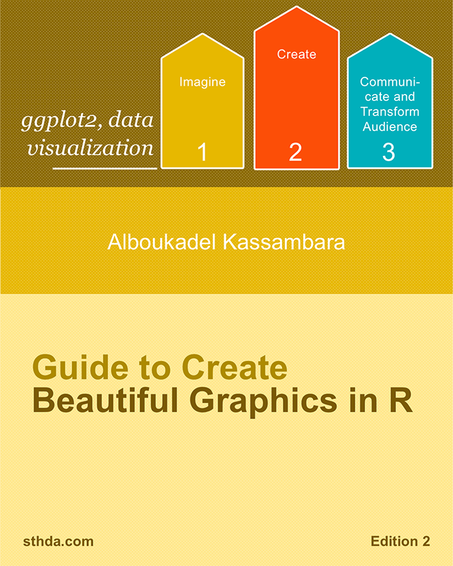
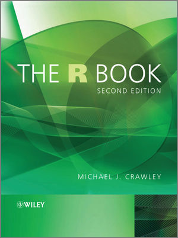
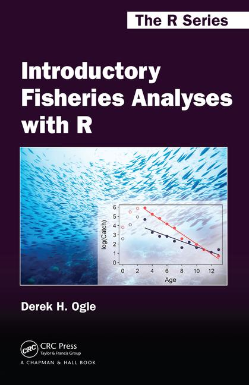

```{r, include=FALSE}
knitr::opts_chunk$set(tidy=FALSE, warning=FALSE, message=FALSE, cache=FALSE, dev.args=list(bg="transparent"), fig.retina = 2)
```

# Recommended literature

## Books

#### General


- Hadley Wickham & Garret Grolemund (2017): **R for Data Science**, O'Reilly Media Inc., CA, U.S.A, 494p. Online accessible at [http://r4ds.had.co.nz/](http://r4ds.had.co.nz/)<br>
→ <small>This book covers pretty much the topics taught in this course, is THE tidyverse book and also reads really nice.</small>
<br>
<br>
<br>
<br>

#### Books on visualisations (i.e. ggplots) 


-  Hadley Wickham (2016): **ggplot2 - Elegant Graphics for Data Analysis**, 2nd edition, Springer International Publishing, Switzerland, 260p. The code and text behind the book can be accessed at github: [https://github.com/hadley/ggplot2-book](https://github.com/hadley/ggplot2-book)
<br>
<br>
<br>
<br>
<br>
<br>



- Alboukadel Kassambara (2013): [Guide to Create Beautiful Graphics in R](http://www.sthda.com/english/download/3-ebooks/5-guide-to-create-beautiful-graphics-in-r-book/), 2nd edition, STHDA, 237p.
<br>
<br>
<br>
<br>

#### Books on statistical modelling



- Michael J. Crawley (2013): **The R Book**, 2nd edition, Wiley & Sons, Ltd., West Sussex, UK, 975p. An online pdf version is freely available [here](https://www.cs.upc.edu/~robert/teaching/estadistica/TheRBook.pdf).<br>
→ <small>This book is very comprehensive (almost 1000p.!) and covers basic statistics as well as many different statistical modelling approaches (which were beyond the scope of this course). However, it does not built on the tidyverse framework so all the graphics are created with the basis packages.</small>
<br>
<br>
<br>
<br>


- Alain F. Zuur, Elena N. Ieno, Neil J. Walker, Anatoly A. Saveliev, Graham M. Smith (2009): **Mixed Effects Models and Extensions in Ecology with R**, Springer Science+Business Media, LLC, NewYork, U.S.A., 574p. For more information and data files see here: [http://highstat.com](http://highstat.com/index.php/mixed-effects-models-and-extensions-in-ecology-with-r)<br>
→ <small>This book covers simple linear regression models and their limitations and describes than alternative approaches (appendix A is a good start!). It includes various ecological case studies where the EDA (Exploratory Data Analayis) cycle is well described. But again, this book does not incorporate the tidyverse framework.</small>
<br>
<br>
<br>
<br>
<br>



- Derek H. Ogle (2015): [Introductory Fisheries Analysis with R](https://www.crcpress.com/Introductory-Fisheries-Analyses-with-R/Ogle/p/book/9781482235203), Chapman & Hall/CRC The R Series, UK, 317p.<br>
→ <small>This is a good R book for fishery ecologist, which is built on the tidyverse framework. It provides detailed instructions on performing basic fisheries stock assessment analyses in the R environment but also includes basics on linear regression and ANOVA within a fisheries context.</small>
<br>
<br>
<br>
<br>

#### Programming in R


- Hadley Wickham (2014): **Advanced R**, Chapman & Hall/CRC The R Series, UK, 456p. Online accessible at [http://adv-r.had.co.nz](http://adv-r.had.co.nz).<br>
→ <small>If you want to learn more on how to program and write R functions I highly recommend this book.</small>
<br>
<br>
<br>
<br>
<br>
<br>

This is just a selection of books that are using R as statistical software. there are many more books on the market, which might be similarly useful for your purposes... Some statistic books also not cover R but are, nevertheless, extremely helpful for understanding the mathematics behind. For instance, for biologists I can recommend

- Gerald Peter Quinn and Michael J. Keough (2002): **Experimental Design and Data Analysis for Biologists**, Cambridge, UK, 553p. An online pdf version is freely available [here](http://www.cambridge.org/de/academic/subjects/life-sciences/ecology-and-conservation/experimental-design-and-data-analysis-biologists?format=PB&isbn=9780521009768#Pq0cPIFm91XhGxdS.97)

<br>

## Websites

Again, the following suggested websites represent only a small subset of websites you can find in the internet. With the recent advances in R Markdown, Blogdown, Bookdown, etc. the number of online tutorials is tremendously increasing.

#### General

- [RStudio Cheatsheets](https://www.rstudio.com/resources/cheatsheets/) → well made overviews of packages and R operations summarised on 1 or 2 pages.
- [R-bloggers](https://www.r-bloggers.com/) → a blog with news on latest advances, package presentations and online tutorials. 
- [Try R](tryr.codeschool.com/levels/1/challenges/1) → an interactive online tutorial from Coda School
- [DataCamp](https://www.datacamp.com/) → this website provides various online tutorials, which are partly free of charge.
- To read up on R operators check this very nice tutorial provided on the tutorialcart website:[ https://www.tutorialkart.com/r-tutorial/r-operators/](https://www.tutorialkart.com/r-tutorial/r-operators/).
- For fisheries-related infos on R, e.g. overviews on fishy packages and courses see the [fishR](http://derekogle.com/fishR/) website 


#### Visalization/ggplot2

- ggplot2 documentation
    - http://ggplot2.org 
    - http://ggplot2.tidyverse.org
- Getting help: [ggplot2 mailing list](https://groups.google.com/forum/?fromgroups#!forum/ggplot2)
- Overview of all geom_functions: http://ggplot2.tidyverse.org/reference/
- For a list of theme components see also [Winston Chang's wiki](https://github.com/wch/ggplot2/wiki/New-theme-system) on github
- Overview of ggplot2 extensions: http://www.ggplot2-exts.org
- The brewer scales provides nice colour schemes from the ColorBrewer particularly tailored for maps: http://colorbrewer2.org
- The Stowers Institute provides a [printable pdf](http://research.stowers.org/mcm/efg/R/Color/Chart/ColorChart.pdf) that lists all colours.


#### R Markdown

- Look at the [R Markdown Webside](https://rmarkdown.rstudio.com) from R Studio for a first start.
- R Studio provides a useful [reference guide](https://www.rstudio.com/wp-content/uploads/2015/03/rmarkdown-reference.pdf).
- To dig deeper you will find many youtube videos and online tutorials.<br>
  → A good one is for instance: [R for fledglings](https://www.uvm.edu/rsenr/vtcfwru/R/fledglings/08_Markdown.html)


#### Strings

- To learn more about regex I recommend the excellent website [http://www.regular-expressions.info](http://www.regular-expressions.info). It contains many different topics, resources, examples, and tutorials at both beginner and advanced levels.

#### Iterations

- A good tutorial for purrr is available on this webpage: https://jennybc.github.io/purrr-tutorial/

<br>
<br>
<br>
